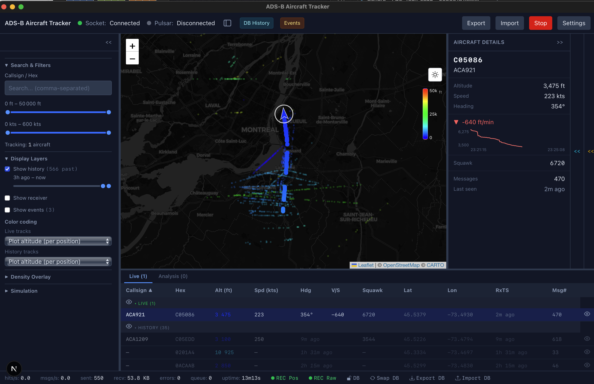
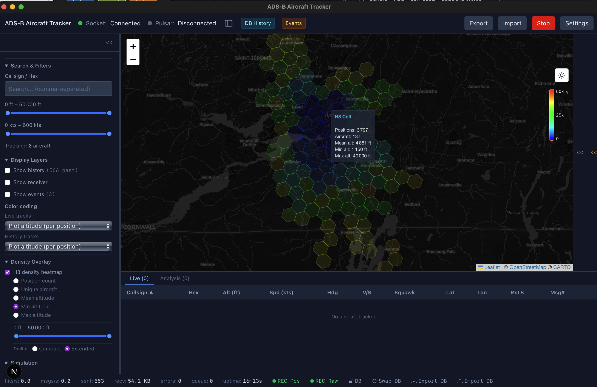
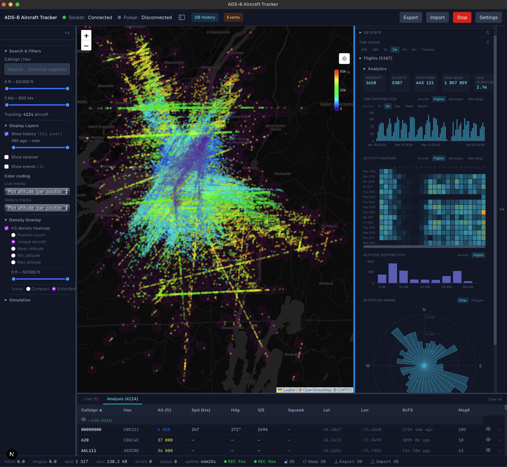

# ADS-B Feed - Rust Workspace

A Cargo workspace for real-time ADS-B aircraft data acquisition, storage, and visualization. Connects to [dump1090](https://github.com/flightaware/dump1090) receivers, forwards messages to [Apache Pulsar](https://pulsar.apache.org/), persists data in [DuckDB](https://duckdb.org/), and provides an interactive desktop tracker.

## Overview

<!-- Replace with actual screenshots -->
| Live Tracking | Geo Statistics | DB History & Analysis |
|:---:|:---:|:---:|
|  |  |  |

## Workspace Crates

```
adsb-feed/rust/
├── adsb-pulsar-client/          # Library + CLI: dump1090 → Pulsar forwarding
├── adsb-data-engine/            # Shared library: SBS-1 parser + DuckDB storage
└── adsb-pulsar-client-desktop/  # Tauri v2 desktop app (Rust backend + Next.js frontend)
    └── src-tauri/               #   (workspace member)
```

| Crate | Purpose | README |
|-------|---------|--------|
| [**adsb-pulsar-client**](adsb-pulsar-client/) | High-performance async client that reads SBS-1 messages from dump1090 and fans them out to pluggable backends (Pulsar, file, custom). Runs on Raspberry Pi with ~50k msg/s throughput, ~15 MB memory. | [README](adsb-pulsar-client/README.md) |
| [**adsb-data-engine**](adsb-data-engine/) | Shared library for SBS-1 parsing and DuckDB persistent storage. Provides spatial queries, flight tracking, analytics (detection range, heatmaps), and Arrow IPC serialization. | [README](adsb-data-engine/README.md) |
| [**adsb-pulsar-client-desktop**](adsb-pulsar-client-desktop/) | Tauri v2 desktop application with interactive Leaflet map, historical analysis, storage management, and GeoJSON export/import. | [README](adsb-pulsar-client-desktop/README.md) |

## Architecture

### System Overview

```
                    ┌──────────────────────────────────────────────────┐
                    │                 Rust Workspace                    │
                    │                                                  │
  dump1090          │  ┌───────────────────┐    ┌───────────────────┐  │
  (TCP SBS-1)  ─────┼─►│ adsb-pulsar-client │───►│  Apache Pulsar   │  │
  port 30003        │  │                   │    │  (or MQTT, ...)   │  │
                    │  │  MessageForwarder  │    └───────────────────┘  │
                    │  │  trait (pluggable) │                           │
                    │  └─────────┬─────────┘                           │
                    │            │ library mode         Pulsar / ...    │
                    │            ▼                           │          │
                    │  ┌────────────────────────────────────────────┐  │
                    │  │     adsb-pulsar-client-desktop (Tauri v2)   │  │
                    │  │                                            │  │
                    │  │  Rust backend ◄────────► Next.js 15        │  │
                    │  │  (Tauri IPC)              React 19         │  │
                    │  │       │                     │              │  │
                    │  │       ▼                     ▼              │  │
                    │  │   DuckDB              Leaflet Map          │  │
                    │  │   (adsb-data-engine)  Recharts             │  │
                    │  └────────────────────────────────────────────┘  │
                    └──────────────────────────────────────────────────┘
```

The desktop app can ingest data through **two paths**: directly from dump1090 via the `adsb-pulsar-client` library, or by consuming from a message broker (Pulsar). Both paths are extensible — adding a new protocol (e.g., MQTT) requires implementing a single trait.

### Crate Dependencies

```
adsb-pulsar-client-desktop (Tauri app)
├── adsb-pulsar-client     (feed client library, default-features = false)
└── adsb-data-engine       (SBS-1 parser + DuckDB storage)
```

- **adsb-pulsar-client** is used as a library by the desktop app (with `default-features = false` to exclude the `clap` CLI dependency)
- **adsb-data-engine** provides the SBS-1 parser and DuckDB storage layer shared across the workspace
- The desktop app's Rust backend bridges the feed client to Tauri events + DuckDB writes

### Design Principles

**Separation of concerns** - Parsing, storage, feed transport, and UI are in distinct crates. The data engine knows nothing about Pulsar or Tauri. The feed client knows nothing about DuckDB.

**Pluggable backends** - The feed client defines a `MessageForwarder` trait for outbound publishing. Built-in implementations: Pulsar, file, noop. New protocols (MQTT, Kafka, ...) only require implementing this trait. The Tauri app uses the client with noop forwarding and taps the message stream directly via `broadcast::channel`.

**Extensible ingestion** - The desktop app currently supports two ingestion paths: direct dump1090 TCP (via the library) and Pulsar consumption. The architecture is designed so that adding new source protocols follows the same pattern without modifying existing code.

**Async with blocking storage** - All I/O is async (Tokio). DuckDB operations are synchronous (C FFI) and run on `spawn_blocking` to avoid starving the async executor.

**Graceful degradation** - The desktop app runs in real-time-only mode if DuckDB initialization fails. Storage is `Arc<RwLock<Option<StorageHandle>>>` - `None` means no persistence, but tracking continues.

**Incremental flight computation** - Flights are segmented on insert (O(1) per position via in-memory tracker), not on query. This keeps analytical queries fast regardless of data volume.

**Arrow IPC for large results** - DuckDB query results are serialized as Apache Arrow IPC (~4x smaller, ~5x faster to parse than JSON). The frontend decodes with zero-copy typed array views.

### Data Flow (Desktop App)

```
dump1090 TCP ──► ADSBFeedClient ──► broadcast::channel
                                         │
                            ┌────────────┴────────────┐
                            ▼                         ▼
                    Tauri bridge                  DuckDB writes
                    (500ms throttle)              (insert_batch)
                            │                         │
                            ▼                         ▼
                    adsb:micro-batch events           positions table
                    (→ frontend map)            flights table
                                               raw_messages table
```

The bridge throttles ~50k msg/s down to ~2 UI updates/sec while persisting every micro-batch to DuckDB.

## Desktop App Highlights

<!-- Replace with actual screenshots -->
| Live Tracking | DB History & Analysis | Aircraft Details |
|:---:|:---:|:---:|
|  |  |  |

**Real-time tracking** on an interactive Leaflet map with altitude-based colors, heading-rotated markers, polyline trails, and H3 density overlays.

**Historical analysis** with DuckDB-backed flight browsing, trajectory reconstruction, detection range radar, hourly heatmaps, and a dedicated Analysis mode for comparing flights.

**Storage management** including release/reclaim for external tools, live export, import with deduplication, and zero-loss database swap.

**GeoJSON export/import**, events of interest, status timeline audit trail, simulated demo flights, and resizable panels with persistent layout.

See the full [Desktop App README](adsb-pulsar-client-desktop/README.md) for features, architecture details, and tech stack.

## Quick Start

### Prerequisites

- Rust 1.75+ ([rustup.rs](https://rustup.rs/))
- Protocol Buffers compiler (`protoc`)
- Node.js 18+ (for desktop app frontend)

```bash
# macOS
brew install protobuf node

# Linux (Debian/Ubuntu)
sudo apt-get install protobuf-compiler nodejs npm
```

### Build & Test

```bash
cd adsb-feed/rust

# Build all crates
cargo build --workspace

# Run all Rust tests (~360 tests)
cargo test --workspace

# Lint and format check
cargo clippy --workspace -- -D warnings
cargo fmt --all --check
```

### Run the CLI Client standalone

```bash
# Forward dump1090 messages to Pulsar
cargo run -p adsb-pulsar-client -- \
  --source-id my-receiver \
  --socket-host 10.0.0.200 \
  --socket-port 30003 \
  --pulsar-broker pulsar://localhost:6650

# Test mode (no Pulsar needed)
cargo run -p adsb-pulsar-client -- \
  --socket-host localhost --socket-port 30003 --test-mode
```

### Run the Desktop App

```bash
cd adsb-pulsar-client-desktop
npm install
npm run tauri dev
```

The desktop app setup config allow to run with the adsb-pulsar-client either in standalone mode or in library mode (embedded).

## Performance

Benchmarked on Raspberry Pi 4 (vs. the Python implementation):

| Metric | Python | Rust | Improvement |
|--------|--------|------|:-----------:|
| Throughput | ~10k msg/s | ~50k msg/s | 5x |
| Memory | ~75 MB | ~15 MB | 5x |
| CPU | ~52% | ~12% | 4x |
| Startup | ~500ms | ~50ms | 10x |
| Binary size | N/A | ~5 MB | - |

## Testing

All crates follow **Test-Driven Development** (Red-Green-Refactor). **985 tests** across Rust and TypeScript. CI gate:

```bash
# Rust (291 tests)
cargo test --workspace && cargo clippy --workspace -- -D warnings && cargo fmt --all --check

# TypeScript (694 tests, from adsb-pulsar-client-desktop/)
npm test && npx next lint
```

| Crate | Tests | Coverage |
|-------|------:|----------|
| adsb-pulsar-client | 117 | Config, errors, metrics, buffer processing, integration (MockDump1090), doc-tests |
| adsb-data-engine | 158 | SBS-1 parsing, storage CRUD, flight tracking, analytics, geodesic math, doc-tests |
| adsb-pulsar-client-desktop (Rust) | 16 | AppState, serialization |
| adsb-pulsar-client-desktop (TS) | 694 | Utilities, hooks, components (Vitest + testing-library) |

## Documentation

| Document | Location | Description |
|----------|----------|-------------|
| CLI Client README | [adsb-pulsar-client/README.md](adsb-pulsar-client/README.md) | Usage, CLI options, deployment, systemd |
| Data Engine README | [adsb-data-engine/README.md](adsb-data-engine/README.md) | API, schema, query methods, design decisions |
| Desktop App README | [adsb-pulsar-client-desktop/README.md](adsb-pulsar-client-desktop/README.md) | Features, architecture, tech stack |
| Desktop Design Doc | [adsb-pulsar-client-desktop/docs/DESIGN.md](adsb-pulsar-client-desktop/docs/DESIGN.md) | IPC flow, track lifecycle, state management |
| Desktop Dev Guide | [adsb-pulsar-client-desktop/docs/DOCUMENTATION.md](adsb-pulsar-client-desktop/docs/DOCUMENTATION.md) | Patterns, conventions, performance |
| Rust vs Python | [RUST_IMPLEMENTATION.md](RUST_IMPLEMENTATION.md) | Detailed performance comparison |

## Part of the ADS-B Project

This Rust workspace is the data acquisition layer of a larger pipeline. See the [project root](../../) for the full architecture including Apache Pulsar streaming, PySpark processing with Delta Lake (medallion architecture), and a Plotly Dash web visualization.
