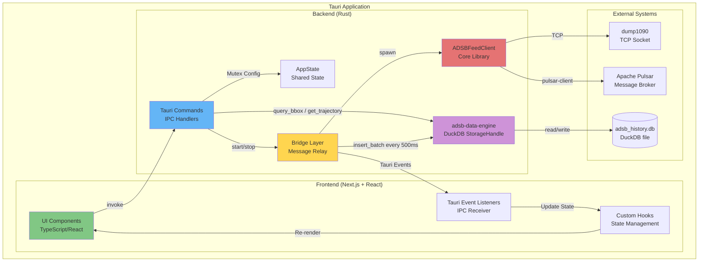
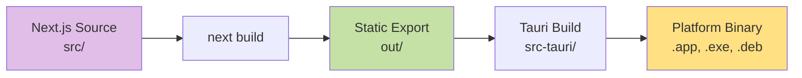
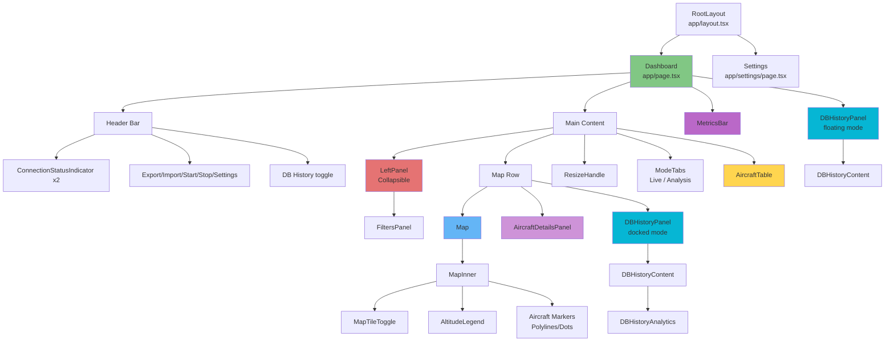
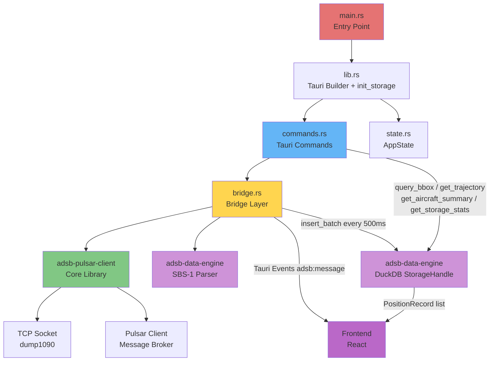
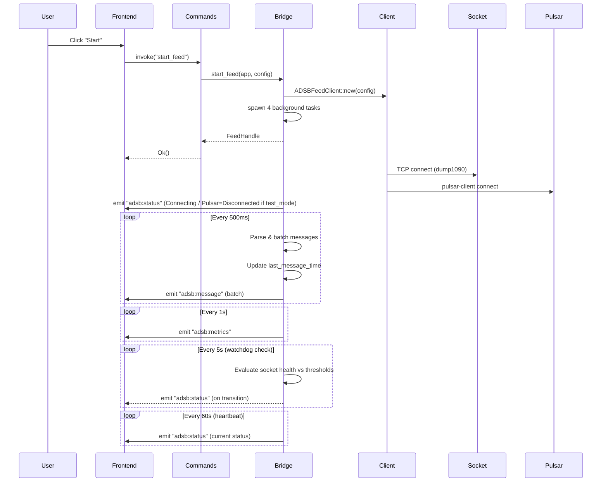
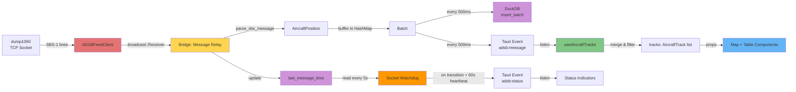
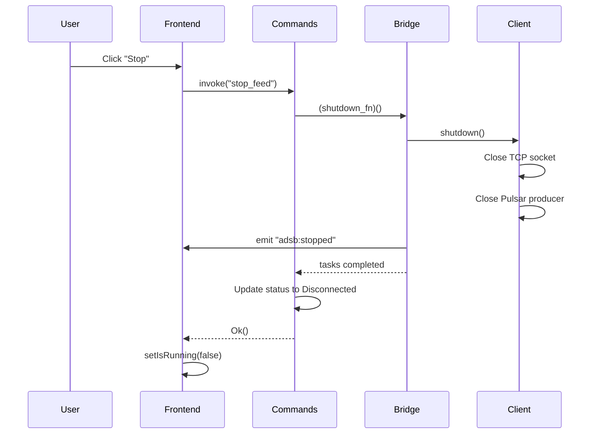
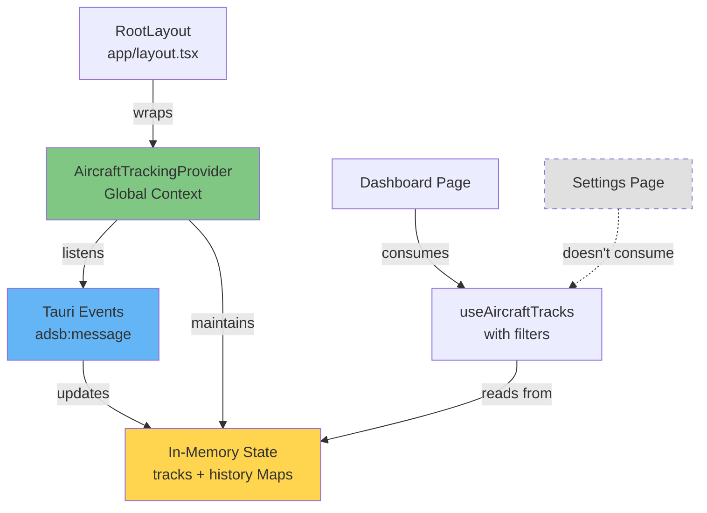
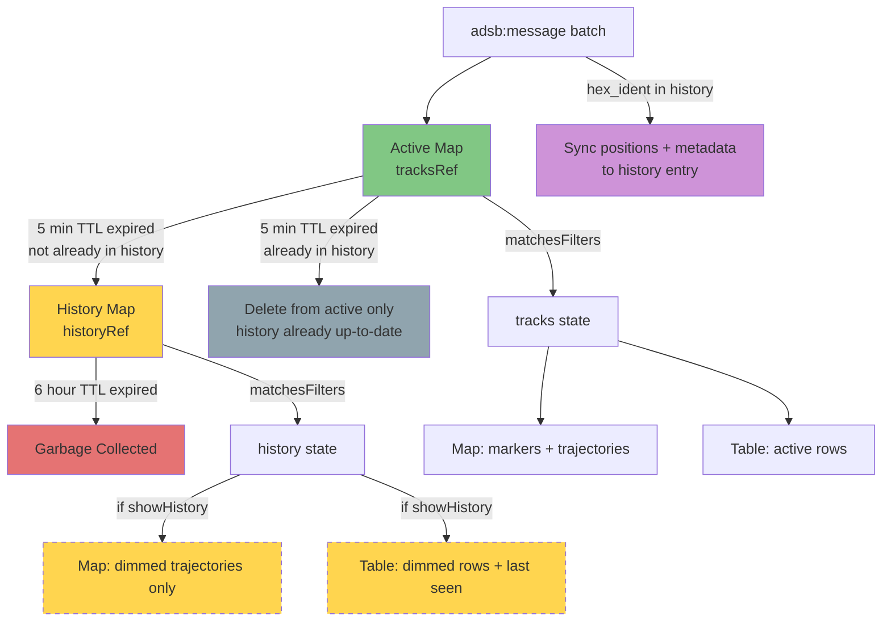
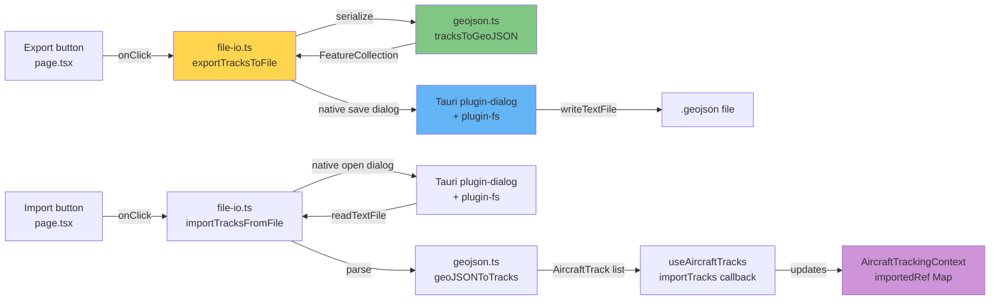

# ADS-B Aircraft Tracker Desktop Application - Design Document

## Table of Contents
1. [High-Level Application Design](#high-level-application-design)
2. [Frontend Architecture](#frontend-architecture)
3. [Component Hierarchy](#component-hierarchy)
4. [Backend Architecture (Tauri Rust)](#backend-architecture-tauri-rust)
5. [Data Flow](#data-flow)
6. [State Management](#state-management)
7. [Global Context Manager Pattern](#global-context-manager-pattern)
8. [In-Memory Aircraft History](#in-memory-aircraft-history)
9. [DuckDB Persistent History](#duckdb-persistent-history)
10. [Storage Management (Release/Reclaim/Export)](#storage-management-releasereclaimexport)
11. [DB History Panel](#db-history-panel)
12. [GeoJSON Export/Import](#geojson-exportimport)
13. [Imported Tracks Selection](#imported-tracks-selection)
14. [Simulated Flights (Demo Mode)](#simulated-flights-demo-mode)
15. [Config Persistence & Receiver Location](#config-persistence--receiver-location)
16. [Analysis Mode](#analysis-mode)
17. [Arrow IPC Query Pipeline](#arrow-ipc-query-pipeline)

---

## High-Level Application Design

### Overview

The ADS-B Aircraft Tracker is a **cross-platform desktop application** built with **Tauri v2**, combining:
- **Backend**: Rust (performance-critical data ingestion and processing)
- **Frontend**: Next.js 15 + React 19 + TypeScript (modern, reactive UI)
- **Styling**: Tailwind CSS 4 (utility-first styling)
- **Mapping**: Leaflet + React-Leaflet (interactive geospatial visualization)

### Architecture Pattern: Event-Driven IPC (Inter-Process Communication)



### Dual History System

The application maintains **two complementary history layers**:

| Layer | Scope | Implementation | Query API |
|-------|-------|---------------|-----------|
| **In-Memory** | Current session (6h TTL) | React `useRef` Maps in `AircraftTrackingContext` | Filter toggle in UI |
| **DuckDB** | Persistent (across restarts) | `adsb-data-engine` StorageHandle | Tauri commands: `query_bbox`, `get_trajectory`, `get_time_distribution`, etc. |

### Five Track Categories

The application maintains five independent track categories in `AircraftTrackingContext`:

| Category | Source | Color | Filtered by Filters? |
|----------|--------|-------|---------------------|
| **tracks** (live) | Real-time SBS-1 via Tauri events | Altitude-based jet colormap | Yes |
| **history** | TTL-expired live tracks | Altitude-based (configurable mode) | Yes |
| **imported** | GeoJSON file import | Indigo | Optional (`includeImportedInFilter`) |
| **dbHistory** | DuckDB queries via DB History panel | Cyan | No (controlled by panel) |
| **analysis** | DuckDB queries loaded to Analysis mode | Cyan (via dbHistory styling) | Yes (independent filter state) |

### Key Design Principles

1. **Separation of Concerns**: Frontend handles UI/UX, backend handles I/O, parsing, and persistence
2. **Event-Driven Communication**: Backend emits Tauri events, frontend listens reactively
3. **Type Safety**: Shared types between Rust (serde) and TypeScript (interfaces)
4. **Non-Blocking UI**: All data operations run on Tokio async runtime in background tasks
5. **Reusability**: Core `adsb-pulsar-client` library shared across CLI and desktop; `adsb-data-engine` shared parser + DuckDB storage crate
6. **Graceful Degradation**: DuckDB storage is optional — app runs in real-time-only mode if initialization fails

### Technology Stack

| Layer | Technology | Version | Purpose |
|-------|-----------|---------|---------|
| **Desktop Framework** | Tauri | 2.x | Native app wrapper, IPC bridge |
| **Frontend Framework** | Next.js | 15.x | React framework with SSG/SSR |
| **UI Library** | React | 19.x | Component-based UI |
| **Language** | TypeScript | 5.x | Type-safe frontend code |
| **Styling** | Tailwind CSS | 4.x | Utility-first CSS framework |
| **Mapping** | Leaflet | 1.9.x | Interactive maps |
| **Map Integration** | React-Leaflet | 5.x | React bindings for Leaflet |
| **Backend Language** | Rust | 1.75+ | High-performance backend |
| **Async Runtime** | Tokio | 1.x | Asynchronous task execution |
| **Core Library** | adsb-pulsar-client | (workspace) | Shared ADSB client logic |
| **Data Engine** | adsb-data-engine | (workspace) | SBS-1 parser + DuckDB persistent storage |
| **Embedded Database** | DuckDB | 1.2 | OLAP embedded DB for historical aircraft queries |

### Application Window Configuration

**File**: `src-tauri/tauri.conf.json`

```json
{
  "identifier": "com.adsb.aircraft-tracker",
  "productName": "ADS-B Aircraft Tracker",
  "version": "0.1.0",
  "app": {
    "windows": [{
      "title": "ADS-B Aircraft Tracker",
      "width": 1400,
      "height": 900,
      "minWidth": 800,
      "minHeight": 600,
      "resizable": true
    }]
  }
}
```

**Content Security Policy (CSP)**:
- Allows OpenStreetMap tile servers for map rendering
- Permits IPC communication between frontend and backend
- Restricts external scripts for security

---

## Frontend Architecture

### Framework: Next.js 15 (App Router)

The frontend uses **Next.js App Router** with:
- **Static Site Generation (SSG)**: Output to `out/` directory for Tauri
- **Client-Side Rendering (CSR)**: All interactivity happens in the Tauri webview
- **No Server-Side Rendering**: App runs entirely offline
- **`trailingSlash: true`**: Required for Tauri static file serving — generates `settings/index.html` instead of `settings.html`, allowing Tauri's webview to resolve `/settings/` correctly for both client-side navigation and hard reloads

### Directory Structure

```
src/
├── app/                      # Next.js App Router pages
│   ├── layout.tsx           # Root layout (wraps children in AircraftTrackingProvider)
│   ├── page.tsx             # Main dashboard page
│   ├── settings/
│   │   └── page.tsx         # Settings page
│   └── globals.css          # Global Tailwind CSS
├── components/              # React UI components
│   ├── AircraftDetailsPanel.tsx # Collapsible right panel for selected aircraft details
│   ├── AircraftTable.tsx    # Tabular data display
│   ├── AltitudeLegend.tsx   # Floating altitude-to-color gradient bar on map
│   ├── ConnectionStatus.tsx # Connection indicator badges
│   ├── DBHistoryAnalytics.tsx # recharts-based analytics (time distribution, altitude histogram)
│   ├── DBHistoryContent.tsx # DB History panel inner content (stats, browse, load, analytics)
│   ├── DBHistoryPanel.tsx   # Dockable/floating DB History panel shell
│   ├── Filters.tsx          # Filter controls (callsign, altitude, speed, toggles)
│   ├── LeftPanel.tsx        # Collapsible resizable left panel wrapping Filters
│   ├── Map.tsx              # Map wrapper (SSR bypass)
│   ├── MapInner.tsx         # Actual Leaflet map
│   ├── MapTileToggle.tsx    # Dark/light map theme toggle
│   ├── MetricsBar.tsx       # Footer metrics display
│   └── ResizeHandle.tsx     # Resizable panel divider
├── contexts/                # React Context providers
│   └── AircraftTrackingContext.tsx # Global aircraft tracking provider
├── hooks/                   # Custom React hooks
│   ├── useAircraftTracks.ts # Filtered track consumer (reads from context)
│   ├── useConnectionStatus.ts # Status polling
│   ├── useDisplayTz.ts      # Display timezone preference (localStorage-backed: local/utc/source)
│   ├── useLocalStorage.ts   # Persistent UI preferences
│   ├── useMapZoom.ts        # Debounced Leaflet zoom level for H3 resolution
│   ├── useMetrics.ts        # Metrics polling
│   ├── useSimulatedTracks.ts # Simulated demo flight tracks
│   └── useTauriEvent.ts     # Event listener abstraction
├── lib/                     # Utilities and types
│   ├── aircraft-details.ts  # Pure utilities: vertical tendency, sparkline, altitude range, formatTrackTime(ms, tzName?)
│   ├── aircraft-icon.ts     # Pure SVG/HTML generation for aircraft map icons
│   ├── arrow-utils.ts       # Arrow IPC converters (arrowToTracks, arrowToFlightSummaries, etc.)
│   ├── colors.ts            # Altitude-based color mapping + ALTITUDE_SCALE_STOPS
│   ├── commands.ts          # Tauri command wrappers (incl. Arrow IPC variants)
│   ├── db-history-analytics.ts # Pure analytics utilities (altitude bins, summary stats, time chart data)
│   ├── file-io.ts           # Tauri native dialog integration for export/import
│   ├── format.ts            # Pure format helpers (timeAgo, formatBytes, formatWithTz)
│   ├── geojson.ts           # Bidirectional AircraftTrack ↔ GeoJSON conversion
│   ├── h3-density.ts        # H3 hexagonal density computation
│   ├── simulation-data.ts   # 20 Montreal-area simulated flight definitions
│   ├── track-ordering.ts    # Render-order utility for selected track
│   └── types.ts             # TypeScript type definitions
```

### Build Pipeline



**Commands**:
- `npm run dev`: Next.js dev server on port 3000 (hot reload)
- `npm run build`: Static export to `out/` directory
- `npm run tauri dev`: Run Tauri in dev mode with Next.js dev server
- `npm run tauri build`: Build production desktop app

---

## Component Hierarchy

### Visual Component Tree



### Component Details

#### 1. **RootLayout** (`src/app/layout.tsx`)

**Purpose**: Root HTML structure, global metadata, and global providers

**Responsibilities**:
- Set application title and description
- Apply global dark theme (`bg-slate-950 text-slate-100`)
- Include Tailwind CSS globals
- Wrap all pages in `AircraftTrackingProvider` for persistent state

**Props**: `children: React.ReactNode`

**Rendering**: Wraps all pages in `<html>` and `<body>` tags, with `AircraftTrackingProvider`

**Implementation**:
```typescript
export default function RootLayout({ children }: { children: React.ReactNode }) {
  return (
    <html lang="en">
      <body className="bg-slate-950 text-slate-100 antialiased">
        <AircraftTrackingProvider>
          {children}
        </AircraftTrackingProvider>
      </body>
    </html>
  );
}
```

**Design Note**: The provider at this level ensures it stays mounted during all client-side
navigation (Next.js App Router preserves layouts). This enables continuous aircraft data
accumulation even when users navigate to Settings or other pages.

**See Also**: [Global Context Manager Pattern](#global-context-manager-pattern), [DuckDB Persistent History](#duckdb-persistent-history)

---

#### 2. **Dashboard** (`src/app/page.tsx`)

**Purpose**: Main application page (aircraft tracking dashboard)

**Responsibilities**:
- Orchestrate all UI components (header, left panel, map, table, details panel, footer)
- Manage top-level state (filters, running status, errors, selection)
- Handle start/stop commands via Tauri IPC
- Handle GeoJSON export/import via `file-io.ts`
- Persist UI preferences to localStorage

**Custom Hooks Used**:
- `useAircraftTracks(activeFilters)`: Track state with filtering (returns `{ tracks, history, imported, dbHistory, analysis, importTracks, clearImported, loadDbHistoryTracks, clearDbHistory, addAnalysisTracks, removeAnalysisTrack, clearAnalysis }`)
- `useSimulatedTracks(enabled)`: Self-animating demo flight tracks
- `useMetrics()`: Performance metrics polling
- `useConnectionStatus()`: Connection status polling
- `useLocalStorage(...)`: Persist map theme, table height, panel states, toggles, color modes

**State Management**:
- `activeMode: ActiveMode`: `"live" | "analysis"` — which view mode is active (persisted)
- `liveFilters: Filters`: Altitude/speed/callsign filters for Live mode
- `analysisFilters: Filters`: Independent filters for Analysis mode
- `activeFilters`: Derived — `liveFilters` or `analysisFilters` based on `activeMode`
- `error: string | null`: Error messages
- `mapTheme: "light" | "dark"`: Map tile style
- `tableHeight: number`: Resizable table height in pixels
- `sidebarOpen: boolean`: Left panel expanded/collapsed (persisted)
- `sidebarWidth: number`: Left panel width in px, 180–400 (persisted)
- `trajectoryStyle: "line" | "dots"`: Trajectory rendering mode (persisted)
- `showHistory: boolean`: Whether to display expired aircraft (persisted)
- `showDensity: boolean`: H3 density overlay toggle (persisted)
- `densityMetric: DensityMetric`: Which metric to display in H3 hexagons (persisted)
- `showSimulation: boolean`: Simulated demo flight toggle (persisted)
- `liveColorMode: AltitudeColorMode`: Color mode for live tracks (persisted)
- `historyColorMode: AltitudeColorMode`: Color mode for history tracks (persisted)
- `showImported: boolean`: Visibility of imported GeoJSON tracks (persisted)
- `includeImportedInDensity: boolean`: Include imported tracks in H3 density (persisted)
- `selectedHexIdents: Set<string>`: Currently selected aircraft hex_idents (multi-select via Ctrl/Cmd click, Shift range)
- `lastSelectedHexIdent: string | null`: Anchor for shift-range selection and auto-scroll target
- `hiddenSections: Map<TrackSection, Set<string>>`: Per-section track visibility — maps each `TrackSection` to a set of hidden hex_idents. Group visibility is derived (not stored separately)
- `detailsPanelOpen: boolean`: Whether the details panel is expanded or collapsed (persisted)
- `detailsPanelWidth: number`: Width of the expanded details panel in px, clamped 200–480 (persisted)
- `dbHistoryOpen: boolean`: DB History panel visible (persisted)
- `dbHistoryDockedExpanded: boolean`: Docked panel expanded vs collapsed strip (persisted)
- `dbHistoryWidth: number`: Docked panel width in px, 240–560 (persisted)
- `dbHistoryFloating: boolean`: Floating mode vs docked mode (persisted)
- `dbHistoryFloatX/Y/W/H: number`: Floating panel position and size (persisted)
- `showDbHistory: boolean`: Visibility of DB History tracks on map/table (persisted)

**Derived State**:
- `isLive`: `activeMode === "live"`
- `allTracks`: Merge of live `tracks` + `simulatedTracks`
- `visibleHistory`: `showHistory ? history : []`
- `visibleImported`: `showImported ? imported : []`
- `visibleDbHistory`: `showDbHistory ? dbHistory : []`
- `mapTracks / mapHistory / mapImported / mapDbHistory`: Mode-conditional arrays filtered through `filterBySection` — in Live mode, removes hidden hex_idents per section; in Analysis mode, only `analysis` tracks (passed as `mapDbHistory` for cyan styling)
- `tableTracks / tableHistory / tableImported / tableDbHistory`: Mode-conditional arrays for table sections (unfiltered — visibility dimming shown via eye icons)
- `selectedTrack`: Resolved from `lastSelectedHexIdent` against mode-conditional map arrays (`mapTracks` → `mapHistory` → `mapDbHistory` → `mapImported`); `null` when no aircraft is selected
- `flatVisibleOrder`: Flat hex_ident array mirroring table section order — used for shift-range selection
- `isImportedSelection`: Whether the selected track came from the imported collection (drives `IMPORTED` badge in details panel)
- `isDbHistorySelection`: Whether the selected track came from DB History or Analysis (drives `DB HISTORY` badge in details panel)
- `densityTracks`: In Live mode, computed from unfiltered `allTracks + history + (imported if includeImportedInDensity)`; in Analysis mode, uses unfiltered `analysis` tracks. **Not affected by per-track or per-group visibility toggles** — density is controlled exclusively by the left panel

**Layout Structure**:
```tsx
<div className="h-screen flex flex-col">
  <header> {/* Header bar: status, sidebar toggle, DB History toggle, export/import/clear, start/stop, settings */} </header>
  <div className="flex flex-1 overflow-hidden">
    <LeftPanel isOpen={sidebarOpen} width={sidebarWidth} ... />
    <main className="flex-1 flex flex-col overflow-hidden">
      <div className="flex flex-1 min-h-0 overflow-hidden">
        <div className="flex-1 min-w-0"> {/* Map */} </div>
        {selectedTrack && (
          <AircraftDetailsPanel
            track={selectedTrack}
            isImported={isImportedSelection}
            isDbHistory={isDbHistorySelection}
            ...
          />
        )}
        {/* DB History panel — docked mode (flex sibling of map) */}
        {dbHistoryOpen && !dbHistoryFloating && (
          <DBHistoryPanel floating={false} ...>
            <DBHistoryContent onLoadTracks={loadDbHistoryTracks} onClearTracks={clearDbHistory} ... />
          </DBHistoryPanel>
        )}
      </div>
      <ResizeHandle />
      <ModeTabs activeMode={activeMode} onModeChange={setActiveMode} ... />
      <div> {/* AircraftTable with mode-conditional tracks + onRemoveTrack in analysis mode */} </div>
    </main>
  </div>
  <MetricsBar />
  {/* DB History panel — floating mode (fixed overlay) */}
  {dbHistoryOpen && dbHistoryFloating && (
    <DBHistoryPanel floating={true} ...>
      <DBHistoryContent ... />
    </DBHistoryPanel>
  )}
</div>
```

---

#### 3. **Settings** (`src/app/settings/page.tsx`)

**Purpose**: Configuration page for connection settings

**Responsibilities**:
- Load current configuration via `get_config` command
- Provide form inputs for all config fields
- Validate configuration before saving
- Save configuration via `save_config` command

**Configuration Fields** (Connection section):
- `source_id`: Unique identifier for this client
- `socket_host`, `socket_port`: dump1090 TCP connection
- `dump1090_tz`: Timezone for SBS-1 timestamps — `"Local"` (machine), `"UTC"`, or IANA name (e.g. `"Europe/Paris"`); persisted in `Config` via `save_config`
- `pulsar_broker`, `pulsar_topic`: Pulsar connection
- Buffer sizes, timeouts, retry policies
- `test_mode`: Run without Pulsar (socket-only)
- `log_level`: Debug, info, warn, error

**Display Section**:
- `Time Display`: three-button toggle — `Local` / `UTC` / `Source`; stored in `localStorage` under key `adsb-display-tz` via `useDisplayTz` hook (independent of Config)

---

#### 4. **AircraftTable** (`src/components/AircraftTable.tsx`)

**Purpose**: Tabular display of active, historical, imported, and DB History aircraft data

**Props**:
- `tracks: AircraftTrack[]`: Active aircraft tracks (or analysis tracks in Analysis mode)
- `historyTracks?: AircraftTrack[]`: Optional expired aircraft tracks (defaults to `[]`)
- `dbHistoryTracks?: AircraftTrack[]`: Optional DB History tracks (defaults to `[]`)
- `importedTracks?: AircraftTrack[]`: Optional imported GeoJSON tracks (defaults to `[]`)
- `selectedHexIdents?: Set<string>`: Currently selected aircraft hex_idents (multi-select)
- `lastSelectedHexIdent?: string | null`: Last-clicked hex for auto-scroll
- `onSelectTrack?: (hex: string, event: SelectEvent) => void`: Callback when a row is clicked (with modifier keys)
- `onRemoveTrack?: (hexIdent: string) => void`: Optional callback for per-row remove button (used in Analysis mode)
- `onToggleMapVisibility?: (hexIdent: string, section: TrackSection) => void`: Per-track map visibility toggle
- `hiddenSections?: Map<TrackSection, Set<string>>`: Per-section hidden hex_idents (drives eye icon state + row dimming)
- `onToggleGroupVisibility?: (section: TrackSection, hexIdents: string[]) => void`: Group visibility toggle — receives the section and the full list of hex_idents in that section
- `liveSectionKey?: TrackSection`: Section key for live rows — `"live"` in Live mode, `"analysis"` in Analysis mode

**Responsibilities**:
- Render scrollable table with fixed header
- Display columns: Callsign, Hex, Alt, Spd, Hdg, V/S, Squawk, Lat, Lon, RxTS, Msg#
- **RxTS**: Relative time since last received message (e.g., "3s ago") via `timeAgo(last_seen)`
- **Msg#**: Total SBS-1 messages received for this aircraft (pre-throttle cumulative count)
- Handle null values gracefully (display "—")
- Render four row sections: active/analysis, history, DB History, imported — each separated by a collapsible divider
- History rows display with `opacity-40` for visual distinction (full opacity when selected)
- History rows show relative "last seen" time (e.g., "23m ago") in place of heading/vertical rate
- Imported rows display with `opacity-60` and indigo text tint for visual identity
- DB History rows display with `opacity-60` and cyan text tint
- When `onRemoveTrack` is provided, render a × button at the end of each Live/Analysis row (used in Analysis mode to remove individual tracks)
- Highlight selected rows and auto-scroll last-selected into view
- **Per-track eye toggle**: When `onToggleMapVisibility` provided, render eye icon per row. Hidden tracks show closed-eye + `opacity-40` dimming
- **Group eye toggle**: When `onToggleGroupVisibility` provided, render eye icon on section headers. Icon state is **derived**: all hex_idents in section hidden → eye-closed, otherwise → eye-open
- **Selection-aware eye toggle**: Clicking eye on a multi-selected track toggles all selected tracks within that section. Single-selected or unselected tracks toggle individually

**Row Sections**:
1. **Active/Analysis rows** — standard rendering, selected highlight: `bg-blue-900/40`; × remove button when `onRemoveTrack` provided
2. **History divider** — uppercase label with count (e.g., "HISTORY (12)"), collapsible, group eye toggle
3. **History rows** — dimmed via `opacity-40`, selected highlight: `bg-blue-900/40`
4. **DB History divider** — uppercase label with count (e.g., "DB HISTORY (3)"), collapsible, group eye toggle
5. **DB History rows** — dimmed via `opacity-60`, cyan text tint, selected highlight: `bg-cyan-900/40`
6. **Imported divider** — uppercase label with count (e.g., "IMPORTED (5)"), collapsible, group eye toggle
7. **Imported rows** — dimmed via `opacity-60`, indigo text tint, selected highlight: `bg-indigo-900/40`

**Styling**:
- Dark background (`bg-slate-900`)
- Fixed header with `sticky top-0`
- Overflow scrolling for table body
- Selected row: `bg-blue-900/40` (active/history) or `bg-cyan-900/40` (DB History) or `bg-indigo-900/40` (imported) + `cursor-pointer` when clickable
- Hidden-from-map row: `opacity-40` with closed-eye icon

**File**: `src/components/AircraftTable.tsx`

---

#### 5. **ConnectionStatus** (`src/components/ConnectionStatus.tsx`)

**Purpose**: Connection status indicator badges

**Props**:
- `label: string`: Display label ("Socket", "Pulsar")
- `status: ConnectionStatus`: Current status enum

**Responsibilities**:
- Render color-coded badge based on status
- Display status text and error messages

**Status Colors**:
- `Disconnected`: Gray (`bg-gray-500`) — not running / intentionally off
- `Connecting`: Yellow pulsing (`bg-yellow-500 animate-pulse`) — establishing connection
- `Connected`: Green (`bg-green-500`) — receiving messages normally
- `Degraded`: Orange pulsing (`bg-orange-500 animate-pulse`) — no messages for `read_timeout + 10s`
- `ConnectionLost`: Red (`bg-red-500`) — no messages for `read_timeout + 30s`
- `Error`: Red (`bg-red-500`) — unexpected error

**File**: `src/components/ConnectionStatus.tsx`

---

#### 6. **Filters** (`src/components/Filters.tsx`)

**Purpose**: Filter panel in left sidebar

**Props**:
- `filters: Filters`: Current filter state
- `onChange: (filters: Filters) => void`: Update callback
- `trackCount: number`: Number of active tracks matching filters
- `showHistory: boolean`: Whether history display is enabled
- `onToggleHistory: () => void`: Toggle history visibility
- `historyCount: number`: Total number of history tracks matching filters

**Responsibilities**:
- Callsign search input
- Altitude range sliders (0-50,000 ft)
- Speed range sliders (0-600 kts)
- Active track count display
- History toggle checkbox with count (e.g., "Show history (12 past)")

**Design Note**: The `historyCount` always reflects filtered history size regardless of
the `showHistory` toggle state. This lets users see how many past tracks are available
before deciding to enable the display.

**Styling**:
- Dark sidebar (`bg-slate-900`)
- Compact form inputs
- Live filter count display

**File**: `src/components/Filters.tsx`

---

#### 7. **Map** (`src/components/Map.tsx`)

**Purpose**: Wrapper for Leaflet map with SSR bypass

**Props**:
- `tracks: AircraftTrack[]`: Active aircraft to display
- `historyTracks: AircraftTrack[]`: Expired aircraft trajectories to display
- `mapTheme: "light" | "dark"`: Tile style
- `onToggleTheme: () => void`: Theme toggle callback
- `trajectoryStyle: "line" | "dots"`: How to render position trails
- `selectedHexIdent: string | null`: Currently selected aircraft hex_ident
- `onSelectTrack: (hex: string | null) => void`: Selection callback (`null` = deselect)

**Responsibilities**:
- Use Next.js `dynamic()` to disable SSR (Leaflet requires browser)
- Display loading state while map initializes
- Forward all props to `MapInner`

**Technical Note**: Leaflet requires `window` and `document`, so it must be loaded client-side only.

**File**: `src/components/Map.tsx`

---

#### 8. **MapInner** (`src/components/MapInner.tsx`)

**Purpose**: Actual Leaflet map with markers, trajectories, and history trails

**Props**: Same as `Map`

**Responsibilities**:
- Initialize Leaflet map with `MapContainer`
- Render OpenStreetMap tile layers (light/dark)
- Display aircraft markers (color-coded by altitude)
- Draw trajectory polylines/dots for each active aircraft
- Render history track trajectories with dimmed styling
- Provide map controls (zoom, theme toggle)

**Rendering Order (Z-Ordering)**:

History tracks are rendered **before** active tracks in the JSX tree. In Leaflet/react-leaflet,
elements rendered later appear on top. This ensures active aircraft markers always overlay
faded history trajectories without needing explicit z-index management.

```
[TileLayer]  ← base map
  ↑
[History trajectories]  ← rendered first (bottom layer)
  ↑
[Active markers + trajectories]  ← rendered last (top layer)
```

**Canvas Renderer**:

`MapContainer` uses `preferCanvas={true}` to render all vector layers (`CircleMarker`, `Polyline`)
on a single `<canvas>` element instead of individual SVG `<path>` nodes. This reduces DOM node
count from O(n) to O(1) and is critical for smooth pan/zoom with thousands of trajectory dots.
Tooltips and mouse events still work via Leaflet's canvas hit-testing.

**Imperative Dots Layer (`DotsLayer`)**:

When `trajectoryStyle === "dots"`, trajectory dots are rendered imperatively via Leaflet's
native API instead of React `<CircleMarker>` components. This avoids React VDOM reconciliation
of 10,000+ component instances every 500ms.

Implementation:
- Uses `useMap()` to get the Leaflet map instance
- Creates `L.circleMarker()` objects in a `useEffect` cleanup cycle
- Tooltips bound via `marker.bindTooltip(() => html)` — lazy (content built only on hover)
- Cleanup removes all markers when `tracks`, `colorMode`, or `type` change
- Combined with canvas renderer, creating/destroying 5,000 markers is ~5ms (lightweight JS objects)

```
DotsLayer({ tracks, colorMode, type: "history" | "live" })
  → useMap() to get map instance
  → useEffect([tracks, colorMode]) creates L.CircleMarker objects
  → Each marker gets bindTooltip with lazy content
  → Cleanup removes all markers
```

**Active Marker Behavior**:
- **Icon**: Rotated triangle SVG, color-coded by altitude
- **Tooltip**: Callsign, hex, altitude, speed, squawk
- **Trajectory**: Polyline or dots connecting recent positions
- **Click**: Selects the aircraft (emits `onSelectTrack(hex_ident)`)

**Selected Aircraft Visual Feedback**:
- **Icon**: Enlarged (36×36 vs 24×24), white stroke, static ring overlay via CSS
- **Polyline (live)**: `weight: 4`, `opacity: 0.9` (vs default `2`/`0.6`)
- **Polyline (history)**: `weight: 3`, `opacity: 0.7` (vs default `1`/`0.25`)
- **Dots**: `radius + 2`, `fillOpacity: 0.9`
- **Render order**: Selected track moved to end of array (renders on top)
- **Map click**: Clicking empty map space deselects (`MapClickHandler` component)

**History Track Behavior**:
- **No marker icon**: The aircraft is no longer present
- **Trajectory only**: Polyline (`weight: 1`, `opacity: 0.25`) or dots (`radius: 2`, `fillOpacity: 0.2`)
- **Tooltip**: Callsign, hex, and relative "last seen" time (e.g., "23m ago")
- **Color**: Altitude-based, same scale as active but at reduced opacity

**Map Layers**:
- Light theme: `https://tile.openstreetmap.org/{z}/{x}/{y}.png`
- Dark theme: `https://{s}.basemaps.cartocdn.com/dark_all/{z}/{x}/{y}{r}.png` (CARTO)

**File**: `src/components/MapInner.tsx`

---

#### 9. **MapTileToggle** (`src/components/MapTileToggle.tsx`)

**Purpose**: Button to toggle map theme (light/dark)

**Props**: `onToggle: () => void`

**Responsibilities**:
- Render floating button in top-right corner of map
- Display sun/moon icon based on current theme
- Call `onToggle` callback on click

**File**: `src/components/MapTileToggle.tsx`

---

#### 10. **MetricsBar** (`src/components/MetricsBar.tsx`)

**Purpose**: Footer bar displaying performance metrics

**Props**: `metrics: MetricsWithRates`

**Responsibilities**:
- Display metrics in compact horizontal layout
- Show: Messages sent, errors, throughput, elapsed time
- Update in real-time (polled every 1 second)

**Metrics Displayed**:
- **Messages Sent**: Total messages forwarded to backends
- **Errors**: Total errors encountered
- **Throughput**: Messages/second (windowed rate from `messages_parsed`)
- **Hits/s**: Raw TCP line rate (windowed rate from `messages_sent`)
- **Elapsed Time**: Time since feed started
- **Bytes Sent/Received**: Network traffic stats

**File**: `src/components/MetricsBar.tsx`

---

#### 11. **ResizeHandle** (`src/components/ResizeHandle.tsx`)

**Purpose**: Draggable divider between map and table

**Props**:
- `onResize: (deltaY: number) => void`: Called during drag
- `onResizeEnd: () => void`: Called when drag ends

**Responsibilities**:
- Render horizontal divider with hover effect
- Capture mouse down and track drag events
- Emit `deltaY` (change in Y position) to parent

**Styling**:
- Thin horizontal line (`h-1`)
- Hover cursor: `cursor-row-resize`
- Visual feedback on hover/drag

**File**: `src/components/ResizeHandle.tsx`

---

#### 12. **LeftPanel** (`src/components/LeftPanel.tsx`)

**Purpose**: Collapsible resizable left sidebar that wraps the `FiltersPanel`

**Props**:
- `isOpen: boolean`: Expanded or collapsed
- `width: number`: Panel width in px (clamped 180–400, persisted)
- `onToggle: () => void`: Toggle expanded/collapsed
- `onWidthChange: (w: number) => void`: Called during drag resize
- Plus all `FiltersPanel` props: `filters`, `onChange`, `trackCount`, `showHistory`, `onToggleHistory`, `historyCount`, `showDensity`, `onToggleDensity`, `densityMetric`, `onDensityMetricChange`, `showSimulation`, `onToggleSimulation`, `simulationCount`, `liveColorMode`, `onLiveColorModeChange`, `historyColorMode`, `onHistoryColorModeChange`, `importedCount`, `showImported`, `onToggleImported`, `onClearImported`, `includeImportedInDensity`, `onToggleIncludeImportedInDensity` (note: `onImportTracks` removed — DB History browsing moved to `DBHistoryPanel`)

**Two States**:
1. **Collapsed** — 32px strip with `>>` button ("Show filters panel")
2. **Expanded** — full-width panel with `<<` button ("Hide filters panel") and `FiltersPanel` content

**Resize Behavior**:
- Right edge: 1px `col-resize` draggable strip (tracks `clientX` delta; moving right = expanding)
- Width clamped: min 180px, max 400px
- Width state is owned by parent (`onWidthChange` callback), same pattern as `AircraftDetailsPanel`

**Design Note**: The `LeftPanel` is the left-side mirror of `AircraftDetailsPanel`. Both use the same collapsed-strip + expanded-panel + drag-resize architecture. The key difference: `LeftPanel` is always rendered (no "hidden" state), while `AircraftDetailsPanel` is conditionally mounted based on selection. The sidebar toggle in the header bar also controls `isOpen`.

**File**: `src/components/LeftPanel.tsx`

---

#### 13. **AltitudeLegend** (`src/components/AltitudeLegend.tsx`)

**Purpose**: Floating altitude-to-color gradient bar overlaid on the map

**Responsibilities**:
- Render a vertical 3×120px gradient bar using `ALTITUDE_SCALE_STOPS` from `colors.ts`
- Display three labels: `50k` (top), `25k` (middle), `0` (bottom) with `ft` unit
- Position in top-right of map with `z-[1000]` and `pointer-events-none`

**Dependencies**: Uses `ALTITUDE_SCALE_STOPS` (named export from `colors.ts`) — an array of `[normalizedPosition, cssColor]` pairs used to build the CSS `linear-gradient`.

**File**: `src/components/AltitudeLegend.tsx`

---

#### 14. **AircraftDetailsPanel** (`src/components/AircraftDetailsPanel.tsx`)

**Purpose**: Collapsible right panel showing full details for the currently selected aircraft

**Props**:
- `track: AircraftTrack | null`: Selected track; returns `null` (renders nothing) when absent
- `isOpen: boolean`: Whether the panel is expanded or collapsed to a 32px strip
- `width: number`: Panel width in px (clamped 200–480, persisted)
- `onToggle: () => void`: Called when fold/unfold button is clicked
- `onWidthChange: (w: number) => void`: Called during drag resize
- `isImported?: boolean`: When `true`, displays an indigo `IMPORTED` badge in the header (defaults to `false`)
- `isDbHistory?: boolean`: When `true`, displays a cyan `DB HISTORY` badge in the header (defaults to `false`)

**Three States**:
1. **Hidden** — `track === null`: renders nothing; map fills full width
2. **Collapsed** — `isOpen === false`: 32px strip with `>>` button (title "Unfold panel")
3. **Expanded** — `isOpen === true`: full-width panel with content and `<<` button (title "Fold panel")

**Content Sections** (expanded state):
1. **Header**: "Aircraft Details" label + optional `IMPORTED` badge (indigo, shown when `isImported === true`) + optional `DB HISTORY` badge (cyan, shown when `isDbHistory === true`) + fold button `<<`
2. **Identity**: ICAO hex (monospace, prominent), callsign (or "—")
3. **Altitude / Speed / Heading**: altitude ft, ground_speed kts, track °, on-ground badge
4. **Vertical Tendency**: arrow icon (▲ green / ▼ red / → slate) + formatted rate; SVG sparkline with axes:
   - **Y-axis**: min/max altitude labels (`data-testid="sparkline-alt-min/max"`)
   - **SVG** (120×40 viewBox): `<polyline>` coloured by tendency
   - **X-axis**: `formatTrackTime(first_seen, resolvedTzName)` and `formatTrackTime(last_seen, resolvedTzName)` — timezone from `useDisplayTz().resolvedTzName` (`data-testid="sparkline-time-start/end"`)
5. **Squawk**: 4-digit code (or "—") + special label badge (7700=EMERGENCY, 7600=RADIO FAILURE, 7500=HIJACK)
6. **Message count**: cumulative SBS-1 messages for this aircraft
7. **Last seen**: relative time string from `timeAgo(last_seen)`

**Resize Behavior**:
- Left edge: 1px `col-resize` draggable strip (tracks `clientX` delta; moving left = expanding)
- Width clamped: min 200px, max 480px
- Owned internally by `ExpandedPanel` sub-component (compare: `ResizeHandle` delegates `deltaY` to parent)

**Pure Utilities** (`src/lib/aircraft-details.ts`):
- `verticalTendency(vr)`: threshold ±200 ft/min; null → "level"
- `formatVerticalRate(vr)`: "+2,400 ft/min", "—", "±0 ft/min"
- `altitudeHistory(positions)`: extract non-null altitudes from position array
- `altitudeRange(altitudes)`: `{ min, max } | null`
- `formatTrackTime(ms)`: local "HH:MM:SS" string for sparkline axis labels
- `altitudeSparklinePoints(altitudes, width, height)`: SVG `points` string; flat data → `height/2`

**File**: `src/components/AircraftDetailsPanel.tsx`

---

### Custom Hooks

#### 1. **useAircraftTracks** (`src/hooks/useAircraftTracks.ts`)

**Purpose**: Consume filtered aircraft data from the global `AircraftTrackingProvider`

**Parameters**: `filters: Filters`

**Returns**: `{ tracks, history, imported, dbHistory, importTracks, clearImported, loadDbHistoryTracks, clearDbHistory }`

**Responsibilities**:
- Read raw track, history, imported, and dbHistory Maps from `AircraftTrackingContext`
- Apply callsign/altitude/speed filters to active and history tracks
- Apply optional filter to imported tracks (when `includeImportedInFilter` is set)
- Return dbHistory unfiltered (controlled by the DB History panel, not live filters)
- Expose `loadDbHistoryTracks` and `clearDbHistory` for the DB History panel

**Implementation**:
```typescript
export function useAircraftTracks(filters: Filters) {
  const {
    tracks: tracksMap, history: historyMap, imported: importedMap, dbHistory: dbHistoryMap,
    version, importTracks, clearImported, loadDbHistoryTracks, clearDbHistory,
  } = useAircraftTrackingContext();

  const tracks = useMemo(() => Array.from(tracksMap.values()).filter(t => matchesFilters(t, filters)), [version, filters]);
  const history = useMemo(() => Array.from(historyMap.values()).filter(t => matchesFilters(t, filters)), [version, filters]);
  const imported = useMemo(() => { /* optional filter */ }, [version, filters]);
  const dbHistory = useMemo(() => Array.from(dbHistoryMap.values()), [version]); // NOT filtered

  return { tracks, history, imported, dbHistory, importTracks, clearImported, loadDbHistoryTracks, clearDbHistory };
}
```

**Design Change (v2)**: This hook was refactored from managing its own state to consuming
the global `AircraftTrackingProvider`. The provider handles all event listening, TTL expiry,
and data accumulation. This hook is now a **pure filter layer** that derives view-specific
arrays from global state.

**Benefits**:
- ✅ Data persists across page navigation (provider stays mounted in layout)
- ✅ No duplicate event listeners (single global listener vs. one per page mount)
- ✅ Continuous accumulation (data collection runs even when dashboard is not visible)
- ✅ Simpler hook logic (no event handling, just filtering)

**Filter extraction**: The `matchesFilters()` function is extracted as a module-level
pure function to keep the filtering logic testable and avoid duplication.

**See Also**: [Global Context Manager Pattern](#global-context-manager-pattern) for
detailed provider implementation and architecture.

**File**: `src/hooks/useAircraftTracks.ts`

---

#### 2. **useConnectionStatus** (`src/hooks/useConnectionStatus.ts`)

**Purpose**: Poll connection status from backend

**Returns**: `StatusResponse`

**Responsibilities**:
- Call `get_status()` command every 1 second
- Update state with latest status
- Handle errors gracefully

**Polling Logic**:
```typescript
useEffect(() => {
  const interval = setInterval(async () => {
    const status = await getStatus();
    setStatus(status);
  }, 1000);
  return () => clearInterval(interval);
}, []);
```

**File**: `src/hooks/useConnectionStatus.ts`

---

#### 3. **useLocalStorage** (`src/hooks/useLocalStorage.ts`)

**Purpose**: Persist UI preferences to browser localStorage

**Parameters**:
- `key: string`: Storage key
- `initialValue: T`: Default value

**Returns**: `[value: T, setValue: (value: T) => void]`

**Responsibilities**:
- Load value from localStorage on mount
- Save value to localStorage on change
- Provide React state interface

**Use Cases**:
- Map theme (`adsb-map-theme`)
- Table height (`adsb-table-height`)
- Details panel open state (`adsb-details-panel-open`)
- Details panel width (`adsb-details-panel-width`)

**File**: `src/hooks/useLocalStorage.ts`

---

#### 4. **useMetrics** (`src/hooks/useMetrics.ts`)

**Purpose**: Subscribe to metrics events and compute windowed rates

**Returns**: `MetricsWithRates` (extends `MetricsSnapshot` with `hits_per_sec`)

**Responsibilities**:
- Subscribe to `adsb:metrics` Tauri events (emitted every 1s by `relay_metrics`)
- Compute windowed throughput rates via `useWindowedRate`:
  - `throughput_msg_per_sec`: windowed rate from `messages_parsed` (successfully parsed SBS messages)
  - `hits_per_sec`: windowed rate from `messages_sent` (all forwarded TCP lines)
- Window size configurable via localStorage key `adsb-metrics-window-secs` (default 5s)

**File**: `src/hooks/useMetrics.ts`

---

#### 5. **useMapZoom** (`src/hooks/useMapZoom.ts`)

**Purpose**: Expose current Leaflet map zoom level as a debounced integer state

**Parameters**: `debounceMs?: number` (default 300ms)

**Returns**: `number` (integer zoom level)

**Responsibilities**:
- Call `useMap()` from react-leaflet (must be inside `<MapContainer>`)
- Listen to Leaflet `"zoomend"` event
- Debounce updates by `debounceMs` to avoid triggering expensive H3 recomputation on every pinch-zoom tick
- Return `Math.round(zoom)` — fractional zoom from smooth gestures is snapped to integer

**Use Case**: Drives H3 density hexagon resolution in `MapInner`. Lower zoom → coarser H3 resolution; higher zoom → finer resolution.

**File**: `src/hooks/useMapZoom.ts`

---

#### 6. **useSimulatedTracks** (`src/hooks/useSimulatedTracks.ts`)

**Purpose**: Self-animating hook producing `AircraftTrack[]` from predefined flight routes for demo/trade-show use

**Parameters**: `enabled: boolean`

**Returns**: `AircraftTrack[]`

**Responsibilities**:
- Animate 20 simulated flights from `SIMULATED_FLIGHTS` in `simulation-data.ts`
- Tick every 2 seconds (`TICK_MS = 2000`), advance `PROGRESS_PER_TICK = 0.04` per tick (~50s per waypoint segment)
- Interpolate linearly between `[lat, lng]` waypoints with heading computed from `computeHeading()`
- Stagger starting positions: `segmentProgress = (i * 0.15) % 1` so aircraft are spread along their routes on first enable
- Cap position trail at 100 entries; clear trail on route loop to avoid teleport line back to waypoint 0
- Reset state and return empty array when `enabled` switches to `false`

**Exported Pure Helpers** (testable without React):
- `computeHeading(lat1, lng1, lat2, lng2): number` — equirectangular heading with `cos(midLat)` correction
- `interpolate(a, b, t): [number, number]` — linear interpolation between two `[lat, lng]` points

**File**: `src/hooks/useSimulatedTracks.ts`

---

#### 7. **useTauriEvent** (`src/hooks/useTauriEvent.ts`)

**Purpose**: Listen for Tauri events with TypeScript type safety

**Parameters**:
- `eventName: string`: Event name (e.g., "adsb:message")
- `handler: (payload: T) => void`: Callback function

**Returns**: `void`

**Responsibilities**:
- Register event listener on mount
- Unregister listener on unmount
- Provide type-safe payload handling

**Usage**:
```typescript
useTauriEvent<AircraftPosition[]>("adsb:message", (batch) => {
  // Handle batch
});
```

**File**: `src/hooks/useTauriEvent.ts`

---

### Utility Libraries

#### 1. **colors.ts** (`src/lib/colors.ts`)

**Purpose**: Map altitude to color for aircraft markers and trajectory dots

**Functions**:
- `altitudeToColor(altitude: number | null): string` — Jet-like colormap (blue → cyan → green → yellow → red, 0–50,000 ft). Returns `#888888` for null/undefined.
- `cachedAltitudeToColor(altitude: number | null): string` — Bounded `Map` cache (max 512 entries, FIFO eviction) wrapping `altitudeToColor`. Used in hot paths (trajectory dots) to avoid recomputing the same `rgb(...)` string thousands of times per render cycle. Altitudes cluster around common flight levels, yielding ~98% cache hit rate.
- `clearColorCache(): void` — Resets the cache (exported for test isolation).
- `densityColor(normalized: number): { color: string; fillOpacity: number }` — Purple → yellow → red scale for H3 density hexagons.
- `ALTITUDE_SCALE_STOPS: [number, string][]` — Named export of `[normalizedPosition, cssColor]` pairs used by `AltitudeLegend` to build its CSS `linear-gradient`.

**Color Scale** (Jet colormap):
- **0 ft**: Blue `rgb(0,0,255)`
- **12,500 ft**: Cyan `rgb(0,255,255)`
- **25,000 ft**: Green `rgb(0,255,0)`
- **37,500 ft**: Yellow `rgb(255,255,0)`
- **50,000 ft**: Red `rgb(255,0,0)`
- **null/undefined**: Gray `#888888`

**File**: `src/lib/colors.ts`

---

#### 2. **commands.ts** (`src/lib/commands.ts`)

**Purpose**: Wrapper functions for Tauri commands

**Feed Control Functions**:
- `startFeed(): Promise<void>`: Start the feed client
- `stopFeed(): Promise<void>`: Stop the feed client
- `getStatus(): Promise<StatusResponse>`: Get connection status
- `getMetrics(): Promise<MetricsSnapshot>`: Get metrics snapshot
- `getConfig(): Promise<Config>`: Load configuration
- `saveConfig(config: Config): Promise<void>`: Save configuration
- `validateConfig(config: Config): Promise<void>`: Validate config

**Historical Query Functions (DuckDB)**:
- `queryBbox(query: BboxQuery): Promise<PositionRecord[]>`: Query positions in geographic bounds + time window
- `queryBboxArrow(query: BboxQuery): Promise<number[]>`: Same as above, returns Arrow IPC bytes
- `getTrajectory(query: TrajectoryQuery): Promise<PositionRecord[]>`: Full position history for a single aircraft
- `getTrajectoryBatchArrow(queries: [TrajectoryQuery, string][]): Promise<number[]>`: Batch trajectory query returning Arrow IPC bytes
- `getAircraftSummary(startMs?: number, endMs?: number): Promise<AircraftSummary[]>`: All aircraft seen with stats
- `getFlightSummary(query: FlightSummaryQuery): Promise<FlightSummary[]>`: Per-flight stats with segmentation
- `getFlightSummaryArrow(query: FlightSummaryQuery): Promise<number[]>`: Same as above, returns Arrow IPC bytes
- `getStorageStats(): Promise<StorageStats>`: Database row count, size, raw msg count, age
- `getTimeDistribution(query: TimeDistributionQuery): Promise<TimeDistributionBucket[]>`: Bucketed counts over a time range for analytics charts. The `metric` field selects positions (default), distinct aircraft, or raw messages
- `getRawMessages(query: RawMessageQuery): Promise<RawSbsRecord[]>`: Raw SBS-1 messages by hex_ident + time range
- `getRawMessagesArrow(query: RawMessageQuery): Promise<number[]>`: Same as above, returns Arrow IPC bytes

**Implementation**:
```typescript
import { invoke } from "@tauri-apps/api/core";

export async function startFeed(): Promise<void> {
  await invoke("start_feed");
}

export async function queryBbox(query: BboxQuery): Promise<PositionRecord[]> {
  return await invoke("query_bbox", { query });
}
```

**File**: `src/lib/commands.ts`

---

#### 3. **types.ts** (`src/lib/types.ts`)

**Purpose**: TypeScript type definitions (mirrors Rust types)

**Key Types**:
- `AircraftPosition`: Single SBS-1 message (from backend). Includes `message_count` (set by bridge before emission).
- `AircraftTrack`: Accumulated track state (frontend only). Key fields:
  - `message_count: number` — cumulative SBS-1 messages, pre-throttle
  - `first_seen: number` — ms epoch of first detection; set **once** when the track is created in `AircraftTrackingContext`, never updated by `mergePositionInto`
  - `last_seen: number` — ms epoch of most recent update
  - `positions: [lat, lng, altitude | null][]` — capped at 100 entries, no per-position timestamps
- `MetricsSnapshot`: Performance metrics (flattened `DesktopMetrics` from Rust). Key fields:
  - `messages_received: number` — all TCP lines from socket (core library counter, includes heartbeats)
  - `messages_parsed: number` — SBS-1 messages successfully parsed into `AircraftPosition` (bridge-level counter)
  - `messages_sent: number` — messages forwarded to backends
  - `reconnection_attempts: number` — TCP reconnection count since start
- `ConnectionStatus`: Connection state union (`Disconnected | Connecting | Connected | Degraded | ConnectionLost | Error`)
- `StatusResponse`: Combined status response (socket + pulsar)
- `Config`: Client configuration (includes `socket_read_timeout_secs` used for watchdog thresholds)
- `Filters`: UI filter state
- **DuckDB historical query types** (mirror Rust structs from `adsb-data-engine`):
  - `PositionRecord`: Single stored position row (`hex_ident`, `callsign`, lat/lon, `altitude`, `ground_speed`, `track`, `vertical_rate`, `squawk`, `is_on_ground`, `timestamp_ms`)
  - `BboxQuery`: Geographic + time bounding box (`north`, `south`, `east`, `west`, optional `start_ms`/`end_ms`, `limit`)
  - `TrajectoryQuery`: Single aircraft query (`hex_ident`, optional `start_ms`/`end_ms`)
  - `AircraftSummary`: Per-aircraft statistics (`hex_ident`, `callsign`, `position_count`, `first_seen_ms`, `last_seen_ms`, `min_altitude`, `max_altitude`)
  - `FlightSummary`: Per-flight statistics with segmentation (`hex_ident`, `flight_num`, `flight_id`, `callsign`, `position_count`, `first_seen_ms`, `last_seen_ms`, `min_altitude`, `max_altitude`)
  - `FlightSummaryQuery`: Flight summary query params (`start_ms`, `end_ms`)
  - `StorageStats`: Database health (`row_count`, `db_size_bytes`, `oldest_timestamp_ms`, `newest_timestamp_ms`, `raw_message_count`, `raw_db_size_bytes`)
  - `RawSbsRecord`: Single raw SBS-1 message (`hex_ident`, `msg_type`, `transmission_type`, `timestamp`/`timestamp_ms`, `raw_message`, `source_id`)
  - `RawMessageQuery`: Raw message query params (`hex_ident`, `start_ms`, `end_ms`)

**Type Safety**: These types match Rust structs via `serde` serialization

**File**: `src/lib/types.ts`

---

#### 4. **format.ts** (`src/lib/format.ts`)

**Purpose**: Pure formatting utilities

**Functions**:
- `timeAgo(lastSeen: number): string` — Converts ms epoch to relative time string: `"Xs ago"`, `"Xm ago"`, `"Xh Xm ago"`
- `formatBytes(bytes: number): string` — Converts byte count to human-readable: `"0 B"`, `"1.5 KB"`, `"2.34 MB"`

**File**: `src/lib/format.ts`

---

#### 5. **geojson.ts** (`src/lib/geojson.ts`)

**Purpose**: Bidirectional conversion between `AircraftTrack[]` and GeoJSON `FeatureCollection`

**Key Types**:
- `TrackProperties`: All `AircraftTrack` metadata fields (`hex_ident`, `callsign`, `altitude`, `first_seen`, `last_seen`, `message_count`, etc.) plus `no_position: boolean`
- `TrackFeature`: GeoJSON `Feature` with `Point` or `LineString` geometry
- `TrackFeatureCollection`: GeoJSON `FeatureCollection` with `ExportMetadata` (`exported_at`, `track_count`, `source: "adsb-pulsar-client-desktop"`, `version: 1`)

**Functions**:
- `tracksToGeoJSON(activeTracks, historyTracks?)`: Merges both arrays and serializes each track as:
  - `Point` at `[0,0]` with `no_position: true` if no positions recorded
  - `Point` if exactly 1 position
  - `LineString` if 2+ positions
  - Coordinate axis swap: internal `[lat, lng, alt]` → GeoJSON `[lng, lat, alt]`
- `geoJSONToTracks(geojson)`: Inverse conversion; reconstructs `AircraftTrack[]`; skips features without `hex_ident`; `first_seen` falls back to `last_seen` for legacy files

**File**: `src/lib/geojson.ts`

---

#### 6. **file-io.ts** (`src/lib/file-io.ts`)

**Purpose**: Orchestration layer bridging `geojson.ts` with Tauri native file dialogs

**Functions**:
- `exportTracksToFile(activeTracks, historyTracks)`: Opens native **save dialog** (default filename `adsb-tracks-<ISO-datetime>.geojson`), serializes via `tracksToGeoJSON`, writes with `writeTextFile`. Returns `true` if saved, `false` if cancelled.
- `importTracksFromFile()`: Opens native **open dialog** (`.geojson`/`.json` filter), reads with `readTextFile`, parses via `geoJSONToTracks`. Returns `AircraftTrack[] | null` (null if cancelled).

**Tauri Plugin Dependencies**: `@tauri-apps/plugin-dialog` (`save`, `open`) and `@tauri-apps/plugin-fs` (`writeTextFile`, `readTextFile`)

**File**: `src/lib/file-io.ts`

---

#### 7. **simulation-data.ts** (`src/lib/simulation-data.ts`)

**Purpose**: Static data defining 20 simulated flight routes for demo mode

**Type**: `SimulatedFlight` — `hex_ident`, `callsign`, `squawk`, `altitude`, `ground_speed`, `vertical_rate`, `is_on_ground`, `waypoints: [number, number][]`

**Flight Categories** (all concentrated around Montreal, ~30km radius):

| Category | Count | Altitude Range |
|----------|-------|---------------|
| Helicopters (police, medical, news, fire, tour) | 6 | 600–1,500 ft |
| Float plane / banner tow / skydive | 3 | 500–2,800 ft |
| General aviation / student / VFR | 4 | 1,200–3,000 ft |
| Military (CF-18 aerobatics) | 1 | 8,000 ft |
| Commercial (YUL arrivals/departures/holding) | 4 | 9,000–22,000 ft |
| High-altitude overflight | 1 | 40,000 ft |
| Training (touch-and-go pattern) | 1 | 1,800 ft |

**Notable**: EVAC1 (SIM-0011) has squawk `7700` (EMERGENCY) — useful for testing squawk alert rendering in `AircraftDetailsPanel`.

**File**: `src/lib/simulation-data.ts`

---

## Backend Architecture (Tauri Rust)

### Directory Structure

```
../adsb-data-engine/src/  # Workspace crate — shared by Tauri app
├── lib.rs                # Re-exports public API
├── geo.rs                # Pure geodesic math (haversine, bearing, sector mapping)
├── sbs_parser.rs         # SBS-1 message parser (22-field CSV)
├── storage.rs            # DuckDB StorageHandle (CRUD + queries + detection range + raw messages)
├── types.rs              # PositionRecord, BboxQuery, TrajectoryQuery, AircraftSummary, StorageStats, RawSbsRecord, RawMessageQuery, DetectionRange*
└── error.rs              # StorageError types

src-tauri/
├── src/
│   ├── main.rs           # Entry point (calls lib.rs::run())
│   ├── lib.rs            # Tauri app initialization + init_storage()
│   ├── commands.rs       # Tauri command handlers (feed control + DuckDB queries)
│   ├── state.rs          # Application state (Mutex<Config>, FeedHandle, storage: Option<StorageHandle>)
│   └── bridge.rs         # Bridge between client library and Tauri + DuckDB writes
├── build.rs              # Build script
├── Cargo.toml            # Rust dependencies
├── tauri.conf.json       # Tauri configuration
└── capabilities/
    └── default.json      # Permission capabilities
```

### Backend Component Diagram



### Backend Modules

#### 1. **main.rs** (`src-tauri/src/main.rs`)

**Purpose**: Application entry point

**Responsibilities**:
- Call `lib::run()` to start Tauri app
- Minimal bootstrap code

**File**: `src-tauri/src/main.rs`

---

#### 2. **lib.rs** (`src-tauri/src/lib.rs`)

**Purpose**: Tauri application builder and initialization

**Responsibilities**:
- Initialize `tracing` logger (configurable via `RUST_LOG` env var)
- Register Tauri plugins:
  - `tauri-plugin-store`: Persistent config storage (backed by `config.json` in app data dir)
  - `tauri-plugin-shell`: Shell command execution
- Load persisted config from Tauri store on startup (falls back to `Config::default()`)
- Initialize DuckDB storage (non-fatal)
- Manage `AppState` (shared state across commands)
- Register Tauri command handlers

**Config Persistence Functions**:
- `load_config(app)`: Reads `config.json` store, deserializes to `Config`. Missing fields (e.g., after an upgrade) default to `None`/default via `#[serde(default)]`.
- `persist_config(app, config)`: Serializes `Config` to `config.json` store and calls `store.save()` to flush to disk. Called by `save_config` command.

**Command Handlers Registered**:
```rust
.invoke_handler(tauri::generate_handler![
    commands::start_feed,
    commands::stop_feed,
    commands::get_status,
    commands::get_metrics,
    commands::get_config,
    commands::save_config,
    commands::validate_config,
    // Historical query commands (DuckDB):
    commands::query_bbox,
    commands::query_bbox_arrow,
    commands::get_trajectory,
    commands::get_trajectories_batch_arrow,
    commands::get_aircraft_summary,
    commands::get_flight_summary,
    commands::get_flight_summary_arrow,
    commands::get_storage_stats,
    commands::get_detection_range,
    commands::get_hourly_heatmap,
    commands::get_raw_messages,
    commands::get_raw_messages_arrow,
])
```

**DuckDB Initialization**:
```rust
fn init_storage(app: &tauri::App) -> Option<StorageHandle> {
    let db_path = app.path().app_data_dir().ok()?.join("adsb_history.db");
    match StorageHandle::open(StorageConfig {
        db_path: Some(db_path),
        source_id: "desktop".to_string(),
    }) {
        Ok(handle) => Some(handle),
        Err(e) => {
            warn!("Storage init failed: {e}");
            None  // App continues in real-time-only mode
        }
    }
}
```

The storage handle is wrapped in `Arc<tokio::sync::RwLock<Option<StorageHandle>>>` (`SharedStorage` type alias) and stored in `AppState`. The `StorageConfig` is also retained for reopening after release. When the inner `Option` is `None`, all historical query commands return `Err("Storage not available")`.

**File**: `src-tauri/src/lib.rs`

---

#### 3. **commands.rs** (`src-tauri/src/commands.rs`)

**Purpose**: Tauri command handlers (invoked from frontend via `invoke()`)

**Commands**:

##### `start_feed(app: AppHandle, state: State<AppState>) -> Result<(), String>`
- Checks if feed is already running (returns error if yes)
- Loads configuration from state
- Calls `bridge::start_feed()` to spawn background tasks
- Updates connection status to "Connecting"
- Stores `FeedHandle` in state

##### `stop_feed(state: State<AppState>) -> Result<(), String>`
- Takes `FeedHandle` from state (sets to `None`)
- Calls shutdown function
- Waits for background tasks to complete (with 5s timeout)
- Updates connection status to "Disconnected"

##### `get_status(state: State<AppState>) -> Result<StatusResponse, String>`
- Returns current connection status

##### `get_metrics(state: State<AppState>) -> Result<MetricsSnapshot, String>`
- Returns metrics snapshot from `FeedHandle` (or empty if not running)

##### `get_config(state: State<AppState>) -> Result<Config, String>`
- Returns current configuration

##### `save_config(app: AppHandle, config: Config, state: State<AppState>) -> Result<(), String>`
- Checks if feed is running (prevents config changes while running)
- Validates configuration
- Persists config to Tauri store (`config.json`) on disk via `persist_config()`
- Updates in-memory `Mutex<Config>` state

##### `validate_config(config: Config) -> Result<(), String>`
- Validates configuration without saving

##### Historical Query Commands (DuckDB)

All query commands below:
- Read-lock `AppState.storage` and return `Err("Storage not available")` if `None`
- Run on `tokio::task::spawn_blocking` (DuckDB C FFI is blocking)
- Accept optional `start_ms` / `end_ms` epoch-ms time boundaries
- **Arrow IPC variants** (`_arrow` suffix) return `Vec<u8>` (Arrow IPC stream bytes) instead of typed structs — see [Arrow IPC Query Pipeline](#arrow-ipc-query-pipeline)

##### `query_bbox(query: BboxQuery) -> Result<Vec<PositionRecord>, String>`
- Queries all positions within a geographic bounding box (`north`, `south`, `east`, `west`)
- Optional time window (`start_ms`, `end_ms`) and `limit` (default 10,000)
- Results sorted by `hex_ident`, then `timestamp_ms`

##### `query_bbox_arrow(query: BboxQuery) -> Result<Vec<u8>, String>`
- Same as `query_bbox` but returns Arrow IPC bytes (11-column PositionRecord schema)

##### `get_trajectory(query: TrajectoryQuery) -> Result<Vec<PositionRecord>, String>`
- Retrieves all recorded positions for a single aircraft (`hex_ident`)
- Optional time window
- Results sorted by `timestamp_ms` (chronological order)

##### `get_trajectories_batch_arrow(queries: Vec<(TrajectoryQuery, String)>) -> Result<Vec<u8>, String>`
- Batch trajectory query — executes multiple `TrajectoryQuery` in sequence, concatenating results into a single Arrow IPC stream
- Each query's results are tagged with a `flight_id` column (the `String` in the tuple) for partitioning on the frontend
- Frontend uses `arrowToTracks()` to partition by `flight_id` and build `AircraftTrack[]`

##### `get_aircraft_summary(start_ms: Option<i64>, end_ms: Option<i64>) -> Result<Vec<AircraftSummary>, String>`
- Returns summary statistics for all distinct aircraft seen in the time window
- Each `AircraftSummary`: `hex_ident`, `callsign`, `position_count`, `first_seen_ms`, `last_seen_ms`, `min_altitude`, `max_altitude`

##### `get_flight_summary(query: FlightSummaryQuery) -> Result<Vec<FlightSummary>, String>`
- Returns per-flight statistics with flight segmentation (same hex_ident can have multiple flights)
- Each `FlightSummary`: `hex_ident`, `flight_num`, `flight_id`, `callsign`, `position_count`, `first_seen_ms`, `last_seen_ms`, `min_altitude`, `max_altitude`

##### `get_flight_summary_arrow(query: FlightSummaryQuery) -> Result<Vec<u8>, String>`
- Same as `get_flight_summary` but returns Arrow IPC bytes (9-column schema)
- Used by DB History panel's `doBrowse()` for efficient flight list loading

##### `get_storage_stats() -> Result<StorageStats, String>`
- Returns database health metrics: `row_count`, `db_size_bytes`, `oldest_timestamp_ms`, `newest_timestamp_ms`, `raw_message_count`, `raw_db_size_bytes`
- Useful for displaying storage status in the UI

##### `get_raw_messages(query: RawMessageQuery) -> Result<Vec<RawSbsRecord>, String>`
- Queries raw SBS-1 messages by `hex_ident` and time range (`start_ms`, `end_ms`)
- Returns up to 10,000 records ordered by `timestamp_ms`
- Each `RawSbsRecord` contains the original CSV line plus indexed key fields

##### `get_raw_messages_arrow(query: RawMessageQuery) -> Result<Vec<u8>, String>`
- Same as `get_raw_messages` but returns Arrow IPC bytes (6-column schema)

##### Storage Management Commands

##### `get_storage_status() -> Result<StorageAvailability, String>`
- Returns `available` (connection active), `released` (intentionally dropped), or `unavailable` (never initialized)
- Uses presence of `storage_config` to distinguish `released` from `unavailable`

##### `release_storage(app: AppHandle) -> Result<(), String>`
- Write-locks `storage`, runs `CHECKPOINT` to flush WAL, drops the connection handle (sets to `None`)
- Emits `adsb:storage-status` event with `StorageAvailability::Released`
- Recording silently stops (batches are dropped); queries return "Storage not available"
- DuckDB file is now unlocked — external tools (e.g., DuckDB CLI) can access it

##### `reclaim_storage(app: AppHandle) -> Result<(), String>`
- Reopens the database from the stored `StorageConfig`
- Write-locks `storage`, sets to `Some(handle)`
- Emits `adsb:storage-status` event with `StorageAvailability::Available`
- Recording resumes on the next flush cycle

##### `export_database(target_path: String) -> Result<(), String>`
- Read-locks `storage`, runs `CHECKPOINT` + `ATTACH` + `CREATE TABLE AS` + `DETACH`
- Copies both `positions` and `raw_messages` tables to the target path
- Recording continues uninterrupted (runs within the active connection)
- Target path provided by frontend via Tauri save-file dialog

##### `swap_database(app: AppHandle) -> Result<String, String>`
- Archives current DB as a timestamped snapshot and starts fresh (zero data loss)
- Pre-creates a fresh `StorageHandle` at staging path before taking write-lock
- Atomic swap: write-lock, take old → insert new, release lock
- Checkpoints and drops old handle, renames files: old→snapshot, staging→canonical
- Returns the snapshot file path
- Emits `adsb:storage-status` event with `StorageAvailability::Available`

##### `preview_import_database(path: String) -> Result<ImportPreview, String>`
- Read-locks `storage`, ATTACHes external file as `import_db (READ_ONLY)`
- Queries `COUNT(*)`, `MIN(timestamp_ms)`, `MAX(timestamp_ms)` for each table
- Returns zero-count `TablePreview` for missing tables in the external DB
- Always DETACHes even on error

##### `import_database(path: String) -> Result<ImportResult, String>`
- Read-locks `storage`, CHECKPOINTs, ATTACHes external file as `import_db (READ_ONLY)`
- INSERTs with dedup: `WHERE NOT EXISTS` anti-join on `(hex_ident, timestamp_ms)` for positions, `(hex_ident, timestamp_ms, raw_message)` for raw_messages
- Returns count of newly imported rows per table
- Always DETACHes even on error

**File**: `src-tauri/src/commands.rs`

---

#### 4. **state.rs** (`src-tauri/src/state.rs`)

**Purpose**: Application state management

**Structs**:

##### `ConnectionStatus` (enum)
```rust
pub enum ConnectionStatus {
    Disconnected,       // Not running / intentionally off (grey)
    Connecting,         // Attempting to establish connection (yellow, pulsing)
    Connected,          // Receiving messages normally (green)
    Degraded,           // No messages for read_timeout + 10s (orange)
    ConnectionLost,     // No messages for read_timeout + 30s (red)
    Error(String),      // Unexpected error (red)
}
```

##### `StatusResponse`
```rust
pub struct StatusResponse {
    pub is_running: bool,
    pub socket_status: ConnectionStatus,
    pub pulsar_status: ConnectionStatus,
}
```

##### `FeedHandle`
```rust
pub struct FeedHandle {
    pub metrics: Metrics,                        // Metrics handle (lock-free)
    pub shutdown_fn: Box<dyn Fn() + Send + Sync>, // Shutdown callback
    pub task_handles: Vec<JoinHandle<()>>,       // Background tasks
}
```

##### `StorageAvailability` (enum)
```rust
#[serde(rename_all = "lowercase")]
pub enum StorageAvailability {
    Available,    // Connection active and usable
    Released,     // Intentionally dropped (user clicked release)
    Unavailable,  // Init failed or never configured
}
```

##### `AppState`
```rust
pub struct AppState {
    pub config: Mutex<Config>,                    // Current configuration
    pub feed_handle: Mutex<Option<FeedHandle>>,   // Running feed (None when stopped)
    pub connection_status: Mutex<StatusResponse>, // Current status
    pub storage: SharedStorage,                   // Arc<RwLock<Option<StorageHandle>>>
    pub storage_config: Option<StorageConfig>,    // Kept for reopening after release
    pub record_positions: Arc<AtomicBool>,        // Toggle position recording
    pub record_raw: Arc<AtomicBool>,              // Toggle raw message recording
}
```

`storage` is `Arc<tokio::sync::RwLock<Option<StorageHandle>>>` — shared between the relay task and Tauri commands. The relay task and query commands take a read-lock on each access. Release/reclaim takes a write-lock. `tokio::sync::RwLock` (not `std::sync`) is used because the lock is held across `.await` points in query commands. `storage_config` retains the `StorageConfig` used at init, enabling reclaim after release.

**File**: `src-tauri/src/state.rs`

---

#### 5. **bridge.rs** (`src-tauri/src/bridge.rs`)

**Purpose**: Bridge between `adsb-pulsar-client` library and Tauri frontend

**Key Function**: `start_feed(app: AppHandle, config: Config, storage: SharedStorage, ...) -> Result<FeedHandle, String>`

**Responsibilities**:
1. Create `ADSBFeedClient` with configuration
2. Attach message tap (broadcast channel with 4096 buffer)
3. Spawn 4 background tasks:
   - **Client Task**: Runs the feed client, listens for shutdown signal
   - **Message Relay Task**: Parses and batches messages, emits `adsb:message` events; updates shared `last_message_time` on every received message
   - **Metrics Relay Task**: Emits `adsb:metrics` events every 1 second
   - **Socket Watchdog Task**: Monitors message activity and emits `adsb:status` events (see below)
4. Return `FeedHandle` for shutdown and metrics access

**Message Relay Strategy** (Throttling + DuckDB persistence):
- Buffer messages in `HashMap<hex_ident, AircraftPosition>` (latest per aircraft)
- Track per-aircraft message counts in a separate `HashMap<hex_ident, u64>` — incremented on every successful parse (before throttle discard)
- Buffer raw SBS messages in a `Vec<RawSbsRecord>` for audit/replay (every valid MSG line, unmerged)
- Flush batch every 500ms:
  1. Attach accumulated `message_count` to each position
  2. **Persist merged positions to DuckDB** via read-lock on `SharedStorage` → `insert_batch(positions, dump1090_tz)` — non-fatal; silently skipped if storage is `None` (released)
  3. **Persist raw messages to DuckDB** via read-lock on `SharedStorage` → `insert_raw_batch(raw_records, dump1090_tz)` — non-fatal; silently skipped if released
  4. Emit `adsb:message` Tauri event to frontend
- Prevents overwhelming the webview with high-frequency updates
- Each received message updates `Arc<RwLock<Instant>>` shared with the watchdog

**Connection Monitoring** (three-layer architecture):

The connection health is monitored at three independent levels:

1. **TCP socket read timeout** (core library, `client.rs`): Raw `tokio::time::timeout` on `stream.read()`.
   Default 75s. Catches fully dead sockets where the OS keeps the TCP connection "alive."

2. **Heartbeat monitor** (core library, `connection_monitor.rs`): Tracks dump1090 heartbeat messages
   (hex_ident `000000`, sent every ~60s) via byte-level pattern matching. If no heartbeat or data
   message arrives within `heartbeat_timeout_secs` (default 90s), declares the connection stale and
   triggers reconnection. Checked every 1s in the housekeeping tick. This catches half-open TCP
   connections faster than the raw socket timeout.

3. **Socket watchdog** (bridge-level, `socket_watchdog` task): UI-level status indicator. Does NOT
   trigger reconnection — only emits status events to the frontend.

**Socket Watchdog** status thresholds (derived from `socket_read_timeout_secs`, default 75s):

| Condition | Status | Color |
|-----------|--------|-------|
| Message received within `read_timeout + 10s` | **Connected** | Green |
| No message for `read_timeout + 10s` | **Degraded** | Orange (pulsing) |
| No message for `read_timeout + 30s` | **ConnectionLost** | Red |
| Message received again | **Connected** | Green (auto-recovery) |

```
[Start] → Connecting (2s wait)
            ↓ (first message)
          Connected ◄─────────────────────────────┐
            ↓ (silence > read_timeout + 10s)      │
          Degraded                                 │ (message received)
            ↓ (silence > read_timeout + 30s)      │
          Connection Lost ────────────────────────►┘
```

- **Check interval**: Every 5 seconds (fast transition detection)
- **Heartbeat**: Emits current status to frontend every 60 seconds regardless of change
- **Pulsar status**: Always `Disconnected` when `test_mode = true`

**Reconnection strategy** (`run_client_mode` in core library):

Exponential backoff between reconnection attempts: `initial_retry_delay_secs` (default 1s)
→ doubles each attempt → capped at `max_retry_delay_secs` (default 60s). Resets to initial delay
on successful connection. `Metrics.reconnection_attempts` counter is incremented on each attempt.

**Metrics relay** (`DesktopMetrics`):

The `adsb:metrics` event emits a `DesktopMetrics` struct that flattens the core `MetricsSnapshot`
(via `#[serde(flatten)]`) and adds a bridge-level counter:
- `messages_received` (from core): all TCP lines including heartbeats
- `messages_parsed` (bridge-level): SBS-1 messages successfully parsed into `AircraftPosition`
- `reconnection_attempts` (from core): TCP reconnection count since start

**Shutdown Mechanism**:
- Uses `tokio::sync::oneshot` channel to signal shutdown
- `tokio::select!` waits for either client completion or shutdown signal
- Emits `adsb:stopped` event when client stops

**File**: `src-tauri/src/bridge.rs`

---

#### 6. **sbs_parser.rs** (`src-tauri/src/sbs_parser.rs`)

**Purpose**: Parse SBS-1 (BaseStation) format messages

**Struct**: `AircraftPosition` (mirrors TypeScript type)

**Functions**:

- `parse_sbs_message(line: &str) -> Option<AircraftPosition>` — Full position parsing for the merged positions table
- `parse_sbs_raw_fields(line: &str) -> Option<(String, String, Option<u8>)>` — Lightweight metadata extraction (`hex_ident`, `msg_type`, `transmission_type`) for the raw messages table. Same validation as `parse_sbs_message` (≥22 fields, MSG type, non-empty hex, not "000000") but skips field-level parsing.
- `extract_sbs_timestamp(line: &str) -> Option<String>` — Extracts timestamp string from SBS fields 6+7 without full parsing

**Parsing Logic** (`parse_sbs_message`):
1. Split CSV line by commas
2. Extract message type (expect "MSG")
3. Extract transmission type (1-8)
4. Parse fields: hex_ident, callsign, altitude, lat/lon, etc.
5. Handle optional fields gracefully (return `None` for empty strings)
6. Construct `AircraftPosition` struct with `message_count: 0` (actual count set by bridge)

**Error Handling**:
- Returns `None` for invalid messages (logged but not propagated)
- Tolerates missing fields (SBS-1 often has partial data)

**File**: `adsb-data-engine/src/sbs_parser.rs`

---

## Data Flow

### Startup Flow



### Message Flow (Real-time Updates + DuckDB Persistence)



### Shutdown Flow



---

## State Management

### Backend State (Rust)

**Managed by**: `AppState` (Tauri managed state)

**Concurrency**: `Mutex` for thread-safe access from command handlers

**State Fields**:
- `config: Mutex<Config>`: Current configuration (loaded from `config.json` Tauri store on startup; saved back on `save_config`)
- `feed_handle: Mutex<Option<FeedHandle>>`: Handle to running feed (None when stopped)
- `connection_status: Mutex<StatusResponse>`: Current connection status
- `storage: Option<StorageHandle>`: DuckDB handle (None if init failed); set once at startup, never changes

**Access Pattern**:
```rust
let config = state.config.lock().map_err(|e| e.to_string())?;
```

### Frontend State (React)

**State Management Strategy**: Local component state + custom hooks

**No Global State Library**: Uses React Context API sparingly, prefers prop drilling for clarity

**State Locations**:

| State | Location | Persistence |
|-------|----------|-------------|
| `tracks: Map<string, AircraftTrack>` | `AircraftTrackingProvider` (global context) | In-memory (5 min active TTL) |
| `history: Map<string, AircraftTrack>` | `AircraftTrackingProvider` (global context) | In-memory (6 hour history TTL) |
| `imported: Map<string, AircraftTrack>` | `AircraftTrackingProvider` (global context) | In-memory (until cleared) |
| `dbHistory: Map<string, AircraftTrack>` | `AircraftTrackingProvider` (global context) | In-memory (until cleared, populated from DuckDB queries) |
| `analysis: Map<string, AircraftTrack>` | `AircraftTrackingProvider` (global context) | In-memory (additive, until cleared) |
| `tracks: AircraftTrack[]` (filtered) | `useAircraftTracks` hook (derived from context) | Computed on each render |
| `history: AircraftTrack[]` (filtered) | `useAircraftTracks` hook (derived from context) | Computed on each render |
| `dbHistory: AircraftTrack[]` (unfiltered) | `useAircraftTracks` hook (derived from context) | Computed on each render |
| `analysis: AircraftTrack[]` (filtered) | `useAircraftTracks` hook (derived from context) | Computed on each render |
| `activeMode: ActiveMode` | `Dashboard` + `useLocalStorage` | localStorage |
| `liveFilters: Filters` | `Dashboard` component | None |
| `analysisFilters: Filters` | `Dashboard` component | None |
| `isRunning: boolean` | `Dashboard` component | None |
| `selectedHexIdent: string \| null` | `Dashboard` component | None (auto-deselects on track disappear) |
| `selectedTrack: AircraftTrack \| null` | `Dashboard` component (derived) | None (useMemo from selectedHexIdent) |
| `mapTheme: "light" \| "dark"` | `Dashboard` + `useLocalStorage` | localStorage |
| `tableHeight: number` | `Dashboard` + `useLocalStorage` | localStorage |
| `showHistory: boolean` | `Dashboard` + `useLocalStorage` | localStorage |
| `detailsPanelOpen: boolean` | `Dashboard` + `useLocalStorage` | localStorage |
| `detailsPanelWidth: number` | `Dashboard` + `useLocalStorage` | localStorage |
| `metrics: MetricsSnapshot` | `useMetrics` hook | Polled from backend |
| `status: StatusResponse` | `useConnectionStatus` hook | Polled from backend |

**Event-Driven Updates**:
- `adsb:message` → `useAircraftTracks` → Re-render map/table
- `adsb:metrics` → `useMetrics` → Re-render footer (every 1s)
- `adsb:status` → `useConnectionStatus` → Re-render status badges (on transition + heartbeat every 60s)
- `adsb:stopped` → Dashboard → `setIsRunning(false)`

---

## Global Context Manager Pattern

### Overview

The application uses a **Global Context Manager** pattern to maintain aircraft tracking state across all pages and route navigation. This ensures that aircraft data (active tracks and 6-hour history) accumulates continuously, even when the user navigates away from the dashboard to settings or other pages.

### Architecture

**File**: `src/contexts/AircraftTrackingContext.tsx`



### Key Components

#### 1. **AircraftTrackingProvider** (`src/contexts/AircraftTrackingContext.tsx`)

**Purpose**: Global state provider that stays mounted across all pages

**Responsibilities**:
- Listen to `adsb:message` events continuously
- Maintain `tracksRef: Map<string, AircraftTrack>` (active tracks, 5min TTL)
- Maintain `historyRef: Map<string, AircraftTrack>` (history, 6h TTL)
- Apply TTL expiry logic (active → history → eviction)
- Trigger React re-renders via state update counter

**Lifecycle**: Mounted once in `app/layout.tsx`, persists across all client-side navigation

**Implementation Details**:
```typescript
export function AircraftTrackingProvider({ children }: { children: ReactNode }) {
  const tracksRef = useRef<Map<string, AircraftTrack>>(new Map());
  const historyRef = useRef<Map<string, AircraftTrack>>(new Map());
  const [updateCounter, setUpdateCounter] = useState(0);

  const handleBatch = useCallback((batch: AircraftPosition[]) => {
    // Mutate existing tracks in-place via mergePositionInto()
    // Accumulate message_count: track.message_count += pos.message_count
    // Use push()+shift() for position arrays (no spread allocation)
    // Consolidated history sync via same mergePositionInto() helper
    setUpdateCounter(c => c + 1);
  }, []);

  // TTL cleanup runs on a separate 15s interval (not every batch)
  useEffect(() => {
    const id = setInterval(() => { /* expire active→history, evict stale history */ }, 15_000);
    return () => clearInterval(id);
  }, []);

  useTauriEvent<AircraftPosition[]>("adsb:message", handleBatch);

  // Memoized context value — new object only when updateCounter changes
  const value = useMemo(
    () => ({ tracks: tracksRef.current, history: historyRef.current, version: updateCounter }),
    [updateCounter]
  );

  return (
    <AircraftTrackingContext.Provider value={value}>
      {children}
    </AircraftTrackingContext.Provider>
  );
}
```

#### 2. **useAircraftTrackingContext** Hook

**Purpose**: Access raw aircraft tracking data from global context

**Returns**: `{ tracks: Map<string, AircraftTrack>, history: Map<string, AircraftTrack>, version: number }`

**Usage**: Internal hook called by `useAircraftTracks`. The `version` field is a monotonically increasing counter that changes on every batch, enabling `useMemo` to detect data changes even though the Map references are stable.

#### 3. **useAircraftTracks** Hook (Refactored)

**Purpose**: Provide filtered aircraft data to components

**Before** (component-local state):
```typescript
// Old implementation - data lost on unmount
export function useAircraftTracks(filters: Filters) {
  const tracksRef = useRef<Map<...>>(new Map());
  useTauriEvent("adsb:message", handleBatch);  // Stops when component unmounts
  return { tracks, history };
}
```

**After** (global context consumer):
```typescript
// New implementation - data persists across navigation
export function useAircraftTracks(filters: Filters) {
  const { tracks: tracksMap, history: historyMap, version } = useAircraftTrackingContext();

  const tracks = useMemo(
    () => Array.from(tracksMap.values()).filter(t => matchesFilters(t, filters)),
    [version, filters]  // version (not Map ref) triggers recomputation
  );

  const history = useMemo(
    () => Array.from(historyMap.values()).filter(t => matchesFilters(t, filters)),
    [version, filters]
  );

  return { tracks, history };
}
```

**Key Changes**:
- No event listeners, no local state — just reads from global context and applies filters
- `version` counter (not Map ref) in `useMemo` deps ensures recomputation on each batch

### Design Principles

#### 1. **Separation of Data Collection and Presentation**

**Data Collection** (Provider):
- Lives in `app/layout.tsx` (always mounted)
- Listens to Tauri events continuously
- Accumulates data in `useRef` Maps (mutable, no re-renders)

**Data Presentation** (Hook):
- Lives in page components (can mount/unmount)
- Reads from context (immutable reference to mutable Maps)
- Applies filters and returns filtered arrays

**Benefit**: Data collection continues even when no component is consuming it

#### 2. **In-Memory, Not Persistent**

**Decision**: Use in-memory Maps instead of localStorage or IndexedDB

**Rationale**:
- **Performance**: No serialization/deserialization overhead
- **Simplicity**: No schema versioning or migration logic
- **Freshness**: Data is always current-session only
- **Privacy**: No tracking data persists after app closes

**Trade-off**: History is lost on app restart, but this is acceptable for a real-time monitoring tool

#### 3. **React Context Provider Lifecycle**

**Key Insight**: Next.js App Router preserves `layout.tsx` during client-side navigation

**Navigation Flow**:
```
User on Dashboard → Click "Settings"
  ├─ Dashboard page unmounts (useAircraftTracks hook cleanup)
  ├─ Settings page mounts
  └─ layout.tsx STAYS MOUNTED (AircraftTrackingProvider keeps running)

User on Settings → Tauri emits adsb:message
  └─ AircraftTrackingProvider receives event, updates Maps
      (no components consuming, but data still accumulates)

User clicks "Back to Dashboard"
  ├─ Settings page unmounts
  ├─ Dashboard page remounts
  ├─ useAircraftTracks hook reads from context
  └─ All accumulated history instantly available
```

**Benefit**: Seamless persistence without localStorage complexity

#### 4. **Version Counter Pattern**

**Problem**: React's `useMemo` compares dependencies by reference. Since Maps are mutated in-place via `useRef`, the Map reference never changes, so `useMemo` would never recompute filtered arrays.

**Solution**: Expose a `version` counter in the context value and use it as the `useMemo` dependency in consumer hooks:
```typescript
// Provider: include version in memoized context value
const [updateCounter, setUpdateCounter] = useState(0);
const value = useMemo(
  () => ({ tracks: tracksRef.current, history: historyRef.current, version: updateCounter }),
  [updateCounter]
);

// Consumer hook: use version (not Map ref) as dependency
const { tracks: tracksMap, version } = useAircraftTrackingContext();
const filtered = useMemo(
  () => Array.from(tracksMap.values()).filter(matchesFilters),
  [version, filters]  // version changes on every batch
);
```

**How It Works**:
1. Maps are mutated in-place (fast, no copying)
2. State counter increments → `useMemo` creates new context value object
3. Consumer hooks receive new `version` → `useMemo` deps change → recomputation
4. `Array.from(tracksMap.values())` creates fresh array from mutated Map
5. Filter applied to fresh array → new result

**Why `version` instead of Map ref**: The Map reference from `useRef` is stable across renders. Without `version`, `useMemo([tracksMap, filters])` would only recompute when `filters` change — not when new aircraft data arrives. This was a critical stale-data bug in the initial implementation.

**Alternative Considered**: Clone Maps on every update (`new Map(tracksRef.current)`)

**Why Rejected**: Cloning 200+ tracks every 500ms is expensive; version counter is O(1)

### File Structure

```
src/
├── contexts/
│   └── AircraftTrackingContext.tsx  # NEW: Global provider
├── hooks/
│   └── useAircraftTracks.ts         # REFACTORED: Now consumes context
└── app/
    └── layout.tsx                   # UPDATED: Wraps children in provider
```

### Integration Points

#### Layout.tsx Wrapper
```typescript
// src/app/layout.tsx
import { AircraftTrackingProvider } from "@/contexts/AircraftTrackingContext";

export default function RootLayout({ children }: { children: React.ReactNode }) {
  return (
    <html lang="en">
      <body>
        <AircraftTrackingProvider>
          {children}
        </AircraftTrackingProvider>
      </body>
    </html>
  );
}
```

#### Dashboard Consumption (Unchanged)
```typescript
// src/app/page.tsx
const { tracks, history } = useAircraftTracks(filters);
// No changes needed - API is identical
```

### Performance Characteristics

| Aspect | Measurement | Notes |
|--------|-------------|-------|
| **Memory footprint** | ~420 KB for 200 aircraft @ 6h | 100 positions × 16 bytes + metadata |
| **Update frequency** | Every 500ms (batch interval) | Throttled by bridge.rs |
| **Re-render cost** | O(filtered tracks) | Only filtered arrays passed to components |
| **Event listener overhead** | 1 global listener | vs. N listeners (one per page mount) |
| **GC pressure** | Minimal | In-place mutation via `push()`/`shift()`, no array spread |
| **Context value allocation** | 1 object per batch | Memoized via `useMemo([updateCounter])` |
| **TTL cleanup frequency** | Every 15 seconds | Separate interval, not on every batch |

### Testing Considerations

**To Verify Global Context Behavior**:

1. **Start feed** → Enable history → Observe 5-10 tracks
2. **Navigate to Settings** → Wait 1 minute
3. **Return to Dashboard** → History should contain all tracks from step 2 + new tracks received during settings view
4. **Check track count** in table — should be cumulative, not reset to zero

**Edge Cases**:

- **Empty state on first mount**: Provider initializes with empty Maps
- **Multiple consumers**: Dashboard + future pages can all read from same context
- **Race conditions**: Single event listener serializes all updates (no concurrent writes)

### Future Enhancements

1. **Persistent History** (Implemented via DuckDB):
   - DuckDB `adsb_history.db` writes every 500ms batch — survives restarts
   - Query via `queryBbox`, `getTrajectory`, `getAircraftSummary` commands
   - See [DuckDB Persistent History](#duckdb-persistent-history) for full details
   - Remaining: UI to expose these historical queries

2. **Context Segmentation**:
   - Separate contexts for metrics, status, tracks
   - Reduce re-renders (only metrics consumers re-render on metric updates)

3. **Selectors**:
   - Use selector pattern (like Recoil/Zustand) for granular subscriptions
   - e.g., `useTrackCount()` re-renders only on count change, not position updates

### Design Guideline: When to Use Global Context Managers

**Use Global Context When**:
- Data must persist across page navigation
- Multiple pages need the same data source
- Background data collection should continue when UI is inactive
- Event-driven updates come from outside React (Tauri, WebSocket)

**Avoid Global Context When**:
- Data is page-specific (doesn't need to survive navigation)
- Frequent updates that don't affect all consumers (use local state)
- Simple prop passing (1-2 levels deep) is sufficient

**This Pattern Applies To**:
- ✅ Aircraft tracking (current use case)
- ✅ Real-time metrics streaming
- ✅ Global notification queue
- ❌ Form state (page-local)
- ❌ Modal visibility (UI-specific)

---

## Performance Considerations

### Backend Optimizations

1. **Async I/O**: All I/O operations (TCP, Pulsar) use Tokio async runtime
2. **Lock-Free Metrics**: `adsb-pulsar-client::Metrics` uses `Arc<AtomicU64>` for concurrent reads
3. **Buffered Parsing**: SBS-1 messages parsed in batches (500ms intervals)
4. **Broadcast Channel**: 4096-message buffer prevents blocking on slow consumers
5. **Socket Watchdog**: `Arc<RwLock<Instant>>` shared between message relay (writer) and watchdog (reader) for minimal contention; dual-timer (`tokio::select!`) handles both 5s health checks and 60s heartbeat in a single task

### Frontend Optimizations

1. **Event Batching**: Messages batched into 500ms intervals (reduce React re-renders)
2. **Canvas Renderer**: `MapContainer preferCanvas={true}` draws all vector layers on a single `<canvas>` element instead of individual SVG `<path>` nodes — reduces DOM node count from ~5,000 to 1
3. **Imperative Dots Layer**: Trajectory dots created via `L.circleMarker()` + `useMap()`/`useEffect()` instead of React `<CircleMarker>` components — eliminates VDOM reconciliation of 10,000+ components every 500ms
4. **Cached Altitude Colors**: `cachedAltitudeToColor()` uses a bounded `Map` cache (512 entries, FIFO eviction) to avoid recomputing `rgb()` strings — ~98% hit rate due to altitude clustering around flight levels
5. **Lazy Tooltips**: `marker.bindTooltip(() => html)` builds tooltip content only on hover, not on creation — avoids building 5,000 HTML strings per render cycle
6. **Lazy Loading**: Map component loaded dynamically (no SSR overhead)
7. **In-Place Track Mutation**: Existing tracks are mutated via `mergePositionInto()` instead of allocating new objects per position update
8. **Zero-Allocation Position Append**: `push()`+`shift()` replaces `[...spread, newItem]` for position arrays — eliminates ~800 array allocations/sec with 40 aircraft
9. **Memoized Context Value**: Provider value is wrapped in `useMemo([updateCounter])` to prevent unnecessary consumer re-renders
10. **Version Counter in useMemo Deps**: Consumer hooks use `version` (not Map ref) in `useMemo` deps to correctly detect data changes
11. **Deferred TTL Cleanup**: TTL expiry scans run on a 15s interval instead of every 500ms batch
12. **useReducer State Batching**: DB History panel uses `useReducer` to batch 7 state updates into a single dispatch, reducing re-renders from 7 to 1 per browse operation
13. **Virtual Flight List**: DB History flight list uses `@tanstack/react-virtual` (`useVirtualizer`) — only visible rows are rendered, enabling smooth scrolling through hundreds of flights
14. **Arrow IPC Query Pipeline**: DuckDB queries use Arrow IPC (`query_arrow()` → `StreamWriter` → `tableFromIPC`) instead of JSON serialization — ~4x smaller wire size, ~5x faster browser parsing. See [Arrow IPC Query Pipeline](#arrow-ipc-query-pipeline)
15. **Memoization**: (Future) Use `React.memo()` for expensive components

### Memory Management

1. **Active Track TTL**: Expire tracks after 5 minutes of inactivity (moved to history, not deleted)
2. **History TTL**: Evict history entries after 6 hours of inactivity (permanently deleted)
3. **Position History Limit**: Max 100 positions per track (prevent unbounded growth)
4. **HashMap Cleanup**: A 15-second interval scans for expired active tracks (moved to history) and stale history entries (evicted). Decoupled from the 500ms batch loop to avoid redundant scans.
5. **Dual-Ref Architecture**: Both `tracksRef` and `historyRef` are `useRef` (not `useState`), so mutations during the batch loop don't trigger intermediate re-renders. A single `setUpdateCounter(c => c + 1)` call at the end of each batch triggers exactly one render cycle.

**Memory Budget Estimate**: With ~200 aircraft over 6 hours, each track holding 100 positions
(~800 bytes per position pair + metadata), history consumes approximately 200 x (100 x 16 + 500) ≈ 420 KB — negligible for desktop apps.

---

## Security Considerations

### Content Security Policy (CSP)

**Configured in**: `src-tauri/tauri.conf.json`

```
default-src 'self';
img-src 'self' https://*.tile.openstreetmap.org https://*.openstreetmap.org data:;
style-src 'self' 'unsafe-inline' https://unpkg.com;
script-src 'self' 'unsafe-inline';
connect-src 'self' ipc: http://ipc.localhost https://*.tile.openstreetmap.org;
```

**Purpose**:
- Allow only necessary external resources (map tiles)
- Permit IPC communication between frontend and backend
- Prevent XSS attacks by restricting script sources

### Tauri Capabilities

**Configured in**: `src-tauri/capabilities/default.json`

**Permissions**:
- `shell:allow-open`: Allow opening URLs in default browser
- `store:allow-get`, `store:allow-set`: Persistent configuration storage

**Principle of Least Privilege**: Only grant permissions required for functionality

---

## Build and Deployment

### Development

```bash
# Install dependencies
npm install

# Run Next.js dev server + Tauri (hot reload)
npm run tauri dev
```

### Production Build

```bash
# Build Next.js static export
npm run build

# Build Tauri app (platform-specific binary)
npm run tauri build
```

**Output Artifacts**:
- **macOS**: `src-tauri/target/release/bundle/macos/ADS-B Aircraft Tracker.app`
- **Windows**: `src-tauri/target/release/bundle/msi/adsb-aircraft-tracker_0.1.0_x64_en-US.msi`
- **Linux**: `src-tauri/target/release/bundle/deb/adsb-aircraft-tracker_0.1.0_amd64.deb`

### Cross-Compilation

Tauri supports cross-compilation for different platforms. See:
- https://tauri.app/v2/guides/building/cross-platform

---

## Testing

### TDD Workflow

All development follows Test-Driven Development (Red-Green-Refactor):

1. **Red** — Write a failing test describing the desired behavior
2. **Green** — Write minimum code to pass
3. **Refactor** — Clean up, keeping tests green

### Rust Tests

```bash
# From adsb-feed/rust/
cargo test --workspace                        # All tests
cargo test -p adsb-data-engine               # Data engine: SBS parser + storage
cargo test -p adsb-pulsar-client-desktop-lib  # Tauri crate: state tests
```

**adsb-data-engine modules with tests:**
- `sbs_parser.rs` — SBS-1 message parsing (MSG subtypes 1/3/4/5, edge cases, field trimming, message_count default)
- `storage.rs` — DuckDB insert/query round-trips (in-memory DB via `StorageConfig { db_path: None }`)

**adsb-pulsar-client-desktop-lib modules with tests:**
- `state.rs` — AppState defaults, ConnectionStatus/StatusResponse serialization

### TypeScript Tests (`src/`)

```bash
npm test            # All tests (CI)
npm run test:watch  # Watch mode (TDD)
```

**Test stack:** Vitest + jsdom + @testing-library/react

| Directory | Tests | Coverage |
|-----------|-------|----------|
| `src/lib/__tests__/` | colors, types, h3-density, format (**formatWithTz**), track-ordering, aircraft-icon, aircraft-details (**formatTrackTime** with tzName), **geojson**, **file-io**, **commands** (DuckDB wrappers), **arrow-utils** (Arrow IPC converters) | Pure utility functions (incl. TZ formatting, GeoJSON conversion, file dialog orchestration, DuckDB command invoke wrappers, Arrow IPC parsing) |
| `src/contexts/__tests__/` | AircraftTrackingContext (appendPosition, mergePositionInto message_count) | Context merge logic |
| `src/hooks/__tests__/` | useLocalStorage, useAircraftTracks, useSimulatedTracks, **useDisplayTz** | Hook logic, filters, TZ persistence |
| `src/components/__tests__/` | ConnectionStatus, MetricsBar, Filters, AircraftTable (selection, RxTS, Msg#, **imported row highlight**, **section-aware visibility**, **group eye toggle**, **selection-aware batch eye toggle**), AircraftDetailsPanel (fold/unfold, sparkline, axes, **IMPORTED badge**), **AltitudeLegend**, **LeftPanel** | Component rendering and interactions |

**Mocking:** `src/test/mocks/tauri.ts` provides mock `@tauri-apps/api` (invoke, events) for testing without Tauri runtime.

### What Is NOT Tested (and Why)

- **`commands.rs` / `bridge.rs`** — Tightly coupled to `tauri::AppHandle`; tested via Tauri integration testing
- **`MapInner.tsx`** — Leaflet map internals require complex DOM mocking with minimal return on value
- **Pulsar connectivity** — Use `Config::test_mode = true` to bypass in tests
- **DuckDB live persistence** — `bridge.rs` DuckDB writes tested indirectly; storage unit tests use in-memory DuckDB (`db_path: None`) to avoid file system dependencies

---

## Future Enhancements

### Planned Features

1. **Historical Query UI** ✅ Implemented: `DBHistoryPanel` (dockable/floating) with `DBHistoryContent` provides stats, time-range browsing, trajectory loading, and recharts analytics (time distribution + altitude histogram) using `get_aircraft_summary`, `get_trajectory`, `get_time_distribution`, `get_storage_stats` commands. Tracks load into dedicated `dbHistory` category (cyan styling).
2. **KML Export**: Export tracks to KML format (GeoJSON export/import is already implemented — see [GeoJSON Export/Import](#geojson-exportimport))
3. **Alerts**: Configurable alerts for specific aircraft (e.g., "notify when AAL123 appears")
4. **Performance Dashboard**: More detailed metrics visualization (charts)
5. **Multi-Source Support**: Connect to multiple dump1090 instances simultaneously
6. **Dark Mode Toggle**: Full dark/light theme (not just map tiles)

### Technical Improvements

1. **Virtual Scrolling**: Handle 1000+ aircraft efficiently in table
2. **WebGL Rendering**: Use WebGL-based map library for even higher density rendering (canvas renderer handles current scale well)
3. **Worker Threads**: Move heavy parsing to Web Workers
4. **DuckDB Data Pruning UI**: Surface `prune(older_than_ms)` command to let users manage database size from Settings
5. **E2E Testing**: Add Playwright tests for UI flows
6. **CI/CD**: Automate builds for macOS, Windows, Linux

---

## In-Memory Aircraft History

### Overview

When a tracked aircraft stops transmitting and its 5-minute active TTL expires, the track is
**moved to a history collection** rather than being deleted. History tracks are retained for up
to 6 hours, allowing users to review past trajectories while the app is running. No disk
persistence is used — history exists only in the current session.

### Design Decisions and Rationale

#### 1. Separate Collections (Active vs History)

**Decision**: Use two separate `Map` instances (`tracksRef` and `historyRef`) instead of a
single map with a status field.

**Rationale**: The active map receives frequent mutations on every 500ms batch. Mixing active
and expired tracks in one collection would require filtering on every iteration of the update
loop and introduce conditional logic throughout. Separate collections keep the hot path clean
and make the code easier to reason about.

#### 2. `useRef` for Both Maps

**Decision**: Both `tracksRef` and `historyRef` are `useRef`, not `useState`.

**Rationale**: During a single `handleBatch` call, multiple mutations happen (merge positions,
expire tracks, evict old history). Using `useState` would trigger intermediate re-renders or
require complex batching. `useRef` allows all mutations to complete, then a single
`setTracks()` + `setHistory()` call at the end triggers exactly one render cycle.

#### 3. Filters Applied to History

**Decision**: The same callsign/altitude/speed filters are applied to history tracks.

**Rationale**: When a user searches for a specific callsign, they expect to see both the
live track and any historical appearances. Applying filters uniformly avoids confusion
where history tracks don't match the active filter state.

#### 4. History Toggle Persisted to localStorage

**Decision**: The `showHistory` boolean is stored via `useLocalStorage("adsb-show-history")`.

**Rationale**: Users who prefer to see history shouldn't have to re-enable it every session.
The toggle state is lightweight (single boolean) and has no privacy implications.

#### 5. Dimmed Rendering (No Marker Icons for History)

**Decision**: History tracks render as faded trajectories only — no aircraft marker icon.

**Rationale**: The aircraft is no longer present at the last-known position. Showing a marker
icon would be misleading. The trajectory-only rendering clearly communicates "this aircraft
was here" without implying it still is. Reduced opacity (`0.25` for lines, `0.2` for dots)
provides further visual distinction from active tracks.

#### 6. Z-Order via JSX Rendering Order

**Decision**: History is rendered before active tracks in the JSX tree (not via z-index CSS).

**Rationale**: In Leaflet/react-leaflet, later-rendered elements appear on top. This is more
reliable than CSS z-index for SVG/Canvas layers and doesn't require Leaflet pane configuration.

#### 7. History Continuity (Append-Only Trajectory Log)

**Decision**: When a new message arrives for a `hex_ident` that exists in history, the history
entry is **kept and completed** — new positions and metadata are appended to the existing
history entry alongside the active track.

**Rationale**: An aircraft that disappears for 20 minutes and reappears is the same flight.
Deleting its history on reappearance would lose the earlier trajectory segment. By keeping
the history entry and continuously appending new positions, the history builds a **complete
trajectory spanning all active/inactive cycles** within the 6-hour window. This is more
useful for reviewing flight paths and understanding an aircraft's full route.

**Implementation detail**: On each incoming position, if a history entry exists for that
`hex_ident`, its metadata (callsign, altitude, etc.) and positions array are updated in
sync with the active track. When the active track later expires, it is only moved to history
if no history entry already exists — the existing entry is already up-to-date and preserves
the full position chain across cycles.

### Visual Summary



### localStorage Keys

See the complete localStorage keys table in the [Simulated Flights](#simulated-flights-demo-mode) section.

---

## DuckDB Persistent History

### Overview

Alongside the in-memory 6-hour history (session-only), the application maintains a **file-backed DuckDB database** that persists all aircraft positions across app restarts. Every 500ms flush writes the current position batch to `adsb_history.db` in the Tauri app data directory.

The two systems are complementary:

| Feature | In-Memory History | DuckDB Persistent History |
|---------|-------------------|--------------------------|
| **Scope** | Current session only | Survives app restarts |
| **TTL** | 5 min active → 6h history | No TTL (use `prune` or manual) |
| **Query** | Filter via React context | SQL queries via Tauri commands |
| **UI access** | "Show history" toggle | Query commands (UI TBD) |
| **Storage** | ~420 KB for 200 aircraft | ~128 bytes/row (grows indefinitely) |

### Storage Engine (`adsb-data-engine` crate)

**Location**: `adsb-data-engine/src/storage.rs`

**Database**: `StorageHandle` wraps an `Arc<Mutex<Connection>>` (thread-safe DuckDB connection).

**Schema** (two tables: merged positions + raw messages):

```sql
-- Merged positions: one row per aircraft per 500ms flush window
CREATE TABLE positions (
    hex_ident    TEXT NOT NULL,
    callsign     TEXT,
    latitude     DOUBLE,
    longitude    DOUBLE,
    altitude     DOUBLE,
    ground_speed DOUBLE,
    track        DOUBLE,
    vertical_rate DOUBLE,
    squawk       TEXT,
    is_on_ground BOOLEAN,
    timestamp_ms BIGINT NOT NULL,
    source_id    TEXT
);
CREATE INDEX idx_positions_ts     ON positions(timestamp_ms);
CREATE INDEX idx_positions_hex_ts ON positions(hex_ident, timestamp_ms);

-- Raw messages: every individual SBS-1 line for audit/replay
CREATE TABLE raw_messages (
    hex_ident         TEXT    NOT NULL,
    msg_type          TEXT,
    transmission_type INTEGER,
    timestamp_ms      BIGINT  NOT NULL,
    raw_message       TEXT    NOT NULL,
    source_id         TEXT
);
CREATE INDEX idx_raw_msgs_ts     ON raw_messages(timestamp_ms);
CREATE INDEX idx_raw_msgs_hex_ts ON raw_messages(hex_ident, timestamp_ms);
```

The `raw_messages` table stores every valid MSG line at full granularity (hybrid format: raw CSV line + indexed key columns). It grows ~50x faster than `positions` since positions are merged per-aircraft per flush window. Both tables are pruned together by `prune(older_than_ms)`.

**Async/sync dual API**: All public methods are async (wrapping `tokio::task::spawn_blocking`) since DuckDB is a blocking C FFI library.

### Query Operations

| Method | Parameters | Returns | Description |
|--------|-----------|---------|-------------|
| `insert_batch` | `Vec<AircraftPosition>` | — | Persist a batch of merged positions |
| `insert_raw_batch` | `Vec<RawSbsRecord>` | — | Persist a batch of raw SBS-1 messages |
| `query_bbox` | `BboxQuery` | `Vec<PositionRecord>` | All positions in lat/lon box + time window |
| `query_bbox_arrow` | `BboxQuery` | `Vec<u8>` (IPC) | Same as `query_bbox` but returns Arrow IPC bytes |
| `get_trajectory` | `TrajectoryQuery` | `Vec<PositionRecord>` | Full path for one aircraft |
| `get_trajectories_batch_arrow` | `Vec<(TrajectoryQuery, flight_id)>` | `Vec<u8>` (IPC) | Batch trajectory query — returns all flights in a single Arrow IPC stream with `flight_id` column |
| `get_aircraft_summary` | `start_ms?`, `end_ms?` | `Vec<AircraftSummary>` | Stats for all aircraft seen |
| `get_flight_summary` | `FlightSummaryQuery` | `Vec<FlightSummary>` | Per-flight stats with segmentation |
| `get_flight_summary_arrow` | `FlightSummaryQuery` | `Vec<u8>` (IPC) | Same as `get_flight_summary` but returns Arrow IPC bytes |
| `get_storage_stats` | — | `StorageStats` | Row count, DB size, raw msg count, age |
| `get_time_distribution` | `TimeDistributionQuery` | `Vec<TimeDistributionBucket>` | Bucketed message counts over time range |
| `get_detection_range` | `DetectionRangeQuery` | `Vec<DetectionRangeSector>` | Max detection distance per 10-degree azimuth sector |
| `query_raw_messages` | `RawMessageQuery` | `Vec<RawSbsRecord>` | Raw SBS lines by hex_ident + time range (limit 10k) |
| `get_raw_messages_arrow` | `RawMessageQuery` | `Vec<u8>` (IPC) | Same as `query_raw_messages` but returns Arrow IPC bytes |
| `prune` | `older_than_ms` | deleted row count | Delete old data from both tables |
| `checkpoint` | — | — | Flush WAL to disk (call before releasing connection) |
| `export_database` | `PathBuf` | — | Copy DB to target path via ATTACH + CREATE TABLE AS (non-blocking to recording) |
| `swap_database` | — | `String` (snapshot path) | Archive current DB as snapshot and start fresh (zero-loss atomic swap) |

### Data Flow

```
[SBS-1 messages from dump1090]
        ↓
  [bridge.rs — every 500ms]
        ↓
  ┌──────────────────────────────────┐
  │  insert_batch(positions, tz)     │   → DuckDB: positions table (merged, always UTC ms)
  │  insert_raw_batch(raw_msgs, tz)  │   → DuckDB: raw_messages table (every SBS line)
  │  emit("adsb:message", ...)       │   → Frontend: in-memory AircraftTrackingContext
  └──────────────────────────────────┘
        ↓
  [DuckDB file on disk]
  ~/.config/adsb-pulsar-client-desktop/adsb_history.db
        ↓
  [Frontend query via invoke()]
  queryBboxArrow / getTrajectoryBatchArrow / getFlightSummaryArrow / getRawMessagesArrow / getStorageStats / ...
```

### Accessing DuckDB Data from the Frontend

DuckDB query commands are available in `src/lib/commands.ts`. High-throughput queries use **Arrow IPC** variants (see [Arrow IPC Query Pipeline](#arrow-ipc-query-pipeline)):

```typescript
import {
  getFlightSummaryArrow, getTrajectoryBatchArrow, queryBboxArrow,
  getRawMessagesArrow, getAircraftSummary, getStorageStats
} from "@/lib/commands";
import {
  arrowToFlightSummaries, arrowToTracks, arrowToPositionRecords, arrowToRawSbsRecords
} from "@/lib/arrow-utils";

// Check storage health:
const stats = await getStorageStats();

// Browse flights in a time range (Arrow IPC):
const bytes = await getFlightSummaryArrow({ start_ms: start, end_ms: end });
const flights = arrowToFlightSummaries(bytes);

// Load trajectories for multiple flights in a single batch (Arrow IPC):
const queries = flights.map(f => [
  { hex_ident: f.hex_ident, start_ms: f.first_seen_ms, end_ms: f.last_seen_ms },
  f.flight_id,
] as [TrajectoryQuery, string]);
const trackBytes = await getTrajectoryBatchArrow(queries);
const tracks = arrowToTracks(trackBytes, flights);

// Query a geographic bounding box (Arrow IPC):
const bboxBytes = await queryBboxArrow({
  north: 46.0, south: 45.0, east: -73.0, west: -74.0,
  start_ms: now - 86_400_000, end_ms: now, limit: 10_000,
});
const positions = arrowToPositionRecords(bboxBytes);
```

### UI: DB History Panel

Historical queries are surfaced through the **DB History Panel** — a first-class dockable/floating panel (see [DB History Panel](#db-history-panel)). The panel provides:
- **Stats strip**: Row count, raw message count, raw size, total DB size, oldest/newest timestamps (via `getStorageStats`)
- **Time range picker**: Uncontrolled `datetime-local` inputs (WKWebView-safe pattern)
- **Flight list**: Browse results from `getFlightSummaryArrow` → `arrowToFlightSummaries()`, load trajectories via `getTrajectoryBatchArrow` → `arrowToTracks()`. The list is virtualized with `@tanstack/react-virtual` for smooth scrolling with hundreds of flights.
- **Analytics**: recharts-based time distribution bar chart + altitude histogram (via `getTimeDistribution`)
- **Track management**: Loaded tracks go into the `dbHistory` category (cyan, independent from `imported`)

### Design Decisions

**Why DuckDB over SQLite?**
DuckDB is an OLAP (analytical) engine — it handles range scans and aggregations over millions of rows efficiently. SQLite is OLTP-oriented and would be slower on `SELECT ... WHERE timestamp_ms BETWEEN ...` over large datasets. DuckDB also supports `ST_Distance` spatial queries via its `spatial` extension for future geo-aware queries.

**Why a separate `adsb-data-engine` crate?**
Isolating parser + storage in a shared workspace crate lets the data engine be tested independently of Tauri. The `sbs_parser.rs` tests don't need a Tauri runtime. The storage tests use an in-memory DuckDB (`StorageConfig { db_path: None }`).

**UTC-only storage — timezone is a parsing concern, not a storage concern**

`timestamp_ms BIGINT` always stores **true UTC epoch milliseconds**. The dump1090 timezone (`Config.dump1090_tz`) is applied by `parse_timestamp_to_ms(ts, tz)` at insertion time (bridge → DuckDB), converting the naive SBS-1 wall-clock string to UTC before writing. Display timezone is a separate UI concern handled by `useDisplayTz` in the frontend. This separation means:
- Stored data is timezone-agnostic and always comparable
- `dump1090_tz` changes take effect on the next flush without any DB migration
- Existing rows are not retroactively corrected when `dump1090_tz` changes

**Files**:
- `adsb-data-engine/src/geo.rs` — Pure geodesic math (haversine, bearing, sector mapping) for test validation
- `adsb-data-engine/src/sbs_parser.rs` — `parse_sbs_message`, `parse_sbs_raw_fields`, `extract_sbs_timestamp`
- `adsb-data-engine/src/storage.rs` — `StorageHandle`, `StorageConfig`, all query methods including detection range, raw messages, Arrow IPC variants, `write_arrow_ipc` helper, `checkpoint`, `export_database`, `move_database_to_snapshot`
- `adsb-data-engine/src/types.rs` — `PositionRecord`, `BboxQuery`, `TrajectoryQuery`, `AircraftSummary`, `FlightSummary`, `FlightSummaryQuery`, `StorageStats`, `RawSbsRecord`, `RawMessageQuery`, `TimeDistributionBucket`, `TimeDistributionQuery`, `DetectionRangeQuery`, `DetectionRangeSector`
- `src-tauri/src/lib.rs` — `init_storage()` returns `(handle, config)`, storage wrapped in `Arc<RwLock<...>>`
- `src-tauri/src/state.rs` — `SharedStorage` type alias, `StorageAvailability` enum, `storage_config` field
- `src-tauri/src/bridge.rs` — `persist_batch()` + `persist_raw_batch()` read-lock `SharedStorage` on every 500ms flush
- `src-tauri/src/commands.rs` — historical query commands + storage management: `get_storage_status`, `release_storage`, `reclaim_storage`, `export_database`, `swap_database`
- `src/lib/commands.ts` — TypeScript wrappers: `queryBbox`, `queryBboxArrow`, `getTrajectory`, `getTrajectoryBatchArrow`, `getAircraftSummary`, `getFlightSummary`, `getFlightSummaryArrow`, `getStorageStats`, `getTimeDistribution`, `getRawMessages`, `getRawMessagesArrow`, `getStorageStatus`, `releaseStorage`, `reclaimStorage`, `exportDatabase`, `swapDatabase`
- `src/lib/arrow-utils.ts` — Arrow IPC converters: `arrowToTracks`, `arrowToFlightSummaries`, `arrowToPositionRecords`, `arrowToRawSbsRecords`
- `src/lib/types.ts` — TypeScript mirrors of all DuckDB types + `FlightSummary`, `FlightSummaryQuery`, `StorageAvailability`
- `src/components/MetricsBar.tsx` — DB status button (release/reclaim) + Export DB button

---

## Storage Management (Release/Reclaim/Export)

### Problem

DuckDB uses exclusive file locking — no multi-process concurrent access. The Tauri app holds a read-write connection to `adsb_history.db` for its entire lifetime, so external tools (DuckDB CLI, Python scripts) get "database locked".

### Solution

Two complementary operations, both controlled from the `MetricsBar` footer:

#### Release/Reclaim

**Release**: Temporarily drops the DuckDB connection so external tools can access the original `.db` file.
1. Write-locks `SharedStorage`
2. Runs `CHECKPOINT` to flush the WAL
3. Sets the inner `Option` to `None`
4. Emits `adsb:storage-status` event with `released`

While released: recording batches are silently dropped (relay task read-locks, sees `None`, skips). All query commands return "Storage not available".

**Reclaim**: Reopens the database from the stored `StorageConfig`.
1. Opens a new `StorageHandle` from `storage_config`
2. Write-locks `SharedStorage`, sets to `Some(handle)`
3. Emits `adsb:storage-status` event with `available`
4. Recording resumes on the next 500ms flush

#### Live Export

**Export**: Copies the database to a user-chosen path without stopping recording.
1. Read-locks `SharedStorage`
2. Runs `CHECKPOINT` (flush WAL)
3. Runs `ATTACH target_path AS export_db`
4. Runs `CREATE TABLE export_db.positions AS SELECT * FROM positions`
5. Runs `CREATE TABLE export_db.raw_messages AS SELECT * FROM raw_messages`
6. Runs `DETACH export_db`

This all runs within the existing connection — recording continues uninterrupted. The frontend uses the Tauri `save()` dialog to pick the target path.

#### Database Import (Merge)

**Import**: Merges records from an external `.db` file into the current database with deduplication.
1. User clicks "Import DB" → native `open()` file picker (`.db` filter)
2. Read-locks `SharedStorage`
3. Runs `ATTACH 'path' AS import_db (READ_ONLY)`
4. Preview: queries `COUNT(*)`, `MIN/MAX(timestamp_ms)` per table → shown in confirmation dialog
5. On confirm: `INSERT INTO positions SELECT * FROM import_db.positions WHERE NOT EXISTS (... dedup on hex_ident + timestamp_ms)`
6. Same for `raw_messages` (dedup on hex_ident + timestamp_ms + raw_message)
7. `DETACH import_db` (always, even on error)

Recording continues uninterrupted. The inner `Mutex<Storage>` serializes the INSERT with ongoing recording flushes — a brief pause may occur for large imports.

### Shared Storage Architecture

```
AppState.storage: Arc<tokio::sync::RwLock<Option<StorageHandle>>>
                  ──────────────────────────────────────────────
                            │                    │
                   relay_messages()        query commands
                   (read-lock per flush)   (read-lock per call)
                            │                    │
                   release_storage()       reclaim_storage()
                   (write-lock)            (write-lock)
```

**Why `tokio::sync::RwLock`** (not `std::sync`): Query commands are async and hold the read lock across the `.await` of `spawn_blocking` calls. `std::sync::RwLock` would block the async runtime.

### UI (MetricsBar)

Two elements in the footer metrics bar:

| Element | Condition | Appearance | Action |
|---------|-----------|------------|--------|
| **DB button** | `available` | Lock icon + "DB" (subtle) | Click → release |
| **DB Released** | `released` | Unlock icon + "DB Released" (amber) | Click → reclaim |
| **Swap DB** | `available` | Rotate icon + "Swap DB" | Click → swap (archive + fresh DB) |
| **Export DB** | `available` | Download icon + "Export DB" | Click → save dialog → export |
| **Import DB** | `available` | Upload icon + "Import DB" | Click → open dialog → preview → confirm → import |
| *(hidden)* | `unavailable` | Not rendered | — |

The export button shows "Exporting..." with disabled state during the operation.

### Events

| Event | Payload | When |
|-------|---------|------|
| `adsb:storage-status` | `StorageAvailability` (`"available"` / `"released"`) | After release or reclaim |

#### Database Swap (Rolling Snapshot)

**Swap**: Archives the current database as a timestamped snapshot and starts fresh — analogous to log rotation. Zero data loss: the `SharedStorage` is never `None` during the swap.

Sequence:
1. Pre-create a fresh `StorageHandle` at a staging path (`adsb_history_next.db`) — outside any lock
2. Write-lock `SharedStorage`: take old handle, insert new handle (atomic swap)
3. Release write-lock — relay task resumes immediately with the new DB
4. Checkpoint old handle (flush WAL), then drop it (close connection)
5. `fs::rename(adsb_history.db → snapshots/adsb_history_{timestamp}.db)`
6. `fs::rename(adsb_history_next.db → adsb_history.db)`
7. Emit `adsb:storage-status` with `available`

The rename in step 6 is safe on Unix: the active connection holds an fd to the inode, not the pathname.

`move_database_to_snapshot()` is a free function in `adsb-data-engine/src/storage.rs` — it creates parent dirs, renames the DB file, and renames the WAL file if present.

### Frontend Integration

`page.tsx` initializes `storageStatus` state from `getStorageStatus()` and listens for `adsb:storage-status` events. The status and handlers are passed to `MetricsBar` as props.

---

## DB History Panel

### Overview

The DB History Panel is a **first-class dockable/floating panel** that provides rich browsing, loading, and analytics for DuckDB-persisted aircraft history. It replaces the previous `HistoryBrowser` component (which was a cramped `<details>` section inside `Filters.tsx` that loaded tracks into the `imported` category).

### Architecture

The panel consists of three components:

| Component | Purpose |
|-----------|---------|
| `DBHistoryPanel` | Panel shell — docked (right-side flex sibling) or floating (fixed overlay), with resize/drag/pin/unpin |
| `DBHistoryContent` | Inner content — stats strip, time range picker, aircraft list, load/clear buttons |
| `DBHistoryAnalytics` | recharts-based analytics — time distribution bar chart (cyan), altitude histogram (indigo), summary stats |

### Panel Modes

**Docked mode** (`floating === false`): Renders as a flex sibling of the map in the map row (right side). Three sub-states:
1. **Hidden**: `dbHistoryOpen === false` — panel not rendered at all
2. **Collapsed**: 32px strip with `<<` expand button (cyan-tinted)
3. **Expanded**: Full panel (240–560px) with left-edge resize handle, content, and unpin button

**Floating mode** (`floating === true`): Renders at the document root with `position: fixed; z-index: 50`. Draggable via title bar, resizable via bottom-right corner handle. Close button (x) hides, pin button docks.

When switching docked to floating, position/size come from persisted localStorage values.

### Track Category: `dbHistory`

Loaded trajectories go into the `dbHistory` track category (4th category in `AircraftTrackingContext`), separate from `imported`:

- **Color**: Cyan (`#06b6d4`) on map and in table
- **Filtering**: NOT filtered by live Filters — controlled entirely by the DB History panel
- **Map layer**: Renders between history and imported layers
- **Table section**: Dedicated "DB History" collapsible section (cyan-900/20 background)
- **Selection**: `isDbHistorySelection` drives a cyan "DB HISTORY" badge in `AircraftDetailsPanel`

### Analytics (recharts + custom SVG)

When "Browse" runs, `getAircraftSummary`, `getTimeDistribution`, and `getDetectionRange` (if receiver location is configured) are fetched in parallel. The analytics are displayed in a collapsible `<details>` section:

1. **Summary stats**: Total tracks, total positions, average duration (plain flex, no charting library)
2. **Time distribution**: `<BarChart>` with cyan bars, ~120px tall, labels formatted as HH:MM in the user's display timezone. A metric toggle (Positions / Aircraft / Raw Msgs) selects what the bars count — position rows, distinct aircraft, or raw SBS-1 messages
3. **Altitude histogram**: `<BarChart>` with indigo bars, ~100px tall, 10 bins of 5000ft each (0–50k ft)
4. **Detection range radar**: Custom SVG polar chart showing max detection distance by 10-degree azimuth sector. Only shown when receiver location is configured and sectors have data.

Pure utility functions in `src/lib/db-history-analytics.ts`:
- `buildAltitudeBins(summaries)` — 10 bins, places each aircraft by `max_altitude`
- `computeDbHistorySummary(summaries)` — totals + weighted average duration
- `formatTimeChartData(buckets, tzName?, rangeMs?)` — formats bucket timestamps as adaptive labels (HH:MM / MMM DD HH:MM / MMM DD depending on range)

Pure SVG geometry functions in `src/lib/detection-radar.ts`:
- `computeMaxRange(sectors)` — max distance across all sectors (min 1)
- `polarToCartesian(bearingDeg, normalizedRadius, center, maxRadius)` — aviation convention (0 = North/up)
- `buildRadarPoints(sectors, config?)` — 36 cartesian points from sector data
- `buildRadarPath(points)` — closed SVG path string
- `buildDistanceRings(maxRange, config?)` — concentric NM rings
- `buildCardinalLabels(config?)` — N, E, S, W label positions

The detection range computation runs entirely in DuckDB (haversine + bearing trig in SQL), returning only up to 36 pre-bucketed sectors regardless of dataset size. The Rust `geo` module provides reference implementations for test validation.

### Design Decisions

**Why a separate `dbHistory` category instead of reusing `imported`?**
The old `HistoryBrowser` loaded tracks into `imported`, conflating file imports with DB queries. This made it impossible to distinguish track sources in the UI, and clearing imported tracks also cleared DB history results. A separate category enables independent lifecycle, styling, and selection behavior.

**Why docked/floating dual mode?**
The panel can be large (analytics charts, aircraft list) but users also need full map visibility during live tracking. Floating mode gives maximum map area; docked mode keeps the panel always visible and spatially stable.

**Why recharts?**
React-native SVG charting (~45KB gzipped), composable with existing React patterns, no D3 dependency management. The two charts (time distribution + altitude histogram) use simple `<BarChart>` with minimal configuration.

**Why uncontrolled datetime inputs?**
Tauri's WKWebView on macOS has a bug where controlled React inputs (`value + onChange`) interfere with the native datetime segment picker. Using `defaultValue + ref` (uncontrolled) avoids this. Values are read imperatively from `ref.current.value` when "Browse" or "Refresh" is clicked.

### Files

- `src/components/DBHistoryPanel.tsx` — Panel shell (docked/floating)
- `src/components/DBHistoryContent.tsx` — Inner content (stats, browse, load, clear, multi-select + batch load to Live/Analysis)
- `src/components/DBHistoryAnalytics.tsx` — recharts analytics (time distribution, altitude histogram) + detection radar
- `src/components/DetectionRadar.tsx` — Custom SVG polar radar chart component
- `src/lib/db-history-analytics.ts` — Pure analytics utilities
- `src/lib/detection-radar.ts` — Pure SVG geometry utilities for radar chart
- `src/contexts/AircraftTrackingContext.tsx` — `dbHistoryRef`, `loadDbHistoryTracks`, `clearDbHistory`, `analysisRef`, `addAnalysisTracks`, `removeAnalysisTrack`, `clearAnalysis`
- `src/hooks/useAircraftTracks.ts` — Exposes `dbHistory` array (unfiltered) + `analysis` array (filtered)
- `src/app/page.tsx` — 10 localStorage state variables, header toggle, dual-mode rendering, mode-conditional props

---

## Bidirectional Track Selection

### Overview

Clicking an aircraft marker on the map or a row in the table selects it. Selection is reflected bidirectionally: highlighted row in the table, emphasized trajectory and static ring on the map marker. Clicking the same target again or clicking empty map space deselects. The selected track auto-deselects when it disappears (TTL expiry).

### Design Decisions and Rationale

#### 1. State Lives in `page.tsx`, Not Context

**Decision**: `selectedHexIdent: string | null` is a `useState` in `Dashboard`, passed via props.

**Rationale**: Selection is a **UI concern between two sibling components** (Map and Table), not application-wide data. Adding it to `AircraftTrackingContext` would conflate view state with data state and cause unnecessary re-renders in components that don't care about selection. Prop drilling through one level (page → Map/Table) is simpler and more explicit.

#### 2. Toggle Behavior via `useCallback`

**Decision**: `handleSelectTrack(hex)` toggles — clicking the same hex deselects (`prev === hex ? null : hex`).

**Rationale**: Users expect click-to-toggle on both surfaces. A separate "deselect" button would add UI clutter. The map's `MapClickHandler` provides an additional deselection path (clicking empty space).

#### 3. Render-Order Z-Index (No CSS z-index for Map Layers)

**Decision**: `orderTracksWithSelectedLast()` moves the selected track to the end of the array before rendering.

**Rationale**: In Leaflet, later-rendered elements appear on top. This approach reuses the existing JSX rendering order pattern (already used for history-before-active) and avoids fighting with Leaflet's z-index/pane API. The `.selected-marker` CSS class provides `z-index: 1000` for the DivIcon container only, as a safety net.

#### 4. Pure `aircraftIconHtml()` Extracted for Testability

**Decision**: SVG generation extracted to `src/lib/aircraft-icon.ts` as a pure function returning `{ html, className, iconSize, iconAnchor }`. A thin `aircraftIcon()` wrapper in MapInner calls `L.divIcon()`.

**Rationale**: The icon now has two visual states (selected: larger, white stroke, ring div; unselected: standard). Testing both states against `L.DivIcon` would require mocking Leaflet. The pure function is fully testable (12 unit tests) with zero dependencies.

#### 5. Static Ring (Not Pulsing Animation)

**Decision**: The selection ring is a static `border-radius: 50%` circle with `pointer-events: none`.

**Rationale**: A static ring provides clear visual feedback without the distraction of continuous animation. `pointer-events: none` prevents the ring div from intercepting clicks intended for the marker beneath it.

#### 6. Auto-Deselect on Track Disappearance

**Decision**: A `useEffect` in `page.tsx` checks if `selectedHexIdent` still exists in `allTracks`, `visibleHistory`, or `visibleImported`. If not, it sets selection to `null`.

**Rationale**: When an aircraft's active TTL expires and it moves to history (or history TTL expires and it's evicted), or when imported tracks are cleared, the selected state would become stale — highlighting nothing. Auto-deselection keeps the UI consistent without user intervention.

#### 7. No Click Handlers on Dots

**Decision**: Only `<Marker>` icons (active aircraft) are clickable on the map. The `DotsLayer` circles are not clickable for selection.

**Rationale**: The `DotsLayer` renders thousands of `L.circleMarker` objects imperatively for performance. Adding individual click handlers to each dot would negate the performance benefit and create a confusing UX (which dot represents "the aircraft"?). Users select via the aircraft marker icon or the table row.

### Files

| File | Purpose |
|------|---------|
| `src/lib/track-ordering.ts` | `orderTracksWithSelectedLast()` — render-order utility |
| `src/lib/aircraft-icon.ts` | `aircraftIconHtml()` — pure SVG/HTML generation with selection state |
| `src/app/globals.css` | `.selected-marker` z-index + `.selected-ring` static ring |
| `src/app/page.tsx` | `selectedHexIdent` state, toggle handler, auto-deselect effect |
| `src/components/Map.tsx` | Prop passthrough |
| `src/components/MapInner.tsx` | `MapClickHandler`, marker click events, visual emphasis |
| `src/components/AircraftTable.tsx` | Row click, highlight, auto-scroll |

---

## GeoJSON Export/Import

### Overview

The application supports exporting aircraft tracks (active + history) to GeoJSON files and importing previously exported tracks back for visualization. This enables sharing flight data between sessions, devices, or users.

### Architecture



### GeoJSON Schema

Each exported file is a standard GeoJSON `FeatureCollection` with metadata:

```json
{
  "type": "FeatureCollection",
  "metadata": {
    "exported_at": "2026-02-22T15:30:00.000Z",
    "track_count": 42,
    "source": "adsb-pulsar-client-desktop",
    "version": 1
  },
  "features": [
    {
      "type": "Feature",
      "geometry": { "type": "LineString", "coordinates": [[lng, lat, alt], ...] },
      "properties": {
        "hex_ident": "ABC123",
        "callsign": "AAL456",
        "first_seen": 1708617000000,
        "last_seen": 1708620600000,
        "message_count": 1234,
        ...
      }
    }
  ]
}
```

**Geometry rules**:
- `LineString` for tracks with 2+ positions
- `Point` for tracks with exactly 1 position
- `Point` at `[0,0]` with `no_position: true` for tracks with no recorded positions

**Coordinate axis swap**: Internal storage uses `[lat, lng, alt]` — GeoJSON uses `[lng, lat, alt]`. The conversion handles this transparently.

### Imported Tracks Lifecycle

1. **Import**: `importTracksFromFile()` → `geoJSONToTracks()` → `importTracks()` callback updates `importedRef` Map in `AircraftTrackingContext`
2. **Display**: Controlled by `showImported` toggle in `LeftPanel`; rendered as indigo-tinted rows in table and dashed indigo polylines (or dots) on map
3. **Clear**: "Clear import" button removes all imported tracks from memory
4. **Persistence**: Imported tracks exist only in memory — they are not persisted across app restarts

### Design Decisions

#### 1. Imported Tracks as Third Collection

**Decision**: Imported tracks are stored in a separate `importedRef: Map<string, AircraftTrack>` alongside `tracksRef` (active) and `historyRef` (history).

**Rationale**: Imported tracks have a different lifecycle (no TTL expiry, no Tauri event updates). Mixing them with active or history tracks would require discriminant fields and complicate the hot path. A separate collection keeps concerns cleanly separated.

#### 2. Indigo Visual Identity

**Decision**: Imported tracks use indigo (`#818cf8`) as their accent color — indigo polylines, indigo text tint in table rows, indigo `IMPORTED` badge in details panel, indigo selection highlight (`bg-indigo-900/40`).

**Rationale**: Blue is already used for active selection (`bg-blue-900/40`). Indigo provides a visually distinct but harmonious accent that clearly communicates "this data was imported, not received live." The consistent indigo theme across all surfaces (map, table, details panel) reinforces this distinction.

### Files

| File | Purpose |
|------|---------|
| `src/lib/geojson.ts` | `tracksToGeoJSON` / `geoJSONToTracks` conversion |
| `src/lib/file-io.ts` | Tauri native dialog integration |
| `src/app/page.tsx` | Export/Import button handlers, `clearImported` |
| `src/contexts/AircraftTrackingContext.tsx` | `importedRef` Map, `importTracks` / `clearImported` |
| `src/hooks/useAircraftTracks.ts` | Exposes `imported`, `importTracks`, `clearImported` from context |

---

## Imported Tracks Selection

### Overview

Imported tracks (loaded via GeoJSON import) participate fully in the bidirectional selection system. Clicking an imported track row in the table, or an imported polyline on the map, selects it and displays its details in the `AircraftDetailsPanel` with an `IMPORTED` badge.

### Design Decisions

#### 1. Four-Source `selectedTrack` Lookup

**Decision**: The `selectedTrack` memo in `page.tsx` searches four collections in order: `allTracks` → `visibleHistory` → `visibleDbHistory` → `visibleImported`.

**Rationale**: Live tracks take priority (an aircraft transmitting live should always "win" over a stale import). History is next, then DB history queries, then file imports. This ordering also applies to the auto-deselect `useEffect`.

#### 2. `isImported` Prop (Not Type Field)

**Decision**: An `isImported?: boolean` prop is passed to `AircraftDetailsPanel` rather than adding a `source` field to `AircraftTrack`.

**Rationale**: The source of a track is a UI concern (badge display), not a data concern. Adding a field to `AircraftTrack` would leak presentation logic into the data model and require changes to GeoJSON serialization. The boolean prop keeps the concern at the page level where the three collections are already available.

#### 3. Polyline Click for Imported Tracks

**Decision**: Imported `<Polyline>` elements have `onClick` handlers for selection. This diverges from Decision 7 (No Click Handlers on Dots) because imported tracks have no marker icons.

**Rationale**: Live aircraft have a `<Marker>` icon as the click target. Imported tracks render only as polylines/dots — without a clickable polyline, the only way to select an imported track would be via the table. Adding click handlers to the relatively few imported polylines (typically dozens, not thousands) has negligible performance impact.

#### 4. Selection Visual Emphasis for Imported Tracks

**Decision**: When an imported track is selected:
- **Map polyline**: `weight: 3` (vs 2), `opacity: 0.8` (vs 0.5), solid line (vs dashed `6 4`)
- **Map dots**: Larger radius, higher opacity (same as live/history selection pattern)
- **Table row**: `bg-indigo-900/40` (vs `opacity-60`), matching indigo accent
- **Details panel**: `IMPORTED` badge in header, all other sections render normally

### Files

| File | Change |
|------|--------|
| `src/app/page.tsx` | `selectedTrack` lookup includes `visibleDbHistory` and `visibleImported`; auto-deselect checks all four; `isImportedSelection` and `isDbHistorySelection` derived; `isImported` and `isDbHistory` props passed to panel |
| `src/components/AircraftDetailsPanel.tsx` | `isImported` prop (indigo `IMPORTED` badge) + `isDbHistory` prop (cyan `DB HISTORY` badge) in header |
| `src/components/MapInner.tsx` | DotsLayer `selectedHexIdent` forwarded; Polyline `onClick` + selection emphasis |
| `src/components/AircraftTable.tsx` | Imported row `bg-indigo-900/40` selection highlight |

---

## Simulated Flights (Demo Mode)

### Overview

The application includes a built-in simulation mode that animates 20 aircraft along predefined routes near Montreal. This enables demonstrations, UI development, and testing without a live ADS-B feed or dump1090 connection.

### How It Works

1. **Enable**: Toggle "Show simulation" in `LeftPanel` → sets `showSimulation = true`
2. **Hook**: `useSimulatedTracks(true)` starts a 2-second tick interval
3. **Animation**: Each tick advances aircraft by `PROGRESS_PER_TICK = 0.04` along their waypoint segments
4. **Merge**: `allTracks = [...tracks, ...simulatedTracks]` — simulated tracks are indistinguishable from live tracks in rendering
5. **Disable**: Toggle off → state resets, empty array returned

### Design Decisions

#### 1. Simulated Tracks Merge with Live Tracks

**Decision**: Simulated tracks are concatenated into `allTracks` alongside real live tracks.

**Rationale**: The simulation is intended for UI development and demos. Simulated tracks should exercise the same rendering paths (markers, polylines, dots, selection, details panel) as live tracks. Keeping them separate would require duplicating all rendering logic.

#### 2. Client-Side Animation (Not Backend)

**Decision**: Simulation runs entirely in the React hook, not via Tauri events.

**Rationale**: The simulation doesn't need the bridge/parser pipeline. Running it client-side avoids the complexity of mocking TCP sockets or Pulsar, and provides instant enable/disable without backend state management.

#### 3. Staggered Starting Positions

**Decision**: Aircraft start at different progress offsets: `segmentProgress = (i * 0.15) % 1`.

**Rationale**: Without staggering, all 20 aircraft would start at waypoint 0 simultaneously, creating an unrealistic cluster. Staggering spreads them along their routes from the first tick, immediately providing a realistic-looking traffic picture.

### localStorage Keys (Complete)

| Key | Type | Default | Purpose |
|-----|------|---------|---------|
| `adsb-map-theme` | `"light" \| "dark"` | `"dark"` | Map tile theme |
| `adsb-table-height` | `number` | `256` | Resizable table height in px |
| `adsb-sidebar-open` | `boolean` | `true` | Left panel expanded/collapsed |
| `adsb-sidebar-width` | `number` | `224` | Left panel width in px (180–400) |
| `adsb-trajectory-style` | `"line" \| "dots"` | `"line"` | Trajectory rendering mode |
| `adsb-show-history` | `boolean` | `false` | Toggle visibility of history tracks |
| `adsb-show-density` | `boolean` | `false` | Toggle H3 density overlay |
| `adsb-density-metric` | `DensityMetric` | `"positions"` | Which metric for H3 hexagons |
| `adsb-show-simulation` | `boolean` | `false` | Toggle simulated demo flights |
| `adsb-live-color-mode` | `AltitudeColorMode` | `"track"` | Color mode for live tracks |
| `adsb-history-color-mode` | `AltitudeColorMode` | `"track"` | Color mode for history tracks |
| `adsb-show-imported` | `boolean` | `true` | Toggle visibility of imported tracks |
| `adsb-include-imported-density` | `boolean` | `false` | Include imported in H3 density |
| `adsb-details-panel-open` | `boolean` | `true` | Details panel expanded vs. collapsed |
| `adsb-details-panel-width` | `number` | `280` | Details panel width in px (200–480) |
| `adsb-dbhistory-open` | `boolean` | `false` | DB History panel visible |
| `adsb-dbhistory-docked-expanded` | `boolean` | `true` | DB History docked panel expanded vs collapsed |
| `adsb-dbhistory-width` | `number` | `360` | DB History docked panel width in px (240–560) |
| `adsb-dbhistory-floating` | `boolean` | `false` | DB History floating mode vs docked |
| `adsb-dbhistory-float-x` | `number` | `100` | DB History floating panel left position |
| `adsb-dbhistory-float-y` | `number` | `80` | DB History floating panel top position |
| `adsb-dbhistory-float-w` | `number` | `400` | DB History floating panel width |
| `adsb-dbhistory-float-h` | `number` | `600` | DB History floating panel height |
| `adsb-show-dbhistory` | `boolean` | `true` | Toggle visibility of DB History tracks |
| `adsb-active-mode` | `ActiveMode` | `"live"` | Active dashboard mode: Live or Analysis |

---

## Config Persistence & Receiver Location

### Config Persistence

The application persists the full `Config` struct across restarts using `tauri-plugin-store`.

**Store file**: `config.json` in the Tauri app data directory (e.g., `~/Library/Application Support/com.adsb.aircraft-tracker/config.json` on macOS).

**Lifecycle**:
1. **Startup** (`lib.rs::setup`): `load_config()` reads the store. If the file exists and deserializes successfully, that config is used. Otherwise, `Config::default()` is used. Missing fields (e.g., after an app upgrade adds new config fields) fall back to their serde defaults (`None` for `Option<T>`, type default for others).
2. **Save** (`commands::save_config`): Validates the config, serializes to `serde_json::Value`, writes to the store, and calls `store.save()` to flush to disk. Then updates the in-memory `Mutex<Config>`.
3. **No auto-save**: Config is only persisted when the user explicitly clicks "Save" in the Settings page.

**Backward compatibility**: All `Config` fields use `#[serde(default)]` or `#[serde(default = "fn")]`, so old store files (missing new fields) deserialize cleanly.

### Receiver Location

The `Config` struct includes three optional fields for the receiver's physical location:

| Field | Rust Type | TypeScript Type | Default |
|-------|-----------|-----------------|---------|
| `receiver_latitude` | `Option<f64>` | `number \| null` | `None` / `null` |
| `receiver_longitude` | `Option<f64>` | `number \| null` | `None` / `null` |
| `receiver_altitude` | `Option<f64>` | `number \| null` | `None` / `null` (feet) |

**Settings page** (`src/app/settings/page.tsx`): A "Receiver Location" section between "Connection" and "Pulsar" with latitude, longitude, and altitude fields. Empty inputs map to `null` on save.

**Map integration** (`src/components/MapInner.tsx`):
- If `receiver_latitude` and `receiver_longitude` are both set, the map uses them as the initial center (replacing the hardcoded Montreal default).
- A cyan `CircleMarker` (`#22d3ee`, 8px radius) marks the receiver location with a tooltip showing "Receiver" and altitude if set.
- If no receiver location is configured, the map falls back to `DEFAULT_CENTER` (`[45.5, -73.6]`).

**Data flow**: Dashboard (`page.tsx`) loads config on mount via `getConfig()`, derives a `receiverLocation` object, and passes it through `Map.tsx` → `MapInner.tsx`.

### Design Decisions

- **`Option<f64>` / `number | null`**: Backward-compatible — old configs without these fields deserialize to `None`/`null`. No validation needed (any float is a valid coordinate).
- **`#[cfg_attr(feature = "cli", arg(skip))]`**: These fields are hidden from the CLI since they're only meaningful in the desktop app.
- **`MapContainer` center is initial-only**: Leaflet's `center` prop only affects the first render. After that, user panning takes over, so the receiver location sets the starting view without fighting user interaction.
- **Altitude in feet**: Consistent with SBS-1 aircraft altitude units used throughout the app.

---

## Analysis Mode

### Overview

Analysis Mode provides a dedicated workspace for historical aircraft data exploration, separate from live monitoring. Users switch between **Live** and **Analysis** views via a tab bar above the track table. The map and table update to show whichever mode is active, while live data processing continues uninterrupted in the background.

### Architecture

The mode is implemented entirely in the UI layer with no backend changes. `page.tsx` acts as a multiplexer, selecting which data arrays flow to Map and Table based on `activeMode`.

| Aspect | Live Mode | Analysis Mode |
|--------|-----------|---------------|
| Map tracks | `allTracks` (live + simulated) | `[]` |
| Map history | `visibleHistory` | `[]` |
| Map imported | `visibleImported` | `[]` |
| Map dbHistory | `visibleDbHistory` | `analysis` (filtered) |
| Density overlay | live + history + imported | analysis tracks |
| Table tracks | `allTracks` | `analysis` |
| Table remove button | Hidden | Visible (× per row) |
| Filters | `liveFilters` | `analysisFilters` (independent) |

### Components

| Component | Role |
|-----------|------|
| `ModeTabs` | Tab bar between ResizeHandle and table — Live/Analysis tabs with counts, "Clear all" button on Analysis tab |
| `AircraftTable` | `onRemoveTrack` prop — renders × button per row in Analysis mode |
| `DBHistoryContent` | Multi-selection with checkboxes, "Select All", "→ Live" / "→ Analysis" batch action buttons |

### Analysis Track Category

The `analysis` ref in `AircraftTrackingContext` is a `Map<string, AircraftTrack>` with **additive** semantics:

- `addAnalysisTracks(tracks)` — sets entries without clearing (accumulates multiple loads)
- `removeAnalysisTrack(hexIdent)` — deletes a single entry
- `clearAnalysis()` — empties the map

This contrasts with `dbHistory` which clears before each load (`loadDbHistoryTracks` calls `map.clear()`).

### DB History Multi-Selection

The flight list in `DBHistoryContent` supports multi-selection:

- **Checkboxes** on each flight row (`selectedFlights: Set<string>` keyed by `flight_id`)
- **Select All / Deselect All** toggle
- **"→ Live" button** — batch loads selected trajectories to Live overlay via `getTrajectoryBatchArrow` → `arrowToTracks` (replaces, as before)
- **"→ Analysis" button** — batch loads selected trajectories additively to Analysis mode, then switches to Analysis tab
- Batch loading sends all selected flights in a single `getTrajectoryBatchArrow` call — one IPC roundtrip for N flights
- Single-click on flight name loads to Live overlay via the same Arrow batch path (single-element batch)

### Independent Filters

Each mode owns its own filter state:

```typescript
const [liveFilters, setLiveFilters] = useState<Filters>(DEFAULT_FILTERS);
const [analysisFilters, setAnalysisFilters] = useState<Filters>(DEFAULT_FILTERS);
const activeFilters = activeMode === "live" ? liveFilters : analysisFilters;
```

Switching modes swaps which filter set the `LeftPanel` and `useAircraftTracks` hook use. Analysis tracks are filtered by `analysisFilters` via the standard `matchesFilters()` logic.

### Design Decisions

**Why a separate `analysis` category instead of reusing `dbHistory`?**
`dbHistory` clears on each load (replace semantics). Analysis mode needs additive loading — users load multiple trajectories that accumulate for comparative analysis. A separate ref with additive semantics avoids changing `dbHistory` behavior.

**Why mode state in `page.tsx` instead of a new context?**
The mode is purely a view concern — it determines which arrays flow to Map and Table. No data ownership changes. `page.tsx` already orchestrates these data flows, so a simple `useLocalStorage<ActiveMode>` string is sufficient.

**Why independent filters per mode?**
Analysis workflows (e.g., filtering historical data by altitude band) should not interfere with live monitoring filters. Each mode's filter state is independent so users can switch freely without losing their filter configuration.

**Why zero changes to Map component?**
The Map already renders whatever arrays it receives via props. The mode switch is implemented entirely by changing what `page.tsx` passes, demonstrating the value of keeping components as pure renderers of props.

### Files

- `src/lib/types.ts` — `ActiveMode` type
- `src/contexts/AircraftTrackingContext.tsx` — `analysisRef`, `addAnalysisTracks`, `removeAnalysisTrack`, `clearAnalysis`
- `src/hooks/useAircraftTracks.ts` — Exposes filtered `analysis` array + 3 functions
- `src/components/ModeTabs.tsx` — Tab bar component
- `src/components/AircraftTable.tsx` — `onRemoveTrack` prop + × button
- `src/components/DBHistoryContent.tsx` — Multi-selection UI, batch loading
- `src/app/page.tsx` — Mode state, independent filters, mode-conditional Map/Table props

---

## Section-Aware Track Visibility

### Overview

Each track in the table can be hidden from the map independently per section. A track with the same `hex_ident` can appear in multiple sections (e.g., live and history) with independent visibility state. Hiding a track from the map does not remove it from the table — the row is dimmed (`opacity-40`) and the eye icon shows closed.

### State Model

A single `Map<TrackSection, Set<string>>` (`hiddenSections`) is the sole source of truth for track visibility:

```
hiddenSections: Map<TrackSection, Set<string>>
  "live"     → Set { "ABC123", "DEF456" }   // these two hidden in live
  "history"  → Set { "GHI789" }             // this one hidden in history
```

There is no separate `hiddenGroups` state. Group visibility is **derived**:
- Group eye icon shows **eye-closed** when every hex_ident in the section is present in `hiddenSections[section]`
- Group eye icon shows **eye-open** when any track in the section is visible (including mixed state)

### Interactions

| Action | Effect |
|--------|--------|
| Click per-track eye (no multi-select) | Toggle that hex_ident in `hiddenSections[section]` |
| Click per-track eye (track is multi-selected) | Toggle all selected hex_idents within that section |
| Click per-track eye (track is NOT selected, multi-select active elsewhere) | Toggle only that one hex_ident |
| Click group eye (some/none hidden) | Add ALL hex_idents in section to `hiddenSections[section]` ("hide all") |
| Click group eye (all hidden) | Remove `hiddenSections[section]` entirely ("show all") |

### Density Overlay Independence

The H3 density overlay is **not affected** by per-track or per-group visibility toggles. `densityTracks` is computed from unfiltered track arrays:

- **Live mode**: `allTracks + history + (imported if includeImportedInDensity)`
- **Analysis mode**: `analysis`

Density is controlled exclusively by the left panel toggles (`showDensity`, `includeImportedInDensity`, altitude range). This separation ensures that density always represents "what coverage do I have" regardless of which individual tracks are visible on the map.

### Map Filtering

The `filterBySection` callback applies `hiddenSections` to map arrays only:

```typescript
const filterBySection = (section: TrackSection, tracks: AircraftTrack[]) => {
  const sectionSet = hiddenSections.get(section);
  if (!sectionSet || sectionSet.size === 0) return tracks;
  return tracks.filter(t => !sectionSet.has(t.hex_ident));
};
```

Table arrays are passed unfiltered — the table shows all tracks with visual dimming for hidden ones.

### Files

| File | Role |
|------|------|
| `src/app/page.tsx` | `hiddenSections` state, `handleToggleMapVisibility` (per-track), `handleToggleGroupVisibility` (bulk add/remove), `filterBySection`, `densityTracks` (unfiltered) |
| `src/components/AircraftTable.tsx` | `GroupEyeButton` (derived state from tracks + hiddenSections), per-track eye with selection-aware batch toggle, row dimming |

---

## Arrow IPC Query Pipeline

### Overview

DuckDB query commands that return large result sets use **Apache Arrow IPC** as the wire format instead of JSON serialization via serde. This eliminates the Rust `query_map()` → `Vec<T>` → serde JSON → Tauri IPC → `JSON.parse()` chain, replacing it with DuckDB's native `query_arrow()` → Arrow `StreamWriter` → IPC bytes → browser `tableFromIPC()`.

**Performance gains** (measured on batch trajectory loading):
- **~4x smaller wire size**: Arrow columnar format with null bitmaps vs. JSON's repeated field names and string encoding
- **~5x faster browser parsing**: `tableFromIPC()` (zero-copy typed array views) vs. `JSON.parse()` (allocates JS objects per row)

### Architecture

```
[DuckDB]                    [Rust]                       [Tauri IPC]           [Browser]
query_arrow()  →  RecordBatch  →  StreamWriter  →  Vec<u8>  →  number[]  →  tableFromIPC()  →  domain types
  (zero-copy       (native          (IPC stream       (JSON array     (typed array       (columnar
   from columnar)   Arrow batches)   serialization)    over IPC)       views, no copy)    access)
```

### Rust: `write_arrow_ipc` Helper

All Arrow query methods share a common helper in `storage.rs`:

```rust
fn write_arrow_ipc(batches: impl Iterator<Item = RecordBatch>) -> Result<Vec<u8>, StorageError> {
    let mut buf = Vec::new();
    let mut writer: Option<StreamWriter<&mut Vec<u8>>> = None;
    for batch in batches {
        if writer.is_none() {
            writer = Some(StreamWriter::try_new(&mut buf, &batch.schema())?);
        }
        writer.as_mut().unwrap().write(&batch)?;
    }
    if let Some(w) = writer.as_mut() { w.finish()?; }
    Ok(buf)
}
```

Each `_arrow_sync` method: prepare SQL → `stmt.query_arrow(params)` → `write_arrow_ipc(batches)`. The batch trajectory variant additionally injects a `flight_id` column into each `RecordBatch` to tag which query produced each row.

### TypeScript: Arrow Converters (`src/lib/arrow-utils.ts`)

Four converter functions parse IPC bytes into domain types using `apache-arrow`'s `tableFromIPC()`:

| Function | Input Schema | Output Type | Notes |
|----------|-------------|-------------|-------|
| `arrowToTracks(bytes, flights)` | 12 columns (incl. `flight_id`) | `AircraftTrack[]` | Partitions by `flight_id`, enriches callsign from `FlightSummary` |
| `arrowToFlightSummaries(bytes)` | 9 columns | `FlightSummary[]` | `Number()` conversion for Int64 fields |
| `arrowToPositionRecords(bytes)` | 11 columns | `PositionRecord[]` | Direct columnar-to-record mapping |
| `arrowToRawSbsRecords(bytes)` | 6 columns | `RawSbsRecord[]` | Sets `timestamp: ""` (not stored in DB) |

All converters use columnar access (`table.getChild("column_name")!.get(i)`) — no per-row object creation from Arrow.

### Commands with Arrow Variants

| JSON Command | Arrow Command | Active UI Consumer |
|-------------|---------------|-------------------|
| `get_flight_summary` | `get_flight_summary_arrow` | DB History `doBrowse()` |
| `get_trajectory` (single) | `get_trajectories_batch_arrow` (batch) | DB History single-flight + batch load |
| `query_bbox` | `query_bbox_arrow` | Available for future use |
| `get_raw_messages` | `get_raw_messages_arrow` | Available for future use |

### Unified Trajectory Loading

Both single-flight and batch-flight loading use the same Arrow path:

```typescript
// Single flight (click on flight name):
const bytes = await getTrajectoryBatchArrow([
  [{ hex_ident: f.hex_ident, start_ms: f.first_seen_ms, end_ms: f.last_seen_ms }, f.flight_id],
]);
const tracks = arrowToTracks(bytes, [flight]);

// Batch load (multi-select → Live or → Analysis):
const queries = selectedFlights.map(f => [
  { hex_ident: f.hex_ident, start_ms: f.first_seen_ms, end_ms: f.last_seen_ms },
  f.flight_id,
] as [TrajectoryQuery, string]);
const bytes = await getTrajectoryBatchArrow(queries);
const tracks = arrowToTracks(bytes, selectedFlights);
```

This eliminates the previous code path that used `getTrajectory` (JSON) + manual `recordsToTrack` conversion + callsign enrichment.

### Files

| File | Purpose |
|------|---------|
| `adsb-data-engine/src/storage.rs` | `write_arrow_ipc` helper, `*_arrow_sync` methods, async wrappers |
| `src-tauri/src/commands.rs` | 4 Arrow Tauri commands |
| `src-tauri/src/lib.rs` | Command registration |
| `src/lib/commands.ts` | TypeScript `invoke()` wrappers returning `Promise<number[]>` |
| `src/lib/arrow-utils.ts` | 4 Arrow IPC → domain type converters |
| `src/lib/__tests__/arrow-utils.test.ts` | 13 tests building IPC with `apache-arrow` and verifying converters |

---

## Conclusion

The ADS-B Aircraft Tracker desktop application demonstrates a modern, performant architecture:

- **Tauri v2**: Combines Rust backend efficiency with web frontend flexibility
- **Event-Driven IPC**: Clean separation between frontend and backend
- **Type Safety**: Shared types (Rust ↔ TypeScript) via serde
- **Reusability**: Core library (`adsb-pulsar-client`) shared across CLI and desktop apps; `adsb-data-engine` shared parser + storage tested independently of Tauri
- **Responsive UI**: Real-time updates with minimal latency
- **Cross-Platform**: Single codebase builds for macOS, Windows, Linux
- **Dual History System**: In-memory 6-hour session history (instant, filtered) + DuckDB persistent storage (survives restarts, queryable by bounds/trajectory/summary)
- **Graceful Degradation**: DuckDB is optional — the app runs in real-time-only mode if storage initialization fails

This design prioritizes developer experience (hot reload, TypeScript, TDD), user experience (responsive UI, offline-capable, persistent history), and performance (async I/O, efficient rendering, Arrow IPC query pipeline, OLAP-optimized storage).

---

*Last updated: March 2026 — Added Arrow IPC query pipeline (4 Arrow commands: flight summary, batch trajectory, bbox, raw messages), `write_arrow_ipc` shared helper, `arrow-utils.ts` converters, `useReducer` state batching in DB History, `@tanstack/react-virtual` flight list virtualization, unified single/batch trajectory loading. Previous: storage management (release/reclaim/export/swap/import), section-aware track visibility, analysis mode, config persistence, `adsb-data-engine` workspace crate, DB History panel (docked/floating).*
