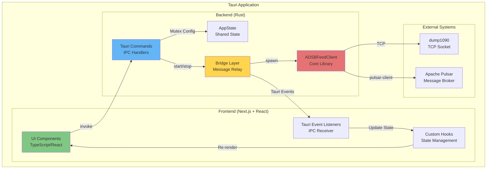
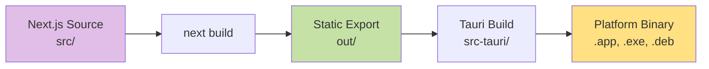
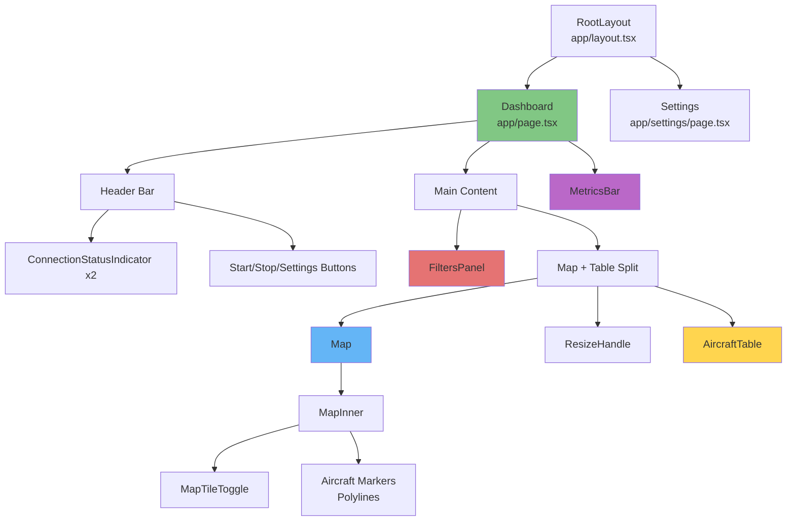
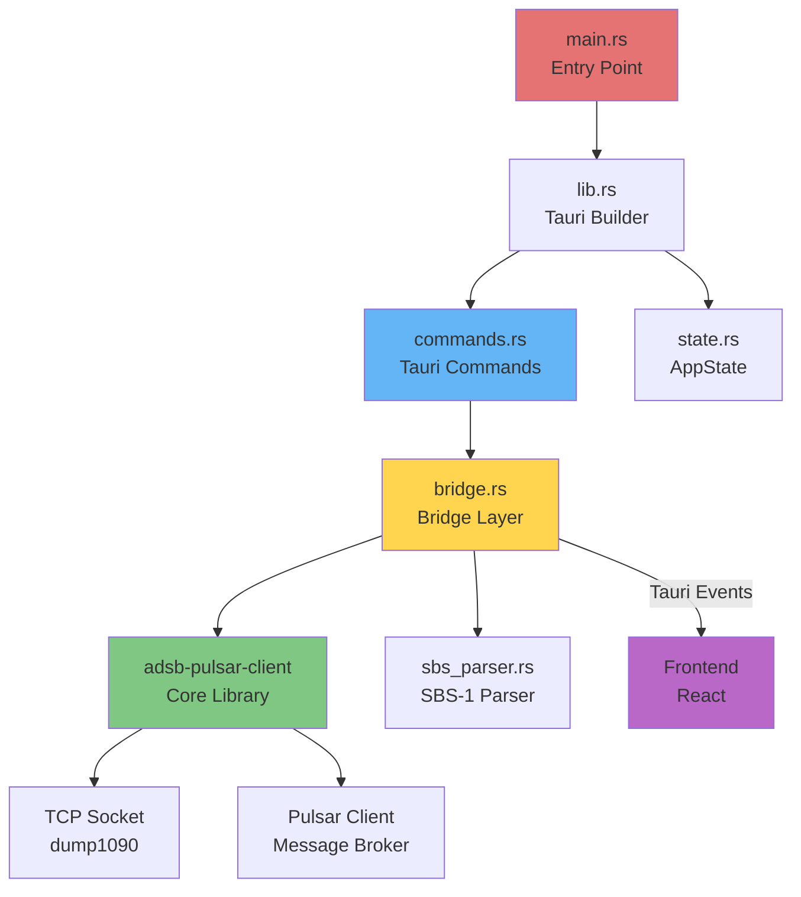
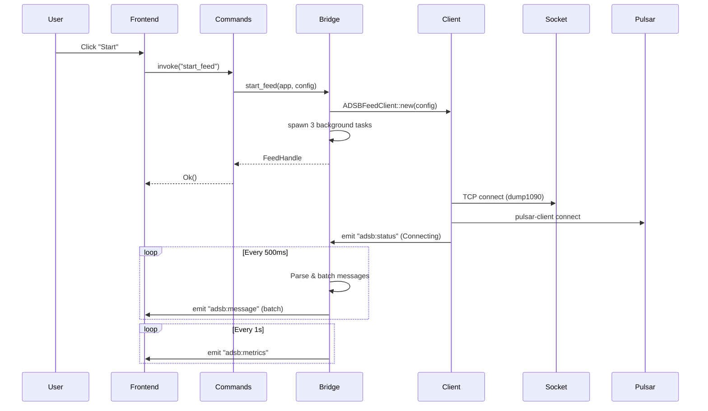
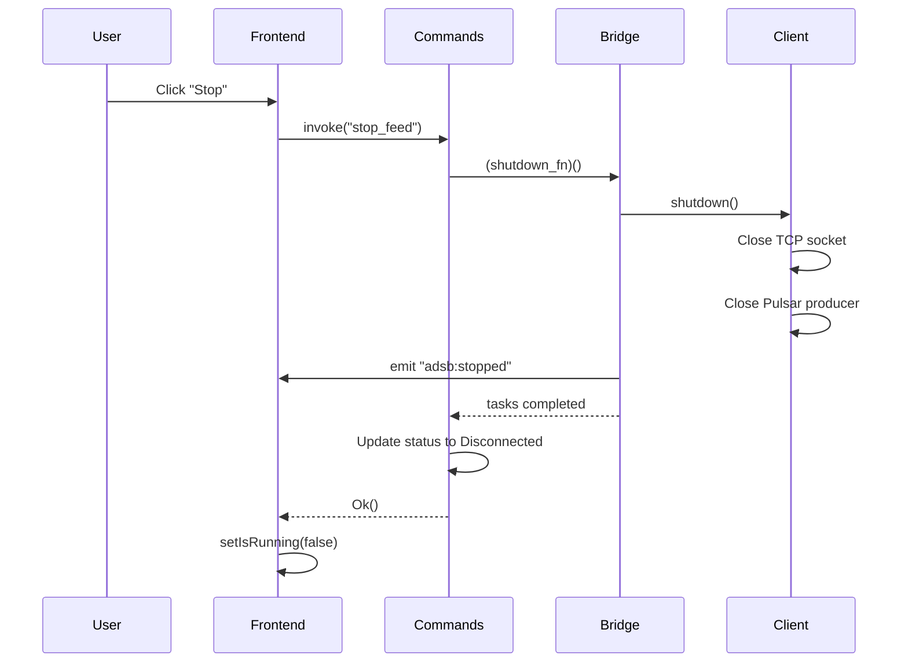

# ADS-B Aircraft Tracker Desktop Application - Design Document

## Table of Contents
1. [High-Level Application Design](#high-level-application-design)
2. [Frontend Architecture](#frontend-architecture)
3. [Component Hierarchy](#component-hierarchy)
4. [Backend Architecture (Tauri Rust)](#backend-architecture-tauri-rust)
5. [Data Flow](#data-flow)
6. [State Management](#state-management)

---

## High-Level Application Design

### Overview

The ADS-B Aircraft Tracker is a **cross-platform desktop application** built with **Tauri v2**, combining:
- **Backend**: Rust (performance-critical data ingestion and processing)
- **Frontend**: Next.js 15 + React 19 + TypeScript (modern, reactive UI)
- **Styling**: Tailwind CSS 4 (utility-first styling)
- **Mapping**: Leaflet + React-Leaflet (interactive geospatial visualization)

### Architecture Pattern: Event-Driven IPC (Inter-Process Communication)



### Key Design Principles

1. **Separation of Concerns**: Frontend handles UI/UX, backend handles I/O and message processing
2. **Event-Driven Communication**: Backend emits Tauri events, frontend listens reactively
3. **Type Safety**: Shared types between Rust (serde) and TypeScript (interfaces)
4. **Non-Blocking UI**: All data operations run on Tokio async runtime in background tasks
5. **Reusability**: Core `adsb-pulsar-client` library used as dependency (no code duplication)

### Technology Stack

| Layer | Technology | Version | Purpose |
|-------|-----------|---------|---------|
| **Desktop Framework** | Tauri | 2.x | Native app wrapper, IPC bridge |
| **Frontend Framework** | Next.js | 15.x | React framework with SSG/SSR |
| **UI Library** | React | 19.x | Component-based UI |
| **Language** | TypeScript | 5.x | Type-safe frontend code |
| **Styling** | Tailwind CSS | 4.x | Utility-first CSS framework |
| **Mapping** | Leaflet | 1.9.x | Interactive maps |
| **Map Integration** | React-Leaflet | 5.x | React bindings for Leaflet |
| **Backend Language** | Rust | 1.75+ | High-performance backend |
| **Async Runtime** | Tokio | 1.x | Asynchronous task execution |
| **Core Library** | adsb-pulsar-client | (workspace) | Shared ADSB client logic |

### Application Window Configuration

**File**: `src-tauri/tauri.conf.json`

```json
{
  "identifier": "com.adsb.aircraft-tracker",
  "productName": "ADS-B Aircraft Tracker",
  "version": "0.1.0",
  "app": {
    "windows": [{
      "title": "ADS-B Aircraft Tracker",
      "width": 1400,
      "height": 900,
      "minWidth": 800,
      "minHeight": 600,
      "resizable": true
    }]
  }
}
```

**Content Security Policy (CSP)**:
- Allows OpenStreetMap tile servers for map rendering
- Permits IPC communication between frontend and backend
- Restricts external scripts for security

---

## Frontend Architecture

### Framework: Next.js 15 (App Router)

The frontend uses **Next.js App Router** with:
- **Static Site Generation (SSG)**: Output to `out/` directory for Tauri
- **Client-Side Rendering (CSR)**: All interactivity happens in the Tauri webview
- **No Server-Side Rendering**: App runs entirely offline

### Directory Structure

```
src/
├── app/                      # Next.js App Router pages
│   ├── layout.tsx           # Root layout (metadata, global styles)
│   ├── page.tsx             # Main dashboard page
│   ├── settings/
│   │   └── page.tsx         # Settings page
│   └── globals.css          # Global Tailwind CSS
├── components/              # React UI components
│   ├── AircraftTable.tsx    # Tabular data display
│   ├── ConnectionStatus.tsx # Connection indicator badges
│   ├── Filters.tsx          # Filter panel (sidebar)
│   ├── Map.tsx              # Map wrapper (SSR bypass)
│   ├── MapInner.tsx         # Actual Leaflet map
│   ├── MapTileToggle.tsx    # Dark/light map theme toggle
│   ├── MetricsBar.tsx       # Footer metrics display
│   └── ResizeHandle.tsx     # Resizable panel divider
├── hooks/                   # Custom React hooks
│   ├── useAircraftTracks.ts # Track state management
│   ├── useConnectionStatus.ts # Status polling
│   ├── useLocalStorage.ts   # Persistent UI preferences
│   ├── useMetrics.ts        # Metrics polling
│   └── useTauriEvent.ts     # Event listener abstraction
├── lib/                     # Utilities and types
│   ├── colors.ts            # Altitude-based color mapping
│   ├── commands.ts          # Tauri command wrappers
│   └── types.ts             # TypeScript type definitions
```

### Build Pipeline



**Commands**:
- `npm run dev`: Next.js dev server on port 3000 (hot reload)
- `npm run build`: Static export to `out/` directory
- `npm run tauri dev`: Run Tauri in dev mode with Next.js dev server
- `npm run tauri build`: Build production desktop app

---

## Component Hierarchy

### Visual Component Tree



### Component Details

#### 1. **RootLayout** (`src/app/layout.tsx`)

**Purpose**: Root HTML structure and global metadata

**Responsibilities**:
- Set application title and description
- Apply global dark theme (`bg-slate-950 text-slate-100`)
- Include Tailwind CSS globals

**Props**: `children: React.ReactNode`

**Rendering**: Wraps all pages in `<html>` and `<body>` tags

---

#### 2. **Dashboard** (`src/app/page.tsx`)

**Purpose**: Main application page (aircraft tracking dashboard)

**Responsibilities**:
- Orchestrate all UI components (header, sidebar, map, table, footer)
- Manage top-level state (filters, running status, errors)
- Handle start/stop commands via Tauri IPC
- Persist UI preferences (map theme, table height) to localStorage

**Custom Hooks Used**:
- `useAircraftTracks(filters)`: Track state with filtering
- `useMetrics()`: Performance metrics polling
- `useConnectionStatus()`: Connection status polling
- `useTauriEvent("adsb:stopped")`: Listen for stop events
- `useLocalStorage("adsb-map-theme")`: Persist map theme
- `useLocalStorage("adsb-table-height")`: Persist table height

**State Management**:
- `filters: Filters`: Altitude/speed/callsign filters
- `isRunning: boolean`: Feed running status
- `error: string | null`: Error messages
- `mapTheme: "light" | "dark"`: Map tile style
- `tableHeight: number`: Resizable table height in pixels

**Layout Structure**:
```tsx
<div className="h-screen flex flex-col">
  <header> {/* Header bar */} </header>
  <div className="flex flex-1">
    <aside> {/* Sidebar filters */} </aside>
    <main className="flex flex-col">
      <div> {/* Map */} </div>
      <ResizeHandle />
      <div> {/* Table */} </div>
    </main>
  </div>
  <MetricsBar />
</div>
```

---

#### 3. **Settings** (`src/app/settings/page.tsx`)

**Purpose**: Configuration page for connection settings

**Responsibilities**:
- Load current configuration via `get_config` command
- Provide form inputs for all config fields
- Validate configuration before saving
- Save configuration via `save_config` command

**Configuration Fields**:
- `source_id`: Unique identifier for this client
- `socket_host`, `socket_port`: dump1090 TCP connection
- `pulsar_broker`, `pulsar_topic`: Pulsar connection
- Buffer sizes, timeouts, retry policies
- `test_mode`: Run without Pulsar (socket-only)
- `log_level`: Debug, info, warn, error

---

#### 4. **AircraftTable** (`src/components/AircraftTable.tsx`)

**Purpose**: Tabular display of aircraft data

**Props**: `tracks: AircraftTrack[]`

**Responsibilities**:
- Render scrollable table with fixed header
- Display columns: Hex ID, Callsign, Altitude, Speed, Track, Lat/Lon, Squawk
- Handle null values gracefully (display "—")
- Apply zebra striping for readability

**Styling**:
- Dark background (`bg-slate-900`)
- Fixed header with `sticky top-0`
- Overflow scrolling for table body

**File**: `src/components/AircraftTable.tsx`

---

#### 5. **ConnectionStatus** (`src/components/ConnectionStatus.tsx`)

**Purpose**: Connection status indicator badges

**Props**:
- `label: string`: Display label ("Socket", "Pulsar")
- `status: ConnectionStatus`: Current status enum

**Responsibilities**:
- Render color-coded badge based on status
- Display status text and error messages

**Status Colors**:
- `Disconnected`: Gray (`bg-slate-700`)
- `Connecting`: Yellow (`bg-yellow-600`)
- `Connected`: Green (`bg-green-600`)
- `Error`: Red (`bg-red-600`)

**File**: `src/components/ConnectionStatus.tsx`

---

#### 6. **Filters** (`src/components/Filters.tsx`)

**Purpose**: Filter panel in left sidebar

**Props**:
- `filters: Filters`: Current filter state
- `onChange: (filters: Filters) => void`: Update callback
- `trackCount: number`: Number of tracks matching filters

**Responsibilities**:
- Callsign search input
- Altitude range sliders (0-50,000 ft)
- Speed range sliders (0-600 kts)
- Reset filters button

**Styling**:
- Dark sidebar (`bg-slate-900`)
- Compact form inputs
- Live filter count display

**File**: `src/components/Filters.tsx`

---

#### 7. **Map** (`src/components/Map.tsx`)

**Purpose**: Wrapper for Leaflet map with SSR bypass

**Props**:
- `tracks: AircraftTrack[]`: Aircraft to display
- `mapTheme: "light" | "dark"`: Tile style
- `onToggleTheme: () => void`: Theme toggle callback

**Responsibilities**:
- Use Next.js `dynamic()` to disable SSR (Leaflet requires browser)
- Display loading state while map initializes
- Forward props to `MapInner`

**Technical Note**: Leaflet requires `window` and `document`, so it must be loaded client-side only.

**File**: `src/components/Map.tsx`

---

#### 8. **MapInner** (`src/components/MapInner.tsx`)

**Purpose**: Actual Leaflet map with markers and trajectories

**Props**: Same as `Map`

**Responsibilities**:
- Initialize Leaflet map with `MapContainer`
- Render OpenStreetMap tile layers (light/dark)
- Display aircraft markers (color-coded by altitude)
- Draw trajectory polylines for each aircraft
- Provide map controls (zoom, theme toggle)

**Marker Behavior**:
- **Color**: Based on altitude (see `src/lib/colors.ts`)
- **Popup**: Display callsign, altitude, speed on click
- **Trajectory**: Polyline connecting recent positions

**Map Layers**:
- Light theme: `https://tile.openstreetmap.org/{z}/{x}/{y}.png`
- Dark theme: Custom dark tiles or inverted colors

**File**: `src/components/MapInner.tsx`

---

#### 9. **MapTileToggle** (`src/components/MapTileToggle.tsx`)

**Purpose**: Button to toggle map theme (light/dark)

**Props**: `onToggle: () => void`

**Responsibilities**:
- Render floating button in top-right corner of map
- Display sun/moon icon based on current theme
- Call `onToggle` callback on click

**File**: `src/components/MapTileToggle.tsx`

---

#### 10. **MetricsBar** (`src/components/MetricsBar.tsx`)

**Purpose**: Footer bar displaying performance metrics

**Props**: `metrics: MetricsSnapshot`

**Responsibilities**:
- Display metrics in compact horizontal layout
- Show: Messages sent, errors, throughput, elapsed time
- Update in real-time (polled every 1 second)

**Metrics Displayed**:
- **Messages Sent**: Total messages sent to Pulsar
- **Errors**: Total errors encountered
- **Throughput**: Messages/second
- **Elapsed Time**: Time since feed started
- **Bytes Sent/Received**: Network traffic stats

**File**: `src/components/MetricsBar.tsx`

---

#### 11. **ResizeHandle** (`src/components/ResizeHandle.tsx`)

**Purpose**: Draggable divider between map and table

**Props**:
- `onResize: (deltaY: number) => void`: Called during drag
- `onResizeEnd: () => void`: Called when drag ends

**Responsibilities**:
- Render horizontal divider with hover effect
- Capture mouse down and track drag events
- Emit `deltaY` (change in Y position) to parent

**Styling**:
- Thin horizontal line (`h-1`)
- Hover cursor: `cursor-row-resize`
- Visual feedback on hover/drag

**File**: `src/components/ResizeHandle.tsx`

---

### Custom Hooks

#### 1. **useAircraftTracks** (`src/hooks/useAircraftTracks.ts`)

**Purpose**: Maintain aircraft track state from `adsb:message` events

**Parameters**: `filters: Filters`

**Returns**: `AircraftTrack[]`

**Responsibilities**:
- Listen for `adsb:message` events (batches of positions)
- Merge new positions into existing tracks (latest values win)
- Build position history array for trajectory rendering
- Apply TTL expiry (5 minutes since last update)
- Filter tracks by callsign, altitude, speed

**Internal State**:
- `tracksRef: Map<string, AircraftTrack>`: Keyed by `hex_ident`
- `tracks: AircraftTrack[]`: Filtered array for rendering

**Event Handling**:
```typescript
useTauriEvent<AircraftPosition[]>("adsb:message", (batch) => {
  // Merge batch into tracksRef
  // Expire old tracks
  // Apply filters
  // Update state
});
```

**File**: `src/hooks/useAircraftTracks.ts`

---

#### 2. **useConnectionStatus** (`src/hooks/useConnectionStatus.ts`)

**Purpose**: Poll connection status from backend

**Returns**: `StatusResponse`

**Responsibilities**:
- Call `get_status()` command every 1 second
- Update state with latest status
- Handle errors gracefully

**Polling Logic**:
```typescript
useEffect(() => {
  const interval = setInterval(async () => {
    const status = await getStatus();
    setStatus(status);
  }, 1000);
  return () => clearInterval(interval);
}, []);
```

**File**: `src/hooks/useConnectionStatus.ts`

---

#### 3. **useLocalStorage** (`src/hooks/useLocalStorage.ts`)

**Purpose**: Persist UI preferences to browser localStorage

**Parameters**:
- `key: string`: Storage key
- `initialValue: T`: Default value

**Returns**: `[value: T, setValue: (value: T) => void]`

**Responsibilities**:
- Load value from localStorage on mount
- Save value to localStorage on change
- Provide React state interface

**Use Cases**:
- Map theme (`adsb-map-theme`)
- Table height (`adsb-table-height`)

**File**: `src/hooks/useLocalStorage.ts`

---

#### 4. **useMetrics** (`src/hooks/useMetrics.ts`)

**Purpose**: Poll metrics from backend

**Returns**: `MetricsSnapshot`

**Responsibilities**:
- Call `get_metrics()` command every 1 second
- Update state with latest metrics

**File**: `src/hooks/useMetrics.ts`

---

#### 5. **useTauriEvent** (`src/hooks/useTauriEvent.ts`)

**Purpose**: Listen for Tauri events with TypeScript type safety

**Parameters**:
- `eventName: string`: Event name (e.g., "adsb:message")
- `handler: (payload: T) => void`: Callback function

**Returns**: `void`

**Responsibilities**:
- Register event listener on mount
- Unregister listener on unmount
- Provide type-safe payload handling

**Usage**:
```typescript
useTauriEvent<AircraftPosition[]>("adsb:message", (batch) => {
  // Handle batch
});
```

**File**: `src/hooks/useTauriEvent.ts`

---

### Utility Libraries

#### 1. **colors.ts** (`src/lib/colors.ts`)

**Purpose**: Map altitude to color for aircraft markers

**Function**: `getAltitudeColor(altitude: number | null): string`

**Color Scale**:
- **0-5,000 ft**: Green (low altitude)
- **5,000-15,000 ft**: Yellow (climbing/descending)
- **15,000-30,000 ft**: Orange (cruise)
- **30,000+ ft**: Red (high altitude)
- **null**: Gray (no altitude data)

**File**: `src/lib/colors.ts`

---

#### 2. **commands.ts** (`src/lib/commands.ts`)

**Purpose**: Wrapper functions for Tauri commands

**Functions**:
- `startFeed(): Promise<void>`: Start the feed client
- `stopFeed(): Promise<void>`: Stop the feed client
- `getStatus(): Promise<StatusResponse>`: Get connection status
- `getMetrics(): Promise<MetricsSnapshot>`: Get metrics snapshot
- `getConfig(): Promise<Config>`: Load configuration
- `saveConfig(config: Config): Promise<void>`: Save configuration
- `validateConfig(config: Config): Promise<void>`: Validate config

**Implementation**:
```typescript
import { invoke } from "@tauri-apps/api/core";

export async function startFeed(): Promise<void> {
  await invoke("start_feed");
}
```

**File**: `src/lib/commands.ts`

---

#### 3. **types.ts** (`src/lib/types.ts`)

**Purpose**: TypeScript type definitions (mirrors Rust types)

**Key Types**:
- `AircraftPosition`: Single SBS-1 message (from backend)
- `AircraftTrack`: Accumulated track state (frontend only)
- `MetricsSnapshot`: Performance metrics
- `ConnectionStatus`: Connection state enum
- `StatusResponse`: Combined status response
- `Config`: Client configuration
- `Filters`: UI filter state

**Type Safety**: These types match Rust structs via `serde` serialization

**File**: `src/lib/types.ts`

---

## Backend Architecture (Tauri Rust)

### Directory Structure

```
src-tauri/
├── src/
│   ├── main.rs           # Entry point (calls lib.rs::run())
│   ├── lib.rs            # Tauri app initialization
│   ├── commands.rs       # Tauri command handlers
│   ├── state.rs          # Application state (Mutex<Config>, FeedHandle)
│   ├── bridge.rs         # Bridge between client library and Tauri
│   └── sbs_parser.rs     # SBS-1 message parser
├── build.rs              # Build script
├── Cargo.toml            # Rust dependencies
├── tauri.conf.json       # Tauri configuration
└── capabilities/
    └── default.json      # Permission capabilities
```

### Backend Component Diagram



### Backend Modules

#### 1. **main.rs** (`src-tauri/src/main.rs`)

**Purpose**: Application entry point

**Responsibilities**:
- Call `lib::run()` to start Tauri app
- Minimal bootstrap code

**File**: `src-tauri/src/main.rs`

---

#### 2. **lib.rs** (`src-tauri/src/lib.rs`)

**Purpose**: Tauri application builder and initialization

**Responsibilities**:
- Initialize `tracing` logger (configurable via `RUST_LOG` env var)
- Register Tauri plugins:
  - `tauri-plugin-store`: Persistent config storage
  - `tauri-plugin-shell`: Shell command execution
- Manage `AppState` (shared state across commands)
- Register Tauri command handlers

**Command Handlers Registered**:
```rust
.invoke_handler(tauri::generate_handler![
    commands::start_feed,
    commands::stop_feed,
    commands::get_status,
    commands::get_metrics,
    commands::get_config,
    commands::save_config,
    commands::validate_config,
])
```

**File**: `src-tauri/src/lib.rs`

---

#### 3. **commands.rs** (`src-tauri/src/commands.rs`)

**Purpose**: Tauri command handlers (invoked from frontend via `invoke()`)

**Commands**:

##### `start_feed(app: AppHandle, state: State<AppState>) -> Result<(), String>`
- Checks if feed is already running (returns error if yes)
- Loads configuration from state
- Calls `bridge::start_feed()` to spawn background tasks
- Updates connection status to "Connecting"
- Stores `FeedHandle` in state

##### `stop_feed(state: State<AppState>) -> Result<(), String>`
- Takes `FeedHandle` from state (sets to `None`)
- Calls shutdown function
- Waits for background tasks to complete (with 5s timeout)
- Updates connection status to "Disconnected"

##### `get_status(state: State<AppState>) -> Result<StatusResponse, String>`
- Returns current connection status

##### `get_metrics(state: State<AppState>) -> Result<MetricsSnapshot, String>`
- Returns metrics snapshot from `FeedHandle` (or empty if not running)

##### `get_config(state: State<AppState>) -> Result<Config, String>`
- Returns current configuration

##### `save_config(config: Config, state: State<AppState>) -> Result<(), String>`
- Validates configuration
- Checks if feed is running (prevents config changes while running)
- Saves new configuration to state

##### `validate_config(config: Config) -> Result<(), String>`
- Validates configuration without saving

**File**: `src-tauri/src/commands.rs`

---

#### 4. **state.rs** (`src-tauri/src/state.rs`)

**Purpose**: Application state management

**Structs**:

##### `ConnectionStatus` (enum)
```rust
pub enum ConnectionStatus {
    Disconnected,
    Connecting,
    Connected,
    Error(String),
}
```

##### `StatusResponse`
```rust
pub struct StatusResponse {
    pub is_running: bool,
    pub socket_status: ConnectionStatus,
    pub pulsar_status: ConnectionStatus,
}
```

##### `FeedHandle`
```rust
pub struct FeedHandle {
    pub metrics: Metrics,                        // Metrics handle (lock-free)
    pub shutdown_fn: Box<dyn Fn() + Send + Sync>, // Shutdown callback
    pub task_handles: Vec<JoinHandle<()>>,       // Background tasks
}
```

##### `AppState`
```rust
pub struct AppState {
    pub config: Mutex<Config>,                    // Current configuration
    pub feed_handle: Mutex<Option<FeedHandle>>,   // Running feed (None when stopped)
    pub connection_status: Mutex<StatusResponse>, // Current status
}
```

**File**: `src-tauri/src/state.rs`

---

#### 5. **bridge.rs** (`src-tauri/src/bridge.rs`)

**Purpose**: Bridge between `adsb-pulsar-client` library and Tauri frontend

**Key Function**: `start_feed(app: AppHandle, config: Config) -> Result<FeedHandle, String>`

**Responsibilities**:
1. Create `ADSBFeedClient` with configuration
2. Attach message tap (broadcast channel with 4096 buffer)
3. Spawn 3 background tasks:
   - **Client Task**: Runs the feed client, listens for shutdown signal
   - **Message Relay Task**: Parses and batches messages, emits `adsb:message` events
   - **Metrics Relay Task**: Emits `adsb:metrics` events every 1 second
4. Return `FeedHandle` for shutdown and metrics access

**Message Relay Strategy** (Throttling):
- Buffer messages in `HashMap<hex_ident, AircraftPosition>` (latest per aircraft)
- Flush batch every 500ms to frontend
- Prevents overwhelming the webview with high-frequency updates

**Shutdown Mechanism**:
- Uses `tokio::sync::oneshot` channel to signal shutdown
- `tokio::select!` waits for either client completion or shutdown signal
- Emits `adsb:stopped` event when client stops

**File**: `src-tauri/src/bridge.rs`

---

#### 6. **sbs_parser.rs** (`src-tauri/src/sbs_parser.rs`)

**Purpose**: Parse SBS-1 (BaseStation) format messages

**Struct**: `AircraftPosition` (mirrors TypeScript type)

**Function**: `parse_sbs_message(line: &str) -> Option<AircraftPosition>`

**Parsing Logic**:
1. Split CSV line by commas
2. Extract message type (expect "MSG")
3. Extract transmission type (1-8)
4. Parse fields: hex_ident, callsign, altitude, lat/lon, etc.
5. Handle optional fields gracefully (return `None` for empty strings)
6. Construct `AircraftPosition` struct

**Error Handling**:
- Returns `None` for invalid messages (logged but not propagated)
- Tolerates missing fields (SBS-1 often has partial data)

**File**: `src-tauri/src/sbs_parser.rs`

---

## Data Flow

### Startup Flow



### Message Flow (Real-time Updates)

```mermaid
graph LR
    A[dump1090<br/>TCP Socket] -->|SBS-1 lines| B[ADSBFeedClient]
    B -->|broadcast::Receiver| C[Bridge: Message Relay]
    C -->|parse_sbs_message| D[AircraftPosition]
    D -->|buffer in HashMap| E[Batch]
    E -->|every 500ms| F[Tauri Event<br/>adsb:message]
    F -->|listen| G[useAircraftTracks]
    G -->|merge & filter| H[tracks: AircraftTrack[]]
    H -->|props| I[Map + Table Components]

    style B fill:#E57373
    style C fill:#FFD54F
    style G fill:#81C784
    style I fill:#64B5F6
```

### Shutdown Flow



---

## State Management

### Backend State (Rust)

**Managed by**: `AppState` (Tauri managed state)

**Concurrency**: `Mutex` for thread-safe access from command handlers

**State Fields**:
- `config: Mutex<Config>`: Current configuration (loaded from tauri-plugin-store)
- `feed_handle: Mutex<Option<FeedHandle>>`: Handle to running feed (None when stopped)
- `connection_status: Mutex<StatusResponse>`: Current connection status

**Access Pattern**:
```rust
let config = state.config.lock().map_err(|e| e.to_string())?;
```

### Frontend State (React)

**State Management Strategy**: Local component state + custom hooks

**No Global State Library**: Uses React Context API sparingly, prefers prop drilling for clarity

**State Locations**:

| State | Location | Persistence |
|-------|----------|-------------|
| `tracks: AircraftTrack[]` | `useAircraftTracks` hook | In-memory (TTL expiry) |
| `filters: Filters` | `Dashboard` component | None |
| `isRunning: boolean` | `Dashboard` component | None |
| `mapTheme: "light" \| "dark"` | `Dashboard` + `useLocalStorage` | localStorage |
| `tableHeight: number` | `Dashboard` + `useLocalStorage` | localStorage |
| `metrics: MetricsSnapshot` | `useMetrics` hook | Polled from backend |
| `status: StatusResponse` | `useConnectionStatus` hook | Polled from backend |

**Event-Driven Updates**:
- `adsb:message` → `useAircraftTracks` → Re-render map/table
- `adsb:metrics` → `useMetrics` → Re-render footer
- `adsb:status` → `useConnectionStatus` → Re-render status badges
- `adsb:stopped` → Dashboard → `setIsRunning(false)`

---

## Performance Considerations

### Backend Optimizations

1. **Async I/O**: All I/O operations (TCP, Pulsar) use Tokio async runtime
2. **Lock-Free Metrics**: `adsb-pulsar-client::Metrics` uses `Arc<AtomicU64>` for concurrent reads
3. **Buffered Parsing**: SBS-1 messages parsed in batches (500ms intervals)
4. **Broadcast Channel**: 4096-message buffer prevents blocking on slow consumers

### Frontend Optimizations

1. **Event Batching**: Messages batched into 500ms intervals (reduce React re-renders)
2. **Map Rendering**: Leaflet uses canvas for efficient marker rendering
3. **Virtual Scrolling**: (Future) Table uses virtual scrolling for 1000+ aircraft
4. **Lazy Loading**: Map component loaded dynamically (no SSR overhead)
5. **Memoization**: (Future) Use `React.memo()` for expensive components

### Memory Management

1. **Track TTL**: Expire tracks after 5 minutes of inactivity
2. **Position History Limit**: Max 100 positions per track (prevent unbounded growth)
3. **HashMap Cleanup**: Periodic cleanup of expired tracks in `useAircraftTracks`

---

## Security Considerations

### Content Security Policy (CSP)

**Configured in**: `src-tauri/tauri.conf.json`

```
default-src 'self';
img-src 'self' https://*.tile.openstreetmap.org https://*.openstreetmap.org data:;
style-src 'self' 'unsafe-inline' https://unpkg.com;
script-src 'self' 'unsafe-inline';
connect-src 'self' ipc: http://ipc.localhost https://*.tile.openstreetmap.org;
```

**Purpose**:
- Allow only necessary external resources (map tiles)
- Permit IPC communication between frontend and backend
- Prevent XSS attacks by restricting script sources

### Tauri Capabilities

**Configured in**: `src-tauri/capabilities/default.json`

**Permissions**:
- `shell:allow-open`: Allow opening URLs in default browser
- `store:allow-get`, `store:allow-set`: Persistent configuration storage

**Principle of Least Privilege**: Only grant permissions required for functionality

---

## Build and Deployment

### Development

```bash
# Install dependencies
npm install

# Run Next.js dev server + Tauri (hot reload)
npm run tauri dev
```

### Production Build

```bash
# Build Next.js static export
npm run build

# Build Tauri app (platform-specific binary)
npm run tauri build
```

**Output Artifacts**:
- **macOS**: `src-tauri/target/release/bundle/macos/ADS-B Aircraft Tracker.app`
- **Windows**: `src-tauri/target/release/bundle/msi/adsb-aircraft-tracker_0.1.0_x64_en-US.msi`
- **Linux**: `src-tauri/target/release/bundle/deb/adsb-aircraft-tracker_0.1.0_amd64.deb`

### Cross-Compilation

Tauri supports cross-compilation for different platforms. See:
- https://tauri.app/v2/guides/building/cross-platform

---

## Future Enhancements

### Planned Features

1. **Historical Replay**: Load and replay past tracks from Delta Lake
2. **Export Functionality**: Export tracks to KML/GeoJSON
3. **Alerts**: Configurable alerts for specific aircraft (e.g., "notify when AAL123 appears")
4. **Performance Dashboard**: More detailed metrics visualization (charts)
5. **Multi-Source Support**: Connect to multiple dump1090 instances simultaneously
6. **Dark Mode Toggle**: Full dark/light theme (not just map tiles)

### Technical Improvements

1. **Virtual Scrolling**: Handle 1000+ aircraft efficiently in table
2. **WebGL Rendering**: Use WebGL-based map library for better performance
3. **Worker Threads**: Move heavy parsing to Web Workers
4. **Persistent Storage**: Cache tracks locally for offline analysis
5. **E2E Testing**: Add Playwright tests for UI flows
6. **CI/CD**: Automate builds for macOS, Windows, Linux

---

## Conclusion

The ADS-B Aircraft Tracker desktop application demonstrates a modern, performant architecture:

- **Tauri v2**: Combines Rust backend efficiency with web frontend flexibility
- **Event-Driven IPC**: Clean separation between frontend and backend
- **Type Safety**: Shared types (Rust ↔ TypeScript) via serde
- **Reusability**: Core library (`adsb-pulsar-client`) shared across CLI and desktop apps
- **Responsive UI**: Real-time updates with minimal latency
- **Cross-Platform**: Single codebase builds for macOS, Windows, Linux

This design prioritizes developer experience (hot reload, TypeScript), user experience (responsive UI, offline-capable), and performance (async I/O, efficient rendering).
