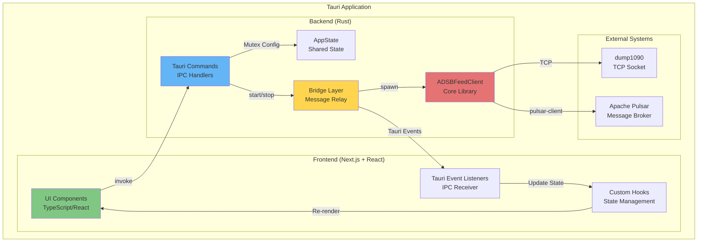
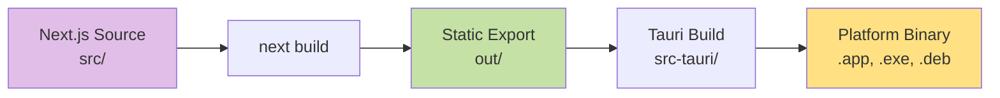
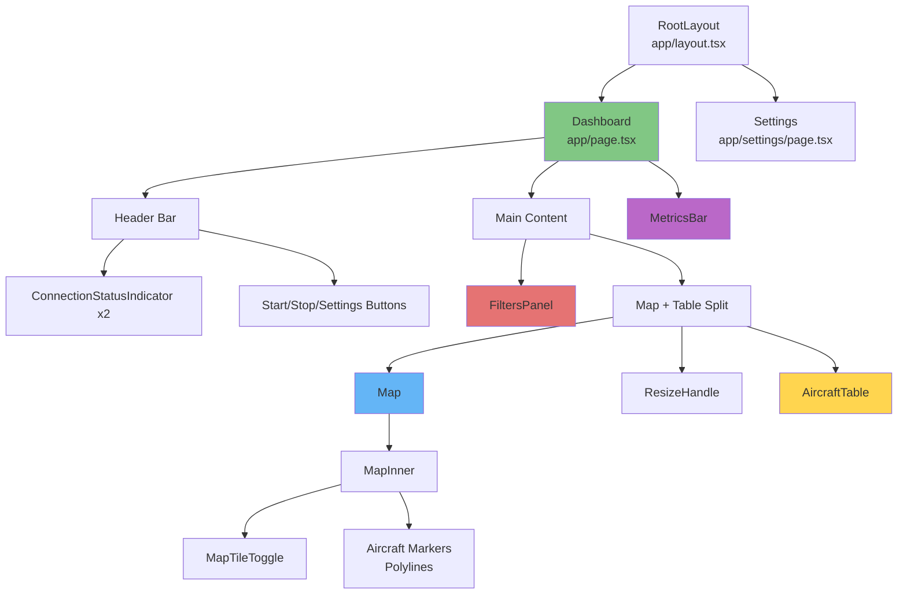
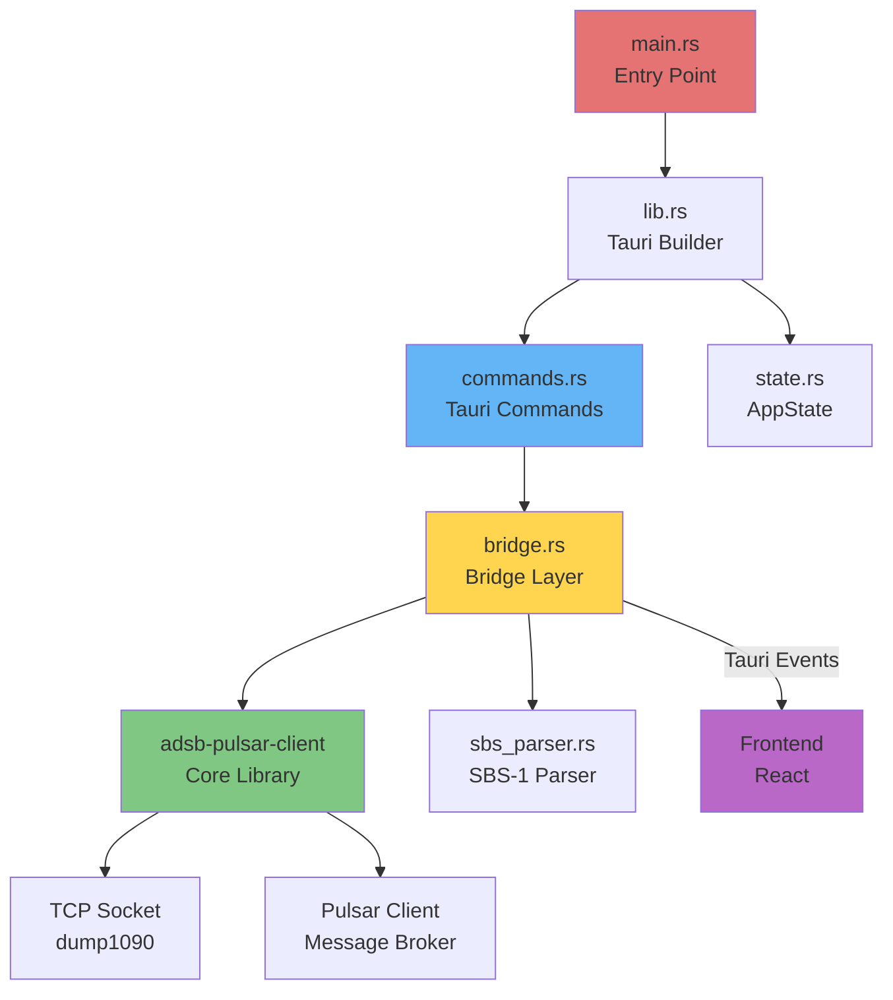
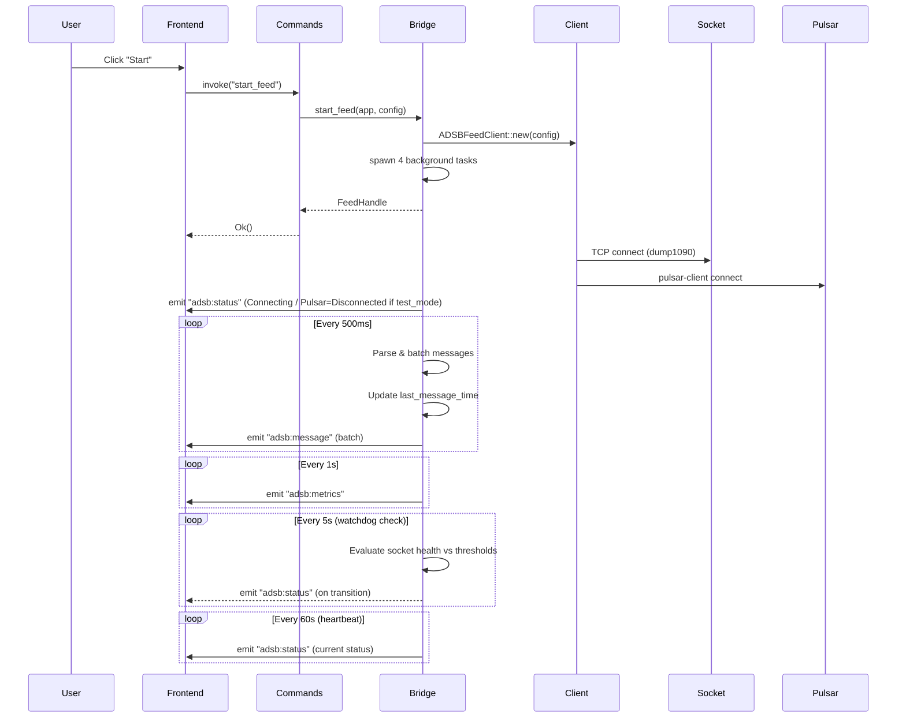
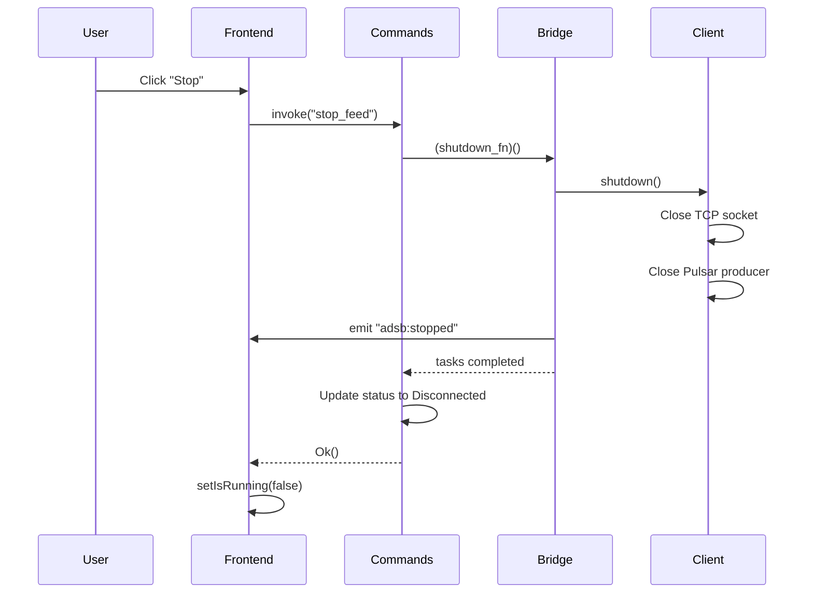
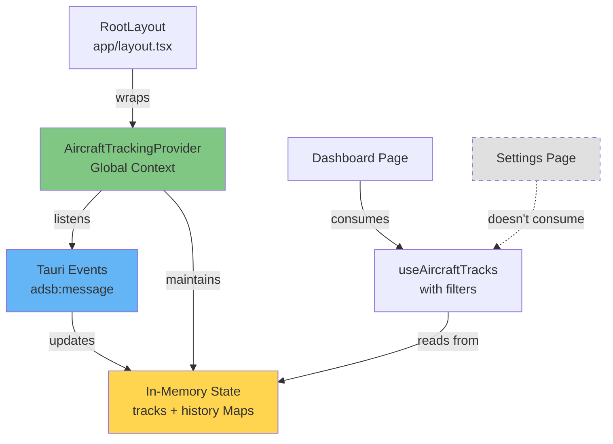
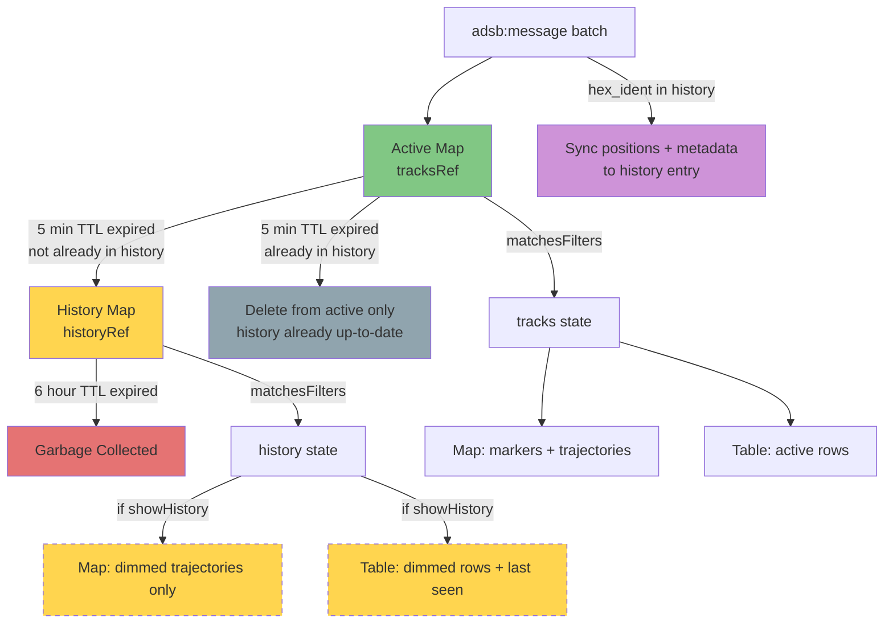

# ADS-B Aircraft Tracker Desktop Application - Design Document

## Table of Contents
1. [High-Level Application Design](#high-level-application-design)
2. [Frontend Architecture](#frontend-architecture)
3. [Component Hierarchy](#component-hierarchy)
4. [Backend Architecture (Tauri Rust)](#backend-architecture-tauri-rust)
5. [Data Flow](#data-flow)
6. [State Management](#state-management)
7. [Global Context Manager Pattern](#global-context-manager-pattern)
8. [In-Memory Aircraft History](#in-memory-aircraft-history)

---

## High-Level Application Design

### Overview

The ADS-B Aircraft Tracker is a **cross-platform desktop application** built with **Tauri v2**, combining:
- **Backend**: Rust (performance-critical data ingestion and processing)
- **Frontend**: Next.js 15 + React 19 + TypeScript (modern, reactive UI)
- **Styling**: Tailwind CSS 4 (utility-first styling)
- **Mapping**: Leaflet + React-Leaflet (interactive geospatial visualization)

### Architecture Pattern: Event-Driven IPC (Inter-Process Communication)



### Key Design Principles

1. **Separation of Concerns**: Frontend handles UI/UX, backend handles I/O and message processing
2. **Event-Driven Communication**: Backend emits Tauri events, frontend listens reactively
3. **Type Safety**: Shared types between Rust (serde) and TypeScript (interfaces)
4. **Non-Blocking UI**: All data operations run on Tokio async runtime in background tasks
5. **Reusability**: Core `adsb-pulsar-client` library used as dependency (no code duplication)

### Technology Stack

| Layer | Technology | Version | Purpose |
|-------|-----------|---------|---------|
| **Desktop Framework** | Tauri | 2.x | Native app wrapper, IPC bridge |
| **Frontend Framework** | Next.js | 15.x | React framework with SSG/SSR |
| **UI Library** | React | 19.x | Component-based UI |
| **Language** | TypeScript | 5.x | Type-safe frontend code |
| **Styling** | Tailwind CSS | 4.x | Utility-first CSS framework |
| **Mapping** | Leaflet | 1.9.x | Interactive maps |
| **Map Integration** | React-Leaflet | 5.x | React bindings for Leaflet |
| **Backend Language** | Rust | 1.75+ | High-performance backend |
| **Async Runtime** | Tokio | 1.x | Asynchronous task execution |
| **Core Library** | adsb-pulsar-client | (workspace) | Shared ADSB client logic |

### Application Window Configuration

**File**: `src-tauri/tauri.conf.json`

```json
{
  "identifier": "com.adsb.aircraft-tracker",
  "productName": "ADS-B Aircraft Tracker",
  "version": "0.1.0",
  "app": {
    "windows": [{
      "title": "ADS-B Aircraft Tracker",
      "width": 1400,
      "height": 900,
      "minWidth": 800,
      "minHeight": 600,
      "resizable": true
    }]
  }
}
```

**Content Security Policy (CSP)**:
- Allows OpenStreetMap tile servers for map rendering
- Permits IPC communication between frontend and backend
- Restricts external scripts for security

---

## Frontend Architecture

### Framework: Next.js 15 (App Router)

The frontend uses **Next.js App Router** with:
- **Static Site Generation (SSG)**: Output to `out/` directory for Tauri
- **Client-Side Rendering (CSR)**: All interactivity happens in the Tauri webview
- **No Server-Side Rendering**: App runs entirely offline

### Directory Structure

```
src/
├── app/                      # Next.js App Router pages
│   ├── layout.tsx           # Root layout (wraps children in AircraftTrackingProvider)
│   ├── page.tsx             # Main dashboard page
│   ├── settings/
│   │   └── page.tsx         # Settings page
│   └── globals.css          # Global Tailwind CSS
├── components/              # React UI components
│   ├── AircraftTable.tsx    # Tabular data display
│   ├── ConnectionStatus.tsx # Connection indicator badges
│   ├── Filters.tsx          # Filter panel (sidebar)
│   ├── Map.tsx              # Map wrapper (SSR bypass)
│   ├── MapInner.tsx         # Actual Leaflet map
│   ├── MapTileToggle.tsx    # Dark/light map theme toggle
│   ├── MetricsBar.tsx       # Footer metrics display
│   └── ResizeHandle.tsx     # Resizable panel divider
├── contexts/                # React Context providers
│   └── AircraftTrackingContext.tsx # Global aircraft tracking provider
├── hooks/                   # Custom React hooks
│   ├── useAircraftTracks.ts # Filtered track consumer (reads from context)
│   ├── useConnectionStatus.ts # Status polling
│   ├── useLocalStorage.ts   # Persistent UI preferences
│   ├── useMetrics.ts        # Metrics polling
│   ├── useSimulatedTracks.ts # Simulated demo flight tracks
│   └── useTauriEvent.ts     # Event listener abstraction
├── lib/                     # Utilities and types
│   ├── colors.ts            # Altitude-based color mapping
│   ├── commands.ts          # Tauri command wrappers
│   ├── h3-density.ts        # H3 hexagonal density computation
│   ├── simulation-data.ts   # Simulated flight definitions
│   └── types.ts             # TypeScript type definitions
```

### Build Pipeline



**Commands**:
- `npm run dev`: Next.js dev server on port 3000 (hot reload)
- `npm run build`: Static export to `out/` directory
- `npm run tauri dev`: Run Tauri in dev mode with Next.js dev server
- `npm run tauri build`: Build production desktop app

---

## Component Hierarchy

### Visual Component Tree



### Component Details

#### 1. **RootLayout** (`src/app/layout.tsx`)

**Purpose**: Root HTML structure, global metadata, and global providers

**Responsibilities**:
- Set application title and description
- Apply global dark theme (`bg-slate-950 text-slate-100`)
- Include Tailwind CSS globals
- Wrap all pages in `AircraftTrackingProvider` for persistent state

**Props**: `children: React.ReactNode`

**Rendering**: Wraps all pages in `<html>` and `<body>` tags, with `AircraftTrackingProvider`

**Implementation**:
```typescript
export default function RootLayout({ children }: { children: React.ReactNode }) {
  return (
    <html lang="en">
      <body className="bg-slate-950 text-slate-100 antialiased">
        <AircraftTrackingProvider>
          {children}
        </AircraftTrackingProvider>
      </body>
    </html>
  );
}
```

**Design Note**: The provider at this level ensures it stays mounted during all client-side
navigation (Next.js App Router preserves layouts). This enables continuous aircraft data
accumulation even when users navigate to Settings or other pages.

**See Also**: [Global Context Manager Pattern](#global-context-manager-pattern)

---

#### 2. **Dashboard** (`src/app/page.tsx`)

**Purpose**: Main application page (aircraft tracking dashboard)

**Responsibilities**:
- Orchestrate all UI components (header, sidebar, map, table, footer)
- Manage top-level state (filters, running status, errors)
- Handle start/stop commands via Tauri IPC
- Persist UI preferences (map theme, table height) to localStorage

**Custom Hooks Used**:
- `useAircraftTracks(filters)`: Track state with filtering (returns `{ tracks, history }`)
- `useMetrics()`: Performance metrics polling
- `useConnectionStatus()`: Connection status polling
- `useTauriEvent("adsb:stopped")`: Listen for stop events
- `useLocalStorage("adsb-map-theme")`: Persist map theme
- `useLocalStorage("adsb-table-height")`: Persist table height
- `useLocalStorage("adsb-show-history")`: Persist history toggle

**State Management**:
- `filters: Filters`: Altitude/speed/callsign filters
- `isRunning: boolean`: Feed running status
- `error: string | null`: Error messages
- `mapTheme: "light" | "dark"`: Map tile style
- `tableHeight: number`: Resizable table height in pixels
- `showHistory: boolean`: Whether to display expired aircraft (persisted to localStorage)

**Derived State**:
- `visibleHistory`: Computed as `showHistory ? history : []` — avoids passing full history arrays to child components when the toggle is off, reducing unnecessary rendering work

**Layout Structure**:
```tsx
<div className="h-screen flex flex-col">
  <header> {/* Header bar */} </header>
  <div className="flex flex-1">
    <aside> {/* Sidebar filters */} </aside>
    <main className="flex flex-col">
      <div> {/* Map */} </div>
      <ResizeHandle />
      <div> {/* Table */} </div>
    </main>
  </div>
  <MetricsBar />
</div>
```

---

#### 3. **Settings** (`src/app/settings/page.tsx`)

**Purpose**: Configuration page for connection settings

**Responsibilities**:
- Load current configuration via `get_config` command
- Provide form inputs for all config fields
- Validate configuration before saving
- Save configuration via `save_config` command

**Configuration Fields**:
- `source_id`: Unique identifier for this client
- `socket_host`, `socket_port`: dump1090 TCP connection
- `pulsar_broker`, `pulsar_topic`: Pulsar connection
- Buffer sizes, timeouts, retry policies
- `test_mode`: Run without Pulsar (socket-only)
- `log_level`: Debug, info, warn, error

---

#### 4. **AircraftTable** (`src/components/AircraftTable.tsx`)

**Purpose**: Tabular display of active and historical aircraft data

**Props**:
- `tracks: AircraftTrack[]`: Active aircraft tracks
- `historyTracks?: AircraftTrack[]`: Optional expired aircraft tracks (defaults to `[]`)

**Responsibilities**:
- Render scrollable table with fixed header
- Display columns: Hex ID, Callsign, Altitude, Speed, Track, Lat/Lon, Squawk
- Handle null values gracefully (display "—")
- Render history rows below active rows, separated by a labeled divider row
- History rows display with `opacity-40` for visual distinction
- History rows show relative "last seen" time (e.g., "23m ago") in place of heading/vertical rate

**Styling**:
- Dark background (`bg-slate-900`)
- Fixed header with `sticky top-0`
- Overflow scrolling for table body
- History divider: uppercase label with count (e.g., "HISTORY (12)")
- History rows: dimmed via `opacity-40` class

**File**: `src/components/AircraftTable.tsx`

---

#### 5. **ConnectionStatus** (`src/components/ConnectionStatus.tsx`)

**Purpose**: Connection status indicator badges

**Props**:
- `label: string`: Display label ("Socket", "Pulsar")
- `status: ConnectionStatus`: Current status enum

**Responsibilities**:
- Render color-coded badge based on status
- Display status text and error messages

**Status Colors**:
- `Disconnected`: Gray (`bg-gray-500`) — not running / intentionally off
- `Connecting`: Yellow pulsing (`bg-yellow-500 animate-pulse`) — establishing connection
- `Connected`: Green (`bg-green-500`) — receiving messages normally
- `Degraded`: Orange pulsing (`bg-orange-500 animate-pulse`) — no messages for `read_timeout + 10s`
- `ConnectionLost`: Red (`bg-red-500`) — no messages for `read_timeout + 30s`
- `Error`: Red (`bg-red-500`) — unexpected error

**File**: `src/components/ConnectionStatus.tsx`

---

#### 6. **Filters** (`src/components/Filters.tsx`)

**Purpose**: Filter panel in left sidebar

**Props**:
- `filters: Filters`: Current filter state
- `onChange: (filters: Filters) => void`: Update callback
- `trackCount: number`: Number of active tracks matching filters
- `showHistory: boolean`: Whether history display is enabled
- `onToggleHistory: () => void`: Toggle history visibility
- `historyCount: number`: Total number of history tracks matching filters

**Responsibilities**:
- Callsign search input
- Altitude range sliders (0-50,000 ft)
- Speed range sliders (0-600 kts)
- Active track count display
- History toggle checkbox with count (e.g., "Show history (12 past)")

**Design Note**: The `historyCount` always reflects filtered history size regardless of
the `showHistory` toggle state. This lets users see how many past tracks are available
before deciding to enable the display.

**Styling**:
- Dark sidebar (`bg-slate-900`)
- Compact form inputs
- Live filter count display

**File**: `src/components/Filters.tsx`

---

#### 7. **Map** (`src/components/Map.tsx`)

**Purpose**: Wrapper for Leaflet map with SSR bypass

**Props**:
- `tracks: AircraftTrack[]`: Active aircraft to display
- `historyTracks: AircraftTrack[]`: Expired aircraft trajectories to display
- `mapTheme: "light" | "dark"`: Tile style
- `onToggleTheme: () => void`: Theme toggle callback
- `trajectoryStyle: "line" | "dots"`: How to render position trails

**Responsibilities**:
- Use Next.js `dynamic()` to disable SSR (Leaflet requires browser)
- Display loading state while map initializes
- Forward all props to `MapInner`

**Technical Note**: Leaflet requires `window` and `document`, so it must be loaded client-side only.

**File**: `src/components/Map.tsx`

---

#### 8. **MapInner** (`src/components/MapInner.tsx`)

**Purpose**: Actual Leaflet map with markers, trajectories, and history trails

**Props**: Same as `Map`

**Responsibilities**:
- Initialize Leaflet map with `MapContainer`
- Render OpenStreetMap tile layers (light/dark)
- Display aircraft markers (color-coded by altitude)
- Draw trajectory polylines/dots for each active aircraft
- Render history track trajectories with dimmed styling
- Provide map controls (zoom, theme toggle)

**Rendering Order (Z-Ordering)**:

History tracks are rendered **before** active tracks in the JSX tree. In Leaflet/react-leaflet,
elements rendered later appear on top. This ensures active aircraft markers always overlay
faded history trajectories without needing explicit z-index management.

```
[TileLayer]  ← base map
  ↑
[History trajectories]  ← rendered first (bottom layer)
  ↑
[Active markers + trajectories]  ← rendered last (top layer)
```

**Active Marker Behavior**:
- **Icon**: Rotated triangle SVG, color-coded by altitude
- **Tooltip**: Callsign, hex, altitude, speed, squawk
- **Trajectory**: Polyline or dots connecting recent positions

**History Track Behavior**:
- **No marker icon**: The aircraft is no longer present
- **Trajectory only**: Polyline (`weight: 1`, `opacity: 0.25`) or dots (`radius: 2`, `fillOpacity: 0.2`)
- **Tooltip**: Callsign, hex, and relative "last seen" time (e.g., "23m ago")
- **Color**: Altitude-based, same scale as active but at reduced opacity

**Map Layers**:
- Light theme: `https://tile.openstreetmap.org/{z}/{x}/{y}.png`
- Dark theme: `https://{s}.basemaps.cartocdn.com/dark_all/{z}/{x}/{y}{r}.png` (CARTO)

**File**: `src/components/MapInner.tsx`

---

#### 9. **MapTileToggle** (`src/components/MapTileToggle.tsx`)

**Purpose**: Button to toggle map theme (light/dark)

**Props**: `onToggle: () => void`

**Responsibilities**:
- Render floating button in top-right corner of map
- Display sun/moon icon based on current theme
- Call `onToggle` callback on click

**File**: `src/components/MapTileToggle.tsx`

---

#### 10. **MetricsBar** (`src/components/MetricsBar.tsx`)

**Purpose**: Footer bar displaying performance metrics

**Props**: `metrics: MetricsSnapshot`

**Responsibilities**:
- Display metrics in compact horizontal layout
- Show: Messages sent, errors, throughput, elapsed time
- Update in real-time (polled every 1 second)

**Metrics Displayed**:
- **Messages Sent**: Total messages sent to Pulsar
- **Errors**: Total errors encountered
- **Throughput**: Messages/second
- **Elapsed Time**: Time since feed started
- **Bytes Sent/Received**: Network traffic stats

**File**: `src/components/MetricsBar.tsx`

---

#### 11. **ResizeHandle** (`src/components/ResizeHandle.tsx`)

**Purpose**: Draggable divider between map and table

**Props**:
- `onResize: (deltaY: number) => void`: Called during drag
- `onResizeEnd: () => void`: Called when drag ends

**Responsibilities**:
- Render horizontal divider with hover effect
- Capture mouse down and track drag events
- Emit `deltaY` (change in Y position) to parent

**Styling**:
- Thin horizontal line (`h-1`)
- Hover cursor: `cursor-row-resize`
- Visual feedback on hover/drag

**File**: `src/components/ResizeHandle.tsx`

---

### Custom Hooks

#### 1. **useAircraftTracks** (`src/hooks/useAircraftTracks.ts`)

**Purpose**: Consume filtered aircraft data from the global `AircraftTrackingProvider`

**Parameters**: `filters: Filters`

**Returns**: `{ tracks: AircraftTrack[], history: AircraftTrack[] }`

**Responsibilities**:
- Read raw track and history Maps from `AircraftTrackingContext`
- Apply callsign/altitude/speed filters to both active and history
- Return filtered arrays for rendering

**Implementation**:
```typescript
export function useAircraftTracks(filters: Filters) {
  const { tracks: tracksMap, history: historyMap } = useAircraftTrackingContext();

  const tracks = useMemo(
    () => Array.from(tracksMap.values()).filter(t => matchesFilters(t, filters)),
    [tracksMap, filters]
  );

  const history = useMemo(
    () => Array.from(historyMap.values()).filter(t => matchesFilters(t, filters)),
    [historyMap, filters]
  );

  return { tracks, history };
}
```

**Design Change (v2)**: This hook was refactored from managing its own state to consuming
the global `AircraftTrackingProvider`. The provider handles all event listening, TTL expiry,
and data accumulation. This hook is now a **pure filter layer** that derives view-specific
arrays from global state.

**Benefits**:
- ✅ Data persists across page navigation (provider stays mounted in layout)
- ✅ No duplicate event listeners (single global listener vs. one per page mount)
- ✅ Continuous accumulation (data collection runs even when dashboard is not visible)
- ✅ Simpler hook logic (no event handling, just filtering)

**Filter extraction**: The `matchesFilters()` function is extracted as a module-level
pure function to keep the filtering logic testable and avoid duplication.

**See Also**: [Global Context Manager Pattern](#global-context-manager-pattern) for
detailed provider implementation and architecture.

**File**: `src/hooks/useAircraftTracks.ts`

---

#### 2. **useConnectionStatus** (`src/hooks/useConnectionStatus.ts`)

**Purpose**: Poll connection status from backend

**Returns**: `StatusResponse`

**Responsibilities**:
- Call `get_status()` command every 1 second
- Update state with latest status
- Handle errors gracefully

**Polling Logic**:
```typescript
useEffect(() => {
  const interval = setInterval(async () => {
    const status = await getStatus();
    setStatus(status);
  }, 1000);
  return () => clearInterval(interval);
}, []);
```

**File**: `src/hooks/useConnectionStatus.ts`

---

#### 3. **useLocalStorage** (`src/hooks/useLocalStorage.ts`)

**Purpose**: Persist UI preferences to browser localStorage

**Parameters**:
- `key: string`: Storage key
- `initialValue: T`: Default value

**Returns**: `[value: T, setValue: (value: T) => void]`

**Responsibilities**:
- Load value from localStorage on mount
- Save value to localStorage on change
- Provide React state interface

**Use Cases**:
- Map theme (`adsb-map-theme`)
- Table height (`adsb-table-height`)

**File**: `src/hooks/useLocalStorage.ts`

---

#### 4. **useMetrics** (`src/hooks/useMetrics.ts`)

**Purpose**: Poll metrics from backend

**Returns**: `MetricsSnapshot`

**Responsibilities**:
- Call `get_metrics()` command every 1 second
- Update state with latest metrics

**File**: `src/hooks/useMetrics.ts`

---

#### 5. **useTauriEvent** (`src/hooks/useTauriEvent.ts`)

**Purpose**: Listen for Tauri events with TypeScript type safety

**Parameters**:
- `eventName: string`: Event name (e.g., "adsb:message")
- `handler: (payload: T) => void`: Callback function

**Returns**: `void`

**Responsibilities**:
- Register event listener on mount
- Unregister listener on unmount
- Provide type-safe payload handling

**Usage**:
```typescript
useTauriEvent<AircraftPosition[]>("adsb:message", (batch) => {
  // Handle batch
});
```

**File**: `src/hooks/useTauriEvent.ts`

---

### Utility Libraries

#### 1. **colors.ts** (`src/lib/colors.ts`)

**Purpose**: Map altitude to color for aircraft markers

**Function**: `getAltitudeColor(altitude: number | null): string`

**Color Scale**:
- **0-5,000 ft**: Green (low altitude)
- **5,000-15,000 ft**: Yellow (climbing/descending)
- **15,000-30,000 ft**: Orange (cruise)
- **30,000+ ft**: Red (high altitude)
- **null**: Gray (no altitude data)

**File**: `src/lib/colors.ts`

---

#### 2. **commands.ts** (`src/lib/commands.ts`)

**Purpose**: Wrapper functions for Tauri commands

**Functions**:
- `startFeed(): Promise<void>`: Start the feed client
- `stopFeed(): Promise<void>`: Stop the feed client
- `getStatus(): Promise<StatusResponse>`: Get connection status
- `getMetrics(): Promise<MetricsSnapshot>`: Get metrics snapshot
- `getConfig(): Promise<Config>`: Load configuration
- `saveConfig(config: Config): Promise<void>`: Save configuration
- `validateConfig(config: Config): Promise<void>`: Validate config

**Implementation**:
```typescript
import { invoke } from "@tauri-apps/api/core";

export async function startFeed(): Promise<void> {
  await invoke("start_feed");
}
```

**File**: `src/lib/commands.ts`

---

#### 3. **types.ts** (`src/lib/types.ts`)

**Purpose**: TypeScript type definitions (mirrors Rust types)

**Key Types**:
- `AircraftPosition`: Single SBS-1 message (from backend)
- `AircraftTrack`: Accumulated track state (frontend only)
- `MetricsSnapshot`: Performance metrics
- `ConnectionStatus`: Connection state union (`Disconnected | Connecting | Connected | Degraded | ConnectionLost | Error`)
- `StatusResponse`: Combined status response (socket + pulsar)
- `Config`: Client configuration (includes `socket_read_timeout_secs` used for watchdog thresholds)
- `Filters`: UI filter state

**Type Safety**: These types match Rust structs via `serde` serialization

**File**: `src/lib/types.ts`

---

## Backend Architecture (Tauri Rust)

### Directory Structure

```
src-tauri/
├── src/
│   ├── main.rs           # Entry point (calls lib.rs::run())
│   ├── lib.rs            # Tauri app initialization
│   ├── commands.rs       # Tauri command handlers
│   ├── state.rs          # Application state (Mutex<Config>, FeedHandle)
│   ├── bridge.rs         # Bridge between client library and Tauri
│   └── sbs_parser.rs     # SBS-1 message parser
├── build.rs              # Build script
├── Cargo.toml            # Rust dependencies
├── tauri.conf.json       # Tauri configuration
└── capabilities/
    └── default.json      # Permission capabilities
```

### Backend Component Diagram



### Backend Modules

#### 1. **main.rs** (`src-tauri/src/main.rs`)

**Purpose**: Application entry point

**Responsibilities**:
- Call `lib::run()` to start Tauri app
- Minimal bootstrap code

**File**: `src-tauri/src/main.rs`

---

#### 2. **lib.rs** (`src-tauri/src/lib.rs`)

**Purpose**: Tauri application builder and initialization

**Responsibilities**:
- Initialize `tracing` logger (configurable via `RUST_LOG` env var)
- Register Tauri plugins:
  - `tauri-plugin-store`: Persistent config storage
  - `tauri-plugin-shell`: Shell command execution
- Manage `AppState` (shared state across commands)
- Register Tauri command handlers

**Command Handlers Registered**:
```rust
.invoke_handler(tauri::generate_handler![
    commands::start_feed,
    commands::stop_feed,
    commands::get_status,
    commands::get_metrics,
    commands::get_config,
    commands::save_config,
    commands::validate_config,
])
```

**File**: `src-tauri/src/lib.rs`

---

#### 3. **commands.rs** (`src-tauri/src/commands.rs`)

**Purpose**: Tauri command handlers (invoked from frontend via `invoke()`)

**Commands**:

##### `start_feed(app: AppHandle, state: State<AppState>) -> Result<(), String>`
- Checks if feed is already running (returns error if yes)
- Loads configuration from state
- Calls `bridge::start_feed()` to spawn background tasks
- Updates connection status to "Connecting"
- Stores `FeedHandle` in state

##### `stop_feed(state: State<AppState>) -> Result<(), String>`
- Takes `FeedHandle` from state (sets to `None`)
- Calls shutdown function
- Waits for background tasks to complete (with 5s timeout)
- Updates connection status to "Disconnected"

##### `get_status(state: State<AppState>) -> Result<StatusResponse, String>`
- Returns current connection status

##### `get_metrics(state: State<AppState>) -> Result<MetricsSnapshot, String>`
- Returns metrics snapshot from `FeedHandle` (or empty if not running)

##### `get_config(state: State<AppState>) -> Result<Config, String>`
- Returns current configuration

##### `save_config(config: Config, state: State<AppState>) -> Result<(), String>`
- Validates configuration
- Checks if feed is running (prevents config changes while running)
- Saves new configuration to state

##### `validate_config(config: Config) -> Result<(), String>`
- Validates configuration without saving

**File**: `src-tauri/src/commands.rs`

---

#### 4. **state.rs** (`src-tauri/src/state.rs`)

**Purpose**: Application state management

**Structs**:

##### `ConnectionStatus` (enum)
```rust
pub enum ConnectionStatus {
    Disconnected,       // Not running / intentionally off (grey)
    Connecting,         // Attempting to establish connection (yellow, pulsing)
    Connected,          // Receiving messages normally (green)
    Degraded,           // No messages for read_timeout + 10s (orange)
    ConnectionLost,     // No messages for read_timeout + 30s (red)
    Error(String),      // Unexpected error (red)
}
```

##### `StatusResponse`
```rust
pub struct StatusResponse {
    pub is_running: bool,
    pub socket_status: ConnectionStatus,
    pub pulsar_status: ConnectionStatus,
}
```

##### `FeedHandle`
```rust
pub struct FeedHandle {
    pub metrics: Metrics,                        // Metrics handle (lock-free)
    pub shutdown_fn: Box<dyn Fn() + Send + Sync>, // Shutdown callback
    pub task_handles: Vec<JoinHandle<()>>,       // Background tasks
}
```

##### `AppState`
```rust
pub struct AppState {
    pub config: Mutex<Config>,                    // Current configuration
    pub feed_handle: Mutex<Option<FeedHandle>>,   // Running feed (None when stopped)
    pub connection_status: Mutex<StatusResponse>, // Current status
}
```

**File**: `src-tauri/src/state.rs`

---

#### 5. **bridge.rs** (`src-tauri/src/bridge.rs`)

**Purpose**: Bridge between `adsb-pulsar-client` library and Tauri frontend

**Key Function**: `start_feed(app: AppHandle, config: Config) -> Result<FeedHandle, String>`

**Responsibilities**:
1. Create `ADSBFeedClient` with configuration
2. Attach message tap (broadcast channel with 4096 buffer)
3. Spawn 4 background tasks:
   - **Client Task**: Runs the feed client, listens for shutdown signal
   - **Message Relay Task**: Parses and batches messages, emits `adsb:message` events; updates shared `last_message_time` on every received message
   - **Metrics Relay Task**: Emits `adsb:metrics` events every 1 second
   - **Socket Watchdog Task**: Monitors message activity and emits `adsb:status` events (see below)
4. Return `FeedHandle` for shutdown and metrics access

**Message Relay Strategy** (Throttling):
- Buffer messages in `HashMap<hex_ident, AircraftPosition>` (latest per aircraft)
- Flush batch every 500ms to frontend
- Prevents overwhelming the webview with high-frequency updates
- Each received message updates `Arc<RwLock<Instant>>` shared with the watchdog

**Socket Watchdog** (`socket_watchdog`):

Monitors socket health by tracking elapsed time since the last received message.
Thresholds are derived from the configured `socket_read_timeout_secs` (default 75s):

| Condition | Status | Color |
|-----------|--------|-------|
| Message received within `read_timeout + 10s` | **Connected** | Green |
| No message for `read_timeout + 10s` | **Degraded** | Orange (pulsing) |
| No message for `read_timeout + 30s` | **ConnectionLost** | Red |
| Message received again | **Connected** | Green (auto-recovery) |

```
[Start] → Connecting (2s wait)
            ↓ (first message)
          Connected ◄─────────────────────────────┐
            ↓ (silence > read_timeout + 10s)      │
          Degraded                                 │ (message received)
            ↓ (silence > read_timeout + 30s)      │
          Connection Lost ────────────────────────►┘
```

- **Check interval**: Every 5 seconds (fast transition detection)
- **Heartbeat**: Emits current status to frontend every 60 seconds regardless of change
- **Pulsar status**: Always `Disconnected` when `test_mode = true`

**Shutdown Mechanism**:
- Uses `tokio::sync::oneshot` channel to signal shutdown
- `tokio::select!` waits for either client completion or shutdown signal
- Emits `adsb:stopped` event when client stops

**File**: `src-tauri/src/bridge.rs`

---

#### 6. **sbs_parser.rs** (`src-tauri/src/sbs_parser.rs`)

**Purpose**: Parse SBS-1 (BaseStation) format messages

**Struct**: `AircraftPosition` (mirrors TypeScript type)

**Function**: `parse_sbs_message(line: &str) -> Option<AircraftPosition>`

**Parsing Logic**:
1. Split CSV line by commas
2. Extract message type (expect "MSG")
3. Extract transmission type (1-8)
4. Parse fields: hex_ident, callsign, altitude, lat/lon, etc.
5. Handle optional fields gracefully (return `None` for empty strings)
6. Construct `AircraftPosition` struct

**Error Handling**:
- Returns `None` for invalid messages (logged but not propagated)
- Tolerates missing fields (SBS-1 often has partial data)

**File**: `src-tauri/src/sbs_parser.rs`

---

## Data Flow

### Startup Flow



### Message Flow (Real-time Updates)

```mermaid
graph LR
    A[dump1090<br/>TCP Socket] -->|SBS-1 lines| B[ADSBFeedClient]
    B -->|broadcast::Receiver| C[Bridge: Message Relay]
    C -->|parse_sbs_message| D[AircraftPosition]
    C -->|update| LMT[last_message_time]
    D -->|buffer in HashMap| E[Batch]
    E -->|every 500ms| F[Tauri Event<br/>adsb:message]
    F -->|listen| G[useAircraftTracks]
    G -->|merge & filter| H[tracks: AircraftTrack list]
    H -->|props| I[Map + Table Components]

    LMT -->|read every 5s| W[Socket Watchdog]
    W -->|on transition + 60s heartbeat| S[Tauri Event<br/>adsb:status]
    S -->|listen| SI[Status Indicators]

    style B fill:#E57373
    style C fill:#FFD54F
    style G fill:#81C784
    style I fill:#64B5F6
    style W fill:#FF9800
    style LMT fill:#CE93D8
```



### Shutdown Flow



---

## State Management

### Backend State (Rust)

**Managed by**: `AppState` (Tauri managed state)

**Concurrency**: `Mutex` for thread-safe access from command handlers

**State Fields**:
- `config: Mutex<Config>`: Current configuration (loaded from tauri-plugin-store)
- `feed_handle: Mutex<Option<FeedHandle>>`: Handle to running feed (None when stopped)
- `connection_status: Mutex<StatusResponse>`: Current connection status

**Access Pattern**:
```rust
let config = state.config.lock().map_err(|e| e.to_string())?;
```

### Frontend State (React)

**State Management Strategy**: Local component state + custom hooks

**No Global State Library**: Uses React Context API sparingly, prefers prop drilling for clarity

**State Locations**:

| State | Location | Persistence |
|-------|----------|-------------|
| `tracks: Map<string, AircraftTrack>` | `AircraftTrackingProvider` (global context) | In-memory (5 min active TTL) |
| `history: Map<string, AircraftTrack>` | `AircraftTrackingProvider` (global context) | In-memory (6 hour history TTL) |
| `tracks: AircraftTrack[]` (filtered) | `useAircraftTracks` hook (derived from context) | Computed on each render |
| `history: AircraftTrack[]` (filtered) | `useAircraftTracks` hook (derived from context) | Computed on each render |
| `filters: Filters` | `Dashboard` component | None |
| `isRunning: boolean` | `Dashboard` component | None |
| `mapTheme: "light" \| "dark"` | `Dashboard` + `useLocalStorage` | localStorage |
| `tableHeight: number` | `Dashboard` + `useLocalStorage` | localStorage |
| `showHistory: boolean` | `Dashboard` + `useLocalStorage` | localStorage |
| `metrics: MetricsSnapshot` | `useMetrics` hook | Polled from backend |
| `status: StatusResponse` | `useConnectionStatus` hook | Polled from backend |

**Event-Driven Updates**:
- `adsb:message` → `useAircraftTracks` → Re-render map/table
- `adsb:metrics` → `useMetrics` → Re-render footer (every 1s)
- `adsb:status` → `useConnectionStatus` → Re-render status badges (on transition + heartbeat every 60s)
- `adsb:stopped` → Dashboard → `setIsRunning(false)`

---

## Global Context Manager Pattern

### Overview

The application uses a **Global Context Manager** pattern to maintain aircraft tracking state across all pages and route navigation. This ensures that aircraft data (active tracks and 6-hour history) accumulates continuously, even when the user navigates away from the dashboard to settings or other pages.

### Architecture

**File**: `src/contexts/AircraftTrackingContext.tsx`



### Key Components

#### 1. **AircraftTrackingProvider** (`src/contexts/AircraftTrackingContext.tsx`)

**Purpose**: Global state provider that stays mounted across all pages

**Responsibilities**:
- Listen to `adsb:message` events continuously
- Maintain `tracksRef: Map<string, AircraftTrack>` (active tracks, 5min TTL)
- Maintain `historyRef: Map<string, AircraftTrack>` (history, 6h TTL)
- Apply TTL expiry logic (active → history → eviction)
- Trigger React re-renders via state update counter

**Lifecycle**: Mounted once in `app/layout.tsx`, persists across all client-side navigation

**Implementation Details**:
```typescript
export function AircraftTrackingProvider({ children }: { children: ReactNode }) {
  const tracksRef = useRef<Map<string, AircraftTrack>>(new Map());
  const historyRef = useRef<Map<string, AircraftTrack>>(new Map());
  const [, setUpdateCounter] = useState(0);  // Force re-renders

  const handleBatch = useCallback((batch: AircraftPosition[]) => {
    // Merge positions into tracks
    // Apply TTL expiry (active → history)
    // Clean stale history (>6h)
    setUpdateCounter(c => c + 1);  // Trigger context consumers to re-render
  }, []);

  useTauriEvent<AircraftPosition[]>("adsb:message", handleBatch);

  return (
    <AircraftTrackingContext.Provider value={{ tracks: tracksRef.current, history: historyRef.current }}>
      {children}
    </AircraftTrackingContext.Provider>
  );
}
```

#### 2. **useAircraftTrackingContext** Hook

**Purpose**: Access raw aircraft tracking data from global context

**Returns**: `{ tracks: Map<string, AircraftTrack>, history: Map<string, AircraftTrack> }`

**Usage**: Internal hook called by `useAircraftTracks`

#### 3. **useAircraftTracks** Hook (Refactored)

**Purpose**: Provide filtered aircraft data to components

**Before** (component-local state):
```typescript
// Old implementation - data lost on unmount
export function useAircraftTracks(filters: Filters) {
  const tracksRef = useRef<Map<...>>(new Map());
  useTauriEvent("adsb:message", handleBatch);  // Stops when component unmounts
  return { tracks, history };
}
```

**After** (global context consumer):
```typescript
// New implementation - data persists across navigation
export function useAircraftTracks(filters: Filters) {
  const { tracks: tracksMap, history: historyMap } = useAircraftTrackingContext();

  const tracks = useMemo(
    () => Array.from(tracksMap.values()).filter(t => matchesFilters(t, filters)),
    [tracksMap, filters]
  );

  const history = useMemo(
    () => Array.from(historyMap.values()).filter(t => matchesFilters(t, filters)),
    [historyMap, filters]
  );

  return { tracks, history };
}
```

**Key Change**: No event listeners, no local state — just reads from global context and applies filters

### Design Principles

#### 1. **Separation of Data Collection and Presentation**

**Data Collection** (Provider):
- Lives in `app/layout.tsx` (always mounted)
- Listens to Tauri events continuously
- Accumulates data in `useRef` Maps (mutable, no re-renders)

**Data Presentation** (Hook):
- Lives in page components (can mount/unmount)
- Reads from context (immutable reference to mutable Maps)
- Applies filters and returns filtered arrays

**Benefit**: Data collection continues even when no component is consuming it

#### 2. **In-Memory, Not Persistent**

**Decision**: Use in-memory Maps instead of localStorage or IndexedDB

**Rationale**:
- **Performance**: No serialization/deserialization overhead
- **Simplicity**: No schema versioning or migration logic
- **Freshness**: Data is always current-session only
- **Privacy**: No tracking data persists after app closes

**Trade-off**: History is lost on app restart, but this is acceptable for a real-time monitoring tool

#### 3. **React Context Provider Lifecycle**

**Key Insight**: Next.js App Router preserves `layout.tsx` during client-side navigation

**Navigation Flow**:
```
User on Dashboard → Click "Settings"
  ├─ Dashboard page unmounts (useAircraftTracks hook cleanup)
  ├─ Settings page mounts
  └─ layout.tsx STAYS MOUNTED (AircraftTrackingProvider keeps running)

User on Settings → Tauri emits adsb:message
  └─ AircraftTrackingProvider receives event, updates Maps
      (no components consuming, but data still accumulates)

User clicks "Back to Dashboard"
  ├─ Settings page unmounts
  ├─ Dashboard page remounts
  ├─ useAircraftTracks hook reads from context
  └─ All accumulated history instantly available
```

**Benefit**: Seamless persistence without localStorage complexity

#### 4. **Update Counter Pattern**

**Problem**: React Context `value` is an object reference `{ tracks, history }`. Even when Maps mutate, the reference stays the same, so consumers don't re-render.

**Solution**: Add a state counter that increments on each batch:
```typescript
const [, setUpdateCounter] = useState(0);
// ...
setUpdateCounter(c => c + 1);  // Triggers context re-render
```

**How It Works**:
1. Maps are mutated in-place (fast, no copying)
2. State counter increments → Context Provider re-renders
3. Consumer hooks re-run → `useMemo` dependencies check Map reference (same)
4. But because Provider re-rendered, React knows to re-run the component
5. `Array.from(tracksMap.values())` creates fresh array
6. Filter applied to fresh array → new result

**Alternative Considered**: Clone Maps on every update (`new Map(tracksRef.current)`)

**Why Rejected**: Cloning 200+ tracks every 500ms is expensive; state counter is O(1)

### File Structure

```
src/
├── contexts/
│   └── AircraftTrackingContext.tsx  # NEW: Global provider
├── hooks/
│   └── useAircraftTracks.ts         # REFACTORED: Now consumes context
└── app/
    └── layout.tsx                   # UPDATED: Wraps children in provider
```

### Integration Points

#### Layout.tsx Wrapper
```typescript
// src/app/layout.tsx
import { AircraftTrackingProvider } from "@/contexts/AircraftTrackingContext";

export default function RootLayout({ children }: { children: React.ReactNode }) {
  return (
    <html lang="en">
      <body>
        <AircraftTrackingProvider>
          {children}
        </AircraftTrackingProvider>
      </body>
    </html>
  );
}
```

#### Dashboard Consumption (Unchanged)
```typescript
// src/app/page.tsx
const { tracks, history } = useAircraftTracks(filters);
// No changes needed - API is identical
```

### Performance Characteristics

| Aspect | Measurement | Notes |
|--------|-------------|-------|
| **Memory footprint** | ~420 KB for 200 aircraft @ 6h | 100 positions × 16 bytes + metadata |
| **Update frequency** | Every 500ms (batch interval) | Throttled by bridge.rs |
| **Re-render cost** | O(filtered tracks) | Only filtered arrays passed to components |
| **Event listener overhead** | 1 global listener | vs. N listeners (one per page mount) |

### Testing Considerations

**To Verify Global Context Behavior**:

1. **Start feed** → Enable history → Observe 5-10 tracks
2. **Navigate to Settings** → Wait 1 minute
3. **Return to Dashboard** → History should contain all tracks from step 2 + new tracks received during settings view
4. **Check track count** in table — should be cumulative, not reset to zero

**Edge Cases**:

- **Empty state on first mount**: Provider initializes with empty Maps
- **Multiple consumers**: Dashboard + future pages can all read from same context
- **Race conditions**: Single event listener serializes all updates (no concurrent writes)

### Future Enhancements

1. **Persistent History** (Optional):
   - Add localStorage/IndexedDB backup
   - Load on mount, save periodically
   - Trade-off: Complexity vs. session persistence

2. **Context Segmentation**:
   - Separate contexts for metrics, status, tracks
   - Reduce re-renders (only metrics consumers re-render on metric updates)

3. **Selectors**:
   - Use selector pattern (like Recoil/Zustand) for granular subscriptions
   - e.g., `useTrackCount()` re-renders only on count change, not position updates

### Design Guideline: When to Use Global Context Managers

**Use Global Context When**:
- Data must persist across page navigation
- Multiple pages need the same data source
- Background data collection should continue when UI is inactive
- Event-driven updates come from outside React (Tauri, WebSocket)

**Avoid Global Context When**:
- Data is page-specific (doesn't need to survive navigation)
- Frequent updates that don't affect all consumers (use local state)
- Simple prop passing (1-2 levels deep) is sufficient

**This Pattern Applies To**:
- ✅ Aircraft tracking (current use case)
- ✅ Real-time metrics streaming
- ✅ Global notification queue
- ❌ Form state (page-local)
- ❌ Modal visibility (UI-specific)

---

## Performance Considerations

### Backend Optimizations

1. **Async I/O**: All I/O operations (TCP, Pulsar) use Tokio async runtime
2. **Lock-Free Metrics**: `adsb-pulsar-client::Metrics` uses `Arc<AtomicU64>` for concurrent reads
3. **Buffered Parsing**: SBS-1 messages parsed in batches (500ms intervals)
4. **Broadcast Channel**: 4096-message buffer prevents blocking on slow consumers
5. **Socket Watchdog**: `Arc<RwLock<Instant>>` shared between message relay (writer) and watchdog (reader) for minimal contention; dual-timer (`tokio::select!`) handles both 5s health checks and 60s heartbeat in a single task

### Frontend Optimizations

1. **Event Batching**: Messages batched into 500ms intervals (reduce React re-renders)
2. **Map Rendering**: Leaflet uses canvas for efficient marker rendering
3. **Virtual Scrolling**: (Future) Table uses virtual scrolling for 1000+ aircraft
4. **Lazy Loading**: Map component loaded dynamically (no SSR overhead)
5. **Memoization**: (Future) Use `React.memo()` for expensive components

### Memory Management

1. **Active Track TTL**: Expire tracks after 5 minutes of inactivity (moved to history, not deleted)
2. **History TTL**: Evict history entries after 6 hours of inactivity (permanently deleted)
3. **Position History Limit**: Max 100 positions per track (prevent unbounded growth)
4. **HashMap Cleanup**: On every batch, expired active tracks move to history; stale history entries are evicted
5. **Dual-Ref Architecture**: Both `tracksRef` and `historyRef` are `useRef` (not `useState`), so mutations during the batch loop don't trigger intermediate re-renders. React state is synced once at the end of each batch via `setTracks()` and `setHistory()`

**Memory Budget Estimate**: With ~200 aircraft over 6 hours, each track holding 100 positions
(~800 bytes per position pair + metadata), history consumes approximately 200 x (100 x 16 + 500) ≈ 420 KB — negligible for desktop apps.

---

## Security Considerations

### Content Security Policy (CSP)

**Configured in**: `src-tauri/tauri.conf.json`

```
default-src 'self';
img-src 'self' https://*.tile.openstreetmap.org https://*.openstreetmap.org data:;
style-src 'self' 'unsafe-inline' https://unpkg.com;
script-src 'self' 'unsafe-inline';
connect-src 'self' ipc: http://ipc.localhost https://*.tile.openstreetmap.org;
```

**Purpose**:
- Allow only necessary external resources (map tiles)
- Permit IPC communication between frontend and backend
- Prevent XSS attacks by restricting script sources

### Tauri Capabilities

**Configured in**: `src-tauri/capabilities/default.json`

**Permissions**:
- `shell:allow-open`: Allow opening URLs in default browser
- `store:allow-get`, `store:allow-set`: Persistent configuration storage

**Principle of Least Privilege**: Only grant permissions required for functionality

---

## Build and Deployment

### Development

```bash
# Install dependencies
npm install

# Run Next.js dev server + Tauri (hot reload)
npm run tauri dev
```

### Production Build

```bash
# Build Next.js static export
npm run build

# Build Tauri app (platform-specific binary)
npm run tauri build
```

**Output Artifacts**:
- **macOS**: `src-tauri/target/release/bundle/macos/ADS-B Aircraft Tracker.app`
- **Windows**: `src-tauri/target/release/bundle/msi/adsb-aircraft-tracker_0.1.0_x64_en-US.msi`
- **Linux**: `src-tauri/target/release/bundle/deb/adsb-aircraft-tracker_0.1.0_amd64.deb`

### Cross-Compilation

Tauri supports cross-compilation for different platforms. See:
- https://tauri.app/v2/guides/building/cross-platform

---

## Future Enhancements

### Planned Features

1. **Historical Replay**: Load and replay past tracks from Delta Lake (note: in-memory history up to 6 hours is now available for session-scoped review)
2. **Export Functionality**: Export tracks to KML/GeoJSON
3. **Alerts**: Configurable alerts for specific aircraft (e.g., "notify when AAL123 appears")
4. **Performance Dashboard**: More detailed metrics visualization (charts)
5. **Multi-Source Support**: Connect to multiple dump1090 instances simultaneously
6. **Dark Mode Toggle**: Full dark/light theme (not just map tiles)

### Technical Improvements

1. **Virtual Scrolling**: Handle 1000+ aircraft efficiently in table
2. **WebGL Rendering**: Use WebGL-based map library for better performance
3. **Worker Threads**: Move heavy parsing to Web Workers
4. **Persistent Storage**: Cache tracks locally for offline analysis (currently in-memory only; could use IndexedDB or tauri-plugin-store to survive app restarts)
5. **E2E Testing**: Add Playwright tests for UI flows
6. **CI/CD**: Automate builds for macOS, Windows, Linux

---

## In-Memory Aircraft History

### Overview

When a tracked aircraft stops transmitting and its 5-minute active TTL expires, the track is
**moved to a history collection** rather than being deleted. History tracks are retained for up
to 6 hours, allowing users to review past trajectories while the app is running. No disk
persistence is used — history exists only in the current session.

### Design Decisions and Rationale

#### 1. Separate Collections (Active vs History)

**Decision**: Use two separate `Map` instances (`tracksRef` and `historyRef`) instead of a
single map with a status field.

**Rationale**: The active map receives frequent mutations on every 500ms batch. Mixing active
and expired tracks in one collection would require filtering on every iteration of the update
loop and introduce conditional logic throughout. Separate collections keep the hot path clean
and make the code easier to reason about.

#### 2. `useRef` for Both Maps

**Decision**: Both `tracksRef` and `historyRef` are `useRef`, not `useState`.

**Rationale**: During a single `handleBatch` call, multiple mutations happen (merge positions,
expire tracks, evict old history). Using `useState` would trigger intermediate re-renders or
require complex batching. `useRef` allows all mutations to complete, then a single
`setTracks()` + `setHistory()` call at the end triggers exactly one render cycle.

#### 3. Filters Applied to History

**Decision**: The same callsign/altitude/speed filters are applied to history tracks.

**Rationale**: When a user searches for a specific callsign, they expect to see both the
live track and any historical appearances. Applying filters uniformly avoids confusion
where history tracks don't match the active filter state.

#### 4. History Toggle Persisted to localStorage

**Decision**: The `showHistory` boolean is stored via `useLocalStorage("adsb-show-history")`.

**Rationale**: Users who prefer to see history shouldn't have to re-enable it every session.
The toggle state is lightweight (single boolean) and has no privacy implications.

#### 5. Dimmed Rendering (No Marker Icons for History)

**Decision**: History tracks render as faded trajectories only — no aircraft marker icon.

**Rationale**: The aircraft is no longer present at the last-known position. Showing a marker
icon would be misleading. The trajectory-only rendering clearly communicates "this aircraft
was here" without implying it still is. Reduced opacity (`0.25` for lines, `0.2` for dots)
provides further visual distinction from active tracks.

#### 6. Z-Order via JSX Rendering Order

**Decision**: History is rendered before active tracks in the JSX tree (not via z-index CSS).

**Rationale**: In Leaflet/react-leaflet, later-rendered elements appear on top. This is more
reliable than CSS z-index for SVG/Canvas layers and doesn't require Leaflet pane configuration.

#### 7. History Continuity (Append-Only Trajectory Log)

**Decision**: When a new message arrives for a `hex_ident` that exists in history, the history
entry is **kept and completed** — new positions and metadata are appended to the existing
history entry alongside the active track.

**Rationale**: An aircraft that disappears for 20 minutes and reappears is the same flight.
Deleting its history on reappearance would lose the earlier trajectory segment. By keeping
the history entry and continuously appending new positions, the history builds a **complete
trajectory spanning all active/inactive cycles** within the 6-hour window. This is more
useful for reviewing flight paths and understanding an aircraft's full route.

**Implementation detail**: On each incoming position, if a history entry exists for that
`hex_ident`, its metadata (callsign, altitude, etc.) and positions array are updated in
sync with the active track. When the active track later expires, it is only moved to history
if no history entry already exists — the existing entry is already up-to-date and preserves
the full position chain across cycles.

### Visual Summary



### localStorage Keys

| Key | Type | Default | Purpose |
|-----|------|---------|---------|
| `adsb-show-history` | `boolean` | `false` | Toggle visibility of history tracks |

---

## Conclusion

The ADS-B Aircraft Tracker desktop application demonstrates a modern, performant architecture:

- **Tauri v2**: Combines Rust backend efficiency with web frontend flexibility
- **Event-Driven IPC**: Clean separation between frontend and backend
- **Type Safety**: Shared types (Rust ↔ TypeScript) via serde
- **Reusability**: Core library (`adsb-pulsar-client`) shared across CLI and desktop apps
- **Responsive UI**: Real-time updates with minimal latency
- **Cross-Platform**: Single codebase builds for macOS, Windows, Linux

This design prioritizes developer experience (hot reload, TypeScript), user experience (responsive UI, offline-capable), and performance (async I/O, efficient rendering).
