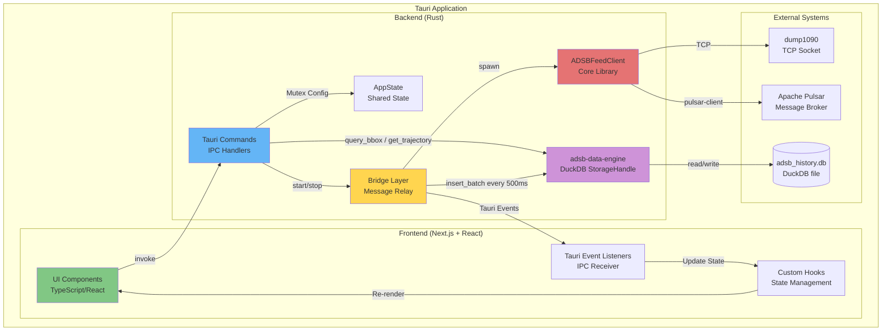
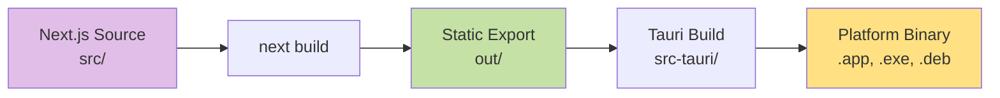
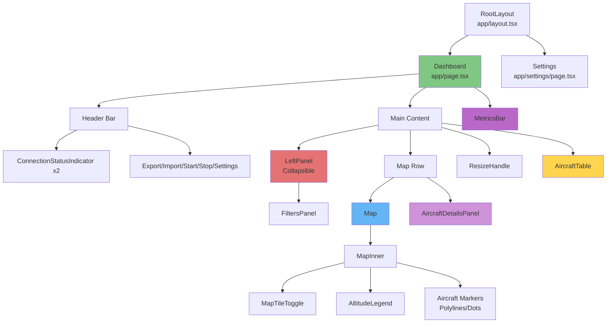
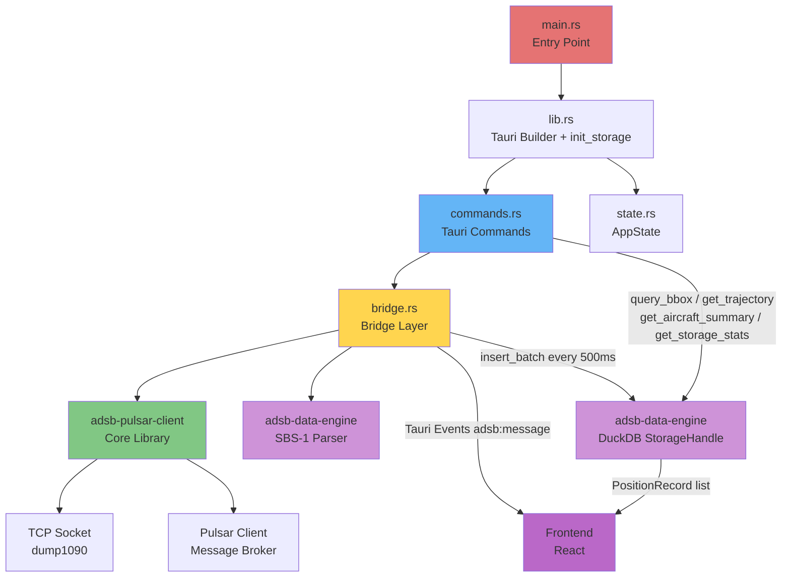
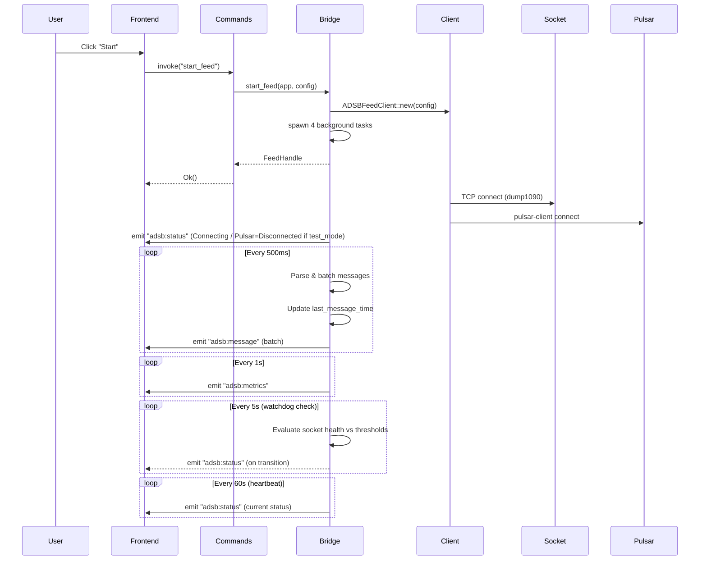
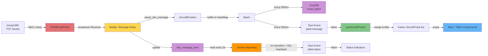
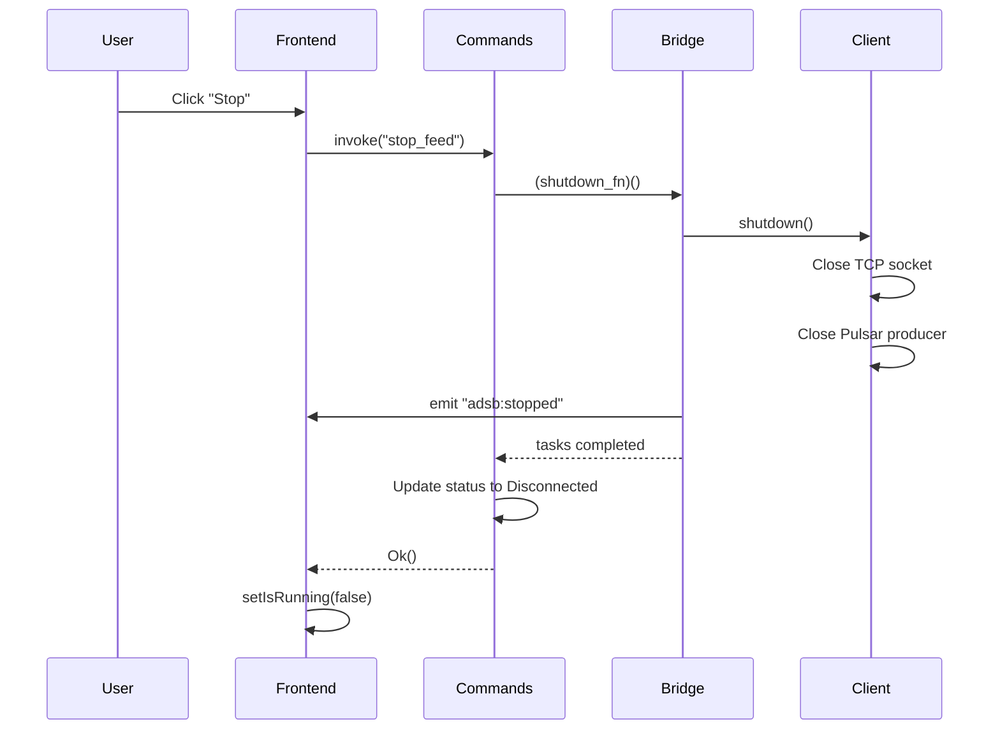
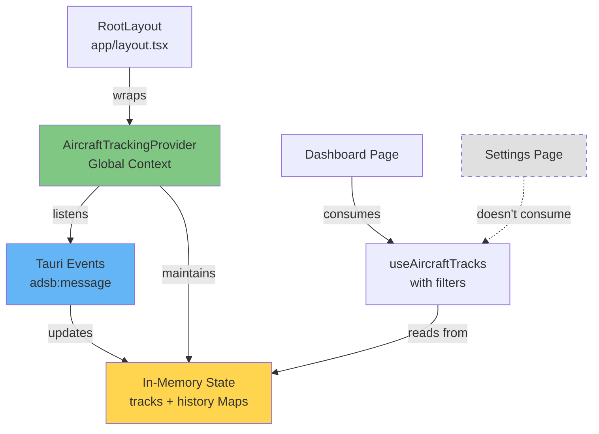
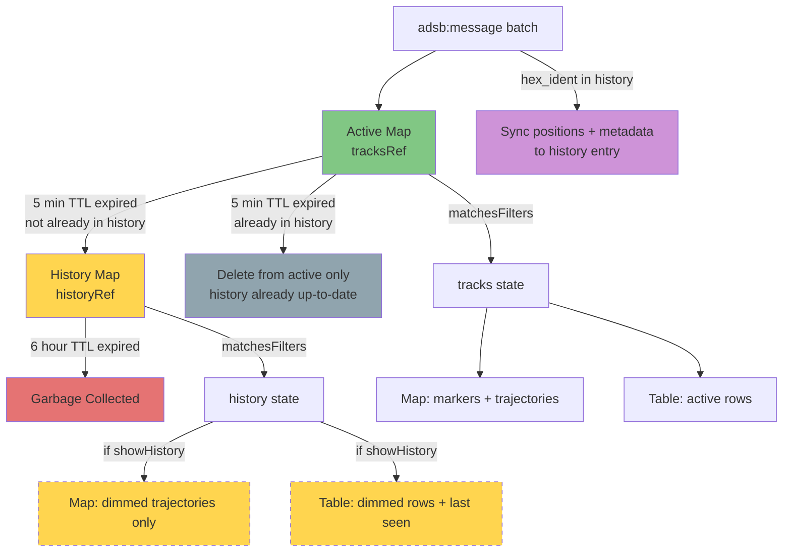
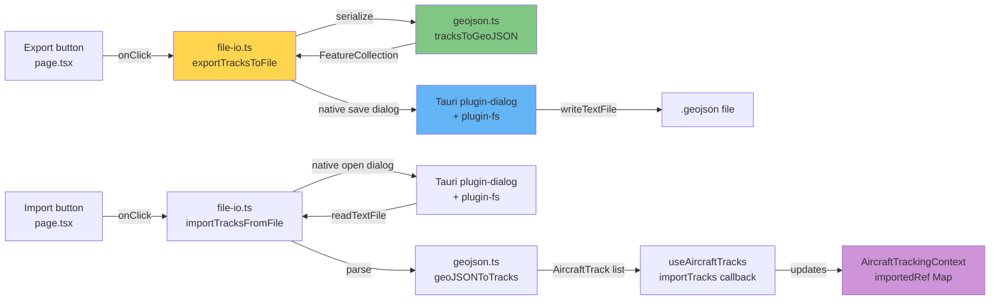

# ADS-B Aircraft Tracker Desktop Application - Design Document

## Table of Contents
1. [High-Level Application Design](#high-level-application-design)
2. [Frontend Architecture](#frontend-architecture)
3. [Component Hierarchy](#component-hierarchy)
4. [Backend Architecture (Tauri Rust)](#backend-architecture-tauri-rust)
5. [Data Flow](#data-flow)
6. [State Management](#state-management)
7. [Global Context Manager Pattern](#global-context-manager-pattern)
8. [In-Memory Aircraft History](#in-memory-aircraft-history)
9. [DuckDB Persistent History](#duckdb-persistent-history)
10. [GeoJSON Export/Import](#geojson-exportimport)
11. [Imported Tracks Selection](#imported-tracks-selection)
12. [Simulated Flights (Demo Mode)](#simulated-flights-demo-mode)

---

## High-Level Application Design

### Overview

The ADS-B Aircraft Tracker is a **cross-platform desktop application** built with **Tauri v2**, combining:
- **Backend**: Rust (performance-critical data ingestion and processing)
- **Frontend**: Next.js 15 + React 19 + TypeScript (modern, reactive UI)
- **Styling**: Tailwind CSS 4 (utility-first styling)
- **Mapping**: Leaflet + React-Leaflet (interactive geospatial visualization)

### Architecture Pattern: Event-Driven IPC (Inter-Process Communication)



### Dual History System

The application maintains **two complementary history layers**:

| Layer | Scope | Implementation | Query API |
|-------|-------|---------------|-----------|
| **In-Memory** | Current session (6h TTL) | React `useRef` Maps in `AircraftTrackingContext` | Filter toggle in UI |
| **DuckDB** | Persistent (across restarts) | `adsb-data-engine` StorageHandle | Tauri commands: `query_bbox`, `get_trajectory`, etc. |

### Key Design Principles

1. **Separation of Concerns**: Frontend handles UI/UX, backend handles I/O, parsing, and persistence
2. **Event-Driven Communication**: Backend emits Tauri events, frontend listens reactively
3. **Type Safety**: Shared types between Rust (serde) and TypeScript (interfaces)
4. **Non-Blocking UI**: All data operations run on Tokio async runtime in background tasks
5. **Reusability**: Core `adsb-pulsar-client` library shared across CLI and desktop; `adsb-data-engine` shared parser + DuckDB storage crate
6. **Graceful Degradation**: DuckDB storage is optional — app runs in real-time-only mode if initialization fails

### Technology Stack

| Layer | Technology | Version | Purpose |
|-------|-----------|---------|---------|
| **Desktop Framework** | Tauri | 2.x | Native app wrapper, IPC bridge |
| **Frontend Framework** | Next.js | 15.x | React framework with SSG/SSR |
| **UI Library** | React | 19.x | Component-based UI |
| **Language** | TypeScript | 5.x | Type-safe frontend code |
| **Styling** | Tailwind CSS | 4.x | Utility-first CSS framework |
| **Mapping** | Leaflet | 1.9.x | Interactive maps |
| **Map Integration** | React-Leaflet | 5.x | React bindings for Leaflet |
| **Backend Language** | Rust | 1.75+ | High-performance backend |
| **Async Runtime** | Tokio | 1.x | Asynchronous task execution |
| **Core Library** | adsb-pulsar-client | (workspace) | Shared ADSB client logic |
| **Data Engine** | adsb-data-engine | (workspace) | SBS-1 parser + DuckDB persistent storage |
| **Embedded Database** | DuckDB | 1.2 | OLAP embedded DB for historical aircraft queries |

### Application Window Configuration

**File**: `src-tauri/tauri.conf.json`

```json
{
  "identifier": "com.adsb.aircraft-tracker",
  "productName": "ADS-B Aircraft Tracker",
  "version": "0.1.0",
  "app": {
    "windows": [{
      "title": "ADS-B Aircraft Tracker",
      "width": 1400,
      "height": 900,
      "minWidth": 800,
      "minHeight": 600,
      "resizable": true
    }]
  }
}
```

**Content Security Policy (CSP)**:
- Allows OpenStreetMap tile servers for map rendering
- Permits IPC communication between frontend and backend
- Restricts external scripts for security

---

## Frontend Architecture

### Framework: Next.js 15 (App Router)

The frontend uses **Next.js App Router** with:
- **Static Site Generation (SSG)**: Output to `out/` directory for Tauri
- **Client-Side Rendering (CSR)**: All interactivity happens in the Tauri webview
- **No Server-Side Rendering**: App runs entirely offline

### Directory Structure

```
src/
├── app/                      # Next.js App Router pages
│   ├── layout.tsx           # Root layout (wraps children in AircraftTrackingProvider)
│   ├── page.tsx             # Main dashboard page
│   ├── settings/
│   │   └── page.tsx         # Settings page
│   └── globals.css          # Global Tailwind CSS
├── components/              # React UI components
│   ├── AircraftDetailsPanel.tsx # Collapsible right panel for selected aircraft details
│   ├── AircraftTable.tsx    # Tabular data display
│   ├── AltitudeLegend.tsx   # Floating altitude-to-color gradient bar on map
│   ├── ConnectionStatus.tsx # Connection indicator badges
│   ├── Filters.tsx          # Filter controls (callsign, altitude, speed, toggles)
│   ├── LeftPanel.tsx        # Collapsible resizable left panel wrapping Filters
│   ├── Map.tsx              # Map wrapper (SSR bypass)
│   ├── MapInner.tsx         # Actual Leaflet map
│   ├── MapTileToggle.tsx    # Dark/light map theme toggle
│   ├── MetricsBar.tsx       # Footer metrics display
│   └── ResizeHandle.tsx     # Resizable panel divider
├── contexts/                # React Context providers
│   └── AircraftTrackingContext.tsx # Global aircraft tracking provider
├── hooks/                   # Custom React hooks
│   ├── useAircraftTracks.ts # Filtered track consumer (reads from context)
│   ├── useConnectionStatus.ts # Status polling
│   ├── useLocalStorage.ts   # Persistent UI preferences
│   ├── useMapZoom.ts        # Debounced Leaflet zoom level for H3 resolution
│   ├── useMetrics.ts        # Metrics polling
│   ├── useSimulatedTracks.ts # Simulated demo flight tracks
│   └── useTauriEvent.ts     # Event listener abstraction
├── lib/                     # Utilities and types
│   ├── aircraft-details.ts  # Pure utilities: vertical tendency, sparkline, altitude range, time format
│   ├── aircraft-icon.ts     # Pure SVG/HTML generation for aircraft map icons
│   ├── colors.ts            # Altitude-based color mapping + ALTITUDE_SCALE_STOPS
│   ├── commands.ts          # Tauri command wrappers
│   ├── file-io.ts           # Tauri native dialog integration for export/import
│   ├── format.ts            # Pure format helpers (timeAgo, formatBytes)
│   ├── geojson.ts           # Bidirectional AircraftTrack ↔ GeoJSON conversion
│   ├── h3-density.ts        # H3 hexagonal density computation
│   ├── simulation-data.ts   # 20 Montreal-area simulated flight definitions
│   ├── track-ordering.ts    # Render-order utility for selected track
│   └── types.ts             # TypeScript type definitions
```

### Build Pipeline



**Commands**:
- `npm run dev`: Next.js dev server on port 3000 (hot reload)
- `npm run build`: Static export to `out/` directory
- `npm run tauri dev`: Run Tauri in dev mode with Next.js dev server
- `npm run tauri build`: Build production desktop app

---

## Component Hierarchy

### Visual Component Tree



### Component Details

#### 1. **RootLayout** (`src/app/layout.tsx`)

**Purpose**: Root HTML structure, global metadata, and global providers

**Responsibilities**:
- Set application title and description
- Apply global dark theme (`bg-slate-950 text-slate-100`)
- Include Tailwind CSS globals
- Wrap all pages in `AircraftTrackingProvider` for persistent state

**Props**: `children: React.ReactNode`

**Rendering**: Wraps all pages in `<html>` and `<body>` tags, with `AircraftTrackingProvider`

**Implementation**:
```typescript
export default function RootLayout({ children }: { children: React.ReactNode }) {
  return (
    <html lang="en">
      <body className="bg-slate-950 text-slate-100 antialiased">
        <AircraftTrackingProvider>
          {children}
        </AircraftTrackingProvider>
      </body>
    </html>
  );
}
```

**Design Note**: The provider at this level ensures it stays mounted during all client-side
navigation (Next.js App Router preserves layouts). This enables continuous aircraft data
accumulation even when users navigate to Settings or other pages.

**See Also**: [Global Context Manager Pattern](#global-context-manager-pattern), [DuckDB Persistent History](#duckdb-persistent-history)

---

#### 2. **Dashboard** (`src/app/page.tsx`)

**Purpose**: Main application page (aircraft tracking dashboard)

**Responsibilities**:
- Orchestrate all UI components (header, left panel, map, table, details panel, footer)
- Manage top-level state (filters, running status, errors, selection)
- Handle start/stop commands via Tauri IPC
- Handle GeoJSON export/import via `file-io.ts`
- Persist UI preferences to localStorage

**Custom Hooks Used**:
- `useAircraftTracks(filters)`: Track state with filtering (returns `{ tracks, history, imported, importTracks, clearImported }`)
- `useSimulatedTracks(enabled)`: Self-animating demo flight tracks
- `useMetrics()`: Performance metrics polling
- `useConnectionStatus()`: Connection status polling
- `useLocalStorage(...)`: Persist map theme, table height, panel states, toggles, color modes

**State Management**:
- `filters: Filters`: Altitude/speed/callsign filters
- `error: string | null`: Error messages
- `mapTheme: "light" | "dark"`: Map tile style
- `tableHeight: number`: Resizable table height in pixels
- `sidebarOpen: boolean`: Left panel expanded/collapsed (persisted)
- `sidebarWidth: number`: Left panel width in px, 180–400 (persisted)
- `trajectoryStyle: "line" | "dots"`: Trajectory rendering mode (persisted)
- `showHistory: boolean`: Whether to display expired aircraft (persisted)
- `showDensity: boolean`: H3 density overlay toggle (persisted)
- `densityMetric: DensityMetric`: Which metric to display in H3 hexagons (persisted)
- `showSimulation: boolean`: Simulated demo flight toggle (persisted)
- `liveColorMode: AltitudeColorMode`: Color mode for live tracks (persisted)
- `historyColorMode: AltitudeColorMode`: Color mode for history tracks (persisted)
- `showImported: boolean`: Visibility of imported GeoJSON tracks (persisted)
- `includeImportedInDensity: boolean`: Include imported tracks in H3 density (persisted)
- `selectedHexIdent: string | null`: Currently selected aircraft (toggle behavior: click same to deselect)
- `detailsPanelOpen: boolean`: Whether the details panel is expanded or collapsed (persisted)
- `detailsPanelWidth: number`: Width of the expanded details panel in px, clamped 200–480 (persisted)

**Derived State**:
- `allTracks`: Merge of live `tracks` + `simulatedTracks`
- `visibleHistory`: `showHistory ? history : []`
- `visibleImported`: `showImported ? imported : []`
- `selectedTrack`: Resolved from `selectedHexIdent` against `allTracks`, then `visibleHistory`, then `visibleImported`; `null` when no aircraft is selected
- `isImportedSelection`: Whether the selected track came from the imported collection (drives `IMPORTED` badge in details panel)
- `densityTracks`: Computed from `allTracks + history + (imported if includeImportedInDensity)` when density overlay is enabled

**Layout Structure**:
```tsx
<div className="h-screen flex flex-col">
  <header> {/* Header bar: status, sidebar toggle, export/import/clear, start/stop, settings */} </header>
  <div className="flex flex-1 overflow-hidden">
    <LeftPanel isOpen={sidebarOpen} width={sidebarWidth} ... />
    <main className="flex-1 flex flex-col overflow-hidden">
      <div className="flex flex-1 min-h-0 overflow-hidden">
        <div className="flex-1 min-w-0"> {/* Map */} </div>
        {selectedTrack && (
          <AircraftDetailsPanel
            track={selectedTrack}
            isOpen={detailsPanelOpen}
            width={detailsPanelWidth}
            onToggle={...}
            onWidthChange={...}
            isImported={isImportedSelection}
          />
        )}
      </div>
      <ResizeHandle />
      <div> {/* AircraftTable */} </div>
    </main>
  </div>
  <MetricsBar />
</div>
```

---

#### 3. **Settings** (`src/app/settings/page.tsx`)

**Purpose**: Configuration page for connection settings

**Responsibilities**:
- Load current configuration via `get_config` command
- Provide form inputs for all config fields
- Validate configuration before saving
- Save configuration via `save_config` command

**Configuration Fields**:
- `source_id`: Unique identifier for this client
- `socket_host`, `socket_port`: dump1090 TCP connection
- `pulsar_broker`, `pulsar_topic`: Pulsar connection
- Buffer sizes, timeouts, retry policies
- `test_mode`: Run without Pulsar (socket-only)
- `log_level`: Debug, info, warn, error

---

#### 4. **AircraftTable** (`src/components/AircraftTable.tsx`)

**Purpose**: Tabular display of active, historical, and imported aircraft data

**Props**:
- `tracks: AircraftTrack[]`: Active aircraft tracks
- `historyTracks?: AircraftTrack[]`: Optional expired aircraft tracks (defaults to `[]`)
- `importedTracks?: AircraftTrack[]`: Optional imported GeoJSON tracks (defaults to `[]`)
- `selectedHexIdent?: string | null`: Currently selected aircraft hex_ident
- `onSelectTrack?: (hex: string) => void`: Callback when a row is clicked

**Responsibilities**:
- Render scrollable table with fixed header
- Display columns: Callsign, Hex, Alt, Spd, Hdg, V/S, Squawk, Lat, Lon, RxTS, Msg#
- **RxTS**: Relative time since last received message (e.g., "3s ago") via `timeAgo(last_seen)`
- **Msg#**: Total SBS-1 messages received for this aircraft (pre-throttle cumulative count)
- Handle null values gracefully (display "—")
- Render three row sections: active, history, imported — each separated by a collapsible divider
- History rows display with `opacity-40` for visual distinction (full opacity when selected)
- History rows show relative "last seen" time (e.g., "23m ago") in place of heading/vertical rate
- Imported rows display with `opacity-60` and indigo text tint for visual identity
- Highlight selected row and auto-scroll it into view

**Row Sections**:
1. **Active rows** — standard rendering, selected highlight: `bg-blue-900/40`
2. **History divider** — uppercase label with count (e.g., "HISTORY (12)"), collapsible
3. **History rows** — dimmed via `opacity-40`, selected highlight: `bg-blue-900/40`
4. **Imported divider** — uppercase label with count (e.g., "IMPORTED (5)"), collapsible
5. **Imported rows** — dimmed via `opacity-60`, indigo text tint, selected highlight: `bg-indigo-900/40`

**Styling**:
- Dark background (`bg-slate-900`)
- Fixed header with `sticky top-0`
- Overflow scrolling for table body
- Selected row: `bg-blue-900/40` (active/history) or `bg-indigo-900/40` (imported) + `cursor-pointer` when clickable

**File**: `src/components/AircraftTable.tsx`

---

#### 5. **ConnectionStatus** (`src/components/ConnectionStatus.tsx`)

**Purpose**: Connection status indicator badges

**Props**:
- `label: string`: Display label ("Socket", "Pulsar")
- `status: ConnectionStatus`: Current status enum

**Responsibilities**:
- Render color-coded badge based on status
- Display status text and error messages

**Status Colors**:
- `Disconnected`: Gray (`bg-gray-500`) — not running / intentionally off
- `Connecting`: Yellow pulsing (`bg-yellow-500 animate-pulse`) — establishing connection
- `Connected`: Green (`bg-green-500`) — receiving messages normally
- `Degraded`: Orange pulsing (`bg-orange-500 animate-pulse`) — no messages for `read_timeout + 10s`
- `ConnectionLost`: Red (`bg-red-500`) — no messages for `read_timeout + 30s`
- `Error`: Red (`bg-red-500`) — unexpected error

**File**: `src/components/ConnectionStatus.tsx`

---

#### 6. **Filters** (`src/components/Filters.tsx`)

**Purpose**: Filter panel in left sidebar

**Props**:
- `filters: Filters`: Current filter state
- `onChange: (filters: Filters) => void`: Update callback
- `trackCount: number`: Number of active tracks matching filters
- `showHistory: boolean`: Whether history display is enabled
- `onToggleHistory: () => void`: Toggle history visibility
- `historyCount: number`: Total number of history tracks matching filters

**Responsibilities**:
- Callsign search input
- Altitude range sliders (0-50,000 ft)
- Speed range sliders (0-600 kts)
- Active track count display
- History toggle checkbox with count (e.g., "Show history (12 past)")

**Design Note**: The `historyCount` always reflects filtered history size regardless of
the `showHistory` toggle state. This lets users see how many past tracks are available
before deciding to enable the display.

**Styling**:
- Dark sidebar (`bg-slate-900`)
- Compact form inputs
- Live filter count display

**File**: `src/components/Filters.tsx`

---

#### 7. **Map** (`src/components/Map.tsx`)

**Purpose**: Wrapper for Leaflet map with SSR bypass

**Props**:
- `tracks: AircraftTrack[]`: Active aircraft to display
- `historyTracks: AircraftTrack[]`: Expired aircraft trajectories to display
- `mapTheme: "light" | "dark"`: Tile style
- `onToggleTheme: () => void`: Theme toggle callback
- `trajectoryStyle: "line" | "dots"`: How to render position trails
- `selectedHexIdent: string | null`: Currently selected aircraft hex_ident
- `onSelectTrack: (hex: string | null) => void`: Selection callback (`null` = deselect)

**Responsibilities**:
- Use Next.js `dynamic()` to disable SSR (Leaflet requires browser)
- Display loading state while map initializes
- Forward all props to `MapInner`

**Technical Note**: Leaflet requires `window` and `document`, so it must be loaded client-side only.

**File**: `src/components/Map.tsx`

---

#### 8. **MapInner** (`src/components/MapInner.tsx`)

**Purpose**: Actual Leaflet map with markers, trajectories, and history trails

**Props**: Same as `Map`

**Responsibilities**:
- Initialize Leaflet map with `MapContainer`
- Render OpenStreetMap tile layers (light/dark)
- Display aircraft markers (color-coded by altitude)
- Draw trajectory polylines/dots for each active aircraft
- Render history track trajectories with dimmed styling
- Provide map controls (zoom, theme toggle)

**Rendering Order (Z-Ordering)**:

History tracks are rendered **before** active tracks in the JSX tree. In Leaflet/react-leaflet,
elements rendered later appear on top. This ensures active aircraft markers always overlay
faded history trajectories without needing explicit z-index management.

```
[TileLayer]  ← base map
  ↑
[History trajectories]  ← rendered first (bottom layer)
  ↑
[Active markers + trajectories]  ← rendered last (top layer)
```

**Canvas Renderer**:

`MapContainer` uses `preferCanvas={true}` to render all vector layers (`CircleMarker`, `Polyline`)
on a single `<canvas>` element instead of individual SVG `<path>` nodes. This reduces DOM node
count from O(n) to O(1) and is critical for smooth pan/zoom with thousands of trajectory dots.
Tooltips and mouse events still work via Leaflet's canvas hit-testing.

**Imperative Dots Layer (`DotsLayer`)**:

When `trajectoryStyle === "dots"`, trajectory dots are rendered imperatively via Leaflet's
native API instead of React `<CircleMarker>` components. This avoids React VDOM reconciliation
of 10,000+ component instances every 500ms.

Implementation:
- Uses `useMap()` to get the Leaflet map instance
- Creates `L.circleMarker()` objects in a `useEffect` cleanup cycle
- Tooltips bound via `marker.bindTooltip(() => html)` — lazy (content built only on hover)
- Cleanup removes all markers when `tracks`, `colorMode`, or `type` change
- Combined with canvas renderer, creating/destroying 5,000 markers is ~5ms (lightweight JS objects)

```
DotsLayer({ tracks, colorMode, type: "history" | "live" })
  → useMap() to get map instance
  → useEffect([tracks, colorMode]) creates L.CircleMarker objects
  → Each marker gets bindTooltip with lazy content
  → Cleanup removes all markers
```

**Active Marker Behavior**:
- **Icon**: Rotated triangle SVG, color-coded by altitude
- **Tooltip**: Callsign, hex, altitude, speed, squawk
- **Trajectory**: Polyline or dots connecting recent positions
- **Click**: Selects the aircraft (emits `onSelectTrack(hex_ident)`)

**Selected Aircraft Visual Feedback**:
- **Icon**: Enlarged (36×36 vs 24×24), white stroke, static ring overlay via CSS
- **Polyline (live)**: `weight: 4`, `opacity: 0.9` (vs default `2`/`0.6`)
- **Polyline (history)**: `weight: 3`, `opacity: 0.7` (vs default `1`/`0.25`)
- **Dots**: `radius + 2`, `fillOpacity: 0.9`
- **Render order**: Selected track moved to end of array (renders on top)
- **Map click**: Clicking empty map space deselects (`MapClickHandler` component)

**History Track Behavior**:
- **No marker icon**: The aircraft is no longer present
- **Trajectory only**: Polyline (`weight: 1`, `opacity: 0.25`) or dots (`radius: 2`, `fillOpacity: 0.2`)
- **Tooltip**: Callsign, hex, and relative "last seen" time (e.g., "23m ago")
- **Color**: Altitude-based, same scale as active but at reduced opacity

**Map Layers**:
- Light theme: `https://tile.openstreetmap.org/{z}/{x}/{y}.png`
- Dark theme: `https://{s}.basemaps.cartocdn.com/dark_all/{z}/{x}/{y}{r}.png` (CARTO)

**File**: `src/components/MapInner.tsx`

---

#### 9. **MapTileToggle** (`src/components/MapTileToggle.tsx`)

**Purpose**: Button to toggle map theme (light/dark)

**Props**: `onToggle: () => void`

**Responsibilities**:
- Render floating button in top-right corner of map
- Display sun/moon icon based on current theme
- Call `onToggle` callback on click

**File**: `src/components/MapTileToggle.tsx`

---

#### 10. **MetricsBar** (`src/components/MetricsBar.tsx`)

**Purpose**: Footer bar displaying performance metrics

**Props**: `metrics: MetricsSnapshot`

**Responsibilities**:
- Display metrics in compact horizontal layout
- Show: Messages sent, errors, throughput, elapsed time
- Update in real-time (polled every 1 second)

**Metrics Displayed**:
- **Messages Sent**: Total messages sent to Pulsar
- **Errors**: Total errors encountered
- **Throughput**: Messages/second
- **Elapsed Time**: Time since feed started
- **Bytes Sent/Received**: Network traffic stats

**File**: `src/components/MetricsBar.tsx`

---

#### 11. **ResizeHandle** (`src/components/ResizeHandle.tsx`)

**Purpose**: Draggable divider between map and table

**Props**:
- `onResize: (deltaY: number) => void`: Called during drag
- `onResizeEnd: () => void`: Called when drag ends

**Responsibilities**:
- Render horizontal divider with hover effect
- Capture mouse down and track drag events
- Emit `deltaY` (change in Y position) to parent

**Styling**:
- Thin horizontal line (`h-1`)
- Hover cursor: `cursor-row-resize`
- Visual feedback on hover/drag

**File**: `src/components/ResizeHandle.tsx`

---

#### 12. **LeftPanel** (`src/components/LeftPanel.tsx`)

**Purpose**: Collapsible resizable left sidebar that wraps the `FiltersPanel`

**Props**:
- `isOpen: boolean`: Expanded or collapsed
- `width: number`: Panel width in px (clamped 180–400, persisted)
- `onToggle: () => void`: Toggle expanded/collapsed
- `onWidthChange: (w: number) => void`: Called during drag resize
- Plus all `FiltersPanel` props: `filters`, `onChange`, `trackCount`, `showHistory`, `onToggleHistory`, `historyCount`, `showDensity`, `onToggleDensity`, `densityMetric`, `onDensityMetricChange`, `showSimulation`, `onToggleSimulation`, `simulationCount`, `liveColorMode`, `onLiveColorModeChange`, `historyColorMode`, `onHistoryColorModeChange`, `importedCount`, `showImported`, `onToggleImported`, `onClearImported`, `includeImportedInDensity`, `onToggleIncludeImportedInDensity`

**Two States**:
1. **Collapsed** — 32px strip with `>>` button ("Show filters panel")
2. **Expanded** — full-width panel with `<<` button ("Hide filters panel") and `FiltersPanel` content

**Resize Behavior**:
- Right edge: 1px `col-resize` draggable strip (tracks `clientX` delta; moving right = expanding)
- Width clamped: min 180px, max 400px
- Width state is owned by parent (`onWidthChange` callback), same pattern as `AircraftDetailsPanel`

**Design Note**: The `LeftPanel` is the left-side mirror of `AircraftDetailsPanel`. Both use the same collapsed-strip + expanded-panel + drag-resize architecture. The key difference: `LeftPanel` is always rendered (no "hidden" state), while `AircraftDetailsPanel` is conditionally mounted based on selection. The sidebar toggle in the header bar also controls `isOpen`.

**File**: `src/components/LeftPanel.tsx`

---

#### 13. **AltitudeLegend** (`src/components/AltitudeLegend.tsx`)

**Purpose**: Floating altitude-to-color gradient bar overlaid on the map

**Responsibilities**:
- Render a vertical 3×120px gradient bar using `ALTITUDE_SCALE_STOPS` from `colors.ts`
- Display three labels: `50k` (top), `25k` (middle), `0` (bottom) with `ft` unit
- Position in top-right of map with `z-[1000]` and `pointer-events-none`

**Dependencies**: Uses `ALTITUDE_SCALE_STOPS` (named export from `colors.ts`) — an array of `[normalizedPosition, cssColor]` pairs used to build the CSS `linear-gradient`.

**File**: `src/components/AltitudeLegend.tsx`

---

#### 14. **AircraftDetailsPanel** (`src/components/AircraftDetailsPanel.tsx`)

**Purpose**: Collapsible right panel showing full details for the currently selected aircraft

**Props**:
- `track: AircraftTrack | null`: Selected track; returns `null` (renders nothing) when absent
- `isOpen: boolean`: Whether the panel is expanded or collapsed to a 32px strip
- `width: number`: Panel width in px (clamped 200–480, persisted)
- `onToggle: () => void`: Called when fold/unfold button is clicked
- `onWidthChange: (w: number) => void`: Called during drag resize
- `isImported?: boolean`: When `true`, displays an indigo `IMPORTED` badge in the header (defaults to `false`)

**Three States**:
1. **Hidden** — `track === null`: renders nothing; map fills full width
2. **Collapsed** — `isOpen === false`: 32px strip with `>>` button (title "Unfold panel")
3. **Expanded** — `isOpen === true`: full-width panel with content and `<<` button (title "Fold panel")

**Content Sections** (expanded state):
1. **Header**: "Aircraft Details" label + optional `IMPORTED` badge (indigo, shown when `isImported === true`) + fold button `<<`
2. **Identity**: ICAO hex (monospace, prominent), callsign (or "—")
3. **Altitude / Speed / Heading**: altitude ft, ground_speed kts, track °, on-ground badge
4. **Vertical Tendency**: arrow icon (▲ green / ▼ red / → slate) + formatted rate; SVG sparkline with axes:
   - **Y-axis**: min/max altitude labels (`data-testid="sparkline-alt-min/max"`)
   - **SVG** (120×40 viewBox): `<polyline>` coloured by tendency
   - **X-axis**: `formatTrackTime(first_seen)` and `formatTrackTime(last_seen)` (`data-testid="sparkline-time-start/end"`)
5. **Squawk**: 4-digit code (or "—") + special label badge (7700=EMERGENCY, 7600=RADIO FAILURE, 7500=HIJACK)
6. **Message count**: cumulative SBS-1 messages for this aircraft
7. **Last seen**: relative time string from `timeAgo(last_seen)`

**Resize Behavior**:
- Left edge: 1px `col-resize` draggable strip (tracks `clientX` delta; moving left = expanding)
- Width clamped: min 200px, max 480px
- Owned internally by `ExpandedPanel` sub-component (compare: `ResizeHandle` delegates `deltaY` to parent)

**Pure Utilities** (`src/lib/aircraft-details.ts`):
- `verticalTendency(vr)`: threshold ±200 ft/min; null → "level"
- `formatVerticalRate(vr)`: "+2,400 ft/min", "—", "±0 ft/min"
- `altitudeHistory(positions)`: extract non-null altitudes from position array
- `altitudeRange(altitudes)`: `{ min, max } | null`
- `formatTrackTime(ms)`: local "HH:MM:SS" string for sparkline axis labels
- `altitudeSparklinePoints(altitudes, width, height)`: SVG `points` string; flat data → `height/2`

**File**: `src/components/AircraftDetailsPanel.tsx`

---

### Custom Hooks

#### 1. **useAircraftTracks** (`src/hooks/useAircraftTracks.ts`)

**Purpose**: Consume filtered aircraft data from the global `AircraftTrackingProvider`

**Parameters**: `filters: Filters`

**Returns**: `{ tracks: AircraftTrack[], history: AircraftTrack[] }`

**Responsibilities**:
- Read raw track and history Maps from `AircraftTrackingContext`
- Apply callsign/altitude/speed filters to both active and history
- Return filtered arrays for rendering

**Implementation**:
```typescript
export function useAircraftTracks(filters: Filters) {
  const { tracks: tracksMap, history: historyMap } = useAircraftTrackingContext();

  const tracks = useMemo(
    () => Array.from(tracksMap.values()).filter(t => matchesFilters(t, filters)),
    [tracksMap, filters]
  );

  const history = useMemo(
    () => Array.from(historyMap.values()).filter(t => matchesFilters(t, filters)),
    [historyMap, filters]
  );

  return { tracks, history };
}
```

**Design Change (v2)**: This hook was refactored from managing its own state to consuming
the global `AircraftTrackingProvider`. The provider handles all event listening, TTL expiry,
and data accumulation. This hook is now a **pure filter layer** that derives view-specific
arrays from global state.

**Benefits**:
- ✅ Data persists across page navigation (provider stays mounted in layout)
- ✅ No duplicate event listeners (single global listener vs. one per page mount)
- ✅ Continuous accumulation (data collection runs even when dashboard is not visible)
- ✅ Simpler hook logic (no event handling, just filtering)

**Filter extraction**: The `matchesFilters()` function is extracted as a module-level
pure function to keep the filtering logic testable and avoid duplication.

**See Also**: [Global Context Manager Pattern](#global-context-manager-pattern) for
detailed provider implementation and architecture.

**File**: `src/hooks/useAircraftTracks.ts`

---

#### 2. **useConnectionStatus** (`src/hooks/useConnectionStatus.ts`)

**Purpose**: Poll connection status from backend

**Returns**: `StatusResponse`

**Responsibilities**:
- Call `get_status()` command every 1 second
- Update state with latest status
- Handle errors gracefully

**Polling Logic**:
```typescript
useEffect(() => {
  const interval = setInterval(async () => {
    const status = await getStatus();
    setStatus(status);
  }, 1000);
  return () => clearInterval(interval);
}, []);
```

**File**: `src/hooks/useConnectionStatus.ts`

---

#### 3. **useLocalStorage** (`src/hooks/useLocalStorage.ts`)

**Purpose**: Persist UI preferences to browser localStorage

**Parameters**:
- `key: string`: Storage key
- `initialValue: T`: Default value

**Returns**: `[value: T, setValue: (value: T) => void]`

**Responsibilities**:
- Load value from localStorage on mount
- Save value to localStorage on change
- Provide React state interface

**Use Cases**:
- Map theme (`adsb-map-theme`)
- Table height (`adsb-table-height`)
- Details panel open state (`adsb-details-panel-open`)
- Details panel width (`adsb-details-panel-width`)

**File**: `src/hooks/useLocalStorage.ts`

---

#### 4. **useMetrics** (`src/hooks/useMetrics.ts`)

**Purpose**: Poll metrics from backend

**Returns**: `MetricsSnapshot`

**Responsibilities**:
- Call `get_metrics()` command every 1 second
- Update state with latest metrics

**File**: `src/hooks/useMetrics.ts`

---

#### 5. **useMapZoom** (`src/hooks/useMapZoom.ts`)

**Purpose**: Expose current Leaflet map zoom level as a debounced integer state

**Parameters**: `debounceMs?: number` (default 300ms)

**Returns**: `number` (integer zoom level)

**Responsibilities**:
- Call `useMap()` from react-leaflet (must be inside `<MapContainer>`)
- Listen to Leaflet `"zoomend"` event
- Debounce updates by `debounceMs` to avoid triggering expensive H3 recomputation on every pinch-zoom tick
- Return `Math.round(zoom)` — fractional zoom from smooth gestures is snapped to integer

**Use Case**: Drives H3 density hexagon resolution in `MapInner`. Lower zoom → coarser H3 resolution; higher zoom → finer resolution.

**File**: `src/hooks/useMapZoom.ts`

---

#### 6. **useSimulatedTracks** (`src/hooks/useSimulatedTracks.ts`)

**Purpose**: Self-animating hook producing `AircraftTrack[]` from predefined flight routes for demo/trade-show use

**Parameters**: `enabled: boolean`

**Returns**: `AircraftTrack[]`

**Responsibilities**:
- Animate 20 simulated flights from `SIMULATED_FLIGHTS` in `simulation-data.ts`
- Tick every 2 seconds (`TICK_MS = 2000`), advance `PROGRESS_PER_TICK = 0.04` per tick (~50s per waypoint segment)
- Interpolate linearly between `[lat, lng]` waypoints with heading computed from `computeHeading()`
- Stagger starting positions: `segmentProgress = (i * 0.15) % 1` so aircraft are spread along their routes on first enable
- Cap position trail at 100 entries; clear trail on route loop to avoid teleport line back to waypoint 0
- Reset state and return empty array when `enabled` switches to `false`

**Exported Pure Helpers** (testable without React):
- `computeHeading(lat1, lng1, lat2, lng2): number` — equirectangular heading with `cos(midLat)` correction
- `interpolate(a, b, t): [number, number]` — linear interpolation between two `[lat, lng]` points

**File**: `src/hooks/useSimulatedTracks.ts`

---

#### 7. **useTauriEvent** (`src/hooks/useTauriEvent.ts`)

**Purpose**: Listen for Tauri events with TypeScript type safety

**Parameters**:
- `eventName: string`: Event name (e.g., "adsb:message")
- `handler: (payload: T) => void`: Callback function

**Returns**: `void`

**Responsibilities**:
- Register event listener on mount
- Unregister listener on unmount
- Provide type-safe payload handling

**Usage**:
```typescript
useTauriEvent<AircraftPosition[]>("adsb:message", (batch) => {
  // Handle batch
});
```

**File**: `src/hooks/useTauriEvent.ts`

---

### Utility Libraries

#### 1. **colors.ts** (`src/lib/colors.ts`)

**Purpose**: Map altitude to color for aircraft markers and trajectory dots

**Functions**:
- `altitudeToColor(altitude: number | null): string` — Jet-like colormap (blue → cyan → green → yellow → red, 0–50,000 ft). Returns `#888888` for null/undefined.
- `cachedAltitudeToColor(altitude: number | null): string` — Bounded `Map` cache (max 512 entries, FIFO eviction) wrapping `altitudeToColor`. Used in hot paths (trajectory dots) to avoid recomputing the same `rgb(...)` string thousands of times per render cycle. Altitudes cluster around common flight levels, yielding ~98% cache hit rate.
- `clearColorCache(): void` — Resets the cache (exported for test isolation).
- `densityColor(normalized: number): { color: string; fillOpacity: number }` — Purple → yellow → red scale for H3 density hexagons.
- `ALTITUDE_SCALE_STOPS: [number, string][]` — Named export of `[normalizedPosition, cssColor]` pairs used by `AltitudeLegend` to build its CSS `linear-gradient`.

**Color Scale** (Jet colormap):
- **0 ft**: Blue `rgb(0,0,255)`
- **12,500 ft**: Cyan `rgb(0,255,255)`
- **25,000 ft**: Green `rgb(0,255,0)`
- **37,500 ft**: Yellow `rgb(255,255,0)`
- **50,000 ft**: Red `rgb(255,0,0)`
- **null/undefined**: Gray `#888888`

**File**: `src/lib/colors.ts`

---

#### 2. **commands.ts** (`src/lib/commands.ts`)

**Purpose**: Wrapper functions for Tauri commands

**Feed Control Functions**:
- `startFeed(): Promise<void>`: Start the feed client
- `stopFeed(): Promise<void>`: Stop the feed client
- `getStatus(): Promise<StatusResponse>`: Get connection status
- `getMetrics(): Promise<MetricsSnapshot>`: Get metrics snapshot
- `getConfig(): Promise<Config>`: Load configuration
- `saveConfig(config: Config): Promise<void>`: Save configuration
- `validateConfig(config: Config): Promise<void>`: Validate config

**Historical Query Functions (DuckDB)**:
- `queryBbox(query: BboxQuery): Promise<PositionRecord[]>`: Query positions in geographic bounds + time window
- `getTrajectory(query: TrajectoryQuery): Promise<PositionRecord[]>`: Full position history for a single aircraft
- `getAircraftSummary(startMs?: number, endMs?: number): Promise<AircraftSummary[]>`: All aircraft seen with stats
- `getStorageStats(): Promise<StorageStats>`: Database row count, size, age

**Implementation**:
```typescript
import { invoke } from "@tauri-apps/api/core";

export async function startFeed(): Promise<void> {
  await invoke("start_feed");
}

export async function queryBbox(query: BboxQuery): Promise<PositionRecord[]> {
  return await invoke("query_bbox", { query });
}
```

**File**: `src/lib/commands.ts`

---

#### 3. **types.ts** (`src/lib/types.ts`)

**Purpose**: TypeScript type definitions (mirrors Rust types)

**Key Types**:
- `AircraftPosition`: Single SBS-1 message (from backend). Includes `message_count` (set by bridge before emission).
- `AircraftTrack`: Accumulated track state (frontend only). Key fields:
  - `message_count: number` — cumulative SBS-1 messages, pre-throttle
  - `first_seen: number` — ms epoch of first detection; set **once** when the track is created in `AircraftTrackingContext`, never updated by `mergePositionInto`
  - `last_seen: number` — ms epoch of most recent update
  - `positions: [lat, lng, altitude | null][]` — capped at 100 entries, no per-position timestamps
- `MetricsSnapshot`: Performance metrics
- `ConnectionStatus`: Connection state union (`Disconnected | Connecting | Connected | Degraded | ConnectionLost | Error`)
- `StatusResponse`: Combined status response (socket + pulsar)
- `Config`: Client configuration (includes `socket_read_timeout_secs` used for watchdog thresholds)
- `Filters`: UI filter state
- **DuckDB historical query types** (mirror Rust structs from `adsb-data-engine`):
  - `PositionRecord`: Single stored position row (`hex_ident`, `callsign`, lat/lon, `altitude`, `ground_speed`, `track`, `vertical_rate`, `squawk`, `is_on_ground`, `timestamp_ms`)
  - `BboxQuery`: Geographic + time bounding box (`north`, `south`, `east`, `west`, optional `start_ms`/`end_ms`, `limit`)
  - `TrajectoryQuery`: Single aircraft query (`hex_ident`, optional `start_ms`/`end_ms`)
  - `AircraftSummary`: Per-aircraft statistics (`hex_ident`, `callsign`, `position_count`, `first_seen_ms`, `last_seen_ms`, `min_altitude`, `max_altitude`)
  - `StorageStats`: Database health (`row_count`, `db_size_bytes`, `oldest_timestamp_ms`, `newest_timestamp_ms`)

**Type Safety**: These types match Rust structs via `serde` serialization

**File**: `src/lib/types.ts`

---

#### 4. **format.ts** (`src/lib/format.ts`)

**Purpose**: Pure formatting utilities

**Functions**:
- `timeAgo(lastSeen: number): string` — Converts ms epoch to relative time string: `"Xs ago"`, `"Xm ago"`, `"Xh Xm ago"`
- `formatBytes(bytes: number): string` — Converts byte count to human-readable: `"0 B"`, `"1.5 KB"`, `"2.34 MB"`

**File**: `src/lib/format.ts`

---

#### 5. **geojson.ts** (`src/lib/geojson.ts`)

**Purpose**: Bidirectional conversion between `AircraftTrack[]` and GeoJSON `FeatureCollection`

**Key Types**:
- `TrackProperties`: All `AircraftTrack` metadata fields (`hex_ident`, `callsign`, `altitude`, `first_seen`, `last_seen`, `message_count`, etc.) plus `no_position: boolean`
- `TrackFeature`: GeoJSON `Feature` with `Point` or `LineString` geometry
- `TrackFeatureCollection`: GeoJSON `FeatureCollection` with `ExportMetadata` (`exported_at`, `track_count`, `source: "adsb-pulsar-client-desktop"`, `version: 1`)

**Functions**:
- `tracksToGeoJSON(activeTracks, historyTracks?)`: Merges both arrays and serializes each track as:
  - `Point` at `[0,0]` with `no_position: true` if no positions recorded
  - `Point` if exactly 1 position
  - `LineString` if 2+ positions
  - Coordinate axis swap: internal `[lat, lng, alt]` → GeoJSON `[lng, lat, alt]`
- `geoJSONToTracks(geojson)`: Inverse conversion; reconstructs `AircraftTrack[]`; skips features without `hex_ident`; `first_seen` falls back to `last_seen` for legacy files

**File**: `src/lib/geojson.ts`

---

#### 6. **file-io.ts** (`src/lib/file-io.ts`)

**Purpose**: Orchestration layer bridging `geojson.ts` with Tauri native file dialogs

**Functions**:
- `exportTracksToFile(activeTracks, historyTracks)`: Opens native **save dialog** (default filename `adsb-tracks-<ISO-datetime>.geojson`), serializes via `tracksToGeoJSON`, writes with `writeTextFile`. Returns `true` if saved, `false` if cancelled.
- `importTracksFromFile()`: Opens native **open dialog** (`.geojson`/`.json` filter), reads with `readTextFile`, parses via `geoJSONToTracks`. Returns `AircraftTrack[] | null` (null if cancelled).

**Tauri Plugin Dependencies**: `@tauri-apps/plugin-dialog` (`save`, `open`) and `@tauri-apps/plugin-fs` (`writeTextFile`, `readTextFile`)

**File**: `src/lib/file-io.ts`

---

#### 7. **simulation-data.ts** (`src/lib/simulation-data.ts`)

**Purpose**: Static data defining 20 simulated flight routes for demo mode

**Type**: `SimulatedFlight` — `hex_ident`, `callsign`, `squawk`, `altitude`, `ground_speed`, `vertical_rate`, `is_on_ground`, `waypoints: [number, number][]`

**Flight Categories** (all concentrated around Montreal, ~30km radius):

| Category | Count | Altitude Range |
|----------|-------|---------------|
| Helicopters (police, medical, news, fire, tour) | 6 | 600–1,500 ft |
| Float plane / banner tow / skydive | 3 | 500–2,800 ft |
| General aviation / student / VFR | 4 | 1,200–3,000 ft |
| Military (CF-18 aerobatics) | 1 | 8,000 ft |
| Commercial (YUL arrivals/departures/holding) | 4 | 9,000–22,000 ft |
| High-altitude overflight | 1 | 40,000 ft |
| Training (touch-and-go pattern) | 1 | 1,800 ft |

**Notable**: EVAC1 (SIM-0011) has squawk `7700` (EMERGENCY) — useful for testing squawk alert rendering in `AircraftDetailsPanel`.

**File**: `src/lib/simulation-data.ts`

---

## Backend Architecture (Tauri Rust)

### Directory Structure

```
../adsb-data-engine/src/  # Workspace crate — shared by Tauri app
├── lib.rs                # Re-exports public API
├── sbs_parser.rs         # SBS-1 message parser (22-field CSV)
├── storage.rs            # DuckDB StorageHandle (CRUD + queries)
├── types.rs              # PositionRecord, BboxQuery, TrajectoryQuery, AircraftSummary, StorageStats
└── error.rs              # StorageError types

src-tauri/
├── src/
│   ├── main.rs           # Entry point (calls lib.rs::run())
│   ├── lib.rs            # Tauri app initialization + init_storage()
│   ├── commands.rs       # Tauri command handlers (feed control + DuckDB queries)
│   ├── state.rs          # Application state (Mutex<Config>, FeedHandle, storage: Option<StorageHandle>)
│   └── bridge.rs         # Bridge between client library and Tauri + DuckDB writes
├── build.rs              # Build script
├── Cargo.toml            # Rust dependencies
├── tauri.conf.json       # Tauri configuration
└── capabilities/
    └── default.json      # Permission capabilities
```

### Backend Component Diagram



### Backend Modules

#### 1. **main.rs** (`src-tauri/src/main.rs`)

**Purpose**: Application entry point

**Responsibilities**:
- Call `lib::run()` to start Tauri app
- Minimal bootstrap code

**File**: `src-tauri/src/main.rs`

---

#### 2. **lib.rs** (`src-tauri/src/lib.rs`)

**Purpose**: Tauri application builder and initialization

**Responsibilities**:
- Initialize `tracing` logger (configurable via `RUST_LOG` env var)
- Register Tauri plugins:
  - `tauri-plugin-store`: Persistent config storage
  - `tauri-plugin-shell`: Shell command execution
- Manage `AppState` (shared state across commands)
- Register Tauri command handlers

**Command Handlers Registered**:
```rust
.invoke_handler(tauri::generate_handler![
    commands::start_feed,
    commands::stop_feed,
    commands::get_status,
    commands::get_metrics,
    commands::get_config,
    commands::save_config,
    commands::validate_config,
    // Historical query commands (DuckDB):
    commands::query_bbox,
    commands::get_trajectory,
    commands::get_aircraft_summary,
    commands::get_storage_stats,
])
```

**DuckDB Initialization**:
```rust
fn init_storage(app: &tauri::App) -> Option<StorageHandle> {
    let db_path = app.path().app_data_dir().ok()?.join("adsb_history.db");
    match StorageHandle::open(StorageConfig {
        db_path: Some(db_path),
        source_id: "desktop".to_string(),
    }) {
        Ok(handle) => Some(handle),
        Err(e) => {
            warn!("Storage init failed: {e}");
            None  // App continues in real-time-only mode
        }
    }
}
```

The `storage: Option<StorageHandle>` is stored in `AppState`. When `None`, all historical query commands return `Err("Storage not available")`.

**File**: `src-tauri/src/lib.rs`

---

#### 3. **commands.rs** (`src-tauri/src/commands.rs`)

**Purpose**: Tauri command handlers (invoked from frontend via `invoke()`)

**Commands**:

##### `start_feed(app: AppHandle, state: State<AppState>) -> Result<(), String>`
- Checks if feed is already running (returns error if yes)
- Loads configuration from state
- Calls `bridge::start_feed()` to spawn background tasks
- Updates connection status to "Connecting"
- Stores `FeedHandle` in state

##### `stop_feed(state: State<AppState>) -> Result<(), String>`
- Takes `FeedHandle` from state (sets to `None`)
- Calls shutdown function
- Waits for background tasks to complete (with 5s timeout)
- Updates connection status to "Disconnected"

##### `get_status(state: State<AppState>) -> Result<StatusResponse, String>`
- Returns current connection status

##### `get_metrics(state: State<AppState>) -> Result<MetricsSnapshot, String>`
- Returns metrics snapshot from `FeedHandle` (or empty if not running)

##### `get_config(state: State<AppState>) -> Result<Config, String>`
- Returns current configuration

##### `save_config(config: Config, state: State<AppState>) -> Result<(), String>`
- Validates configuration
- Checks if feed is running (prevents config changes while running)
- Saves new configuration to state

##### `validate_config(config: Config) -> Result<(), String>`
- Validates configuration without saving

##### Historical Query Commands (DuckDB)

All four commands below:
- Return `Err("Storage not available")` if `AppState.storage` is `None`
- Run on `tokio::task::spawn_blocking` (DuckDB C FFI is blocking)
- Accept optional `start_ms` / `end_ms` epoch-ms time boundaries

##### `query_bbox(query: BboxQuery) -> Result<Vec<PositionRecord>, String>`
- Queries all positions within a geographic bounding box (`north`, `south`, `east`, `west`)
- Optional time window (`start_ms`, `end_ms`) and `limit` (default 10,000)
- Results sorted by `hex_ident`, then `timestamp_ms`

##### `get_trajectory(query: TrajectoryQuery) -> Result<Vec<PositionRecord>, String>`
- Retrieves all recorded positions for a single aircraft (`hex_ident`)
- Optional time window
- Results sorted by `timestamp_ms` (chronological order)

##### `get_aircraft_summary(start_ms: Option<i64>, end_ms: Option<i64>) -> Result<Vec<AircraftSummary>, String>`
- Returns summary statistics for all distinct aircraft seen in the time window
- Each `AircraftSummary`: `hex_ident`, `callsign`, `position_count`, `first_seen_ms`, `last_seen_ms`, `min_altitude`, `max_altitude`

##### `get_storage_stats() -> Result<StorageStats, String>`
- Returns database health metrics: `row_count`, `db_size_bytes`, `oldest_timestamp_ms`, `newest_timestamp_ms`
- Useful for displaying storage status in the UI

**File**: `src-tauri/src/commands.rs`

---

#### 4. **state.rs** (`src-tauri/src/state.rs`)

**Purpose**: Application state management

**Structs**:

##### `ConnectionStatus` (enum)
```rust
pub enum ConnectionStatus {
    Disconnected,       // Not running / intentionally off (grey)
    Connecting,         // Attempting to establish connection (yellow, pulsing)
    Connected,          // Receiving messages normally (green)
    Degraded,           // No messages for read_timeout + 10s (orange)
    ConnectionLost,     // No messages for read_timeout + 30s (red)
    Error(String),      // Unexpected error (red)
}
```

##### `StatusResponse`
```rust
pub struct StatusResponse {
    pub is_running: bool,
    pub socket_status: ConnectionStatus,
    pub pulsar_status: ConnectionStatus,
}
```

##### `FeedHandle`
```rust
pub struct FeedHandle {
    pub metrics: Metrics,                        // Metrics handle (lock-free)
    pub shutdown_fn: Box<dyn Fn() + Send + Sync>, // Shutdown callback
    pub task_handles: Vec<JoinHandle<()>>,       // Background tasks
}
```

##### `AppState`
```rust
pub struct AppState {
    pub config: Mutex<Config>,                    // Current configuration
    pub feed_handle: Mutex<Option<FeedHandle>>,   // Running feed (None when stopped)
    pub connection_status: Mutex<StatusResponse>, // Current status
    pub storage: Option<StorageHandle>,           // DuckDB handle (None if init failed)
}
```

`storage` is intentionally not behind a `Mutex` — `StorageHandle` uses an internal `Arc<Mutex<Connection>>` for thread safety. The outer `Option` represents whether DuckDB initialized successfully; once set at app startup it never changes.

**File**: `src-tauri/src/state.rs`

---

#### 5. **bridge.rs** (`src-tauri/src/bridge.rs`)

**Purpose**: Bridge between `adsb-pulsar-client` library and Tauri frontend

**Key Function**: `start_feed(app: AppHandle, config: Config) -> Result<FeedHandle, String>`

**Responsibilities**:
1. Create `ADSBFeedClient` with configuration
2. Attach message tap (broadcast channel with 4096 buffer)
3. Spawn 4 background tasks:
   - **Client Task**: Runs the feed client, listens for shutdown signal
   - **Message Relay Task**: Parses and batches messages, emits `adsb:message` events; updates shared `last_message_time` on every received message
   - **Metrics Relay Task**: Emits `adsb:metrics` events every 1 second
   - **Socket Watchdog Task**: Monitors message activity and emits `adsb:status` events (see below)
4. Return `FeedHandle` for shutdown and metrics access

**Message Relay Strategy** (Throttling + DuckDB persistence):
- Buffer messages in `HashMap<hex_ident, AircraftPosition>` (latest per aircraft)
- Track per-aircraft message counts in a separate `HashMap<hex_ident, u64>` — incremented on every successful parse (before throttle discard)
- Flush batch every 500ms:
  1. Attach accumulated `message_count` to each position
  2. **Persist batch to DuckDB** via `StorageHandle::insert_batch()` — non-fatal if storage unavailable
  3. Emit `adsb:message` Tauri event to frontend
- Prevents overwhelming the webview with high-frequency updates
- Each received message updates `Arc<RwLock<Instant>>` shared with the watchdog

**Socket Watchdog** (`socket_watchdog`):

Monitors socket health by tracking elapsed time since the last received message.
Thresholds are derived from the configured `socket_read_timeout_secs` (default 75s):

| Condition | Status | Color |
|-----------|--------|-------|
| Message received within `read_timeout + 10s` | **Connected** | Green |
| No message for `read_timeout + 10s` | **Degraded** | Orange (pulsing) |
| No message for `read_timeout + 30s` | **ConnectionLost** | Red |
| Message received again | **Connected** | Green (auto-recovery) |

```
[Start] → Connecting (2s wait)
            ↓ (first message)
          Connected ◄─────────────────────────────┐
            ↓ (silence > read_timeout + 10s)      │
          Degraded                                 │ (message received)
            ↓ (silence > read_timeout + 30s)      │
          Connection Lost ────────────────────────►┘
```

- **Check interval**: Every 5 seconds (fast transition detection)
- **Heartbeat**: Emits current status to frontend every 60 seconds regardless of change
- **Pulsar status**: Always `Disconnected` when `test_mode = true`

**Shutdown Mechanism**:
- Uses `tokio::sync::oneshot` channel to signal shutdown
- `tokio::select!` waits for either client completion or shutdown signal
- Emits `adsb:stopped` event when client stops

**File**: `src-tauri/src/bridge.rs`

---

#### 6. **sbs_parser.rs** (`src-tauri/src/sbs_parser.rs`)

**Purpose**: Parse SBS-1 (BaseStation) format messages

**Struct**: `AircraftPosition` (mirrors TypeScript type)

**Function**: `parse_sbs_message(line: &str) -> Option<AircraftPosition>`

**Parsing Logic**:
1. Split CSV line by commas
2. Extract message type (expect "MSG")
3. Extract transmission type (1-8)
4. Parse fields: hex_ident, callsign, altitude, lat/lon, etc.
5. Handle optional fields gracefully (return `None` for empty strings)
6. Construct `AircraftPosition` struct with `message_count: 0` (actual count set by bridge)

**Error Handling**:
- Returns `None` for invalid messages (logged but not propagated)
- Tolerates missing fields (SBS-1 often has partial data)

**File**: `src-tauri/src/sbs_parser.rs`

---

## Data Flow

### Startup Flow



### Message Flow (Real-time Updates + DuckDB Persistence)



### Shutdown Flow



---

## State Management

### Backend State (Rust)

**Managed by**: `AppState` (Tauri managed state)

**Concurrency**: `Mutex` for thread-safe access from command handlers

**State Fields**:
- `config: Mutex<Config>`: Current configuration (loaded from tauri-plugin-store)
- `feed_handle: Mutex<Option<FeedHandle>>`: Handle to running feed (None when stopped)
- `connection_status: Mutex<StatusResponse>`: Current connection status
- `storage: Option<StorageHandle>`: DuckDB handle (None if init failed); set once at startup, never changes

**Access Pattern**:
```rust
let config = state.config.lock().map_err(|e| e.to_string())?;
```

### Frontend State (React)

**State Management Strategy**: Local component state + custom hooks

**No Global State Library**: Uses React Context API sparingly, prefers prop drilling for clarity

**State Locations**:

| State | Location | Persistence |
|-------|----------|-------------|
| `tracks: Map<string, AircraftTrack>` | `AircraftTrackingProvider` (global context) | In-memory (5 min active TTL) |
| `history: Map<string, AircraftTrack>` | `AircraftTrackingProvider` (global context) | In-memory (6 hour history TTL) |
| `tracks: AircraftTrack[]` (filtered) | `useAircraftTracks` hook (derived from context) | Computed on each render |
| `history: AircraftTrack[]` (filtered) | `useAircraftTracks` hook (derived from context) | Computed on each render |
| `filters: Filters` | `Dashboard` component | None |
| `isRunning: boolean` | `Dashboard` component | None |
| `selectedHexIdent: string \| null` | `Dashboard` component | None (auto-deselects on track disappear) |
| `selectedTrack: AircraftTrack \| null` | `Dashboard` component (derived) | None (useMemo from selectedHexIdent) |
| `mapTheme: "light" \| "dark"` | `Dashboard` + `useLocalStorage` | localStorage |
| `tableHeight: number` | `Dashboard` + `useLocalStorage` | localStorage |
| `showHistory: boolean` | `Dashboard` + `useLocalStorage` | localStorage |
| `detailsPanelOpen: boolean` | `Dashboard` + `useLocalStorage` | localStorage |
| `detailsPanelWidth: number` | `Dashboard` + `useLocalStorage` | localStorage |
| `metrics: MetricsSnapshot` | `useMetrics` hook | Polled from backend |
| `status: StatusResponse` | `useConnectionStatus` hook | Polled from backend |

**Event-Driven Updates**:
- `adsb:message` → `useAircraftTracks` → Re-render map/table
- `adsb:metrics` → `useMetrics` → Re-render footer (every 1s)
- `adsb:status` → `useConnectionStatus` → Re-render status badges (on transition + heartbeat every 60s)
- `adsb:stopped` → Dashboard → `setIsRunning(false)`

---

## Global Context Manager Pattern

### Overview

The application uses a **Global Context Manager** pattern to maintain aircraft tracking state across all pages and route navigation. This ensures that aircraft data (active tracks and 6-hour history) accumulates continuously, even when the user navigates away from the dashboard to settings or other pages.

### Architecture

**File**: `src/contexts/AircraftTrackingContext.tsx`



### Key Components

#### 1. **AircraftTrackingProvider** (`src/contexts/AircraftTrackingContext.tsx`)

**Purpose**: Global state provider that stays mounted across all pages

**Responsibilities**:
- Listen to `adsb:message` events continuously
- Maintain `tracksRef: Map<string, AircraftTrack>` (active tracks, 5min TTL)
- Maintain `historyRef: Map<string, AircraftTrack>` (history, 6h TTL)
- Apply TTL expiry logic (active → history → eviction)
- Trigger React re-renders via state update counter

**Lifecycle**: Mounted once in `app/layout.tsx`, persists across all client-side navigation

**Implementation Details**:
```typescript
export function AircraftTrackingProvider({ children }: { children: ReactNode }) {
  const tracksRef = useRef<Map<string, AircraftTrack>>(new Map());
  const historyRef = useRef<Map<string, AircraftTrack>>(new Map());
  const [updateCounter, setUpdateCounter] = useState(0);

  const handleBatch = useCallback((batch: AircraftPosition[]) => {
    // Mutate existing tracks in-place via mergePositionInto()
    // Accumulate message_count: track.message_count += pos.message_count
    // Use push()+shift() for position arrays (no spread allocation)
    // Consolidated history sync via same mergePositionInto() helper
    setUpdateCounter(c => c + 1);
  }, []);

  // TTL cleanup runs on a separate 15s interval (not every batch)
  useEffect(() => {
    const id = setInterval(() => { /* expire active→history, evict stale history */ }, 15_000);
    return () => clearInterval(id);
  }, []);

  useTauriEvent<AircraftPosition[]>("adsb:message", handleBatch);

  // Memoized context value — new object only when updateCounter changes
  const value = useMemo(
    () => ({ tracks: tracksRef.current, history: historyRef.current, version: updateCounter }),
    [updateCounter]
  );

  return (
    <AircraftTrackingContext.Provider value={value}>
      {children}
    </AircraftTrackingContext.Provider>
  );
}
```

#### 2. **useAircraftTrackingContext** Hook

**Purpose**: Access raw aircraft tracking data from global context

**Returns**: `{ tracks: Map<string, AircraftTrack>, history: Map<string, AircraftTrack>, version: number }`

**Usage**: Internal hook called by `useAircraftTracks`. The `version` field is a monotonically increasing counter that changes on every batch, enabling `useMemo` to detect data changes even though the Map references are stable.

#### 3. **useAircraftTracks** Hook (Refactored)

**Purpose**: Provide filtered aircraft data to components

**Before** (component-local state):
```typescript
// Old implementation - data lost on unmount
export function useAircraftTracks(filters: Filters) {
  const tracksRef = useRef<Map<...>>(new Map());
  useTauriEvent("adsb:message", handleBatch);  // Stops when component unmounts
  return { tracks, history };
}
```

**After** (global context consumer):
```typescript
// New implementation - data persists across navigation
export function useAircraftTracks(filters: Filters) {
  const { tracks: tracksMap, history: historyMap, version } = useAircraftTrackingContext();

  const tracks = useMemo(
    () => Array.from(tracksMap.values()).filter(t => matchesFilters(t, filters)),
    [version, filters]  // version (not Map ref) triggers recomputation
  );

  const history = useMemo(
    () => Array.from(historyMap.values()).filter(t => matchesFilters(t, filters)),
    [version, filters]
  );

  return { tracks, history };
}
```

**Key Changes**:
- No event listeners, no local state — just reads from global context and applies filters
- `version` counter (not Map ref) in `useMemo` deps ensures recomputation on each batch

### Design Principles

#### 1. **Separation of Data Collection and Presentation**

**Data Collection** (Provider):
- Lives in `app/layout.tsx` (always mounted)
- Listens to Tauri events continuously
- Accumulates data in `useRef` Maps (mutable, no re-renders)

**Data Presentation** (Hook):
- Lives in page components (can mount/unmount)
- Reads from context (immutable reference to mutable Maps)
- Applies filters and returns filtered arrays

**Benefit**: Data collection continues even when no component is consuming it

#### 2. **In-Memory, Not Persistent**

**Decision**: Use in-memory Maps instead of localStorage or IndexedDB

**Rationale**:
- **Performance**: No serialization/deserialization overhead
- **Simplicity**: No schema versioning or migration logic
- **Freshness**: Data is always current-session only
- **Privacy**: No tracking data persists after app closes

**Trade-off**: History is lost on app restart, but this is acceptable for a real-time monitoring tool

#### 3. **React Context Provider Lifecycle**

**Key Insight**: Next.js App Router preserves `layout.tsx` during client-side navigation

**Navigation Flow**:
```
User on Dashboard → Click "Settings"
  ├─ Dashboard page unmounts (useAircraftTracks hook cleanup)
  ├─ Settings page mounts
  └─ layout.tsx STAYS MOUNTED (AircraftTrackingProvider keeps running)

User on Settings → Tauri emits adsb:message
  └─ AircraftTrackingProvider receives event, updates Maps
      (no components consuming, but data still accumulates)

User clicks "Back to Dashboard"
  ├─ Settings page unmounts
  ├─ Dashboard page remounts
  ├─ useAircraftTracks hook reads from context
  └─ All accumulated history instantly available
```

**Benefit**: Seamless persistence without localStorage complexity

#### 4. **Version Counter Pattern**

**Problem**: React's `useMemo` compares dependencies by reference. Since Maps are mutated in-place via `useRef`, the Map reference never changes, so `useMemo` would never recompute filtered arrays.

**Solution**: Expose a `version` counter in the context value and use it as the `useMemo` dependency in consumer hooks:
```typescript
// Provider: include version in memoized context value
const [updateCounter, setUpdateCounter] = useState(0);
const value = useMemo(
  () => ({ tracks: tracksRef.current, history: historyRef.current, version: updateCounter }),
  [updateCounter]
);

// Consumer hook: use version (not Map ref) as dependency
const { tracks: tracksMap, version } = useAircraftTrackingContext();
const filtered = useMemo(
  () => Array.from(tracksMap.values()).filter(matchesFilters),
  [version, filters]  // version changes on every batch
);
```

**How It Works**:
1. Maps are mutated in-place (fast, no copying)
2. State counter increments → `useMemo` creates new context value object
3. Consumer hooks receive new `version` → `useMemo` deps change → recomputation
4. `Array.from(tracksMap.values())` creates fresh array from mutated Map
5. Filter applied to fresh array → new result

**Why `version` instead of Map ref**: The Map reference from `useRef` is stable across renders. Without `version`, `useMemo([tracksMap, filters])` would only recompute when `filters` change — not when new aircraft data arrives. This was a critical stale-data bug in the initial implementation.

**Alternative Considered**: Clone Maps on every update (`new Map(tracksRef.current)`)

**Why Rejected**: Cloning 200+ tracks every 500ms is expensive; version counter is O(1)

### File Structure

```
src/
├── contexts/
│   └── AircraftTrackingContext.tsx  # NEW: Global provider
├── hooks/
│   └── useAircraftTracks.ts         # REFACTORED: Now consumes context
└── app/
    └── layout.tsx                   # UPDATED: Wraps children in provider
```

### Integration Points

#### Layout.tsx Wrapper
```typescript
// src/app/layout.tsx
import { AircraftTrackingProvider } from "@/contexts/AircraftTrackingContext";

export default function RootLayout({ children }: { children: React.ReactNode }) {
  return (
    <html lang="en">
      <body>
        <AircraftTrackingProvider>
          {children}
        </AircraftTrackingProvider>
      </body>
    </html>
  );
}
```

#### Dashboard Consumption (Unchanged)
```typescript
// src/app/page.tsx
const { tracks, history } = useAircraftTracks(filters);
// No changes needed - API is identical
```

### Performance Characteristics

| Aspect | Measurement | Notes |
|--------|-------------|-------|
| **Memory footprint** | ~420 KB for 200 aircraft @ 6h | 100 positions × 16 bytes + metadata |
| **Update frequency** | Every 500ms (batch interval) | Throttled by bridge.rs |
| **Re-render cost** | O(filtered tracks) | Only filtered arrays passed to components |
| **Event listener overhead** | 1 global listener | vs. N listeners (one per page mount) |
| **GC pressure** | Minimal | In-place mutation via `push()`/`shift()`, no array spread |
| **Context value allocation** | 1 object per batch | Memoized via `useMemo([updateCounter])` |
| **TTL cleanup frequency** | Every 15 seconds | Separate interval, not on every batch |

### Testing Considerations

**To Verify Global Context Behavior**:

1. **Start feed** → Enable history → Observe 5-10 tracks
2. **Navigate to Settings** → Wait 1 minute
3. **Return to Dashboard** → History should contain all tracks from step 2 + new tracks received during settings view
4. **Check track count** in table — should be cumulative, not reset to zero

**Edge Cases**:

- **Empty state on first mount**: Provider initializes with empty Maps
- **Multiple consumers**: Dashboard + future pages can all read from same context
- **Race conditions**: Single event listener serializes all updates (no concurrent writes)

### Future Enhancements

1. **Persistent History** (Implemented via DuckDB):
   - DuckDB `adsb_history.db` writes every 500ms batch — survives restarts
   - Query via `queryBbox`, `getTrajectory`, `getAircraftSummary` commands
   - See [DuckDB Persistent History](#duckdb-persistent-history) for full details
   - Remaining: UI to expose these historical queries

2. **Context Segmentation**:
   - Separate contexts for metrics, status, tracks
   - Reduce re-renders (only metrics consumers re-render on metric updates)

3. **Selectors**:
   - Use selector pattern (like Recoil/Zustand) for granular subscriptions
   - e.g., `useTrackCount()` re-renders only on count change, not position updates

### Design Guideline: When to Use Global Context Managers

**Use Global Context When**:
- Data must persist across page navigation
- Multiple pages need the same data source
- Background data collection should continue when UI is inactive
- Event-driven updates come from outside React (Tauri, WebSocket)

**Avoid Global Context When**:
- Data is page-specific (doesn't need to survive navigation)
- Frequent updates that don't affect all consumers (use local state)
- Simple prop passing (1-2 levels deep) is sufficient

**This Pattern Applies To**:
- ✅ Aircraft tracking (current use case)
- ✅ Real-time metrics streaming
- ✅ Global notification queue
- ❌ Form state (page-local)
- ❌ Modal visibility (UI-specific)

---

## Performance Considerations

### Backend Optimizations

1. **Async I/O**: All I/O operations (TCP, Pulsar) use Tokio async runtime
2. **Lock-Free Metrics**: `adsb-pulsar-client::Metrics` uses `Arc<AtomicU64>` for concurrent reads
3. **Buffered Parsing**: SBS-1 messages parsed in batches (500ms intervals)
4. **Broadcast Channel**: 4096-message buffer prevents blocking on slow consumers
5. **Socket Watchdog**: `Arc<RwLock<Instant>>` shared between message relay (writer) and watchdog (reader) for minimal contention; dual-timer (`tokio::select!`) handles both 5s health checks and 60s heartbeat in a single task

### Frontend Optimizations

1. **Event Batching**: Messages batched into 500ms intervals (reduce React re-renders)
2. **Canvas Renderer**: `MapContainer preferCanvas={true}` draws all vector layers on a single `<canvas>` element instead of individual SVG `<path>` nodes — reduces DOM node count from ~5,000 to 1
3. **Imperative Dots Layer**: Trajectory dots created via `L.circleMarker()` + `useMap()`/`useEffect()` instead of React `<CircleMarker>` components — eliminates VDOM reconciliation of 10,000+ components every 500ms
4. **Cached Altitude Colors**: `cachedAltitudeToColor()` uses a bounded `Map` cache (512 entries, FIFO eviction) to avoid recomputing `rgb()` strings — ~98% hit rate due to altitude clustering around flight levels
5. **Lazy Tooltips**: `marker.bindTooltip(() => html)` builds tooltip content only on hover, not on creation — avoids building 5,000 HTML strings per render cycle
6. **Lazy Loading**: Map component loaded dynamically (no SSR overhead)
7. **In-Place Track Mutation**: Existing tracks are mutated via `mergePositionInto()` instead of allocating new objects per position update
8. **Zero-Allocation Position Append**: `push()`+`shift()` replaces `[...spread, newItem]` for position arrays — eliminates ~800 array allocations/sec with 40 aircraft
9. **Memoized Context Value**: Provider value is wrapped in `useMemo([updateCounter])` to prevent unnecessary consumer re-renders
10. **Version Counter in useMemo Deps**: Consumer hooks use `version` (not Map ref) in `useMemo` deps to correctly detect data changes
11. **Deferred TTL Cleanup**: TTL expiry scans run on a 15s interval instead of every 500ms batch
12. **Virtual Scrolling**: (Future) Table uses virtual scrolling for 1000+ aircraft
13. **Memoization**: (Future) Use `React.memo()` for expensive components

### Memory Management

1. **Active Track TTL**: Expire tracks after 5 minutes of inactivity (moved to history, not deleted)
2. **History TTL**: Evict history entries after 6 hours of inactivity (permanently deleted)
3. **Position History Limit**: Max 100 positions per track (prevent unbounded growth)
4. **HashMap Cleanup**: A 15-second interval scans for expired active tracks (moved to history) and stale history entries (evicted). Decoupled from the 500ms batch loop to avoid redundant scans.
5. **Dual-Ref Architecture**: Both `tracksRef` and `historyRef` are `useRef` (not `useState`), so mutations during the batch loop don't trigger intermediate re-renders. A single `setUpdateCounter(c => c + 1)` call at the end of each batch triggers exactly one render cycle.

**Memory Budget Estimate**: With ~200 aircraft over 6 hours, each track holding 100 positions
(~800 bytes per position pair + metadata), history consumes approximately 200 x (100 x 16 + 500) ≈ 420 KB — negligible for desktop apps.

---

## Security Considerations

### Content Security Policy (CSP)

**Configured in**: `src-tauri/tauri.conf.json`

```
default-src 'self';
img-src 'self' https://*.tile.openstreetmap.org https://*.openstreetmap.org data:;
style-src 'self' 'unsafe-inline' https://unpkg.com;
script-src 'self' 'unsafe-inline';
connect-src 'self' ipc: http://ipc.localhost https://*.tile.openstreetmap.org;
```

**Purpose**:
- Allow only necessary external resources (map tiles)
- Permit IPC communication between frontend and backend
- Prevent XSS attacks by restricting script sources

### Tauri Capabilities

**Configured in**: `src-tauri/capabilities/default.json`

**Permissions**:
- `shell:allow-open`: Allow opening URLs in default browser
- `store:allow-get`, `store:allow-set`: Persistent configuration storage

**Principle of Least Privilege**: Only grant permissions required for functionality

---

## Build and Deployment

### Development

```bash
# Install dependencies
npm install

# Run Next.js dev server + Tauri (hot reload)
npm run tauri dev
```

### Production Build

```bash
# Build Next.js static export
npm run build

# Build Tauri app (platform-specific binary)
npm run tauri build
```

**Output Artifacts**:
- **macOS**: `src-tauri/target/release/bundle/macos/ADS-B Aircraft Tracker.app`
- **Windows**: `src-tauri/target/release/bundle/msi/adsb-aircraft-tracker_0.1.0_x64_en-US.msi`
- **Linux**: `src-tauri/target/release/bundle/deb/adsb-aircraft-tracker_0.1.0_amd64.deb`

### Cross-Compilation

Tauri supports cross-compilation for different platforms. See:
- https://tauri.app/v2/guides/building/cross-platform

---

## Testing

### TDD Workflow

All development follows Test-Driven Development (Red-Green-Refactor):

1. **Red** — Write a failing test describing the desired behavior
2. **Green** — Write minimum code to pass
3. **Refactor** — Clean up, keeping tests green

### Rust Tests

```bash
# From adsb-feed/rust/
cargo test --workspace                        # All tests
cargo test -p adsb-data-engine               # Data engine: SBS parser + storage
cargo test -p adsb-pulsar-client-desktop-lib  # Tauri crate: state tests
```

**adsb-data-engine modules with tests:**
- `sbs_parser.rs` — SBS-1 message parsing (MSG subtypes 1/3/4/5, edge cases, field trimming, message_count default)
- `storage.rs` — DuckDB insert/query round-trips (in-memory DB via `StorageConfig { db_path: None }`)

**adsb-pulsar-client-desktop-lib modules with tests:**
- `state.rs` — AppState defaults, ConnectionStatus/StatusResponse serialization

### TypeScript Tests (`src/`)

```bash
npm test            # All tests (CI)
npm run test:watch  # Watch mode (TDD)
```

**Test stack:** Vitest + jsdom + @testing-library/react

| Directory | Tests | Coverage |
|-----------|-------|----------|
| `src/lib/__tests__/` | colors, types, h3-density, format, track-ordering, aircraft-icon, aircraft-details, **geojson**, **file-io**, **commands** (DuckDB wrappers) | Pure utility functions (incl. GeoJSON conversion, file dialog orchestration, DuckDB command invoke wrappers) |
| `src/contexts/__tests__/` | AircraftTrackingContext (appendPosition, mergePositionInto message_count) | Context merge logic |
| `src/hooks/__tests__/` | useLocalStorage, useAircraftTracks, useSimulatedTracks | Hook logic and filters |
| `src/components/__tests__/` | ConnectionStatus, MetricsBar, Filters, AircraftTable (selection, RxTS, Msg#, **imported row highlight**), AircraftDetailsPanel (fold/unfold, sparkline, axes, **IMPORTED badge**), **AltitudeLegend**, **LeftPanel** | Component rendering and interactions |

**Mocking:** `src/test/mocks/tauri.ts` provides mock `@tauri-apps/api` (invoke, events) for testing without Tauri runtime.

### What Is NOT Tested (and Why)

- **`commands.rs` / `bridge.rs`** — Tightly coupled to `tauri::AppHandle`; tested via Tauri integration testing
- **`MapInner.tsx`** — Leaflet map internals require complex DOM mocking with minimal return on value
- **Pulsar connectivity** — Use `Config::test_mode = true` to bypass in tests
- **DuckDB live persistence** — `bridge.rs` DuckDB writes tested indirectly; storage unit tests use in-memory DuckDB (`db_path: None`) to avoid file system dependencies

---

## Future Enhancements

### Planned Features

1. **Historical Query UI**: Build a history browser panel with time-range pickers and trajectory replay using the existing DuckDB query commands (`query_bbox`, `get_trajectory`, `get_aircraft_summary`) — backend is fully implemented, only frontend UI is missing
2. **KML Export**: Export tracks to KML format (GeoJSON export/import is already implemented — see [GeoJSON Export/Import](#geojson-exportimport))
3. **Alerts**: Configurable alerts for specific aircraft (e.g., "notify when AAL123 appears")
4. **Performance Dashboard**: More detailed metrics visualization (charts)
5. **Multi-Source Support**: Connect to multiple dump1090 instances simultaneously
6. **Dark Mode Toggle**: Full dark/light theme (not just map tiles)

### Technical Improvements

1. **Virtual Scrolling**: Handle 1000+ aircraft efficiently in table
2. **WebGL Rendering**: Use WebGL-based map library for even higher density rendering (canvas renderer handles current scale well)
3. **Worker Threads**: Move heavy parsing to Web Workers
4. **DuckDB Data Pruning UI**: Surface `prune(older_than_ms)` command to let users manage database size from Settings
5. **E2E Testing**: Add Playwright tests for UI flows
6. **CI/CD**: Automate builds for macOS, Windows, Linux

---

## In-Memory Aircraft History

### Overview

When a tracked aircraft stops transmitting and its 5-minute active TTL expires, the track is
**moved to a history collection** rather than being deleted. History tracks are retained for up
to 6 hours, allowing users to review past trajectories while the app is running. No disk
persistence is used — history exists only in the current session.

### Design Decisions and Rationale

#### 1. Separate Collections (Active vs History)

**Decision**: Use two separate `Map` instances (`tracksRef` and `historyRef`) instead of a
single map with a status field.

**Rationale**: The active map receives frequent mutations on every 500ms batch. Mixing active
and expired tracks in one collection would require filtering on every iteration of the update
loop and introduce conditional logic throughout. Separate collections keep the hot path clean
and make the code easier to reason about.

#### 2. `useRef` for Both Maps

**Decision**: Both `tracksRef` and `historyRef` are `useRef`, not `useState`.

**Rationale**: During a single `handleBatch` call, multiple mutations happen (merge positions,
expire tracks, evict old history). Using `useState` would trigger intermediate re-renders or
require complex batching. `useRef` allows all mutations to complete, then a single
`setTracks()` + `setHistory()` call at the end triggers exactly one render cycle.

#### 3. Filters Applied to History

**Decision**: The same callsign/altitude/speed filters are applied to history tracks.

**Rationale**: When a user searches for a specific callsign, they expect to see both the
live track and any historical appearances. Applying filters uniformly avoids confusion
where history tracks don't match the active filter state.

#### 4. History Toggle Persisted to localStorage

**Decision**: The `showHistory` boolean is stored via `useLocalStorage("adsb-show-history")`.

**Rationale**: Users who prefer to see history shouldn't have to re-enable it every session.
The toggle state is lightweight (single boolean) and has no privacy implications.

#### 5. Dimmed Rendering (No Marker Icons for History)

**Decision**: History tracks render as faded trajectories only — no aircraft marker icon.

**Rationale**: The aircraft is no longer present at the last-known position. Showing a marker
icon would be misleading. The trajectory-only rendering clearly communicates "this aircraft
was here" without implying it still is. Reduced opacity (`0.25` for lines, `0.2` for dots)
provides further visual distinction from active tracks.

#### 6. Z-Order via JSX Rendering Order

**Decision**: History is rendered before active tracks in the JSX tree (not via z-index CSS).

**Rationale**: In Leaflet/react-leaflet, later-rendered elements appear on top. This is more
reliable than CSS z-index for SVG/Canvas layers and doesn't require Leaflet pane configuration.

#### 7. History Continuity (Append-Only Trajectory Log)

**Decision**: When a new message arrives for a `hex_ident` that exists in history, the history
entry is **kept and completed** — new positions and metadata are appended to the existing
history entry alongside the active track.

**Rationale**: An aircraft that disappears for 20 minutes and reappears is the same flight.
Deleting its history on reappearance would lose the earlier trajectory segment. By keeping
the history entry and continuously appending new positions, the history builds a **complete
trajectory spanning all active/inactive cycles** within the 6-hour window. This is more
useful for reviewing flight paths and understanding an aircraft's full route.

**Implementation detail**: On each incoming position, if a history entry exists for that
`hex_ident`, its metadata (callsign, altitude, etc.) and positions array are updated in
sync with the active track. When the active track later expires, it is only moved to history
if no history entry already exists — the existing entry is already up-to-date and preserves
the full position chain across cycles.

### Visual Summary



### localStorage Keys

See the complete localStorage keys table in the [Simulated Flights](#simulated-flights-demo-mode) section.

---

## DuckDB Persistent History

### Overview

Alongside the in-memory 6-hour history (session-only), the application maintains a **file-backed DuckDB database** that persists all aircraft positions across app restarts. Every 500ms flush writes the current position batch to `adsb_history.db` in the Tauri app data directory.

The two systems are complementary:

| Feature | In-Memory History | DuckDB Persistent History |
|---------|-------------------|--------------------------|
| **Scope** | Current session only | Survives app restarts |
| **TTL** | 5 min active → 6h history | No TTL (use `prune` or manual) |
| **Query** | Filter via React context | SQL queries via Tauri commands |
| **UI access** | "Show history" toggle | Query commands (UI TBD) |
| **Storage** | ~420 KB for 200 aircraft | ~128 bytes/row (grows indefinitely) |

### Storage Engine (`adsb-data-engine` crate)

**Location**: `adsb-data-engine/src/storage.rs`

**Database**: `StorageHandle` wraps an `Arc<Mutex<Connection>>` (thread-safe DuckDB connection).

**Schema** (single `positions` table):

```sql
CREATE TABLE positions (
    hex_ident    TEXT NOT NULL,
    callsign     TEXT,
    latitude     DOUBLE,
    longitude    DOUBLE,
    altitude     DOUBLE,
    ground_speed DOUBLE,
    track        DOUBLE,
    vertical_rate DOUBLE,
    squawk       TEXT,
    is_on_ground BOOLEAN,
    timestamp_ms BIGINT NOT NULL,
    source_id    TEXT
);
CREATE INDEX idx_positions_ts     ON positions(timestamp_ms);
CREATE INDEX idx_positions_hex_ts ON positions(hex_ident, timestamp_ms);
```

**Async/sync dual API**: All public methods are async (wrapping `tokio::task::spawn_blocking`) since DuckDB is a blocking C FFI library.

### Query Operations

| Method | Parameters | Returns | Description |
|--------|-----------|---------|-------------|
| `insert_batch` | `Vec<AircraftPosition>` | — | Persist a batch of positions |
| `query_bbox` | `BboxQuery` | `Vec<PositionRecord>` | All positions in lat/lon box + time window |
| `get_trajectory` | `TrajectoryQuery` | `Vec<PositionRecord>` | Full path for one aircraft |
| `get_aircraft_summary` | `start_ms?`, `end_ms?` | `Vec<AircraftSummary>` | Stats for all aircraft seen |
| `get_storage_stats` | — | `StorageStats` | Row count, DB size, age |
| `prune` | `older_than_ms` | deleted row count | Delete old data |

### Data Flow

```
[SBS-1 messages from dump1090]
        ↓
  [bridge.rs — every 500ms]
        ↓
  ┌─────────────────────────────┐
  │  insert_batch(positions)    │   → DuckDB: positions table
  │  emit("adsb:message", ...)  │   → Frontend: in-memory AircraftTrackingContext
  └─────────────────────────────┘
        ↓
  [DuckDB file on disk]
  ~/.config/adsb-pulsar-client-desktop/adsb_history.db
        ↓
  [Frontend query via invoke()]
  queryBbox / getTrajectory / getAircraftSummary / getStorageStats
```

### Accessing DuckDB Data from the Frontend

All four DuckDB query commands are available in `src/lib/commands.ts`:

```typescript
import { queryBbox, getTrajectory, getAircraftSummary, getStorageStats } from "@/lib/commands";

// Check storage health:
const stats = await getStorageStats();
// { row_count: 45000, db_size_bytes: 5760000, oldest_timestamp_ms: ..., newest_timestamp_ms: ... }

// Get all aircraft seen in the last hour:
const now = Date.now();
const aircraft = await getAircraftSummary(now - 3_600_000, now);

// Replay a specific aircraft's trajectory:
const positions = await getTrajectory({ hex_ident: "A1B2C3" });

// Query a geographic bounding box:
const positions = await queryBbox({
  north: 46.0, south: 45.0, east: -73.0, west: -74.0,
  start_ms: now - 86_400_000,  // last 24 hours
  end_ms: now,
  limit: 10_000
});
```

### Current Limitation: No UI for Historical Queries

As of Feb 2026, the backend infrastructure is fully implemented but **no UI components exist** to trigger historical queries. The "Show history" toggle in the Filters panel displays only in-memory history (React context), not DuckDB. Building a history browser panel with time-range pickers and trajectory replay is the planned next step.

### Design Decisions

**Why DuckDB over SQLite?**
DuckDB is an OLAP (analytical) engine — it handles range scans and aggregations over millions of rows efficiently. SQLite is OLTP-oriented and would be slower on `SELECT ... WHERE timestamp_ms BETWEEN ...` over large datasets. DuckDB also supports `ST_Distance` spatial queries via its `spatial` extension for future geo-aware queries.

**Why a separate `adsb-data-engine` crate?**
Isolating parser + storage in a shared workspace crate lets the data engine be tested independently of Tauri. The `sbs_parser.rs` tests don't need a Tauri runtime. The storage tests use an in-memory DuckDB (`StorageConfig { db_path: None }`).

**Files**:
- `adsb-data-engine/src/storage.rs` — `StorageHandle`, `StorageConfig`, all query methods
- `adsb-data-engine/src/types.rs` — `PositionRecord`, `BboxQuery`, `TrajectoryQuery`, `AircraftSummary`, `StorageStats`
- `src-tauri/src/lib.rs` — `init_storage()`, storage injected into `AppState`
- `src-tauri/src/bridge.rs` — `persist_batch()` called on every 500ms flush
- `src-tauri/src/commands.rs` — four historical query command handlers
- `src/lib/commands.ts` — TypeScript wrappers: `queryBbox`, `getTrajectory`, `getAircraftSummary`, `getStorageStats`
- `src/lib/types.ts` — TypeScript mirrors of all DuckDB types

---

## Bidirectional Track Selection

### Overview

Clicking an aircraft marker on the map or a row in the table selects it. Selection is reflected bidirectionally: highlighted row in the table, emphasized trajectory and static ring on the map marker. Clicking the same target again or clicking empty map space deselects. The selected track auto-deselects when it disappears (TTL expiry).

### Design Decisions and Rationale

#### 1. State Lives in `page.tsx`, Not Context

**Decision**: `selectedHexIdent: string | null` is a `useState` in `Dashboard`, passed via props.

**Rationale**: Selection is a **UI concern between two sibling components** (Map and Table), not application-wide data. Adding it to `AircraftTrackingContext` would conflate view state with data state and cause unnecessary re-renders in components that don't care about selection. Prop drilling through one level (page → Map/Table) is simpler and more explicit.

#### 2. Toggle Behavior via `useCallback`

**Decision**: `handleSelectTrack(hex)` toggles — clicking the same hex deselects (`prev === hex ? null : hex`).

**Rationale**: Users expect click-to-toggle on both surfaces. A separate "deselect" button would add UI clutter. The map's `MapClickHandler` provides an additional deselection path (clicking empty space).

#### 3. Render-Order Z-Index (No CSS z-index for Map Layers)

**Decision**: `orderTracksWithSelectedLast()` moves the selected track to the end of the array before rendering.

**Rationale**: In Leaflet, later-rendered elements appear on top. This approach reuses the existing JSX rendering order pattern (already used for history-before-active) and avoids fighting with Leaflet's z-index/pane API. The `.selected-marker` CSS class provides `z-index: 1000` for the DivIcon container only, as a safety net.

#### 4. Pure `aircraftIconHtml()` Extracted for Testability

**Decision**: SVG generation extracted to `src/lib/aircraft-icon.ts` as a pure function returning `{ html, className, iconSize, iconAnchor }`. A thin `aircraftIcon()` wrapper in MapInner calls `L.divIcon()`.

**Rationale**: The icon now has two visual states (selected: larger, white stroke, ring div; unselected: standard). Testing both states against `L.DivIcon` would require mocking Leaflet. The pure function is fully testable (12 unit tests) with zero dependencies.

#### 5. Static Ring (Not Pulsing Animation)

**Decision**: The selection ring is a static `border-radius: 50%` circle with `pointer-events: none`.

**Rationale**: A static ring provides clear visual feedback without the distraction of continuous animation. `pointer-events: none` prevents the ring div from intercepting clicks intended for the marker beneath it.

#### 6. Auto-Deselect on Track Disappearance

**Decision**: A `useEffect` in `page.tsx` checks if `selectedHexIdent` still exists in `allTracks`, `visibleHistory`, or `visibleImported`. If not, it sets selection to `null`.

**Rationale**: When an aircraft's active TTL expires and it moves to history (or history TTL expires and it's evicted), or when imported tracks are cleared, the selected state would become stale — highlighting nothing. Auto-deselection keeps the UI consistent without user intervention.

#### 7. No Click Handlers on Dots

**Decision**: Only `<Marker>` icons (active aircraft) are clickable on the map. The `DotsLayer` circles are not clickable for selection.

**Rationale**: The `DotsLayer` renders thousands of `L.circleMarker` objects imperatively for performance. Adding individual click handlers to each dot would negate the performance benefit and create a confusing UX (which dot represents "the aircraft"?). Users select via the aircraft marker icon or the table row.

### Files

| File | Purpose |
|------|---------|
| `src/lib/track-ordering.ts` | `orderTracksWithSelectedLast()` — render-order utility |
| `src/lib/aircraft-icon.ts` | `aircraftIconHtml()` — pure SVG/HTML generation with selection state |
| `src/app/globals.css` | `.selected-marker` z-index + `.selected-ring` static ring |
| `src/app/page.tsx` | `selectedHexIdent` state, toggle handler, auto-deselect effect |
| `src/components/Map.tsx` | Prop passthrough |
| `src/components/MapInner.tsx` | `MapClickHandler`, marker click events, visual emphasis |
| `src/components/AircraftTable.tsx` | Row click, highlight, auto-scroll |

---

## GeoJSON Export/Import

### Overview

The application supports exporting aircraft tracks (active + history) to GeoJSON files and importing previously exported tracks back for visualization. This enables sharing flight data between sessions, devices, or users.

### Architecture



### GeoJSON Schema

Each exported file is a standard GeoJSON `FeatureCollection` with metadata:

```json
{
  "type": "FeatureCollection",
  "metadata": {
    "exported_at": "2026-02-22T15:30:00.000Z",
    "track_count": 42,
    "source": "adsb-pulsar-client-desktop",
    "version": 1
  },
  "features": [
    {
      "type": "Feature",
      "geometry": { "type": "LineString", "coordinates": [[lng, lat, alt], ...] },
      "properties": {
        "hex_ident": "ABC123",
        "callsign": "AAL456",
        "first_seen": 1708617000000,
        "last_seen": 1708620600000,
        "message_count": 1234,
        ...
      }
    }
  ]
}
```

**Geometry rules**:
- `LineString` for tracks with 2+ positions
- `Point` for tracks with exactly 1 position
- `Point` at `[0,0]` with `no_position: true` for tracks with no recorded positions

**Coordinate axis swap**: Internal storage uses `[lat, lng, alt]` — GeoJSON uses `[lng, lat, alt]`. The conversion handles this transparently.

### Imported Tracks Lifecycle

1. **Import**: `importTracksFromFile()` → `geoJSONToTracks()` → `importTracks()` callback updates `importedRef` Map in `AircraftTrackingContext`
2. **Display**: Controlled by `showImported` toggle in `LeftPanel`; rendered as indigo-tinted rows in table and dashed indigo polylines (or dots) on map
3. **Clear**: "Clear import" button removes all imported tracks from memory
4. **Persistence**: Imported tracks exist only in memory — they are not persisted across app restarts

### Design Decisions

#### 1. Imported Tracks as Third Collection

**Decision**: Imported tracks are stored in a separate `importedRef: Map<string, AircraftTrack>` alongside `tracksRef` (active) and `historyRef` (history).

**Rationale**: Imported tracks have a different lifecycle (no TTL expiry, no Tauri event updates). Mixing them with active or history tracks would require discriminant fields and complicate the hot path. A separate collection keeps concerns cleanly separated.

#### 2. Indigo Visual Identity

**Decision**: Imported tracks use indigo (`#818cf8`) as their accent color — indigo polylines, indigo text tint in table rows, indigo `IMPORTED` badge in details panel, indigo selection highlight (`bg-indigo-900/40`).

**Rationale**: Blue is already used for active selection (`bg-blue-900/40`). Indigo provides a visually distinct but harmonious accent that clearly communicates "this data was imported, not received live." The consistent indigo theme across all surfaces (map, table, details panel) reinforces this distinction.

### Files

| File | Purpose |
|------|---------|
| `src/lib/geojson.ts` | `tracksToGeoJSON` / `geoJSONToTracks` conversion |
| `src/lib/file-io.ts` | Tauri native dialog integration |
| `src/app/page.tsx` | Export/Import button handlers, `clearImported` |
| `src/contexts/AircraftTrackingContext.tsx` | `importedRef` Map, `importTracks` / `clearImported` |
| `src/hooks/useAircraftTracks.ts` | Exposes `imported`, `importTracks`, `clearImported` from context |

---

## Imported Tracks Selection

### Overview

Imported tracks (loaded via GeoJSON import) participate fully in the bidirectional selection system. Clicking an imported track row in the table, or an imported polyline on the map, selects it and displays its details in the `AircraftDetailsPanel` with an `IMPORTED` badge.

### Design Decisions

#### 1. Three-Source `selectedTrack` Lookup

**Decision**: The `selectedTrack` memo in `page.tsx` searches three collections in order: `allTracks` → `visibleHistory` → `visibleImported`.

**Rationale**: Live tracks take priority (an aircraft transmitting live should always "win" over a stale import). History is next. Imported is last. This ordering also applies to the auto-deselect `useEffect`.

#### 2. `isImported` Prop (Not Type Field)

**Decision**: An `isImported?: boolean` prop is passed to `AircraftDetailsPanel` rather than adding a `source` field to `AircraftTrack`.

**Rationale**: The source of a track is a UI concern (badge display), not a data concern. Adding a field to `AircraftTrack` would leak presentation logic into the data model and require changes to GeoJSON serialization. The boolean prop keeps the concern at the page level where the three collections are already available.

#### 3. Polyline Click for Imported Tracks

**Decision**: Imported `<Polyline>` elements have `onClick` handlers for selection. This diverges from Decision 7 (No Click Handlers on Dots) because imported tracks have no marker icons.

**Rationale**: Live aircraft have a `<Marker>` icon as the click target. Imported tracks render only as polylines/dots — without a clickable polyline, the only way to select an imported track would be via the table. Adding click handlers to the relatively few imported polylines (typically dozens, not thousands) has negligible performance impact.

#### 4. Selection Visual Emphasis for Imported Tracks

**Decision**: When an imported track is selected:
- **Map polyline**: `weight: 3` (vs 2), `opacity: 0.8` (vs 0.5), solid line (vs dashed `6 4`)
- **Map dots**: Larger radius, higher opacity (same as live/history selection pattern)
- **Table row**: `bg-indigo-900/40` (vs `opacity-60`), matching indigo accent
- **Details panel**: `IMPORTED` badge in header, all other sections render normally

### Files

| File | Change |
|------|--------|
| `src/app/page.tsx` | `selectedTrack` lookup includes `visibleImported`; auto-deselect checks all three; `isImportedSelection` derived; `isImported` prop passed to panel |
| `src/components/AircraftDetailsPanel.tsx` | `isImported` prop; indigo `IMPORTED` badge in header |
| `src/components/MapInner.tsx` | DotsLayer `selectedHexIdent` forwarded; Polyline `onClick` + selection emphasis |
| `src/components/AircraftTable.tsx` | Imported row `bg-indigo-900/40` selection highlight |

---

## Simulated Flights (Demo Mode)

### Overview

The application includes a built-in simulation mode that animates 20 aircraft along predefined routes near Montreal. This enables demonstrations, UI development, and testing without a live ADS-B feed or dump1090 connection.

### How It Works

1. **Enable**: Toggle "Show simulation" in `LeftPanel` → sets `showSimulation = true`
2. **Hook**: `useSimulatedTracks(true)` starts a 2-second tick interval
3. **Animation**: Each tick advances aircraft by `PROGRESS_PER_TICK = 0.04` along their waypoint segments
4. **Merge**: `allTracks = [...tracks, ...simulatedTracks]` — simulated tracks are indistinguishable from live tracks in rendering
5. **Disable**: Toggle off → state resets, empty array returned

### Design Decisions

#### 1. Simulated Tracks Merge with Live Tracks

**Decision**: Simulated tracks are concatenated into `allTracks` alongside real live tracks.

**Rationale**: The simulation is intended for UI development and demos. Simulated tracks should exercise the same rendering paths (markers, polylines, dots, selection, details panel) as live tracks. Keeping them separate would require duplicating all rendering logic.

#### 2. Client-Side Animation (Not Backend)

**Decision**: Simulation runs entirely in the React hook, not via Tauri events.

**Rationale**: The simulation doesn't need the bridge/parser pipeline. Running it client-side avoids the complexity of mocking TCP sockets or Pulsar, and provides instant enable/disable without backend state management.

#### 3. Staggered Starting Positions

**Decision**: Aircraft start at different progress offsets: `segmentProgress = (i * 0.15) % 1`.

**Rationale**: Without staggering, all 20 aircraft would start at waypoint 0 simultaneously, creating an unrealistic cluster. Staggering spreads them along their routes from the first tick, immediately providing a realistic-looking traffic picture.

### localStorage Keys (Complete)

| Key | Type | Default | Purpose |
|-----|------|---------|---------|
| `adsb-map-theme` | `"light" \| "dark"` | `"dark"` | Map tile theme |
| `adsb-table-height` | `number` | `256` | Resizable table height in px |
| `adsb-sidebar-open` | `boolean` | `true` | Left panel expanded/collapsed |
| `adsb-sidebar-width` | `number` | `224` | Left panel width in px (180–400) |
| `adsb-trajectory-style` | `"line" \| "dots"` | `"line"` | Trajectory rendering mode |
| `adsb-show-history` | `boolean` | `false` | Toggle visibility of history tracks |
| `adsb-show-density` | `boolean` | `false` | Toggle H3 density overlay |
| `adsb-density-metric` | `DensityMetric` | `"positions"` | Which metric for H3 hexagons |
| `adsb-show-simulation` | `boolean` | `false` | Toggle simulated demo flights |
| `adsb-live-color-mode` | `AltitudeColorMode` | `"track"` | Color mode for live tracks |
| `adsb-history-color-mode` | `AltitudeColorMode` | `"track"` | Color mode for history tracks |
| `adsb-show-imported` | `boolean` | `true` | Toggle visibility of imported tracks |
| `adsb-include-imported-density` | `boolean` | `false` | Include imported in H3 density |
| `adsb-details-panel-open` | `boolean` | `true` | Details panel expanded vs. collapsed |
| `adsb-details-panel-width` | `number` | `280` | Details panel width in px (200–480) |

---

## Conclusion

The ADS-B Aircraft Tracker desktop application demonstrates a modern, performant architecture:

- **Tauri v2**: Combines Rust backend efficiency with web frontend flexibility
- **Event-Driven IPC**: Clean separation between frontend and backend
- **Type Safety**: Shared types (Rust ↔ TypeScript) via serde
- **Reusability**: Core library (`adsb-pulsar-client`) shared across CLI and desktop apps; `adsb-data-engine` shared parser + storage tested independently of Tauri
- **Responsive UI**: Real-time updates with minimal latency
- **Cross-Platform**: Single codebase builds for macOS, Windows, Linux
- **Dual History System**: In-memory 6-hour session history (instant, filtered) + DuckDB persistent storage (survives restarts, queryable by bounds/trajectory/summary)
- **Graceful Degradation**: DuckDB is optional — the app runs in real-time-only mode if storage initialization fails

This design prioritizes developer experience (hot reload, TypeScript, TDD), user experience (responsive UI, offline-capable, persistent history), and performance (async I/O, efficient rendering, OLAP-optimized storage).

---

*Last updated: February 2026 — Added `adsb-data-engine` workspace crate (DuckDB persistent history), dual history system, 4 historical query Tauri commands, and TypeScript wrappers.*
