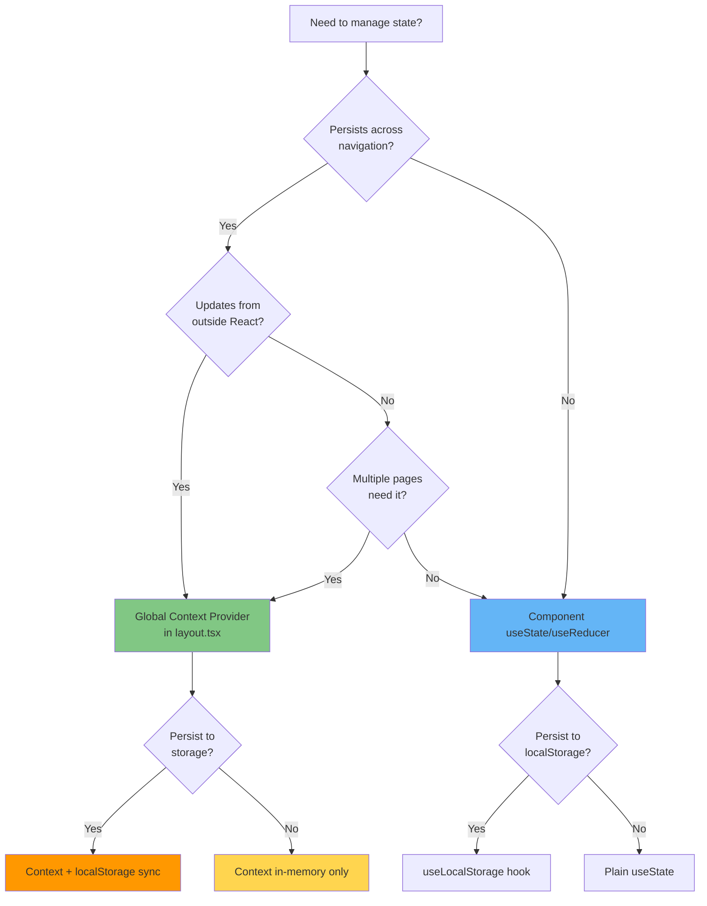

# ADS-B Aircraft Tracker - Developer Documentation

## Overview

This document provides development guidelines, design patterns, and best practices for the ADS-B Aircraft Tracker desktop application.

For comprehensive architectural documentation, see [DESIGN.md](./DESIGN.md).

---

## Design Patterns and Guidelines

### Global Context Manager Pattern

**When to Use**: State that must persist across page navigation and continue updating in the background.

**Implementation**: React Context Provider mounted in `app/layout.tsx`

#### Pattern Structure

```typescript
// 1. Create Context and Provider
// src/contexts/YourDataContext.tsx
export function YourDataProvider({ children }: { children: ReactNode }) {
  const dataRef = useRef<Map<string, YourData>>(new Map());
  const [, setUpdateCounter] = useState(0);

  const handleUpdate = useCallback((update: Update) => {
    // Mutate dataRef in-place
    // ...
    setUpdateCounter(c => c + 1);  // Trigger re-renders
  }, []);

  useTauriEvent<Update>("your:event", handleUpdate);

  return (
    <YourDataContext.Provider value={{ data: dataRef.current }}>
      {children}
    </YourDataContext.Provider>
  );
}

// 2. Wrap in layout.tsx
// src/app/layout.tsx
export default function RootLayout({ children }) {
  return (
    <html>
      <body>
        <YourDataProvider>
          {children}
        </YourDataProvider>
      </body>
    </html>
  );
}

// 3. Consume in components
// src/hooks/useYourData.ts
export function useYourData(filters: Filters) {
  const { data: dataMap } = useYourDataContext();

  const filtered = useMemo(
    () => Array.from(dataMap.values()).filter(applyFilters),
    [dataMap, filters]
  );

  return filtered;
}
```

#### Key Principles

1. **Separation of Concerns**:
   - **Provider**: Manages raw data, listens to events, handles lifecycle
   - **Hook**: Applies filters, returns view-specific data

2. **In-Memory Only** (No Persistence by Default):
   - Simpler: No serialization/deserialization
   - Faster: No localStorage overhead
   - Fresher: Data is always current-session
   - Add persistence only when needed (see "When to Add Persistence" below)

3. **Update Counter Pattern**:
   ```typescript
   const [, setUpdateCounter] = useState(0);
   // After mutating ref:
   setUpdateCounter(c => c + 1);  // Forces context re-render
   ```
   - Avoids cloning large Maps/Sets
   - Consumers re-run and derive fresh arrays

4. **Lifecycle Guarantee**:
   - Next.js App Router preserves `layout.tsx` during client-side navigation
   - Provider stays mounted → event listeners keep running
   - Data accumulates continuously, even when no components consume it

#### When to Use Global Context

✅ **Use Global Context When**:
- Data must persist across page navigation (e.g., aircraft tracking history)
- Background updates should continue when UI is inactive (e.g., real-time metrics)
- Multiple pages need the same data source (e.g., dashboard + details view)
- Event-driven updates from outside React (Tauri events, WebSocket)

❌ **Use Component-Local State When**:
- Data is page-specific and doesn't need to survive navigation
- Frequent updates that don't affect all consumers (optimization)
- Simple prop passing (1-2 levels deep) is sufficient
- Form state or transient UI state

#### When to Add Persistence

Add localStorage/IndexedDB only when:
- Users expect data to survive app restarts (e.g., saved filters, preferences)
- Data is expensive to recompute (e.g., large processed datasets)
- Session continuity is critical (e.g., draft edits, shopping cart)

**Don't add persistence for**:
- Real-time streaming data (stale after restart anyway)
- Data that's fast to re-fetch from backend
- Temporary caches (browser memory is sufficient)

#### Performance Considerations

| Aspect | Global Context | Component State |
|--------|----------------|-----------------|
| **Navigation overhead** | None (stays mounted) | Re-mount on each navigation |
| **Event listeners** | 1 global listener | N listeners (one per mount) |
| **Memory footprint** | Persistent (cleared on app close) | Cleared on unmount |
| **Re-render cost** | O(consumers) | O(component tree) |

#### Example Use Cases

**✅ Good Fit for Global Context**:
- Aircraft tracking (current implementation)
- Real-time notification queue
- Global theme/settings
- WebSocket connection state
- Background job status

**❌ Poor Fit for Global Context**:
- Modal open/close state
- Form input values
- Hover/focus UI state
- Pagination current page
- Search query input

#### Testing Global Context

**Verify Persistence Across Navigation**:
1. Mount provider with test data
2. Navigate to different page
3. Return to original page
4. Assert data is still present

**Example Test**:
```typescript
import { render, screen } from '@testing-library/react';
import { YourDataProvider } from '@/contexts/YourDataContext';

test('data persists across navigation', () => {
  const { rerender } = render(
    <YourDataProvider>
      <DashboardPage />
    </YourDataProvider>
  );

  // Add data
  // ...

  // Simulate navigation by remounting child
  rerender(
    <YourDataProvider>
      <SettingsPage />
    </YourDataProvider>
  );

  // Navigate back
  rerender(
    <YourDataProvider>
      <DashboardPage />
    </YourDataProvider>
  );

  // Assert data still exists
  expect(screen.getByText('expected data')).toBeInTheDocument();
});
```

---

## Code Organization

### Directory Structure Conventions

```
src/
├── app/                    # Next.js pages (App Router)
│   ├── layout.tsx         # MUST wrap children in global providers
│   └── page.tsx           # Page components (can mount/unmount)
├── contexts/              # Global React Context providers
│   └── *Context.tsx       # Pattern: {Name}Provider + use{Name}Context hook
├── hooks/                 # Custom React hooks
│   ├── use*.ts           # Component-consumable hooks (filters, derived state)
│   └── useTauriEvent.ts  # Low-level utilities
├── components/            # UI components (presentational)
├── lib/                   # Business logic, utilities, types
└── src-tauri/            # Rust backend (separate concerns)
```

### Naming Conventions

| Type | Pattern | Example |
|------|---------|---------|
| **Context File** | `{Name}Context.tsx` | `AircraftTrackingContext.tsx` |
| **Provider Component** | `{Name}Provider` | `AircraftTrackingProvider` |
| **Context Hook** | `use{Name}Context` | `useAircraftTrackingContext` |
| **Consumer Hook** | `use{Name}` | `useAircraftTracks` (filters + derives) |
| **Component** | `PascalCase.tsx` | `MapInner.tsx` |
| **Utility** | `camelCase.ts` | `colors.ts`, `commands.ts` |

---

## State Management Decision Tree



**Decision Guide**:

1. **Does it persist across navigation?**
   - No → Component state
   - Yes → Continue to #2

2. **Updates from outside React?** (Tauri events, WebSocket, timers)
   - Yes → Global Context
   - No → Continue to #3

3. **Multiple pages need it?**
   - Yes → Global Context
   - No → Component state

4. **Persist to localStorage?** (for component state)
   - Yes → `useLocalStorage` hook
   - No → Plain `useState`

5. **Persist to storage?** (for global context)
   - Yes → Context + localStorage sync in provider
   - No → In-memory context (recommended default)

---

## Common Patterns

### Pattern 1: Filtered Data from Global Context

**Use Case**: Derive view-specific data from global state

```typescript
// Hook implementation
export function useFilteredData(filters: Filters) {
  const { data: rawData } = useDataContext();

  return useMemo(
    () => Array.from(rawData.values()).filter(item => matchesFilters(item, filters)),
    [rawData, filters]
  );
}

// Component usage
function MyComponent() {
  const [filters, setFilters] = useState(DEFAULT_FILTERS);
  const data = useFilteredData(filters);

  return <Table data={data} />;
}
```

**Why**: Keeps filtering logic in the hook, components stay clean

### Pattern 2: Derived State with useMemo

**Use Case**: Expensive computations on global state

```typescript
export function useComputedMetrics() {
  const { tracks } = useAircraftTracks();

  const metrics = useMemo(() => ({
    total: tracks.length,
    avgAltitude: tracks.reduce((sum, t) => sum + (t.altitude ?? 0), 0) / tracks.length,
    maxSpeed: Math.max(...tracks.map(t => t.ground_speed ?? 0)),
  }), [tracks]);

  return metrics;
}
```

**Why**: Memoization prevents recomputation on every render

### Pattern 3: Event Listener in Provider

**Use Case**: Background updates from Tauri/WebSocket

```typescript
export function DataProvider({ children }: { children: ReactNode }) {
  const dataRef = useRef<Map<string, Data>>(new Map());
  const [, forceUpdate] = useState(0);

  const handleEvent = useCallback((payload: Payload) => {
    // Update dataRef
    dataRef.current.set(payload.id, payload.data);

    // Trigger re-render
    forceUpdate(c => c + 1);
  }, []);

  useTauriEvent<Payload>("your:event", handleEvent);

  return (
    <DataContext.Provider value={{ data: dataRef.current }}>
      {children}
    </DataContext.Provider>
  );
}
```

**Why**: Provider stays mounted, listener never unregisters unnecessarily

---

## Performance Guidelines

### Do's ✅

1. **Use `useMemo` for expensive filtering**:
   ```typescript
   const filtered = useMemo(
     () => data.filter(applyComplexFilter),
     [data, filterCriteria]
   );
   ```

2. **Use `useCallback` for event handlers passed to children**:
   ```typescript
   const handleClick = useCallback((id: string) => {
     // ...
   }, [dependencies]);
   ```

3. **Batch state updates**:
   ```typescript
   // Good: Single render
   setBatch({ field1: val1, field2: val2 });

   // Bad: Two renders
   setField1(val1);
   setField2(val2);
   ```

4. **Use `React.memo` for expensive child components**:
   ```typescript
   const ExpensiveComponent = React.memo(({ data }) => {
     // ...
   });
   ```

### Don'ts ❌

1. **Don't clone large objects unnecessarily**:
   ```typescript
   // Bad: Clones entire map every update
   setData(new Map(dataRef.current));

   // Good: Update counter pattern
   setUpdateCounter(c => c + 1);
   ```

2. **Don't use context for high-frequency updates**:
   ```typescript
   // Bad: Mouse position in global context (60 FPS re-renders)
   // Good: Mouse position in component state
   ```

3. **Don't create inline objects/functions in render**:
   ```typescript
   // Bad: New object every render
   <Child config={{ option: true }} />

   // Good: Memoized object
   const config = useMemo(() => ({ option: true }), []);
   <Child config={config} />
   ```

---

## Migration Guide: Component State → Global Context

**When to Migrate**: When users report data loss after navigation or when background updates are needed.

**Steps**:

1. **Create Context Provider**:
   ```typescript
   // src/contexts/YourDataContext.tsx
   export function YourDataProvider({ children }: { children: ReactNode }) {
     // Move event listener and state logic here
     // ...
   }
   ```

2. **Update Layout**:
   ```typescript
   // src/app/layout.tsx
   <YourDataProvider>
     {children}
   </YourDataProvider>
   ```

3. **Refactor Hook**:
   ```typescript
   // src/hooks/useYourData.ts
   export function useYourData(filters: Filters) {
     const { data } = useYourDataContext();
     return useMemo(() => filter(data, filters), [data, filters]);
   }
   ```

4. **Test**:
   - Start app with data
   - Navigate to settings
   - Return to dashboard
   - Verify data persists

---

## Conclusion

The Global Context Manager pattern is the recommended approach for state that must persist across navigation and continue updating in the background. Follow these guidelines to maintain consistent, performant state management across the application.

**Key Takeaways**:
- ✅ Use Global Context for cross-page, event-driven state
- ✅ Keep providers in `layout.tsx` for persistence
- ✅ Use update counter pattern instead of cloning
- ✅ Default to in-memory, add persistence only when needed
- ✅ Apply filters in consumer hooks, not in provider
