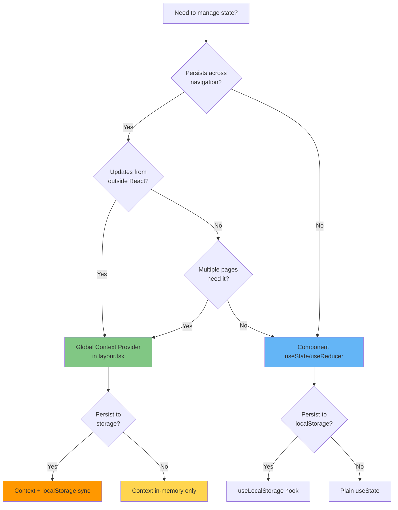

# ADS-B Aircraft Tracker - Developer Documentation

## Overview

This document provides development guidelines, design patterns, and best practices for the ADS-B Aircraft Tracker desktop application.

For comprehensive architectural documentation, see [DESIGN.md](./DESIGN.md).

---

## Design Patterns and Guidelines

### Global Context Manager Pattern

**When to Use**: State that must persist across page navigation and continue updating in the background.

**Implementation**: React Context Provider mounted in `app/layout.tsx`

#### Pattern Structure

```typescript
// 1. Create Context and Provider
// src/contexts/YourDataContext.tsx
export function YourDataProvider({ children }: { children: ReactNode }) {
  const dataRef = useRef<Map<string, YourData>>(new Map());
  const [updateCounter, setUpdateCounter] = useState(0);

  const handleUpdate = useCallback((update: Update) => {
    // Mutate dataRef in-place (no new object allocation for existing entries)
    const existing = dataRef.current.get(update.id);
    if (existing) {
      Object.assign(existing, update.data);  // In-place mutation
    } else {
      dataRef.current.set(update.id, update.data);
    }
    setUpdateCounter(c => c + 1);  // Trigger re-renders
  }, []);

  useTauriEvent<Update>("your:event", handleUpdate);

  // Memoize context value — only allocates new object when counter changes
  const value = useMemo(
    () => ({ data: dataRef.current, version: updateCounter }),
    [updateCounter]
  );

  return (
    <YourDataContext.Provider value={value}>
      {children}
    </YourDataContext.Provider>
  );
}

// 2. Wrap in layout.tsx
// src/app/layout.tsx
export default function RootLayout({ children }) {
  return (
    <html>
      <body>
        <YourDataProvider>
          {children}
        </YourDataProvider>
      </body>
    </html>
  );
}

// 3. Consume in components
// src/hooks/useYourData.ts
export function useYourData(filters: Filters) {
  const { data: dataMap, version } = useYourDataContext();

  const filtered = useMemo(
    () => Array.from(dataMap.values()).filter(applyFilters),
    [version, filters]  // version (not Map ref) triggers recomputation
  );

  return filtered;
}
```

#### Key Principles

1. **Separation of Concerns**:
   - **Provider**: Manages raw data, listens to events, handles lifecycle
   - **Hook**: Applies filters, returns view-specific data

2. **In-Memory Only for React Context** (No Browser Persistence by Default):
   - Simpler: No serialization/deserialization
   - Faster: No localStorage overhead
   - Fresher: Data is always current-session
   - Note: Cross-restart persistence for streaming data is handled at the Rust layer (DuckDB via `adsb-data-engine`) — not in React context
   - Add browser persistence only when needed (see "When to Add Persistence" below)

3. **Version Counter Pattern**:
   ```typescript
   const [updateCounter, setUpdateCounter] = useState(0);
   // After mutating ref:
   setUpdateCounter(c => c + 1);

   // Expose version in memoized context value
   const value = useMemo(
     () => ({ data: dataRef.current, version: updateCounter }),
     [updateCounter]
   );

   // Consumer hooks use version as useMemo dependency
   const { data, version } = useContext(...);
   const filtered = useMemo(() => filter(data), [version, filters]);
   ```
   - Avoids cloning large Maps/Sets
   - `version` in consumer `useMemo` deps ensures recomputation when data changes
   - Memoized context value prevents unnecessary consumer re-renders
   - **Critical**: Do NOT use the Map ref as a `useMemo` dep — it never changes

4. **Lifecycle Guarantee**:
   - Next.js App Router preserves `layout.tsx` during client-side navigation
   - Provider stays mounted → event listeners keep running
   - Data accumulates continuously, even when no components consume it

#### When to Use Global Context

✅ **Use Global Context When**:
- Data must persist across page navigation (e.g., aircraft tracking history)
- Background updates should continue when UI is inactive (e.g., real-time metrics)
- Multiple pages need the same data source (e.g., dashboard + details view)
- Event-driven updates from outside React (Tauri events, WebSocket)

❌ **Use Component-Local State When**:
- Data is page-specific and doesn't need to survive navigation
- Frequent updates that don't affect all consumers (optimization)
- Simple prop passing (1-2 levels deep) is sufficient
- Form state or transient UI state

#### When to Add Persistence

**Browser-side (localStorage/IndexedDB)** — add when:
- Users expect preferences to survive app restarts (e.g., saved filters, map theme)
- Data is expensive to recompute (e.g., large processed datasets)
- Session continuity is critical (e.g., draft edits)

**Rust backend (DuckDB)** — for streaming data that must survive restarts:
- The Tauri bridge persists every 500ms position batch to `adsb_history.db` via `adsb-data-engine` (both merged positions and raw SBS-1 messages)
- Frontend queries historical data via Arrow IPC commands (`getFlightSummaryArrow`, `getTrajectoryBatchArrow`, `queryBboxArrow`, `getRawMessagesArrow`) and JSON commands (`getAircraftSummary`, `getStorageStats`, `getTimeDistribution`, `getDetectionRange`)
- Storage management: `releaseStorage` / `reclaimStorage` (temporarily release DB lock for external tools), `exportDatabase` (live copy via DuckDB ATTACH without stopping recording), `swapDatabase` (archive current DB as snapshot and start fresh — zero data loss), `getStorageStatus` (check availability)
- The `DBHistoryPanel` provides browsing + analytics UI for DuckDB queries
- This is preferred over localStorage for high-volume streaming data (avoids browser storage limits and serialization overhead)

**Don't add browser persistence for**:
- High-volume real-time streaming data — use DuckDB (Rust backend) instead
- Data that's fast to re-fetch from backend
- Temporary caches (browser memory is sufficient)

#### Performance Considerations

| Aspect | Global Context | Component State |
|--------|----------------|-----------------|
| **Navigation overhead** | None (stays mounted) | Re-mount on each navigation |
| **Event listeners** | 1 global listener | N listeners (one per mount) |
| **Memory footprint** | Persistent (cleared on app close) | Cleared on unmount |
| **Re-render cost** | O(consumers) | O(component tree) |

#### Example Use Cases

**✅ Good Fit for Global Context**:
- Aircraft tracking (current implementation)
- Real-time notification queue
- Global theme/settings
- WebSocket connection state
- Background job status

**❌ Poor Fit for Global Context**:
- Modal open/close state
- Form input values
- Hover/focus UI state
- Pagination current page
- Search query input

#### Testing Global Context

**Verify Persistence Across Navigation**:
1. Mount provider with test data
2. Navigate to different page
3. Return to original page
4. Assert data is still present

**Example Test**:
```typescript
import { render, screen } from '@testing-library/react';
import { YourDataProvider } from '@/contexts/YourDataContext';

test('data persists across navigation', () => {
  const { rerender } = render(
    <YourDataProvider>
      <DashboardPage />
    </YourDataProvider>
  );

  // Add data
  // ...

  // Simulate navigation by remounting child
  rerender(
    <YourDataProvider>
      <SettingsPage />
    </YourDataProvider>
  );

  // Navigate back
  rerender(
    <YourDataProvider>
      <DashboardPage />
    </YourDataProvider>
  );

  // Assert data still exists
  expect(screen.getByText('expected data')).toBeInTheDocument();
});
```

---

## Code Organization

### Directory Structure Conventions

```
src/
├── app/                    # Next.js pages (App Router)
│   ├── layout.tsx         # MUST wrap children in global providers
│   └── page.tsx           # Page components (can mount/unmount)
├── contexts/              # Global React Context providers
│   └── *Context.tsx       # Pattern: {Name}Provider + use{Name}Context hook
├── hooks/                 # Custom React hooks
│   ├── use*.ts           # Component-consumable hooks (filters, derived state)
│   └── useTauriEvent.ts  # Low-level utilities
├── components/            # UI components (presentational)
├── lib/                   # Business logic, utilities, types
└── src-tauri/            # Rust backend (separate concerns)
```

### Naming Conventions

| Type | Pattern | Example |
|------|---------|---------|
| **Context File** | `{Name}Context.tsx` | `AircraftTrackingContext.tsx` |
| **Provider Component** | `{Name}Provider` | `AircraftTrackingProvider` |
| **Context Hook** | `use{Name}Context` | `useAircraftTrackingContext` |
| **Consumer Hook** | `use{Name}` | `useAircraftTracks` (filters + derives) |
| **Component** | `PascalCase.tsx` | `MapInner.tsx`, `DBHistoryPanel.tsx` |
| **Analytics Utility** | `camelCase.ts` | `db-history-analytics.ts` |
| **Utility** | `camelCase.ts` | `colors.ts`, `commands.ts` |

---

## State Management Decision Tree


```mermaid
graph TD
    Start[Need to manage state?] --> Q1{Persists across<br/>navigation?}
    Q1 -->|Yes| Q2{Updates from<br/>outside React?}
    Q1 -->|No| Local[Component useState/useReducer]

    Q2 -->|Yes| Global[Global Context Provider<br/>in layout.tsx]
    Q2 -->|No| Q3{Multiple pages<br/>need it?}

    Q3 -->|Yes| Global
    Q3 -->|No| Local

    Local --> Q4{Persist to<br/>localStorage?}
    Q4 -->|Yes| LocalStorage[useLocalStorage hook]
    Q4 -->|No| LocalState[Plain useState]

    Global --> Q5{Persist to<br/>storage?}
    Q5 -->|Yes| GlobalPersist[Context + localStorage sync]
    Q5 -->|No| GlobalMemory[Context in-memory only]

    style Global fill:#81C784
    style Local fill:#64B5F6
    style GlobalMemory fill:#FFD54F
    style GlobalPersist fill:#FF9800
```

**Decision Guide**:

1. **Does it persist across navigation?**
   - No → Component state
   - Yes → Continue to #2

2. **Updates from outside React?** (Tauri events, WebSocket, timers)
   - Yes → Global Context
   - No → Continue to #3

3. **Multiple pages need it?**
   - Yes → Global Context
   - No → Component state

4. **Persist to localStorage?** (for component state / UI preferences)
   - Yes → `useLocalStorage` hook
   - No → Plain `useState`

5. **Persist to storage?** (for global context)
   - Yes → Context + localStorage sync in provider
   - No → In-memory context (recommended default)

6. **Backend config that survives app restart?**
   - Yes → `tauri-plugin-store` (`config.json` in app data dir). Loaded in `lib.rs::setup`, saved via `persist_config()` in `save_config` command.
   - No → In-memory `Mutex<Config>` (lost on restart)

---

## Common Patterns

### Pattern 4: Three-State Collapsible Panel

**Use Case**: A side panel that can be fully hidden, collapsed to a narrow strip, or fully expanded.

```typescript
// State lives in parent (page.tsx); persisted via useLocalStorage
const [panelOpen, setPanelOpen] = useLocalStorage<boolean>("key-open", true);
const [panelWidth, setPanelWidth] = useLocalStorage<number>("key-width", 280);

// Panel is absent from DOM when nothing is selected
{selectedItem && (
  <Panel
    item={selectedItem}
    isOpen={panelOpen}
    width={panelWidth}
    onToggle={() => setPanelOpen(p => !p)}
    onWidthChange={setPanelWidth}
  />
)}
```

**Three states**:
1. **Hidden** (`selectedItem === null`): Panel not rendered; sibling fills available space
2. **Collapsed** (`isOpen === false`): Fixed-width strip (e.g. 32px) with an unfold button
3. **Expanded** (`isOpen === true`): Full content panel with a fold button and draggable resize edge

**Resize edge pattern**: Track `clientX` delta directly inside the component (`useRef` for `lastX` and `isDragging`). Clamp the new width to `[MIN, MAX]` and call `onWidthChange`. This keeps the resize logic encapsulated — the parent only stores/restores the final width value.

**Immutability contract for `first_seen`**: When a track is created, set `first_seen: now` once. The `mergePositionInto` update path must **never** overwrite `first_seen`. This ensures the sparkline x-axis start label always reflects the true first detection time, not the most recent update.

```typescript
// AircraftTrackingContext.tsx — creation only
const track: AircraftTrack = { ..., first_seen: now, last_seen: now };

// mergePositionInto — update path, never touches first_seen
function mergePositionInto(track: AircraftTrack, pos: AircraftPosition, now: number) {
  track.last_seen = now;          // ✅ update last_seen
  // track.first_seen = now;      // ❌ never do this
}
```

---

### Pattern 5: Docked/Floating Dual-Mode Panel

**Use Case**: A panel that can be docked as a flex sibling of the map (like AircraftDetailsPanel) or float as a draggable overlay.

```typescript
// State lives in parent (page.tsx); persisted via useLocalStorage
const [isFloating, setIsFloating] = useLocalStorage<boolean>("key-floating", false);
const [floatX, setFloatX] = useLocalStorage<number>("key-float-x", 100);
const [floatY, setFloatY] = useLocalStorage<number>("key-float-y", 80);
const [floatW, setFloatW] = useLocalStorage<number>("key-float-w", 400);
const [floatH, setFloatH] = useLocalStorage<number>("key-float-h", 600);

// Docked: rendered inside the map flex row (sibling of map + details panel)
{panelOpen && !isFloating && (
  <DockedPanel width={dockedWidth} onWidthChange={setDockedWidth}>
    <PanelContent />
  </DockedPanel>
)}

// Floating: rendered at document root with position: fixed
{panelOpen && isFloating && (
  <FloatingPanel x={floatX} y={floatY} w={floatW} h={floatH}>
    <PanelContent />
  </FloatingPanel>
)}
```

**Two rendering locations**: The same content component renders in both modes, but the shell differs:
1. **Docked**: Flex sibling in the map row. Resize handle on left edge. Three states: hidden/collapsed 32px/expanded.
2. **Floating**: `position: fixed; z-index: 50`. Draggable via title bar. Resizable via corner handle. Close button (×).

**Pin/unpin button** in the title bar toggles between modes. When switching docked→floating, position initializes to sensible defaults. Float position/size persisted in localStorage.

**Extracting shared content**: The panel body (stats, controls, charts) lives in a separate `*Content` component that both docked and floating shells render, avoiding duplication.

---

### Pattern 6: Five Track Categories

**Use Case**: Multiple independent collections of `AircraftTrack` objects, each with distinct lifecycle and visual identity.

| Category | Ref | Source | Lifecycle | Color |
|----------|-----|--------|-----------|-------|
| `tracks` | `tracksRef` | Tauri `adsb:batch` events | Live, TTL-managed | Altitude-based |
| `history` | `historyRef` | TTL expiry from `tracks` | Session-scoped | Altitude-based |
| `imported` | `importedRef` | GeoJSON file import | Until cleared | Indigo |
| `dbHistory` | `dbHistoryRef` | DuckDB query results | Until cleared (replace on each load) | Cyan |
| `analysis` | `analysisRef` | DuckDB queries via "→ Analysis" | Until cleared (additive loading) | Cyan (via dbHistory styling) |

**Key design decisions**:
- Each category has its own `Map<string, AircraftTrack>` in `AircraftTrackingContext`
- `tracks`, `history`, and `analysis` are filtered by Filters (callsign, altitude, speed)
- `imported` and `dbHistory` are **not filtered** by live Filters — they have their own visibility toggles
- `analysis` uses independent `analysisFilters` (not the same Filters object as live)
- `selectedTrack` lookup order: mode-conditional arrays (`mapTracks` → `mapHistory` → `mapDbHistory` → `mapImported`)
- Visual identity carried by props (`isImported`, `isDbHistory`), not fields on `AircraftTrack`
- `analysis` has **additive** semantics (`addAnalysisTracks` does not clear), while `dbHistory` has **replace** semantics (`loadDbHistoryTracks` clears first)

```typescript
// useAircraftTracks returns all five categories
const {
  tracks, history, imported, dbHistory, analysis,
  importTracks, clearImported,
  loadDbHistoryTracks, clearDbHistory,
  addAnalysisTracks, removeAnalysisTrack, clearAnalysis,
} = useAircraftTracks(activeFilters);

// Visibility controlled independently (Live mode)
const visibleDbHistory = showDbHistory ? dbHistory : [];
const visibleImported = showImported ? imported : [];

// Mode-conditional arrays for Map and Table
const isLive = activeMode === "live";
const mapTracks = isLive ? allTracks : [];
const mapDbHistory = isLive ? visibleDbHistory : analysis;
const tableTracks = isLive ? allTracks : analysis;
```

---

### Pattern 1: Filtered Data from Global Context

**Use Case**: Derive view-specific data from global state

```typescript
// Hook implementation
export function useFilteredData(filters: Filters) {
  const { data: rawData, version } = useDataContext();

  return useMemo(
    () => Array.from(rawData.values()).filter(item => matchesFilters(item, filters)),
    [version, filters]  // version triggers recomputation, not the stable Map ref
  );
}

// Component usage
function MyComponent() {
  const [filters, setFilters] = useState(DEFAULT_FILTERS);
  const data = useFilteredData(filters);

  return <Table data={data} />;
}
```

**Why**: Keeps filtering logic in the hook, components stay clean

### Pattern 2: Derived State with useMemo

**Use Case**: Expensive computations on global state

```typescript
export function useComputedMetrics() {
  const { tracks } = useAircraftTracks();

  const metrics = useMemo(() => ({
    total: tracks.length,
    avgAltitude: tracks.reduce((sum, t) => sum + (t.altitude ?? 0), 0) / tracks.length,
    maxSpeed: Math.max(...tracks.map(t => t.ground_speed ?? 0)),
  }), [tracks]);

  return metrics;
}
```

**Why**: Memoization prevents recomputation on every render

### Pattern 3: Event Listener in Provider

**Use Case**: Background updates from Tauri/WebSocket

```typescript
export function DataProvider({ children }: { children: ReactNode }) {
  const dataRef = useRef<Map<string, Data>>(new Map());
  const [updateCounter, setUpdateCounter] = useState(0);

  const handleEvent = useCallback((payload: Payload) => {
    // Mutate in-place for existing entries
    const existing = dataRef.current.get(payload.id);
    if (existing) {
      Object.assign(existing, payload.data);
    } else {
      dataRef.current.set(payload.id, payload.data);
    }
    setUpdateCounter(c => c + 1);
  }, []);

  useTauriEvent<Payload>("your:event", handleEvent);

  // Memoize context value to avoid new object on every render
  const value = useMemo(
    () => ({ data: dataRef.current, version: updateCounter }),
    [updateCounter]
  );

  return (
    <DataContext.Provider value={value}>
      {children}
    </DataContext.Provider>
  );
}
```

**Why**: Provider stays mounted, listener never unregisters unnecessarily. Memoized value prevents spurious consumer re-renders.

---

### Pattern 8: Nullable Persisted Preference (smart default + user override)

**Use case**: a UI preference that should have a *context-sensitive* default until the
user expresses an opinion — a section that starts open while it is empty and closes once
it fills, but stays exactly where the user last put it thereafter.

```typescript
// SimulationPanel.tsx — the generation fold
const [genOpenPref, setGenOpenPref] = useLocalStorage<boolean | null>(
  "adsb-sim-generate-open",
  null,
);
const genOpen = genOpenPref ?? trajectories.length === 0;   // derived during render

<details open={genOpen} onToggle={(e) => setGenOpenPref(e.currentTarget.open)}>
```

**Why the third value**: `boolean` alone cannot distinguish *"closed because that is the
default"* from *"closed because the user closed it"*. `null` means "no opinion yet", so
the default is free to change with context while a real choice wins permanently.

**Why during render, not in an effect**: an effect that "fixes up" the value would run
after the user's own toggle and fight it — and StrictMode double-invocation makes that
misbehave in ways non-Strict tests will not catch. Deriving with `??` is a pure
expression: nothing to synchronise, nothing to race.

**Don't** reach for a second `hasUserToggled` boolean. That is the same three states in
two variables, with the extra ability to represent the impossible fourth.

---

### Pattern 9: Scoped Subset Toggle

**Use case**: a bulk show/hide (or select-all) control acting on a **subset** of a set
that another control owns in full.

```typescript
// lib/track-visibility.ts
export function toggleScopedVisibility(
  hidden: ReadonlySet<string> | undefined,
  hexIdents: string[],
): Set<string> | undefined {
  const next = new Set(hidden ?? []);
  const allHidden = hexIdents.length > 0 && hexIdents.every(h => next.has(h));
  for (const h of hexIdents) allHidden ? next.delete(h) : next.add(h);
  return next.size === 0 ? undefined : next;   // empty ⇒ drop the entry entirely
}
```

**The trap**: the whole-set version is naturally written as
`set(section, new Set(hexIdents))` — a *replace*. That is correct only while the control
owns every member of the set. Point a subset control at it and everything outside the
subset is silently reset: in this codebase, hiding the scenario's trajectories would have
revealed every other hidden live aircraft.

**Rules**:
- A subset toggle **unions/subtracts**; only a whole-set toggle may replace.
- Derive "all hidden" from the scoped list, not from the stored set's size.
- Normalise empty back to `undefined`/absent so "nothing hidden" has one representation.
- Put it in `src/lib/` as a pure function. The bug is invisible in a component test that
  only renders the subset — the missing assertion is about the members you *didn't* pass.

---

### Pattern 7: Agent Tool Registration (AG-UI)

When adding a new capability the AI assistant can use, the **first decision is which
tool plane it belongs to** (full design in [DESIGN.md §18](DESIGN.md#ai-agent--ag-ui-integration)):

| The tool... | Plane | Where to add it |
|-------------|-------|-----------------|
| reads data only (a DuckDB query) | **Server** | Add a handler in `src-tauri/src/tool_service.rs`, route it in `tool_server.rs`, and add the tool name to `SERVER_TOOL_NAMES` in `adsb-agent/src/adsb_agent/graph.py`. Executes in-loop — the agent can chain it without a frontend round-trip. |
| mutates UI or app state, or triggers an action | **Client** | Register it in `src/hooks/useCopilotTools.ts` with `useSafeFrontendTool`. Forwarded to the frontend and run with the user in the loop. |

**Client tool checklist:**

```typescript
// src/hooks/useCopilotTools.ts
useSafeFrontendTool({
  name: "panMapTo",                       // camelCase; matches the LLM-facing schema
  description: "Pan and zoom the map to a location",
  parameters: [/* zod/JSON schema */],
  handler: async ({ lat, lng, zoom }) => {
    mapRef.current?.flyTo([lat, lng], zoom);
    return `Panned to ${lat}, ${lng}`;     // return a string (AG-UI contract)
  },
  render: ({ status, args }) => <PanCard status={status} {...args} />, // optional card
});
```

- `useSafeFrontendTool` already wraps the handler: exceptions become error JSON,
  non-string returns are coerced, and a debug breadcrumb is emitted. **Don't** add your
  own try/catch or short-circuit on error.
- If the agent should *know about* some UI state without a tool call, expose it as a
  readable in `src/hooks/useCopilotContext.ts` instead — it is injected into the system
  prompt every turn.

**Why**: The server/client split keeps read-only reasoning fast (in-loop, no round-trip)
while guaranteeing UI-affecting actions stay user-in-the-loop and never run silently
inside the agent's reasoning. See DESIGN.md §18 for the `route()` semantics.

**Persisted data follows the same split.** Simulation scenarios put `listScenarios` and
`getScenario` on the server plane, but every *write* (`createScenario`, `deleteScenario`,
`addTrajectoryToScenario`, …) is a client tool, mirroring `createEventOfInterest`. A
destructive tool reachable from `tool_server.rs` could delete a user's saved work from
inside the agent's reasoning loop with nothing on screen;
`scenario_writes_are_not_reachable_from_the_tool_server` in `tool_server.rs` pins this.

**Tool descriptions are an interface, not documentation.** The model routes on them, and
two tools that describe themselves similarly will be confused for each other. This app has
already shipped that bug once: `toggleDemoFlights` and `generateSimulatedTrajectory` both
spoke of "simulated flights", so "start simulated flights" launched 20 canned routes and
generated nothing. When adding a tool near an existing one:

- give it nouns the neighbouring tool does not use (scenarios say *saved*, *collection*,
  *stored*; generation owns *start*, *run*, *create* an aircraft);
- name the alternative *inside* the description at the point of confusion
  (`createScenario` says "creates no aircraft — use generateSimulatedTrajectory");
- add a prose assertion in the tool tests. `useCopilotTools.test.ts`,
  `useCopilotScenarioTools.test.ts` and the Python
  `test_simulation_tool_disambiguation.py` all assert on description wording, because
  this class of regression is invisible until a user phrases a request the wrong way.

The trap repeats whenever two tools write *different fields of the same object*.
`renameScenario` and `setScenarioDescription` both "set text on a scenario", and
`createEventOfInterest` also has a `description` argument. Each description therefore
names the field it writes **and** the field it does not: rename says "its name only, not
its description", and `setScenarioDescription` says "not its name" and scopes itself to
scenarios. Both halves are asserted in `useCopilotScenarioTools.test.ts`.

### Non-chat agent endpoints

Two controls in the left panel call `adsb-agent` over plain REST instead of going through
the chat pipeline: **Generate** (`POST /simulate/trajectory`) and **Generate from
trajectories** (`POST /scenario/describe`). Both live outside `AIChatContent`'s component
tree and must work with the chat panel closed, and a button press should not have to fake
a chat turn to be answered.

`/scenario/describe` is a single-shot summarisation call — `describe.py`, no LangGraph and
no tools — with a `model=None` injection seam so every test runs without an LLM endpoint.

**An empty answer is the failure mode to design against.** Reasoning tokens are charged
against the same `max_tokens` budget as the reply, so a model that deliberates hits
`finish_reason='length'` having written nothing. There is no error, no partial output and
no signal — the caller simply waits out its timeout. Two settings guard it, and both
matter independently:

| Setting | Why |
|---|---|
| `ADSB_AGENT_REASONING_EFFORT` (default `off`) | Maps every plain word for "off" onto `reasoning_effort="none"` — the one value a toggle-style model honours. `on` restores the model's default; a graded level works where a provider offers a dial. |
| `max_retries=0` | The OpenAI client retries twice by default, making one call three attempts and silently tripling the timeout budget. |

Neither is a guarantee: reasoning control is a *request*, and an endpoint that does not
understand the field ignores it. The reliable lever remains choosing a model that does not
reason. `describe_scenario` therefore still raises on empty content, so the failure
surfaces as a readable 502 rather than a blank textarea.
It returns **502** when the LLM behind the agent is unreachable or emits no content, which
the panel renders inline; the empty-content case is explicit because a reasoning-variant
model can emit only reasoning tokens and fail completely silently.

On the client, `describeScenario` rethrows an `AbortError` untouched so a cancel is not
reported as a failure. The guard is duck-typed on `.name`, not `instanceof Error`: a
`DOMException` is not an `Error` instance under jsdom, so an instanceof check silently
misses it and every deliberate cancel surfaces as "agent unreachable".

---

## Performance Guidelines

### Do's ✅

1. **Use `useMemo` for expensive filtering**:
   ```typescript
   const filtered = useMemo(
     () => data.filter(applyComplexFilter),
     [data, filterCriteria]
   );
   ```

2. **Use `useCallback` for event handlers passed to children**:
   ```typescript
   const handleClick = useCallback((id: string) => {
     // ...
   }, [dependencies]);
   ```

3. **Batch state updates**:
   ```typescript
   // Good: Single render
   setBatch({ field1: val1, field2: val2 });

   // Bad: Two renders
   setField1(val1);
   setField2(val2);
   ```

4. **Use `React.memo` for expensive child components**:
   ```typescript
   const ExpensiveComponent = React.memo(({ data }) => {
     // ...
   });
   ```

### Don'ts ❌

1. **Don't use Map refs as `useMemo` dependencies**:
   ```typescript
   // Bad: Map ref never changes → useMemo never recomputes → stale data
   const { data: dataMap } = useContext(DataContext);
   const filtered = useMemo(() => filter(dataMap), [dataMap, filters]);

   // Good: Use version counter from context
   const { data: dataMap, version } = useContext(DataContext);
   const filtered = useMemo(() => filter(dataMap), [version, filters]);
   ```

2. **Don't clone large objects unnecessarily**:
   ```typescript
   // Bad: Clones entire map every update
   setData(new Map(dataRef.current));

   // Good: Update counter pattern
   setUpdateCounter(c => c + 1);
   ```

3. **Don't use spread for capped arrays in hot paths**:
   ```typescript
   // Bad: ~800 array allocations/sec with 40 aircraft
   track.positions = [...track.positions.slice(-(MAX - 1)), newPos];

   // Good: In-place mutation
   track.positions.push(newPos);
   if (track.positions.length > MAX) track.positions.shift();
   ```

4. **Don't create inline context values**:
   ```typescript
   // Bad: New object every render → all consumers re-render
   <Context.Provider value={{ data: ref.current }}>

   // Good: Memoized value
   const value = useMemo(() => ({ data: ref.current, version }), [version]);
   <Context.Provider value={value}>
   ```

5. **Don't use context for high-frequency updates**:
   ```typescript
   // Bad: Mouse position in global context (60 FPS re-renders)
   // Good: Mouse position in component state
   ```

6. **Don't run cleanup scans on every data batch**:
   ```typescript
   // Bad: TTL scan on every 500ms batch (most entries aren't expired)
   const handleBatch = () => { process(batch); scanForExpired(); };

   // Good: Separate interval for cleanup
   useEffect(() => {
     const id = setInterval(scanForExpired, 15_000);
     return () => clearInterval(id);
   }, []);
   ```

---

## Migration Guide: Component State → Global Context

**When to Migrate**: When users report data loss after navigation or when background updates are needed.

**Steps**:

1. **Create Context Provider**:
   ```typescript
   // src/contexts/YourDataContext.tsx
   export function YourDataProvider({ children }: { children: ReactNode }) {
     // Move event listener and state logic here
     // ...
   }
   ```

2. **Update Layout**:
   ```typescript
   // src/app/layout.tsx
   <YourDataProvider>
     {children}
   </YourDataProvider>
   ```

3. **Refactor Hook**:
   ```typescript
   // src/hooks/useYourData.ts
   export function useYourData(filters: Filters) {
     const { data, version } = useYourDataContext();
     return useMemo(() => filter(data, filters), [version, filters]);
   }
   ```

4. **Test**:
   - Start app with data
   - Navigate to settings
   - Return to dashboard
   - Verify data persists

---

## Conclusion

The Global Context Manager pattern is the recommended approach for state that must persist across navigation and continue updating in the background. Follow these guidelines to maintain consistent, performant state management across the application.

**Key Takeaways**:
- Use Global Context for cross-page, event-driven state
- Keep providers in `layout.tsx` for persistence
- Expose `version` counter in context value; use it (not Map refs) in consumer `useMemo` deps
- Memoize context value with `useMemo([updateCounter])` to avoid inline object allocation
- Mutate existing objects in-place; use `push()`/`shift()` instead of spread for capped arrays
- Decouple TTL cleanup to a separate interval (not every data batch)
- Default to in-memory, add persistence only when needed
- Apply filters in consumer hooks, not in provider
- Use separate Maps for distinct track categories (live, history, imported, dbHistory) — don't discriminate with fields
- For docked/floating dual-mode panels, extract shared content into a separate component and render in two DOM locations
